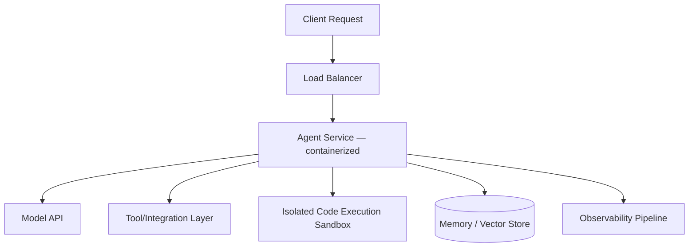

# 16 · Deployment

## Overview

Deployment covers how agent systems actually get run in production:
containerization, orchestration at scale, cloud hosting patterns, edge
deployment, and serverless architectures — the infrastructure layer that
turns a working prototype into a reliable, scalable service.

## Learning Objectives

- Choose an appropriate deployment model based on scale, latency, and cost
  requirements
- Understand the operational concerns specific to agent workloads (long-
  running sessions, tool-call fan-out, streaming responses)
- Recognize when serverless/edge deployment fits vs. when it doesn't

## Docker

Containerizing an agent application packages the model-calling logic, tool
integrations, and dependencies into a reproducible, portable unit — the
standard starting point for most production deployments regardless of the
eventual orchestration layer.

Key considerations specific to agents:

- Sandboxed code-execution tools (see [CodeAct](../13-agent-patterns/codeact.md))
  should run in their own isolated containers, separate from the main agent
  process, with strict resource limits.
- Long-running agent sessions may need different container lifecycle
  handling than typical stateless request/response services.

## Kubernetes

For scaled deployments, Kubernetes (or similar orchestration) manages
scaling, health checks, and rolling updates across many agent instances.
Agent-specific considerations:

- **Session affinity**: if agent state is held in-process rather than in an
  external store, requests for the same session need to route consistently.
- **Autoscaling on the right signal**: request volume alone may not capture
  agent workload well if individual requests vary hugely in duration (a
  simple lookup vs. a 20-step tool-use loop) — consider concurrency-based or
  queue-depth-based autoscaling.
- **Resource limits for sandboxed execution**: code-execution sidecars need
  their own strict CPU/memory/time limits, isolated from the main service's
  resource pool.

## Cloud

Managed cloud hosting (via a cloud provider's compute services) trades some
control for reduced operational overhead — a common choice for teams without
dedicated infrastructure engineering capacity.

## Edge

Running agent logic closer to the end user (edge compute) can reduce
latency for specific components, though the core LLM inference typically
still happens in a centralized/cloud environment given current model
hosting constraints — edge deployment for agents today usually applies to
lighter-weight components (routing, caching, simple guardrail checks) rather
than the full reasoning loop.

## Serverless

Serverless (function-as-a-service) deployment fits well for:

- Bursty, unpredictable traffic where paying only for active compute matters
- Stateless request/response agent interactions
- Rapid iteration without managing infrastructure

Less well-suited for:

- Long-running agent sessions exceeding typical serverless execution time
  limits
- Workloads needing persistent in-memory state across many rapid calls
  (though external state stores can mitigate this)

## Architecture Overview

## Key Concepts

| Term | Definition |
|---|---|
| Containerization | Packaging an application and its dependencies into a portable, reproducible unit |
| Orchestration | Automated management of container deployment, scaling, and health at scale |
| Session affinity | Routing requests for the same session consistently to the same instance |
| Serverless | Function-as-a-service compute that scales to zero and charges per invocation |

## Advantages / Disadvantages

| Approach | Advantages | Disadvantages |
|---|---|---|
| Docker (single container) | Simple, portable, good starting point | Doesn't handle scale/orchestration alone |
| Kubernetes | Scales reliably, mature ecosystem, fine-grained control | Real operational complexity and expertise required |
| Managed cloud services | Reduced operational overhead | Less infrastructure control, potential vendor lock-in |
| Serverless | Cost-efficient for bursty/unpredictable load, minimal ops | Execution time limits, cold starts, state management challenges |

## Common Mistakes

- **Mistake:** Running sandboxed code-execution tools in the same container/
  process as the main agent logic. **Fix:** Isolate execution sandboxes into
  their own strictly resource-limited environment.
- **Mistake:** Autoscaling purely on request count when agent request
  duration varies enormously. **Fix:** Autoscale on concurrency or resource
  utilization signals that better reflect actual load.
- **Mistake:** Choosing serverless for long-running, stateful agent sessions
  without accounting for execution time limits. **Fix:** Match deployment
  model to actual session characteristics; use external state stores if
  needed.

## Related Categories

- [`14-observability/`](../14-observability/README.md) — monitoring the deployed system
- [`07-safety-alignment/`](../07-safety-alignment/README.md) — sandboxing requirements that inform deployment architecture
- [`15-evaluation/`](../15-evaluation/README.md) — gating deployments on evaluation results

## Research Papers

Deployment for agentic systems draws primarily from general cloud/DevOps
engineering practice; see [`resources/README.md`](../resources/README.md)
for tooling references.

## Further Reading

- [`07-safety-alignment/README.md`](../07-safety-alignment/README.md) — sandboxing requirements relevant to deployment
