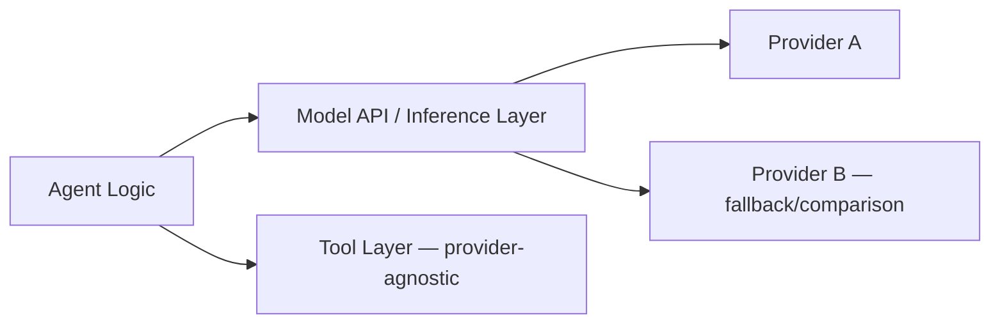

# 17 · Models

## Overview

This category covers vendor-specific notes for the model providers commonly
used to power agents: OpenAI, Anthropic, Google (Gemini), Mistral, Meta
(Llama), Qwen, DeepSeek, and the broader open-source model ecosystem.
Everywhere else in this repository, concepts are explained vendor-neutrally;
this is the one place provider-specific details live, since they change
frequently and shouldn't leak into the general concept explanations.

## Learning Objectives

- Know what dimensions actually matter when choosing a model for an agent
  workload (not just leaderboard rank)
- Understand that model choice is a tradeoff across capability, cost,
  latency, and specific feature support (tool calling, context length,
  multimodality)

## What to Evaluate When Choosing a Model

| Dimension | Why it matters for agents |
|---|---|
| Tool/function calling support and reliability | Core requirement for most agent architectures |
| Context window size | Affects how much retrieved context, history, and tool results fit per call |
| Latency and throughput | Directly affects user-facing responsiveness and multi-step loop cost |
| Cost per token (input/output) | Multiplies significantly in multi-step agent loops vs. single-shot use |
| Structured output support | Reliability of JSON-mode/schema-constrained generation |
| Multimodal support | Needed for vision/audio/video-involving domain skills |
| Fine-tuning/customization options | Relevant if in-context techniques alone aren't sufficient |

## Provider Families (Vendor-Neutral Notes)

> ⚠️ **This section deliberately avoids specific model names, benchmark
> scores, and pricing**, since these change frequently and would go stale
> quickly. For current specifics, always check the provider's official
> documentation directly.

| Provider family | General notes |
|---|---|
| **OpenAI** | Broad ecosystem support and tooling; check current docs for tool-calling and structured-output features. |
| **Anthropic** | Strong emphasis on safety tooling and long-context support; check current docs for the latest model lineup and capabilities. |
| **Google (Gemini)** | Deep integration with Google Cloud and Workspace ecosystems; check current docs for multimodal capabilities. |
| **Mistral** | Offers both proprietary and open-weight models; check current docs for licensing terms per model. |
| **Meta (Llama)** | Prominent open-weight model family, widely used as a self-hosting/fine-tuning base. |
| **Qwen** | Actively developed open-weight model family with strong multilingual support. |
| **DeepSeek** | Open-weight models with notable reasoning-focused variants. |
| **Broader open-source ecosystem** | Enables self-hosting, fine-tuning, and full control over inference — at the cost of managing your own infrastructure. |

## Proprietary vs. Open-Weight Models

| | Proprietary (API-based) | Open-weight (self-hosted) |
|---|---|---|
| Setup effort | Low — API integration only | Higher — requires hosting infrastructure |
| Cost model | Pay-per-token | Infrastructure cost (can be cheaper at very high, steady volume) |
| Customization | Limited to prompting, and fine-tuning APIs where offered | Full control — fine-tuning, quantization, custom serving |
| Data control | Data sent to a third-party API | Can be fully on-premises/private |
| Latest capabilities | Typically fastest access to frontier capabilities | Open-weight releases often lag frontier proprietary models, though the gap varies over time |

## Architecture: Model as One Component

Well-designed agent architectures keep the model call behind an
abstraction layer, making it feasible to switch or add providers (for
fallback, cost optimization, or capability reasons) without rewriting the
rest of the agent's logic.

## Key Concepts

| Term | Definition |
|---|---|
| Context window | The maximum amount of text a model can process in a single call |
| Structured output / JSON mode | A model feature for reliably constraining output to a schema |
| Open-weight model | A model whose weights are published for self-hosting/fine-tuning, as opposed to API-only access |
| Model abstraction layer | Code that decouples agent logic from any specific model provider's API |

## Advantages / Disadvantages

| Advantages | Disadvantages |
|---|---|
| Multiple viable providers create healthy competition and optionality | Provider-specific quirks (tool-calling formats, rate limits) still leak through in practice |
| Open-weight models enable full data control and customization | Self-hosting requires real infrastructure investment and expertise |
| Abstraction layers ease multi-provider strategies (fallback, cost optimization) | Abstracting too early, before you understand your actual needs, can add unneeded complexity |

## Common Mistakes

- **Mistake:** Choosing a model purely by leaderboard rank without testing
  against your actual task distribution. **Fix:** Evaluate candidates on a
  [custom benchmark](../15-evaluation/README.md#benchmarks) built from real
  or realistic tasks.
- **Mistake:** Hardcoding provider-specific API calls throughout agent
  logic. **Fix:** Introduce a model abstraction layer to ease future
  provider changes.
- **Mistake:** Assuming cost is purely per-token without accounting for
  multi-step agent loop multiplication. **Fix:** Model total cost per
  completed task, not just per API call.

## Related Categories

- [`15-evaluation/`](../15-evaluation/README.md) — benchmarking models against your actual use case
- [`16-deployment/`](../16-deployment/README.md) — self-hosting considerations for open-weight models
- [`product-self-knowledge` skill](../docs/README.md) — for Anthropic-product-specific details, this repository's authoring process defers to live documentation rather than baking in specifics that go stale

## Research Papers

Model-specific technical reports are published directly by each provider;
see [`resources/README.md`](../resources/README.md) for links to official
documentation.

## Further Reading

- Always check each provider's official documentation for current model
  lineups, pricing, and capabilities — this page intentionally avoids
  specifics that would go stale.
