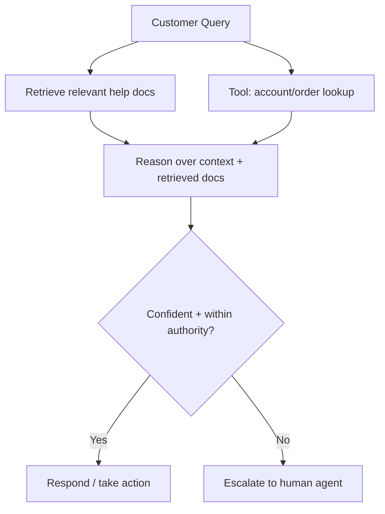

# 18 · Workflows

## Overview

Workflows show how the primitives covered elsewhere in this repository
(reasoning, tool use, RAG, multi-agent coordination, safety) combine into
complete, end-to-end agent applications for specific, common use cases.
Where [`05-domain-skills/`](../05-domain-skills/README.md) covers what
changes per domain, this category covers full worked architectures.

## Learning Objectives

- See how multiple categories from this repository combine into one
  working system
- Use these as starting-point architectures to adapt to your own use case

## Customer Support

A customer support agent typically combines: [RAG](../10-rag/README.md)
over a knowledge base/help docs, [tool use](../02-tool-use/README.md) for
account/order lookups, [conversation state](../03-communication/README.md#conversation-state)
tracking across a support thread, and a clear
[escalation/fallback](../04-decision-making/README.md#fallback-strategies)
path to a human agent for anything outside its confidence or authority.

## Research Agent

A research agent combines web search/[RAG](../10-rag/README.md),
multi-step [planning](../01-core-cognitive/planning/README.md) (e.g.
[Plan-and-Execute](../13-agent-patterns/plan-and-execute.md)), source
synthesis, and citation/[groundedness](../04-decision-making/README.md#hallucination-detection)
checks before producing a final report.

## Coding Agent

A coding agent combines file/repository access
([tool use](../02-tool-use/README.md)), [task decomposition](../01-core-cognitive/planning/task-decomposition.md)
of a larger coding task into steps, code execution as both an action
representation ([CodeAct](../13-agent-patterns/codeact.md)) and a
verification signal (running tests), and
[Reflexion](../13-agent-patterns/reflexion.md)-style iteration on failures.

## Email Agent

An email agent handles reading, summarizing, drafting, and (with human
approval for sending) responding to email — combining
[summarization](../03-communication/README.md#summarization),
[structured output](../03-communication/README.md#structured-outputs) for
draft formatting, and mandatory
[human approval](../07-safety-alignment/README.md#human-approval) before
any message is actually sent, given the irreversibility of sending email.

## Browser Agent

A browser agent navigates and interacts with live web pages
([browser automation](../02-tool-use/README.md#browser-automation)) —
requiring careful [guardrails](../07-safety-alignment/README.md#guardrails)
around what actions can be taken autonomously (e.g. reading is lower-risk
than submitting forms or making purchases) and robust handling of dynamic,
unpredictable page content.

## Data Analyst Agent

A data analyst agent combines [code execution](../02-tool-use/README.md#code-execution)
for data processing/analysis, [structured output](../03-communication/README.md#structured-outputs)
for presenting findings, and often visualization generation — with
[verification](../04-decision-making/README.md#verification) of numerical
claims against the actual computed results (never letting the model
"eyeball" a statistic instead of computing it).

## Recruiter Agent

A recruiter-support agent (screening assistance, not autonomous hiring
decisions) combines document parsing/[RAG](../10-rag/README.md) over
resumes/job descriptions, structured extraction, and — given the
significant fairness and legal considerations around hiring — should
generally keep humans firmly in the decision loop, with the agent providing
information/summarization support rather than autonomous decisions.

## Legal Assistant

A legal-support agent (research, document review assistance — not legal
advice) combines [RAG](../10-rag/README.md) over legal documents/precedent,
careful [citation and grounding](../04-decision-making/README.md#hallucination-detection)
practices given the stakes of legal inaccuracy, and should always be
positioned as supporting a qualified legal professional's judgment, not
replacing it.

## Medical Assistant

A medical-support agent (documentation, information synthesis — not
diagnosis) requires the strictest grounding/verification bar in this list,
given real-world patient-safety stakes; see the caveats in
[`05-domain-skills/README.md#medicine`](../05-domain-skills/README.md#medicine).

## Key Concepts

| Term | Definition |
|---|---|
| Workflow | A complete, end-to-end agent architecture for a specific use case, composed from general-purpose primitives |
| Escalation path | A defined route for handing off to a human when the agent's confidence or authority is insufficient |

## Advantages / Disadvantages

| Advantages | Disadvantages |
|---|---|
| Worked examples accelerate building a new agent — start from a known-good shape | Real deployments need domain-specific tuning beyond this general template |
| Shows how disparate categories in this repo compose into one system | High-stakes workflows (legal, medical, financial) need much deeper domain-specific safety review than shown here |

## Common Mistakes

- **Mistake:** Copying a workflow architecture without adjusting the
  risk/approval model for your specific domain's stakes. **Fix:** Recalibrate
  human-approval and verification requirements per
  [`05-domain-skills/README.md`](../05-domain-skills/README.md) guidance.
- **Mistake:** Treating these as complete, deployable systems rather than
  starting architectures. **Fix:** Layer in your own
  [evaluation](../15-evaluation/README.md) and
  [observability](../14-observability/README.md) before production use.

## Related Categories

- [`05-domain-skills/`](../05-domain-skills/README.md) — the domain-specific considerations behind each workflow
- [`19-recipes/`](../19-recipes/README.md) — smaller, focused cookbook-style entries
- [`20-case-studies/`](../20-case-studies/README.md) — real-world accounts of workflows like these in production

## Research Papers

See domain-specific entries in [`papers/README.md`](../papers/README.md).

## Further Reading

- [`19-recipes/README.md`](../19-recipes/README.md) — smaller focused examples
- [`20-case-studies/README.md`](../20-case-studies/README.md) — production accounts
