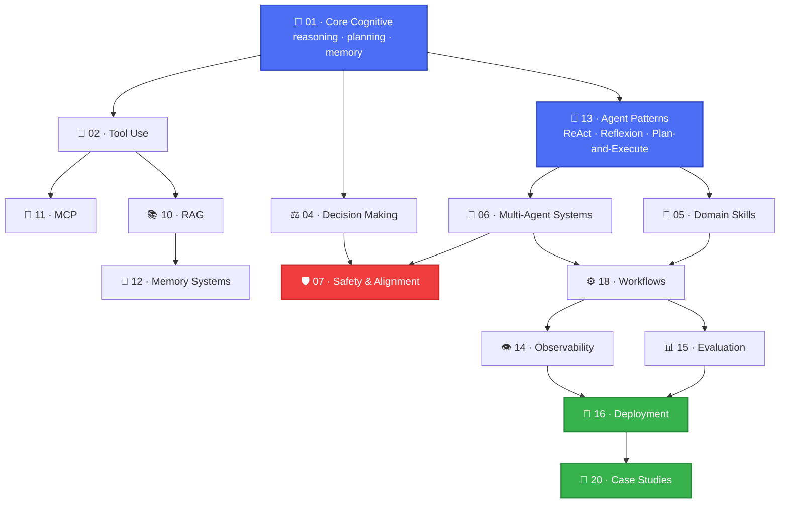
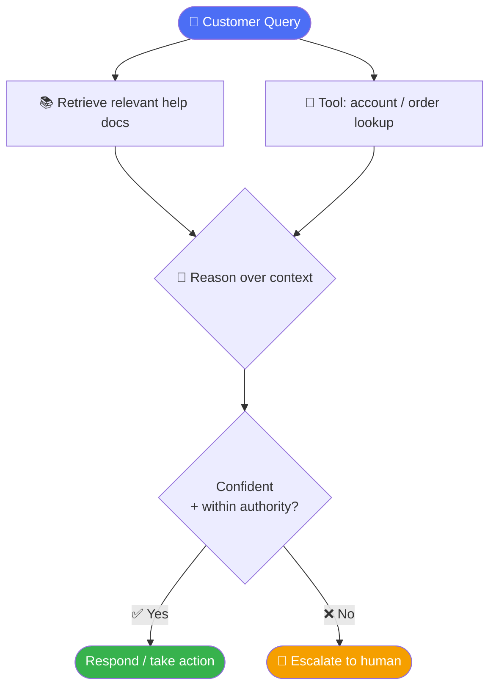
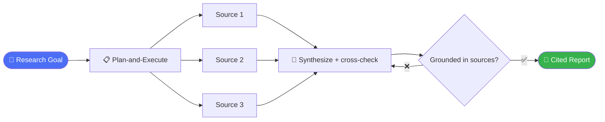
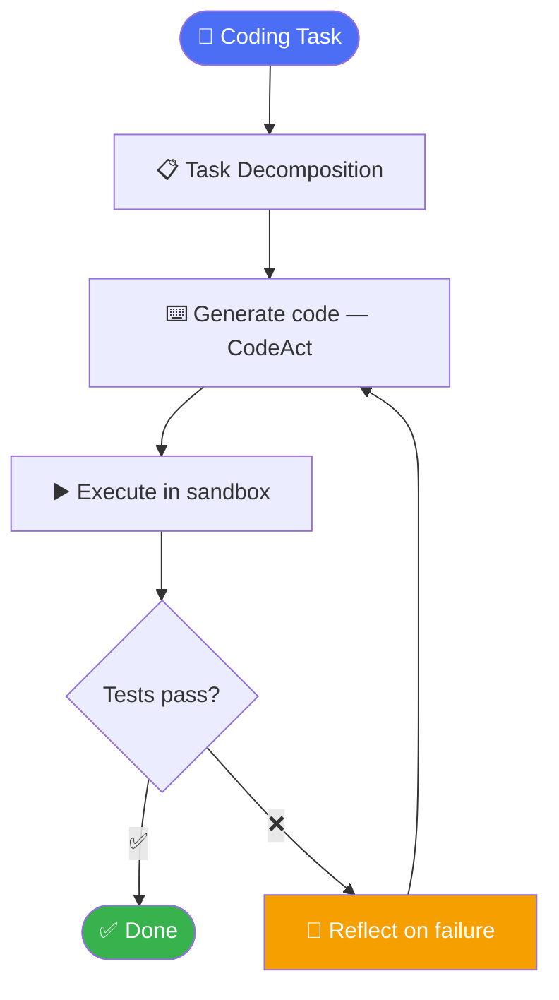
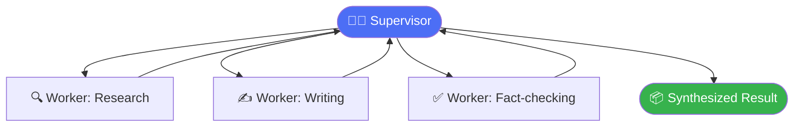
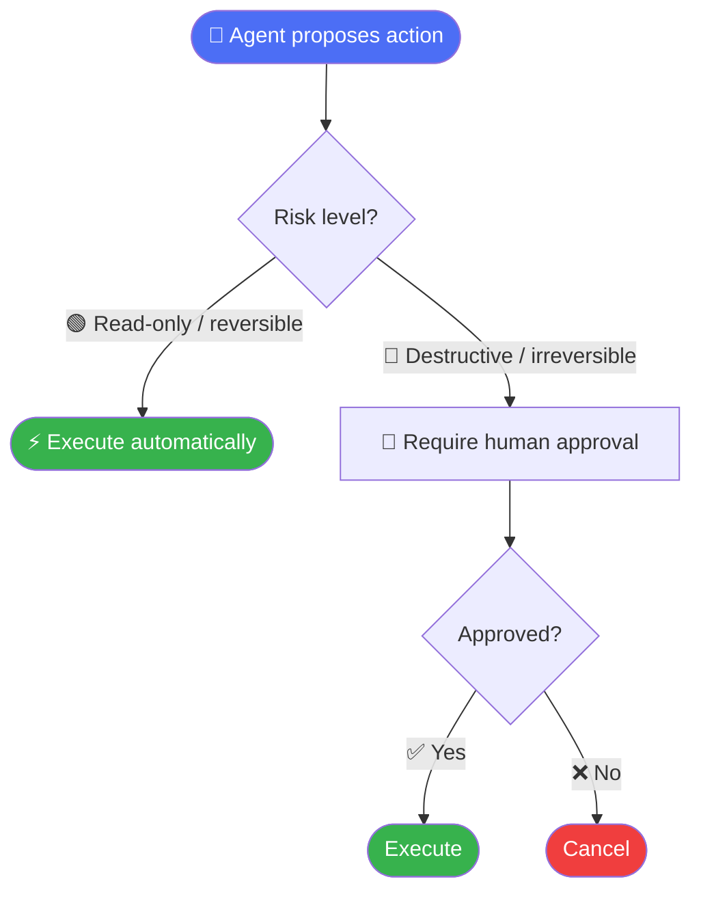
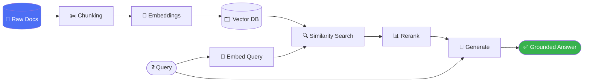
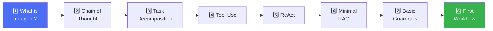
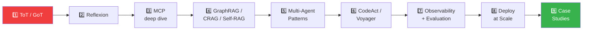

# 🧠⚡ AI-Agent-Skills

### The open-source knowledge base for designing, building, evaluating, and deploying AI agents

**Not a library. A map of the entire field.**

 

**[📚 Skill Catalog](SKILL_CATALOG.md)** · **[🗺️ Roadmap](ROADMAP.md)** · **[📖 Glossary](glossary/README.md)** · **[🤝 Contributing](CONTRIBUTING.md)**

 

> Awesome Lists + Papers with Code + a vendor-neutral AI engineering handbook — **combined into one repo.**

`AI-Agent-Skills` teaches everything required to **design, build, evaluate,
deploy, and improve AI agents** — from first-principles cognition (reasoning,
planning, memory) all the way up through production concerns (observability,
evaluation, deployment). Every page is diagrammed, cross-linked, and backed
by real citations. No "coming soon." No fluff.

---

## 🧭 Who this is for

<table>
<tr>
<td width="20%" align="center">🟢 <b>Beginner</b></td>
<td>Never built an agent before → <a href="#-beginner-learning-path">Beginner Learning Path</a></td>
</tr>
<tr>
<td align="center">🛠️ <b>AI Engineer</b></td>
<td>Shipping a product → <a href="SKILL_CATALOG.md">Skill Catalog</a> → pick a <a href="18-workflows/README.md">workflow</a></td>
</tr>
<tr>
<td align="center">🔬 <b>Researcher</b></td>
<td>Want primary sources → <a href="papers/README.md">papers/</a>, <a href="13-agent-patterns/README.md">agent patterns</a></td>
</tr>
<tr>
<td align="center">🏢 <b>Enterprise / Platform Team</b></td>
<td><a href="16-deployment/README.md">deployment</a>, <a href="07-safety-alignment/README.md">safety</a>, <a href="14-observability/README.md">observability</a></td>
</tr>
<tr>
<td align="center">🎓 <b>Student</b></td>
<td>Learning the field deeply → <a href="#-advanced-learning-path">Advanced Learning Path</a></td>
</tr>
<tr>
<td align="center">✍️ <b>Contributor</b></td>
<td>Want to help build this → <a href="CONTRIBUTING.md">CONTRIBUTING.md</a> + <a href="ROADMAP.md">ROADMAP.md</a></td>
</tr>
</table>

---

## 🏗️ How the Repository Is Organized

---

## ⚙️ See It In Action — Real Agent Workflows

These are complete, worked architectures from [`18-workflows/`](18-workflows/README.md),
showing how the primitives in this repo combine into real systems.

<b>🎧 Customer Support Agent</b> — RAG + tool use + escalation

→ [`10-rag/`](10-rag/README.md) · [`02-tool-use/`](02-tool-use/README.md) · [`04-decision-making/`](04-decision-making/README.md#fallback-strategies)

<b>🔬 Research Agent</b> — plan, retrieve, synthesize, cite

→ [`13-agent-patterns/plan-and-execute.md`](13-agent-patterns/plan-and-execute.md) · [`10-rag/`](10-rag/README.md)

<b>💻 Coding Agent</b> — write, run, reflect, repeat

→ [`13-agent-patterns/codeact.md`](13-agent-patterns/codeact.md) · [`13-agent-patterns/reflexion.md`](13-agent-patterns/reflexion.md)

<b>🤝 Multi-Agent Research Team</b> — supervisor + specialized workers

→ [`06-multi-agent/`](06-multi-agent/README.md#supervisor-pattern)

<b>🛡️ Safe Tool Execution</b> — guardrails + human approval

→ [`07-safety-alignment/`](07-safety-alignment/README.md#human-approval)

<b>📚 RAG Pipeline</b> — from raw docs to grounded answer

→ [`10-rag/README.md`](10-rag/README.md)

---

## 📂 Full Directory Index

| # | Folder | What's inside | Status |
|---|---|---|:---:|
| 01 | [`01-core-cognitive/`](01-core-cognitive/README.md) | Reasoning (CoT, ToT, GoT), planning, task decomposition, memory foundations | 🟢 |
| 02 | [`02-tool-use/`](02-tool-use/README.md) | Function calling, web search, browser automation, API/DB/CLI/code execution, file systems | 🟡 |
| 03 | [`03-communication/`](03-communication/README.md) | Summarization, translation, conversation state, prompt engineering, structured outputs | 🟡 |
| 04 | [`04-decision-making/`](04-decision-making/README.md) | Risk analysis, confidence estimation, fallback strategies, hallucination detection, verification | 🟡 |
| 05 | [`05-domain-skills/`](05-domain-skills/README.md) | Coding, writing, research, finance, medicine, education, math, creative, vision/speech/video | 🟡 |
| 06 | [`06-multi-agent/`](06-multi-agent/README.md) | Agent communication, delegation, supervisor/swarm/debate/critic/manager-worker | 🟡 |
| 07 | [`07-safety-alignment/`](07-safety-alignment/README.md) | Guardrails, prompt injection, jailbreaks, permissions, auth, human approval | 🟡 |
| 08 | [`08-learning-adaptation/`](08-learning-adaptation/README.md) | Few-shot, in-context learning, feedback loops, knowledge updating | 🟡 |
| 09 | [`09-integrations/`](09-integrations/README.md) | Vendor-neutral integration patterns for external systems | 🟡 |
| 10 | [`10-rag/`](10-rag/README.md) | Chunking, embeddings, retrieval, hybrid search, GraphRAG, CRAG, Self-RAG, reranking, vector DBs | 🟢 |
| 11 | [`11-mcp/`](11-mcp/README.md) | Model Context Protocol — spec, clients, servers, tools/resources/prompts, auth, transport | 🟢 |
| 12 | [`12-memory/`](12-memory/README.md) | Applied memory systems for production agents (builds on 01) | 🟡 |
| 13 | [`13-agent-patterns/`](13-agent-patterns/README.md) | ReAct, Reflexion, Self-Discover, Plan-and-Execute, CodeAct, Voyager | 🟢 |
| 14 | [`14-observability/`](14-observability/README.md) | Tracing, telemetry, metrics, logging, monitoring | 🟡 |
| 15 | [`15-evaluation/`](15-evaluation/README.md) | LLM-as-a-judge, benchmarks, latency/cost/quality tradeoffs | 🟡 |
| 16 | [`16-deployment/`](16-deployment/README.md) | Docker, Kubernetes, cloud, edge, serverless | 🟡 |
| 17 | [`17-models/`](17-models/README.md) | OpenAI, Anthropic, Gemini, Mistral, Llama, Qwen, DeepSeek, open-source | 🟡 |
| 18 | [`18-workflows/`](18-workflows/README.md) | Customer support, research agent, coding agent, email, browser, data analyst, recruiter, legal, medical | 🟡 |
| 19 | [`19-recipes/`](19-recipes/README.md) | Short, task-oriented cookbook entries | 🟡 |
| 20 | [`20-case-studies/`](20-case-studies/README.md) | Enterprise AI, coding assistants, autonomous agents, customer service, research automation | 🟡 |
| — | [`papers/`](papers/README.md) | Curated, categorized bibliography of foundational papers | 🟡 |
| — | [`resources/`](resources/README.md) | Tools, courses, communities, newsletters | 🟡 |
| — | [`glossary/`](glossary/README.md) | Alphabetical glossary of agent-engineering terms | 🟡 |
| — | [`docs/`](docs/README.md) | Style guide, templates, meta-documentation | 🟢 |
| — | [`examples/`](examples/README.md) | Index of runnable, minimal educational snippets | 🟡 |

*(🟢 = full depth, 🟡 = solid overview with sub-pages expanding — see [`ROADMAP.md`](ROADMAP.md) for live tracking)*

---

## 🟢 Beginner Learning Path

1. [What is an AI agent?](01-core-cognitive/README.md#what-is-an-agent)
2. [Chain of Thought reasoning](01-core-cognitive/reasoning/chain-of-thought.md)
3. [Task decomposition & planning](01-core-cognitive/planning/task-decomposition.md)
4. [Tool use & function calling](02-tool-use/README.md#function-calling)
5. [ReAct pattern](13-agent-patterns/react.md)
6. [Your first RAG pipeline](10-rag/README.md#a-minimal-rag-pipeline)
7. [Basic guardrails](07-safety-alignment/README.md#guardrails)
8. [Your first workflow](18-workflows/README.md)

## 🔴 Advanced Learning Path

1. [Tree of Thought / Graph of Thought](01-core-cognitive/reasoning/tree-of-thought.md)
2. [Self-Reflection & Reflexion](13-agent-patterns/reflexion.md)
3. [Model Context Protocol deep dive](11-mcp/README.md)
4. [Advanced RAG: GraphRAG, CRAG, Self-RAG](10-rag/advanced-rag.md)
5. [Multi-agent supervisor/swarm/debate patterns](06-multi-agent/README.md)
6. [CodeAct & Voyager](13-agent-patterns/codeact.md)
7. [Production observability & evaluation](14-observability/README.md), [15-evaluation](15-evaluation/README.md)
8. [Deployment at scale](16-deployment/README.md)
9. [Case studies](20-case-studies/README.md)

---

## 🔎 Quick Search Table

Looking for something specific? The [Skill Catalog](SKILL_CATALOG.md) is a flat,
`Ctrl+F`-friendly index of every technique in the repo with direct links.

| I want to... | Go to |
|---|---|
| 🧠 Understand how LLMs reason step by step | [Chain of Thought](01-core-cognitive/reasoning/chain-of-thought.md) |
| 🔧 Give my agent tools | [Tool Use](02-tool-use/README.md) |
| 🔌 Connect my agent to external systems cleanly | [MCP](11-mcp/README.md) |
| 📚 Ground responses in my own documents | [RAG](10-rag/README.md) |
| 🤝 Coordinate multiple agents | [Multi-Agent Systems](06-multi-agent/README.md) |
| 🛡️ Stop my agent from doing something unsafe | [Safety & Alignment](07-safety-alignment/README.md) |
| 📊 Know if my agent is actually working | [Evaluation](15-evaluation/README.md) |
| 🚀 Ship this to production | [Deployment](16-deployment/README.md) |
| 📁 See how others solved this | [Case Studies](20-case-studies/README.md) |

---

## 🧬 Repository Principles

| | |
|---|---|
| 🌐 **Vendor-neutral first** | Concepts are explained generically; provider-specific quirks live in [`17-models/`](17-models/README.md) |
| 🚫 **No unlabeled anti-patterns** | Insecure or discouraged examples are always marked `# ANTI-PATTERN` |
| 📖 **Real citations only** | We do not fabricate papers, benchmarks, or stats |
| 🔗 **Everything cross-linked** | Related Topics sections use relative links, always |
| 📊 **Diagrams are Mermaid** | Renders natively on GitHub, zero image dependencies |

## 🤝 Contributing

This repository grows through community contributions. See
[`CONTRIBUTING.md`](CONTRIBUTING.md) for the style guide, page template, and
PR process, and [`ROADMAP.md`](ROADMAP.md) for what's currently in progress —
great first-contribution targets are marked 🟡 or 🔴.

## 📄 License

Code/tooling: [MIT](LICENSE). Prose content: CC BY 4.0 — see
[`docs/content-license.md`](docs/content-license.md).

 

**⭐ If this repo helps you build better agents, consider starring it.**

