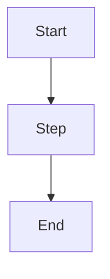

# {Topic Name}

> One-sentence tagline: what this is and why it matters.

## Overview

2-4 sentences. Plain language. What problem does this solve, and where does
it sit in the overall agent-building process?

## Learning Objectives

By the end of this page, you should be able to:

- ...
- ...
- ...

## Key Concepts

| Term | Definition |
|---|---|
| ... | ... |

## Architecture



## Workflow

1. Step one
2. Step two
3. Step three

## Example

```python
# Minimal, commented example
```

## Advantages / Disadvantages

| Advantages | Disadvantages |
|---|---|
| ... | ... |

## When to Use

- ...

## When NOT to Use

- ...

## Common Mistakes

- **Mistake:** ... **Fix:** ...

## Comparison

| Approach | Best for | Cost | Complexity |
|---|---|---|---|
| This technique | ... | ... | ... |
| Alternative | ... | ... | ... |

## Related Topics

- [Related page](../other-folder/page.md)

## Research Papers

- **Title** — Authors, Year. [Link](url)

## Further Reading

- [External resource](url)
