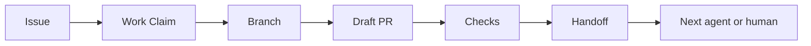

# Agent Handoff

[](AGENT_HANDOFF_STANDARD.md)
[](docs/en/README.md)
[](ai/GITHUB_WORKFLOW.md)
[](ai/AGENT_IDENTITY.md)

Agent Handoff is a GitHub-native standard for passing project context between AI coding agents, human maintainers, and human-supervised agents.

## Why this exists

AI coding agents often lose context between sessions, tools, branches, and pull requests. Chat history is not enough for medium repositories where several humans and agents may work in parallel.

Agent Handoff keeps durable context where development already happens:

```text
GitHub = Issues, Pull Requests, reviews, checks, labels, comments, ownership
Git    = branches, commits, diffs, tags, history
ai/    = compact durable project memory and agent protocols
```

## Core idea



## Who it is for

- maintainers coordinating AI-assisted development;
- developers using Codex-like coding agents;
- teams working with ChatGPT, Cursor, Claude Code, local agents, or custom LLM tools;
- projects that need visible ownership, compact memory, and safe handoff between runs.

## Quick start

Start with the English documentation: [docs/en/README.md](docs/en/README.md).

### Copy-paste prompt

```text
Add Agent Handoff to this repository.
Use the latest standard from https://github.com/artyomboyko/Agent_Handoff.
Inspect the current repository first.
Create or update the Agent Handoff files, GitHub Issue Forms, and Pull Request template.
Keep the repository language English unless the downstream project explicitly chooses another language.

Ask me a separate explicit question about Docker and Docker Compose organization before creating, moving, renaming, deleting, or consolidating any container files or paths.
Ask whether containerization is used or planned, which supported layout I want, whether an existing layout must be preserved or may be migrated, and whether production deployment configuration belongs in this repository or a separate deployment repository.
Do not infer the answer or choose the recommended layout automatically.

Do not let security or evidence work block acceptance or expand scope unless a current-scope risk is verified as High or Critical with reproducible evidence or a directly applicable authoritative source.
A suspected High or Critical risk permits only a short, time-boxed investigation until confirmed. Keep Low, Medium, unrated, and unverified risks non-blocking, preserve the existing security baseline, and run the smallest useful end-to-end scenario as early as practical.
Do not add hardening, gates, ADRs, checkers, or separate stages for theoretical or unverified risks. Cite any exact acceptance criterion or verified mandatory requirement used as an independent blocker.

Before implementation, record the primary outcome, the smallest acceptance proof, and the execution envelope.
The execution envelope records existing authorization; it does not grant broader authority.
Keep supporting work minimum sufficient. Fix localized reversible supporting-work failures and run bounded post-fix verification inside the same work item and authorization.
Do not create a separate stage, handoff, completion target, or owner approval gate for a supporting-tool failure alone.
After two consecutive supporting-only updates without outcome progress, mark the work progress-stalled and replan the shortest path.

When requesting changes in a Pull Request, classify findings as blocking, non-blocking, or questions.
Give each blocking finding a stable ID and a sufficient correction contract: evidence or reproduction, violated contract, cause confidence, required outcome, preserved invariants, scope guard, applicable verification, and acceptance criteria.
Treat implementation guidance as non-binding when an equivalent safe correction satisfies the outcome and invariants.
Keep agent-reported addressed status separate from reviewer-verified resolution.

Open a Pull Request and leave a compact handoff.
```

## Principles

1. GitHub is the source of work truth.
2. Git is the source of code truth.
3. `ai/` is compact durable memory.
4. Handoffs are short, structured, and reviewable.
5. Humans stay in control of structural and migration decisions.
6. Security and evidence work blocks or expands scope only for verified High or Critical current-scope risk or an exactly cited mandatory requirement.
7. Supporting work stays subordinate to the primary outcome and its smallest acceptance proof.
8. Blocking review findings carry sufficient correction contracts without prescribing one implementation unnecessarily.

## What is included

| Area | File |
|---|---|
| Standard | [AGENT_HANDOFF_STANDARD.md](AGENT_HANDOFF_STANDARD.md) |
| GitHub workflow | [ai/GITHUB_WORKFLOW.md](ai/GITHUB_WORKFLOW.md) |
| Agent guide | [AGENTS.md](AGENTS.md) |
| Memory map | [ai/README.md](ai/README.md) |
| Work claim | [ai/WORK_CLAIM_PROTOCOL.md](ai/WORK_CLAIM_PROTOCOL.md) |
| Task reports | [ai/TASK_REPORT_PROTOCOL.md](ai/TASK_REPORT_PROTOCOL.md) |
| Review corrections | [ai/REVIEW_PROTOCOL.md](ai/REVIEW_PROTOCOL.md) |
| Agent identity | [ai/AGENT_IDENTITY.md](ai/AGENT_IDENTITY.md) |
| Refactoring workflow | [ai/REFACTORING.md](ai/REFACTORING.md) |
| Containerization | [ai/CONTAINERIZATION.md](ai/CONTAINERIZATION.md) |
| Issue labels | [ISSUE_LABELS.md](ISSUE_LABELS.md) |
| Issue status | [ISSUE_STATUS.md](ISSUE_STATUS.md) |
| FAQ | [FAQ.md](FAQ.md) |
| Examples | [examples/](examples/) |
| Release notes | [docs/releases/v1.5.1.md](docs/releases/v1.5.1.md) |

## Comparison

| Approach | What it keeps | Limitation |
|---|---|---|
| Chat memory | Conversation context | Tool-specific and session-bound |
| README only | Project overview | Not enough for active work ownership |
| Long LOG.md | Detailed history | Becomes noisy and hard to review |
| Wiki | Documentation | Often detached from branches and PRs |
| Agent Handoff | Compact project state, claims, handoffs | Requires small workflow discipline |

## Natural search terms

Agent Handoff is related to AI coding agents, Codex-like agents, ChatGPT coding workflows, Cursor, Claude Code, LLM agents, project context, agent memory, GitHub workflow, multi-agent development, handoff protocol, pull request workflow, actionable review handoff, review correction contract, outcome-oriented execution, bounded supporting work, progress-stalled recovery, proportionate security, evidence scope, vertical slices, containerization decisions, Docker Compose organization, and human-agent collaboration.

## For humans

Use Agent Handoff to see who owns work, what changed, what was tested, what remains risky, and where the next contributor or agent should continue.

## For agents

Start from `AGENTS.md`, read the required files, claim work in GitHub, record the primary outcome and execution envelope, keep supporting work subordinate, ask for required user decisions, keep security and evidence non-blocking unless a High or Critical current-scope risk is verified, use `ai/REVIEW_PROTOCOL.md` for blocking review corrections, open a Draft PR early, keep `ai/` compact, and leave a handoff only at a legitimate outcome boundary, blocker, interruption, or transfer.

## Repository visibility

This repository is public. Before reusing the standard in your own public repository, review repository history, generated files, and workflow logs.

## License

License: GPL-3.0. See [CHANGELOG.md](CHANGELOG.md) for version history.
