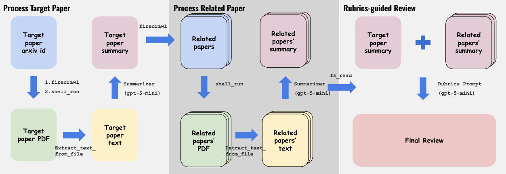

# GUIDE: Paper Advising Pipeline

GUIDE is a YAML workflow pipeline that advises on a **target paper** by resolving it on arXiv, processing it plus several **related papers**, then **synthesizing** a rubric-based academic advising report.

It is built as 4 reusable stages (the "friendly" stage names are for this README; the module filenames are canonical):
- **Parse PDF**: `modules/PDF_parser.yaml`
- **Chunk paper**: `modules/chunk_read.yaml`
- **Summarize chunks → memory**: `modules/process_paper_chunked.yaml`
- **Synthesize + quality-check**: `modules/synthesize_review.yaml`



---

## 📝 Advising Demo

This section provides **end-to-end demo examples** of the GUIDE paper advising pipeline.

Each demo corresponds to a preset listed in the table above:
- **⚡️ Fast/cheap**: a lightweight run with fewer related papers, demonstrating speed and cost efficiency.
- **🎯 Quality**: a higher-quality run with more related papers, demonstrating stronger coverage and analysis depth.

**Evaluation Performance:** GUIDE excels at evaluating **novelty** and **significance**. In the demo examples, our generated advising covers over **80% of human reviewers' feedback** from ARR on these critical dimensions.

**Note:** In the demo files, correct and well-identified aspects are emphasized with ✅ <u>**underlined bold text**</u> to highlight where GUIDE's analysis aligns with human reviewer assessments.

See the full demo runs here:
- ⚡️ Fast/cheap demo → [`assets/fast.md`](assets/fast.md)
- 🎯 Quality demo → [`assets/quality.md`](assets/quality.md)

---

## 🚀 Quick Start

**1. Set API Keys**

First, configure your API keys in `config/vm.env`:
- `OPENAI_API_KEY` - Required for LLM calls
- `FIRECRAWL_API_KEY` - Required for web searching related papers

**2. Run the Pipeline**

From repo root:

```bash
bash ./scripts/run_agent.sh demo/ai_advisor/workflows/paper_advising/guide
```

When it finishes, you should see artifacts under `WORKSPACE_ROOT` (default: `/workspace/outputs/guide_fast_demo`), including:
- `target_memory.json`
- `related_memory.json`
- `advising_results/comparison.json`
- `advising_results/advising.md`

---

## Recommended configs (time / cost)

This repo logs **token usage** per step; USD cost depends on your model pricing. 

| Preset | `openai_model` | `MAX_RELATED_PAPERS` | Expected time | Expected cost | Success rate | Demo |
|---|---|---:|---|---|---|---|
| ⚡️ Fast/cheap | `gpt-5-mini` | 3 | 16 min | $0.2 | 95% | [demo](assets/fast.md) |
| 🎯 Quality | `gpt-5.2` | 5 | 20 min | $5.2 | 95% | [demo](assets/quality.md) |


Notes:
- If you want fewer related papers, set `MAX_RELATED_PAPERS` in `main.env`.
- Using very small models (e.g., `gpt-5-nano`) may lead to degraded performance or execution failure.
- Occasional API timeouts may occur; re-running the pipeline typically resolves this.

### How presets map to workflows (env configuration)

The **Fast/cheap** and **Quality** presets are controlled purely via environment variables.
No workflow files need to be modified.

You can switch between presets by setting the following variables in `main.env`:
- `NUM_RELATED_PAPERS=3` → `NUM_RELATED_PAPERS=5`
- `openai_model=gpt-5-mini` → `openai_model=gpt-5.2`

---


## What the pipeline does (overview)

**Input:** Paper arxiv ID (from `ARXIV_ID`).

**High-level flow:**
1. **Resolve target** (arXiv search by ID) → `arxiv_id` + abstract
2. **Parse + chunk + summarize target** → `target_memory.json`
3. **Find related** (arXiv search) → up to `MAX_RELATED_PAPERS`
4. **Parse + chunk + summarize each related** → `related_memory.json`
5. **Synthesize & evaluate** → `advising_results/advising.md`

---


## BibTeX

```bibtex
@misc{liu2025guide,
  title         = {GUIDE: Towards Scalable Advising for Research Ideas},
  author        = {Yaowenqi Liu and Bingxu Meng and Rui Pan and Yuxing Liu and Jerry Huang and Jiaxuan You and Tong Zhang},
  year          = {2025},
  eprint        = {2507.08870},
  archivePrefix = {arXiv},
  primaryClass  = {cs.LG},
  url           = {https://arxiv.org/abs/2507.08870}
}
