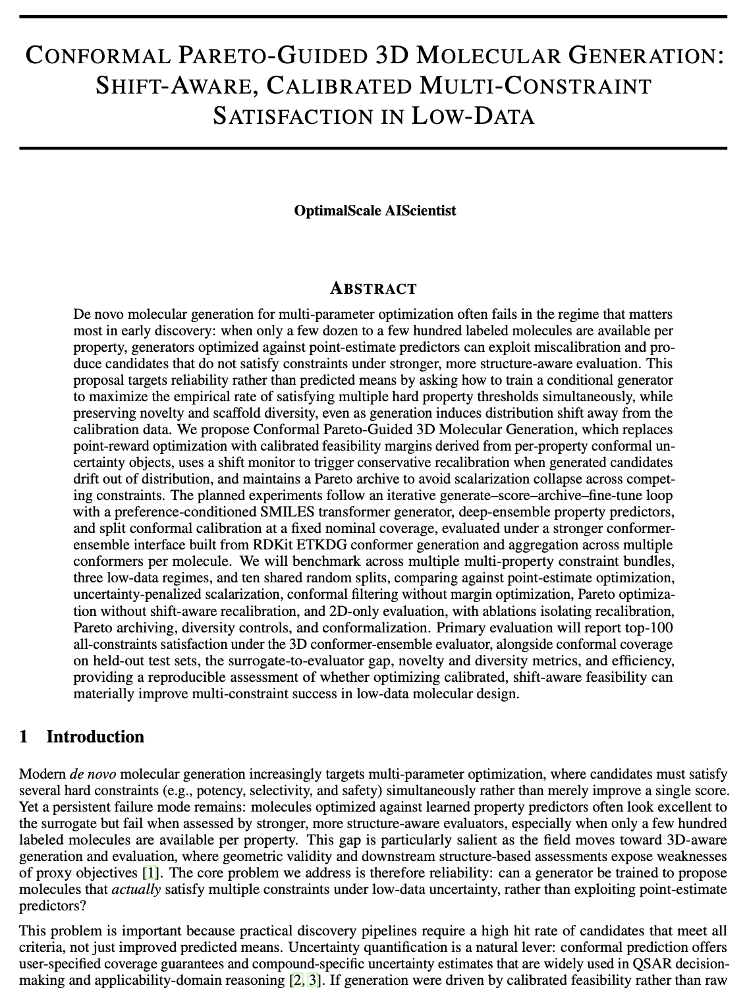

# OptimalScale AIScientist

<p align="center">
  
</p>

OptimalScale AIScientist is an AI-powered workflow for generating scientific proposal drafts. It combines **idea generation** (Thinker) and **proposal writing** (Writer) into end-to-end pipelines. Two workflows are available: a quick demo (**ai_scientists_fast**) and a full pipeline (**ai_scientists**).

---

## 📊 Performance Summary

| Workflow | Mode | Model | Avg. Time | Tokens | Cost | LaTeX Success | Sample proposal |
|----------|------|-------|-----------|--------|------|---------------|--------------|
| **ai_scientists_fast** | — | GPT-5.2 | 4 min | 255K | $0.01 | — | [📄 PDF](proposals/ai_scientists_fast.pdf) |
| **ai_scientists** | Default (full) | GPT-5.2 (user choice) | 24 min | 1.84M | $2.91 | — | [📄 PDF](proposals/ai_scientists.pdf) |
| **ai_scientists** | Default + Refiner | GPT-5.2 + Gemini 2.5 Flash | 40–60 min | ~3.5M | ~$5–7 | — | [📄 PDF](proposals/ai_scientists_refiner.pdf) |
| **ai_scientists** | Cost Efficient | gpt-5-mini + gpt-5-nano | 88 min | 2.28M | $0.55 | 80% | [📄 PDF](proposals/ai_scientists_costefficiency.pdf) |

*Cost and token counts are approximate and depend on API pricing and run conditions. Refiner time/cost depends on the number of iterations needed to meet quality thresholds.*

**Why does Cost Efficient take 88 min?** This mode uses gpt-5-nano for most sections (except Method and Experimental Setup, which use gpt-5-mini). The nano model is slower per token and more prone to LaTeX format mistakes (e.g. escaped characters, citation syntax). The pipeline therefore invokes LaTeX fix tools to correct these errors, which adds extra steps and time. LaTeX success rate under this mode is 80%.

---

## 🚀 Quick Start: Run ai_scientists_fast (4 minutes)

**ai_scientists_fast** is a lightweight demo that generates a short proposal. It's ideal for first-time users to get familiar with the system.

### Prerequisites

1. **Start the VM** (required for all OptimalScale AIScientist workflows):
   ```bash
   bash ./scripts/run_vm.sh start
   ```

2. **Set your API keys** in `config/vm.env` (at the AgentSPEX project root):
   - **OPENAI_API_KEY** — Required for LLM calls. Fill in your OpenAI API key.
   - **FIRECRAWL_API_KEY** — Required for web search and citation fetching. Get one at [Firecrawl](https://firecrawl.dev).
   - **GOOGLE_API_KEY** — Required only if running with the Refiner (for figure generation via Gemini). Get one at [Google AI Studio](https://aistudio.google.com/apikey).

### Run the Fast Demo

From the project root:

```bash
bash ./scripts/run_agent.sh demo/ai_scientists/ai_scientists_fast.yaml
```

- **Typical runtime**: 4 minutes (with GPT-5.2)
- **Typical cost**: $0.01
- **Sample output**: [sample proposal (PDF)](proposals/ai_scientists_fast.pdf)

---

## 📄 Full Pipeline: ai_scientists

**ai_scientists** runs the complete workflow: safety check, idea generation, and full proposal writing (abstract, introduction, related work, method, experimental setup).

### Run the Full Pipeline

```bash
bash ./scripts/run_agent.sh demo/ai_scientists/ai_scientists.yaml
```

**Default configuration** (`cost_efficient: false`): the workflow uses a **single model** of your choice (e.g. GPT-5.2) for the entire pipeline—Thinker and all Writer sections. No model mixing. See [sample proposal (PDF)](proposals/AIScientist.pdf) for an example run with this setup.

### Cost-Efficient Mode

The full pipeline supports **Cost Efficient** mode to reduce token usage and cost:

| Mode | Description |
|------|-------------|
| **Cost Efficient ON** (`cost_efficient: true`) | Uses `gpt-5-mini` for Method and Experimental Setup; `gpt-5-nano` for all other sections. [Sample proposal (PDF)](proposals/ai_scientists_costefficiency.pdf) |
| **Cost Efficient OFF** (`cost_efficient: false`) | **Default.** Uses your chosen model (e.g., GPT-5.2) for the entire workflow. |

Edit `demo/ai_scientists/ai_scientists.yaml` and set:

```yaml
parameters:
  cost_efficient: true   # or false
```

### Refiner (Iterative Quality Improvement) — Disabled by Default

> ⚠️ **The Refiner is commented out by default** in `demo/ai_scientists/ai_scientists.yaml` because it requires the **Gemini API** (for figure generation) and can consume a large number of tokens across multiple iterations. Enable it only if you understand the cost implications.

The Refiner is an optional stage that runs after the Writer. It iteratively improves the generated proposal through a loop of:

1. **Compile PDF** and submit to a **review API** (`review_paper` tool) for scoring
2. **Format checks** — 11 automated criteria (title length, abstract formatting, subsection count, reference count, figure presence, contribution clarity, etc.)
3. **Generate suggestions** based on review feedback and failing format criteria
4. **Apply edits** per section using surgical text patching
5. **Generate a research overview figure** using Gemini 2.5 Flash Image — a colorful infographic-style figure is automatically created and inserted into the paper
6. **Repeat** until a stop condition is met (see below)

#### Stop Conditions

The loop terminates as soon as **either** of these conditions is satisfied:

| # | Condition | Where it's defined |
|---|-----------|--------------------|
| 1 | **Quality threshold met**: `review_score ≥ min_score` (default `5.6`) **AND** all 11 format checks pass | [`refiner/modules/review_and_exit.yaml`](refiner/modules/review_and_exit.yaml) — `STOP if all_format_pass == true AND score_ok == true` |
| 2 | **Max iterations reached**: 10 iterations completed | [`refiner/ai_scientists_refiner.yaml`](refiner/ai_scientists_refiner.yaml) — `while.max_iterations: 10` |

You can adjust both thresholds:
- `min_score`: edit `parameters.min_score` in [`refiner/ai_scientists_refiner.yaml`](refiner/ai_scientists_refiner.yaml) (default `5.6`)
- `max_iterations`: edit `while.max_iterations` in the same file (default `10`)

> 💡 **Token usage tip**: Each iteration calls GPT-5.2 several times (suggestions for 6 sections + edits + format/content evaluation) plus one Gemini call for figure generation. A single iteration typically costs **$0.5–$1.5**. With `max_iterations: 10`, the worst-case cost is **~$10–$15** if no early stop is triggered. Lower `max_iterations` or raise `min_score` cautiously.

#### API Keys Required

| Key | Purpose |
|-----|---------|
| `OPENAI_API_KEY` | GPT-5.2 for suggestion generation, text editing, format evaluation, and the `review_paper` reviewer call |
| `GOOGLE_API_KEY` | Gemini 2.5 Flash Image for research overview figure generation |

#### How to Enable the Refiner

Open `demo/ai_scientists/ai_scientists.yaml` and **uncomment** the Step 5.2 block (remove the leading `# ` from each line):

```yaml
        # Step 5.2: Refiner — iterative review-driven improvement
        - call:
            module: "demo/ai_scientists/refiner/ai_scientists_refiner.yaml"
            parameters:
              sections_dir: "{{output_dir}}/writer/sections"
              output_dir: "{{output_dir}}/refiner"
              human_feedback: "Shorten the title to be more concise (under 10 words). Improve LaTeX table formatting: replace \\hline with booktabs commands (\\toprule, \\midrule, \\bottomrule) and ensure column alignment is clean."
            save_as: "refiner_result"
            return: "prev_output"
```

The Refiner can also be run independently on any existing paper:

```bash
SECTIONS_DIR=/workspace/outputs/<paper>/writer/sections \
REFINER_OUTPUT_DIR=/workspace/outputs/<paper>/refiner \
bash ./scripts/run_agent.sh demo/ai_scientists/refiner/ai_scientists_refiner.yaml
```

---

## ▶️ How to Run (Command Reference)

| Workflow | Command |
|----------|---------|
| **ai_scientists_fast** (quick demo) | `bash ./scripts/run_agent.sh demo/ai_scientists/ai_scientists_fast.yaml` |
| **ai_scientists** (full pipeline) | `bash ./scripts/run_agent.sh demo/ai_scientists/ai_scientists.yaml` |

### Three demos and workflow entries

| Demo | Entry YAML | Description |
|------|------------|-------------|
| **Fast** | `demo/ai_scientists/ai_scientists_fast.yaml` | Quick short demo (about 4 min). No refiner. |
| **Full (default)** | `demo/ai_scientists/ai_scientists.yaml` with `cost_efficient: false` | Full pipeline with GPT-5.2 + Refiner (iterative improvement + figure generation). |
| **Full (cost efficient)** | `demo/ai_scientists/ai_scientists.yaml` with `cost_efficient: true` | Full pipeline with gpt-5-mini + gpt-5-nano + Refiner. |

The workflows live under **demo/ai_scientists** and are intended to be run from the **AgentSPEX** project root (which provides the runner and VM).

---

## 🌐 Web UI

OptimalScale AIScientist also provides a **chat-style Web UI** for a more user-friendly experience. Instead of editing YAML files and running commands, users interact through a multi-turn conversation in the browser: describe a research topic, and the system generates a full proposal with downloadable PDF and source files.

**Key features:**
- Multi-turn chat interface with typewriter-style responses
- Automatic domain & intent extraction from natural language
- Real-time step-by-step progress tracking
- Downloadable PDF and LaTeX source ZIP on completion

**Quick start:**

```bash
conda activate yaml-agent
python demo/ai_scientists/web/app.py
# Open http://localhost:5001 in your browser
```

For full deployment instructions, dependencies, configuration, and troubleshooting, see the **[Web UI README](web/README.md)**.

---

## 💻 Virtual Machine (One-Click Deployment)

A pre-built virtual machine image (`.utm`) is available for **Mac with Apple Silicon**. It includes all dependencies pre-installed — users just import the VM, start it, enter an API key, and open the website.

**What's included in the VM:**
- Ubuntu 22.04 with Docker, Conda, LaTeX, and all Python dependencies
- Pre-built Docker sandbox image
- Auto-start services (sandbox + web UI boot automatically)
- First-boot setup portal for API key configuration

**User guide:** See the **[VM Quick Start](web/VM_README.md)** for detailed instructions on how to use the `.utm` file.

---

## ⚙️ Parameters and Configuration

### Where to Set Parameters

Parameters are defined in the YAML files.

| Setting | Where to Set | Description |
|---------|--------------|-------------|
| **Model** | YAML `config.model` | The LLM used for the main workflow. Edit the `config` section in the YAML file. |
| **output_dir** | YAML `parameters.output_dir` | Directory for all outputs. Edit the YAML directly. |
| **domain** | YAML `parameters.domain` | Research domain (e.g., `bioinformatics`). |
| **intent** | YAML `parameters.intent` | Research goal / query (e.g., "Develop generative models for de novo molecular design..."). |
| **num_ideas** | YAML `parameters.num_ideas` | Number of ideas to generate (default: 1). |
| **cost_efficient** | YAML `parameters.cost_efficient` | (Full pipeline only) Use cost-efficient model mix. |
| **proposal_format** | YAML `parameters.proposal_format` | Output format: `latex` (default) or `markdown`. |

### Aligning output_dir with System Output

The agent writes step outputs and logs to `outputs/{task_name}` (e.g., `outputs/ai_scientists_fast`). The full path is `workspace/outputs/{task_name}`.

To keep everything in one place, set `output_dir` in the YAML to match:

- **ai_scientists_fast**: `output_dir: "workspace/outputs/ai_scientists_fast"`
- **ai_scientists**: `output_dir: "workspace/outputs/ai_scientists"`

These are the defaults. If you change `output_dir`, all submodule outputs (thinker, writer) will go under your chosen directory.

### Example: Custom Model

Edit the YAML file (e.g., `demo/ai_scientists/ai_scientists.yaml`) and set the model in the `config` section:

```yaml
config:
    model: "gpt-5.2"
```

---

## 📁 Output Files and Structure

### ai_scientists_fast Output Structure

```
workspace/outputs/ai_scientists_fast/
├── config.txt              # Run configuration
├── agent_run.log           # Main workflow log
├── step-1-output.txt       # Step outputs
├── step-2-output.txt
├── step-3-output.txt
├── step-4-output.txt
├── final-output.txt        # Final step output
├── thinker/                # Idea generation
│   ├── step-2-final-ideas.json
│   └── ...
└── writer/
    └── sections/
        ├── abstract.tex    # Generated abstract
        ├── brief_introduction.tex
        ├── brief_related_work.tex
        ├── brief_method.tex
        ├── brief_experiment_plan.tex
        └── main.tex        # LaTeX main file
```

### ai_scientists (Full Pipeline) Output Structure

```
workspace/outputs/ai_scientists/
├── config.txt
├── agent_run.log
├── step-*-output.txt
├── final-output.txt
├── thinker/                # Idea generation + safety check
│   ├── step-1-safety-check.json
│   ├── step-2-final-ideas.json
│   └── ...
├── writer/
│   └── sections/           # Original generated sections (read-only)
│       ├── abstract.tex
│       ├── introduction.tex
│       ├── related_work.tex
│       ├── method.tex
│       ├── experimental_setup.tex
│       ├── main.tex
│       ├── references.bib
│       └── ...
└── refiner/                # Iterative refinement (if enabled)
    ├── working_sections/   # Current working copy of sections
    │   ├── *.tex
    │   └── figures/
    │       └── research_overview.png  # Auto-generated overview figure
    ├── best_sections/      # Best scoring version
    ├── iterations/         # Per-iteration snapshots
    │   ├── 0/              # Baseline
    │   ├── 1/              # Iteration 1 (proposal.pdf, score.txt, review.json)
    │   └── ...
    ├── citation_pool.json  # Cached citation search results
    └── best_review_score.txt
```

### LaTeX Files and References

- **`.tex` files**: `workspace/outputs/{task_name}/writer/sections/`
- **`references.bib`**: `workspace/outputs/{task_name}/writer/sections/references.bib` (Full pipeline only; Fast has no citations)

### Compiling to PDF

Use the generated `.tex` files together with `PRIMEarxiv.sty`:

1. Copy the `sections/` folder (or its contents) from your run output.
2. Copy `demo/ai_scientists/PRIMEarxiv.sty` into the same directory (or a path LaTeX can find).

---

## 🔧 Troubleshooting

### VM not running

Ensure the VM is started before running the agent:

```bash
bash ./scripts/run_vm.sh start
```

### proposal writing skipped

If idea generation fails or the safety check does not pass, proposal writing is skipped. Check:

- `{output_dir}/thinker/step-1-safety-check.json`
- `{output_dir}/thinker/step-2-final-ideas.json`
- `{output_dir}/proposal_writing_skipped.txt` (if present)

