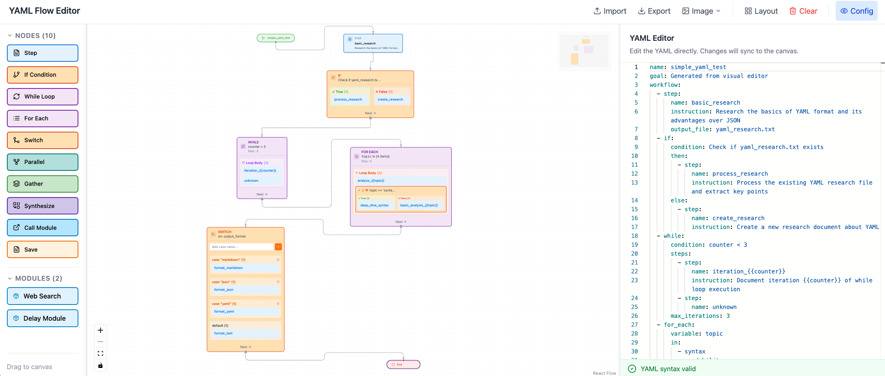

# YAML Flow Editor

A visual editor for **YAML workflows** used by the AgentSPEX agent. Design workflows with a drag-and-drop canvas, edit raw YAML in Monaco, and run the agent from the UI—all with bidirectional sync between graph and YAML.



---

## Features

| Feature | Description |
|--------|-------------|
| **Visual workflow** | Drag nodes from the sidebar, connect with edges, configure in the right panel. |
| **Bidirectional sync** | Edits in the graph update YAML; edits in the YAML editor update the graph. |
| **Rich node set** | Step, If/While/ForEach/Switch, Gather, Parallel, Call, Input, Return, Set Variable, Increment. |
| **Auto layout** | Top-to-bottom or left-to-right layout with [dagre](https://github.com/dagrejs/dagre). |
| **Import / Export** | Load YAML files, export YAML or PNG/SVG/PDF of the flow. |
| **Run from UI** | Run the agent with current YAML; optional dashboard, resume, and extra args. |
| **Undo / Redo** | History with keyboard shortcuts (Ctrl/Cmd+Z, Ctrl/Cmd+Shift+Z). |
| **Submodules** | View and edit called modules; import folder or individual YAML files. |

---

## Quick Start

### Prerequisites

- **Node.js 18+**
- **npm** or **yarn**

### Install and run

```bash
cd yaml-flow-editor
npm install
npm run dev
```

Open **http://localhost:3000** in your browser.

### Build for production

```bash
npm run build
```

Output is in the `dist/` directory. Preview with `npm run preview`.

---

## Basic usage

1. **Add nodes** — Drag a node from the left sidebar onto the canvas (Step, If, While, For Each, Switch, Gather, Parallel, Call, Input, Return).
2. **Connect** — Drag from a node’s **bottom handle** to another node’s **top handle** to create a connection.
3. **Configure** — Click a node to edit its properties in the right panel (name, instruction, condition, parameters, etc.).
4. **Layout** — Use the toolbar **Layout** button (or menu) to auto-arrange nodes (Top–Bottom or Left–Right).
5. **YAML** — Toggle **YAML** to view or edit the raw workflow; changes sync back to the graph.
6. **Export** — Use **Export** to download the YAML file, or **Export → Image** for PNG/SVG/PDF.
7. **Run** — Use **Run** to execute the current plan via the repo’s `run_agent.sh` (see [Run from UI](#run-from-ui)).

---

## Node types

| Node | YAML key | Purpose |
|------|----------|---------|
| **Start** / **End** | (implicit) | Workflow boundaries; added automatically. |
| **Step** | `step` | Single step: `name`, `instruction`, `save_as`, `output_file`. |
| **If** | `if` | Branch on `condition`; `then` / `else` branches. |
| **While** | `while` | Loop while `condition`; optional `max_iterations`, `steps`. |
| **For Each** | `for_each` | Iterate over `variable` in `in`; optional `max_iterations`, `steps`. |
| **Switch** | `switch` | Multi-way branch on `variable`; `cases` and optional `default`. |
| **Gather** | `gather` | Parallel calls (multiple modules or one module with `parameters_list`). |
| **Parallel** | `parallel` | One module, multiple parameter sets in parallel. |
| **Call** | `call` | Call a submodule with `module` and `parameters`. |
| **Input** | `input` | Prompt user; `prompt`, `save_as`, optional `default`. |
| **Return** | `return` | Return a context variable (e.g. `variable: "result"`). |
| **Set Variable** | `set_variable` | Set `name` to `value`. |
| **Increment** | `increment` | Increment a counter variable. |

Details and YAML shape: see [docs/NODE_REFERENCE.md](docs/NODE_REFERENCE.md) and the repo’s [yaml_README.md](../yaml_README.md).

---

## Run from UI

When the editor is served from the **Vite dev server** (e.g. `npm run dev` from the repo root or from `yaml-flow-editor`), the **Run** button:

1. Sends the current editor YAML (and any uploaded submodule files) to the backend.
2. Writes the plan to `outputs/_ui_runs/run_<id>.yaml` and, if needed, module files under `run_<id>_modules/`.
3. Runs `scripts/run_agent.sh` with the saved plan; you can enable **Dashboard**, **Resume**, and pass **Extra args** from the Run options.

**Run options** (in the Run dropdown):

- **Dashboard** — Start the agent dashboard and show a link (proxied through the dev server).
- **Resume** — Pass resume-related flags to the agent.
- **Model / Max tokens / Max tool calls / Plan revision steps** — Forwarded as CLI args.
- **MCP URL, Output dir, Checkpoint path, Trace path, Replay trace, Extra args** — Optional overrides.

Logs stream in the run panel; when the run starts, **Open Dashboard** becomes available if Dashboard was enabled.

**Note:** Run and dashboard proxy only work when the app is served by the Vite dev server (which registers the run-agent API and dashboard proxy). A static `dist/` build does not include this backend.

---

## Project structure

```
yaml-flow-editor/
├── src/
│   ├── App.tsx              # Main editor: flow state, YAML sync, run panel
│   ├── components/          # UI: Sidebar, Toolbar, NodeConfigPanel, nodes/*, etc.
│   ├── contexts/            # InnerStep, SubmoduleStep, Layout, Modules
│   ├── converters/          # yaml-to-graph, graph-to-yaml
│   ├── hooks/               # useHistory (undo/redo)
│   ├── types/               # Workflow, WorkflowStep, FlowNodeData, NODE_CONFIGS
│   └── utils/               # layout (dagre), image export, moduleYaml, parseModuleYaml
├── public/
├── docs/                    # Detailed documentation
├── package.json
├── vite.config.ts           # Vite + run-agent API plugin
└── README.md
```

For architecture and data flow, see [docs/ARCHITECTURE.md](docs/ARCHITECTURE.md).

---

## Scripts

| Command | Description |
|---------|-------------|
| `npm run dev` | Start Vite dev server (with run-agent API) at http://localhost:3000 |
| `npm run build` | TypeScript compile + Vite build → `dist/` |
| `npm run preview` | Serve `dist/` locally |

---

## Documentation

- **[docs/ARCHITECTURE.md](docs/ARCHITECTURE.md)** — Architecture, state, converters, and run API.
- **[docs/NODE_REFERENCE.md](docs/NODE_REFERENCE.md)** — Node types and their YAML mapping.
- **[../yaml_README.md](../yaml_README.md)** — Full YAML task language reference (goal, parameters, workflow, tools, etc.).

---

## Tech stack

- **React 18** + **TypeScript**
- **@xyflow/react** (React Flow) for the canvas
- **dagre** for auto layout
- **Monaco Editor** (@monaco-editor/react) for YAML
- **js-yaml** for parsing and serializing
- **Vite** for build and dev server (with custom run-agent middleware)
- **Tailwind CSS** for styling
- **Lucide React** for icons

---

## License

Same as the parent repository (AgentSPEX).
