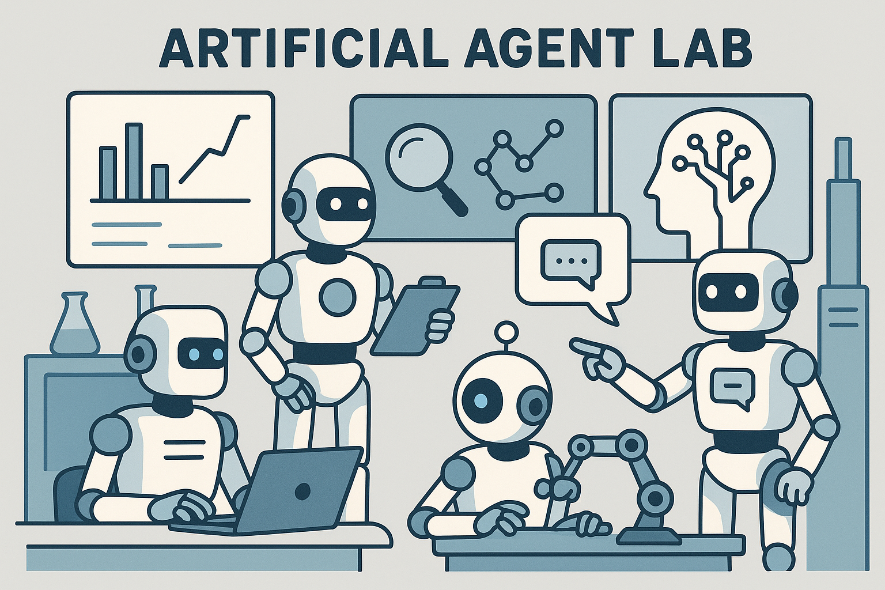
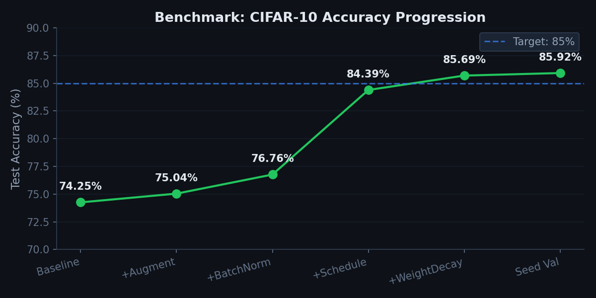

<p align="center">
  
</p>

<p align="center">
  An autonomous research lab powered by AI agents. Drop your code, papers, and notes — a PI agent and PhD investigators run experiments, build a knowledge graph, and write a paper.
</p>

---

## How It Works

Built on [Claude Code](https://docs.anthropic.com/en/docs/claude-code) and the [Claude Agent SDK](https://docs.anthropic.com/en/docs/claude-agent-sdk). A PI agent orchestrates multiple PhD investigator agents that run experiments in parallel on your compute, record results in a knowledge graph, and produce a research paper with a reproducibility notebook when done.

You provide four things:
1. **Source material** — code, papers, notes, data
2. **Skills** — domain knowledge that guides research and writing (optional)
3. **Compute nodes** — machines to run experiments on
4. **Research proposal** — what to investigate, how to measure success

```
                 ┌───────────────────────────────────────┐
                 │  PI Agent (Principal Investigator)    │
sources/         │                                       │
skills/    ───►  │  Reads everything → opens threads →   │
proposal.md      │  dispatches PhDs → reviews findings   │
compute_nodes/   │  → generates new ideas → repeat       │
                 │                                       │
                 │  ┌──────────┐      ┌──────────┐       │
                 │  │  phd_1   │      │  phd_2   │       │
                 │  │ Runs exp │      │ Runs exp │       │
                 │  │ on nodeA │      │ on nodeB │       │
                 │  └────┬─────┘      └────┬─────┘       │
                 │       └───────┬─────────┘             │
                 │               ▼                       │
                 │     PI reviews, opens next thread     │
                 │     When done: writes paper           │
                 └───────────────────────────────────────┘
                                 │
                                 ▼
                 results.jsonl + knowledge_graph.jsonl
                 + paper/ + reproduce.ipynb
```

---

## Try It: CIFAR-10 Benchmark

A simple CIFAR-10 classification task to showcase the full lab pipeline and verify everything works. The goal: improve a baseline CNN from ~70% to >85% test accuracy. It's intentionally simple — the point is to see how the PI opens threads, dispatches investigators, builds the knowledge graph, and writes a summary.

```bash
git clone git@github.com:BY571/artificial-agent-lab.git
cd artificial-agent-lab
uv sync

# Run the benchmark (~20 min, local machine, GPU auto-detected)
bash benchmark/run_benchmark.sh

# Monitor in real-time (separate terminal)
uv run streamlit run dashboard.py
```

> **Note**: The dashboard is in beta — functional but still being improved in both features and design. Contributions welcome!

No config needed — everything is pre-configured in `benchmark/`.

### What to Expect

The lab takes a simple 3-layer CNN (~70% accuracy on CIFAR-10) and systematically improves it. Here's what a typical benchmark run produces:

| # | Experiment | Accuracy | Change |
|---|-----------|----------|--------|
| 1 | Baseline | 74.25% | SimpleCNN, 10 epochs, SGD lr=0.01 |
| 2 | + Augmentation | 75.04% | RandomCrop + HorizontalFlip |
| 3 | + BatchNorm | 76.76% | BatchNorm2d after each conv layer |
| 4 | + Scheduling | 84.39% | CosineAnnealing, 50 epochs, lr=0.1 |
| 5 | + Regularization | 85.69% | Weight decay 1e-4 |
| 6 | Seed validation | 85.92% | Confirms with seed=43 |

<p align="center">
  
</p>

**~20 minutes total** — 6 experiments, +11.7% accuracy improvement, knowledge graph with insights per experiment, findings report, and a summary document. The PI progressively stacks improvements: augmentation → batch normalization → learning rate scheduling → regularization → seed validation.

---

## Quick Start (Your Own Research)

<details>
<summary><b>1. Install</b></summary>

```bash
git clone git@github.com:BY571/artificial-agent-lab.git
cd artificial-agent-lab
uv sync    # or: pip install -r requirements.txt
```

Requires [Claude Code](https://docs.anthropic.com/en/docs/claude-code) and the [Claude Agent SDK](https://docs.anthropic.com/en/docs/claude-agent-sdk).

</details>

<details>
<summary><b>2. Define compute nodes</b></summary>

Each machine needs a file in `compute_nodes/`. A `local.md` is included by default.

For remote machines, copy the template:

```bash
cp compute_nodes/TEMPLATE.md compute_nodes/my-gpu.md
```

Fill in: connection (`ssh user@host`), hardware specs, run command, utilization (50% = shared machine, 100% = dedicated). See `compute_nodes/TEMPLATE.md` for all fields.

The number of investigators auto-matches the number of nodes.

</details>

<details>
<summary><b>3. Create a session</b></summary>

```bash
python scripts/init_session.py --name "my-research" --sources /path/to/my/code
```

This creates `autoresearch/<date>_my-research/` with `sources/`, `skills/`, `threads/`, and an empty `research_proposal.md`.

</details>

<details>
<summary><b>4. Add sources and skills</b></summary>

**Sources** — what to research (code, papers, data):
```bash
cp train.py model.py autoresearch/<session>/sources/
cp reference_paper.pdf autoresearch/<session>/sources/
```

**Skills** — how to research (domain knowledge, `.md` files injected into agent prompts):
```bash
cp pytorch-patterns.md autoresearch/<session>/skills/
cp plotting-guide.md autoresearch/<session>/skills/
```

Skills guide both research AND paper writing. Optional but recommended.

</details>

<details>
<summary><b>5. Write the research proposal</b></summary>

Edit `autoresearch/<session>/research_proposal.md` with: research question, hypothesis, success criteria, starting ideas, primary metric, hardware, and budget. See `research_proposal_template.md` for all fields.

</details>

<details>
<summary><b>6. Launch, monitor, stop</b></summary>

```bash
# Launch
python -m orchestrator.run autoresearch/<session>/

# Monitor (separate terminal)
uv run streamlit run dashboard.py

# Stop (PI finishes current thread, then writes paper)
touch autoresearch/<session>/.stop_autoresearch

# When done, merge results back to main
git checkout main && git merge research/<session-name>
```

</details>

---

## What You Get

After a session completes, the lab produces a full research package — paper (or summary), reproducibility notebook, structured results, and a knowledge graph capturing every experiment and insight.

| Output | Description |
|--------|-------------|
| `paper/paper.pdf` or `paper/summary.md` | Research paper or findings summary |
| `paper/reproduce.ipynb` | Notebook to reproduce key results |
| `results.jsonl` | Every experiment with metrics |
| `knowledge_graph.jsonl` | What was tried, why, what was learned |
| `research_log.md` | PI's strategic reasoning |
| `threads/*/findings.md` | Per-thread analysis and recommendations |

## Key Concepts

### Sources vs Skills

| | Sources (`sources/`) | Skills (`skills/`) |
|---|---|---|
| **What** | Code, papers, data, notes | Domain knowledge, best practices |
| **Purpose** | What to research | How to research (and write papers) |
| **Read by** | Investigators | PI + Investigators (injected into prompts) |

### Compute Nodes

Each machine needs a file in `compute_nodes/` with: connection, hardware, utilization, run command, and constraints. Investigators are auto-assigned one per node — `hardware: local+gpu1+gpu2` creates 3 investigators running in parallel.

### Knowledge Graph

Every experiment produces a node: what was changed, why, outcome, insights, and ideas for follow-up. The PI and investigators read it before planning — no repeated failures, discoveries compound.

### Research Budget & Rate Limits

| Budget | Behavior |
|--------|----------|
| `4h` | Research for 4 hours, then write paper. Soft warning at 75%. |
| `unlimited` | Run indefinitely until you stop it. |

| Rate Limit Policy | Behavior |
|-------------------|----------|
| `wait` (default) | Pause, poll every 5 min, resume when cleared. Budget clock pauses. |
| `stop` | End research, write paper. |

### Final Output

| Setting | What you get |
|---------|-------------|
| `paper` | Full LaTeX paper + figures + reproduce notebook + N review rounds |
| `summary` | Concise markdown summary (2-4 pages, no LaTeX needed) |

## Design Principles

- **Source-driven** — drop your materials, the lab reads them
- **Skill-augmented** — domain knowledge guides research and writing
- **Hierarchical** — PI thinks strategically, investigators execute
- **Branch-per-session** — each session isolated on its own git branch
- **Knowledge compounds** — the graph prevents repeated mistakes
- **Append-only** — results and knowledge graph survive crashes
