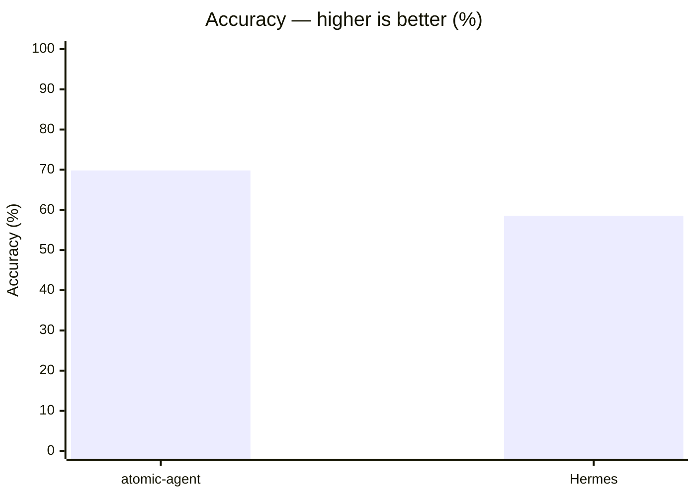
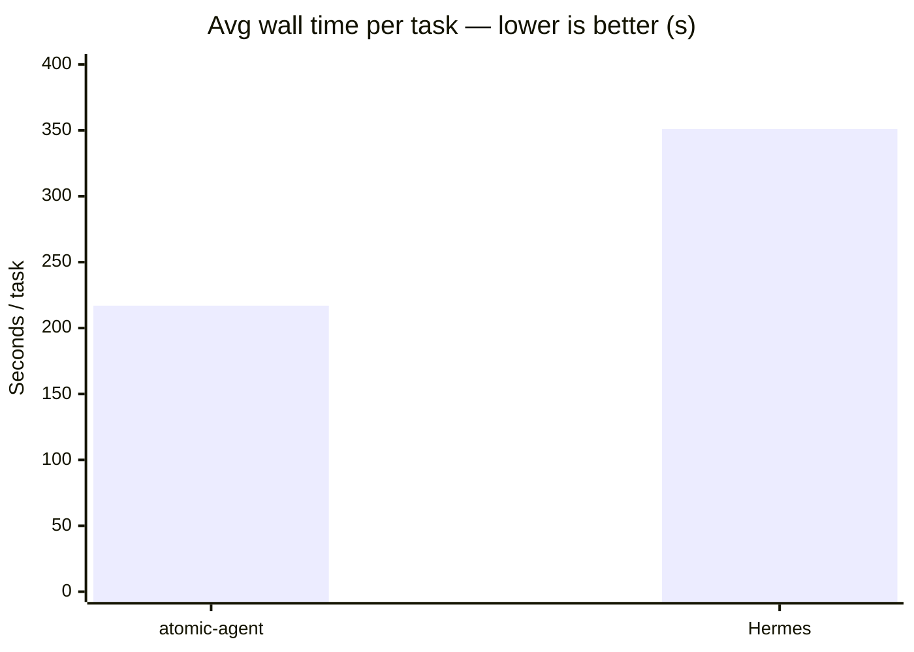
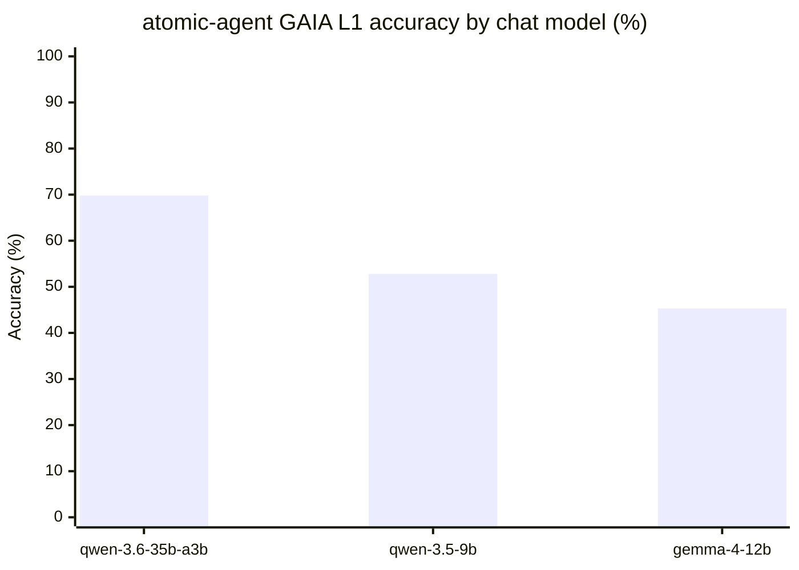

# GAIA Level 1 — atomic-agent vs Hermes (local single-model benchmark)

Reproducible write-up of the GAIA Level 1 comparison between `atomic-agent` and
`Hermes`, both driving the **same** local `qwen-3.6-35b-a3b` served by
`llama-server`. All raw artifacts (per-task matrices, NDJSON traces, run logs)
are published as a downloadable bundle on the GitHub release:
[**gaia-l1-eval-2026-06-11**](https://github.com/AtomicBot-ai/atomic-agent/releases/tag/gaia-l1-eval-2026-06-11)
(asset `gaia-l1-eval.tar.gz`).

---

## 1. Goal

Measure end-to-end task accuracy of two local operator agents on the public
GAIA validation Level 1 split, holding the model, quantization, context window,
step budget, timeout, and dataset constant. The only deliberate variable is the
**agent runtime** (atomic-agent vs Hermes).

---

## 2. Environment (captured snapshot)

From `eval-agents/reports/run-2026-06-11T07-29-11-112Z/environment.json`:

| Component | Value |
|---|---|
| atomic-agent version | `0.1.36` |
| git sha | `cc5c7d4` (branch `main`, dirty: harness `taskIds` filter only) |
| Hardware | Apple M4 Max (40-core GPU) |
| Node | `v25.7.0`, `darwin`, `arm64` |
| Chat model | `Qwen3.6-35B-A3B-UD-Q4_K_XL` (GGUF, UD-Q4_K_XL quant) |
| Chat context window | `262144` tokens (`n_ctx`) |
| Chat daemon | `http://127.0.0.1:19091` |
| Embedding model | `bge-m3-Q8_0` |
| Embedding daemon | `http://127.0.0.1:19092` |
| llama-server build | `b1-9ee9a1c` |

Both agents talk to the **same** chat daemon. atomic-agent additionally uses the
embedding daemon for its memory fabric (hybrid recall). Hermes does not use the
embedding daemon.

---

## 3. Dataset

- **Source:** GAIA 2023 `validation` split, **Level 1 only** (53 tasks).
- **On disk:** `eval-agents/datasets/gaia/hf/2023/validation/metadata.jsonl`
  (+ attachment files in the same directory).
- **Download:** `npm run eval:agents:datasets` (requires a Hugging Face token /
  accepted GAIA license; the token is read from `eval-agents/.env`, never logged).
- **Loader:** `eval-agents/harness/load-gaia-rows.ts` filters by `Level === 1`.

---

## 4. Harness

- **Runner:** `vitest` via `eval-agents/scripts/run-level1.mjs` →
  `eval-agents/gaia.eval.ts`.
- **Sequential execution:** `eval-agents/vitest.config.ts` sets `singleFork: true`
  and `maxConcurrency: 1`, so exactly one task runs at a time against the single
  shared llama-server. `testTimeout` is derived from `ATOMIC_AGENT_GAIA_TIMEOUT_MS`
  plus a safety margin.
- **Per-task isolation:** `eval-agents/harness/temp-workspace.ts` creates a fresh
  working dir + state dir per task; it is deleted after the case (traces are copied
  out first — see below).
- **Step / time budget:** `max-steps = 40`, `timeout = 900000 ms` (15 min) per task.
- **Grading (deterministic, no LLM judge in the scoring path):**
  1. `extractFinalAnswer(rawReply)` (`eval-agents/harness/extract-answer.ts`)
     pulls the last `FINAL ANSWER: <value>` line from the agent reply.
  2. `questionScorer(extracted, gold)` (`eval-agents/harness/score-gaia.ts`) is a
     TypeScript port of the official GAIA leaderboard scorer (number
     normalization, list split on `,`/`;`, punctuation/space-insensitive string
     match).
  - The `judge` block in `environment.json` is captured for provenance but is
    **not** used by the matrix grading path.
- **Report output:** each run writes a fresh
  `eval-agents/reports/run-<ISO-timestamp>/` containing `matrix.csv`,
  `matrix.jsonl`, `environment.json`, and `traces/<taskId>/*.ndjson`.

---

## 5. Agents under test

### atomic-agent
- Launched from the compiled CLI: `dist/cli/index.js` (build with `npm run build`).
- Memory fabric ON (profile + notes + hybrid recall via the embedding daemon).
- Sampling overridable by env (read by `src/llm/llama-server-client.ts`):
  `ATOMIC_AGENT_LLAMA_TEMPERATURE`, `ATOMIC_AGENT_LLAMA_TOP_P`,
  `ATOMIC_AGENT_LLAMA_TOP_K`, `ATOMIC_AGENT_LLAMA_SEED`. Defaults: `temp=0.2`,
  `top_p=0.95`, `top_k=40`, random seed.

### Hermes
- Invoked via its CLI (`hermes chat`); adapter in
  `eval-agents/adapters/hermes-adapter.ts`.
- `~/.hermes/config.yaml` points Hermes at the same llama-server
  (`base_url: http://127.0.0.1:19091/v1`, `model.default: qwen-3.6-35b-a3b`).
- Temperature is **not** configurable in Hermes config — it runs at its own
  default. This is the one uncontrolled variable; documented as a caveat.
- Memory reset to a blank slate before the run: `npm run eval:agents:reset-hermes`
  (memory isolation per run; each task runs in its own session).

---

## 6. Exact reproduction commands

> Prerequisites: datasets downloaded (§3), `npm install`, `npm run build`,
> and a running chat daemon (`atomic-agent models start` brings up chat+embedding;
> `run-level1.mjs` will also cold-start them itself when no
> `ATOMIC_AGENT_EVAL_LLAMA_URL` is exported).

### 6.1 atomic-agent — full L1, default sampling (temp 0.2)
```bash
ATOMIC_AGENT_EVAL_AGENTS=atomic-agent \
ATOMIC_AGENT_EVAL_LLAMA_URL=http://127.0.0.1:19091 \
ATOMIC_AGENT_EVAL_EMBED_URL=http://127.0.0.1:19092 \
ATOMIC_AGENT_EVAL_KEEP_DAEMON=1 \
node eval-agents/scripts/run-level1.mjs
```

### 6.2 Hermes — full L1
```bash
npm run eval:agents:reset-hermes
ATOMIC_AGENT_EVAL_AGENTS=hermes \
ATOMIC_AGENT_EVAL_LLAMA_URL=http://127.0.0.1:19091 \
ATOMIC_AGENT_EVAL_KEEP_DAEMON=1 \
node eval-agents/scripts/run-level1.mjs
```

> Operational note: `run-level1.mjs` installs a SIGTERM/SIGINT handler that calls
> `models stop` unconditionally. To abort a run **without** killing the shared
> daemons, use `kill -9` on the run process (skips the handler).

---

## 7. Results

### 7.1 atomic-agent vs Hermes (full L1, 53 tasks)





| Metric | atomic-agent | Hermes |
|---|---|---|
| **Accuracy** | **37/53 = 69.8%** | 31/53 = 58.5% |
| Empty answers | 4 | 0 |
| Avg steps / task | ~8 | n/a (not reported) |
| Avg wall / task | ~217 s | ~351 s |

atomic-agent report: `run-2026-06-11T07-29-11-112Z/`
Hermes report: `run-2026-06-10T22-02-07-267Z/`

### 7.2 Head-to-head (per task)

| Outcome | Count |
|---|---|
| Both correct | 22 |
| atomic only | 15 |
| Hermes only | 9 |
| Both wrong | 7 |

- **atomic only:** `5d0080cb, a1e91b78, cffe0e32, b816bfce, 72e110e7, cca530fc,
  4fc2f1ae, 389793a7, 4b650a35, cabe07ed, 0383a3ee, e142056d, 23dd907f, 840bfca7,
  bda648d7`
- **Hermes only:** `e1fc63a2, 8e867cd7, 46719c30, 2d83110e, 42576abe, 9318445f,
  50ad0280, 50ec8903, 7bd855d8`

Net: atomic-agent is **+11.3 pp** more accurate (+6 tasks) and **~1.6× faster**
per task.

### 7.3 Smaller local models (atomic-agent only)

The same loop, harness, dataset, and budget — only the chat model shrinks. These
are **single-agent** runs (no Hermes head-to-head); the point is graceful
degradation as the local model gets smaller, not a competitor comparison.



| Chat model | Accuracy | Avg wall / task | Avg steps / task | agent ver | Report |
|---|---|---|---|---|---|
| `Qwen3.6-35B-A3B-UD-Q4_K_XL` | **37/53 = 69.8%** | ~217 s | ~7.5 | `0.1.36` | `run-2026-06-11T07-29-11-112Z/` |
| `Qwen3.5-9B-Q4_K_M` | **28/53 = 52.8%** | ~152 s | ~7.2 | `0.1.47` | `run-2026-06-24T22-04-19-046Z/` |
| `gemma-4-12B-it-qat-UD-Q4_K_XL` | **24/53 = 45.3%** | ~423 s | ~3.0 | `0.1.41` | `run-2026-06-17T19-40-33-622Z/` |

Notes:
- Each row is the **best** full-L1 (53-task) run for that model; partial /
  smoke runs (1–14 tasks) are excluded.
- `qwen-3.5-9b` clears more than half of L1 while running faster per task than
  the 35B model — the context-frugal loop keeps a small model on-task.
- `gemma-4-12b` bails early on many tasks (avg ~3 steps, high empty-answer rate),
  which both caps its accuracy and inflates avg wall time on the tasks it does
  attempt — a model-behavior signal, not a harness difference.
- **Cross-version caveat:** these runs span `atomic-agent` `0.1.36`–`0.1.47`, so
  they are indicative model-scaling data points, not a controlled single-version
  sweep. The atomic-vs-Hermes comparison in §7.1 is the controlled result.

---

## 8. Caveats / threats to validity

- **Hermes temperature uncontrolled.** Hermes does not expose temperature in its
  config, so it runs at its own default. This is the one uncontrolled variable.
- **Web-dependent tasks.** GAIA L1 leans on live web access; results depend on
  network state and each agent's browser/fetch reliability at run time.
- **Shared browser at process scope** for atomic-agent (one profile per process);
  irrelevant here because tasks run strictly sequentially.
- **Quantized 4-bit model.** UD-Q4_K_XL; absolute scores are below full-precision
  / hosted-model GAIA numbers by design (this is a *relative* local comparison).
- **Single run per configuration.** No multi-seed averaging; runs use a random
  seed, so exact per-task outcomes are not bit-reproducible.

---

## 9. Artifact index

All artifacts below are bundled in `gaia-l1-eval.tar.gz` on the
[gaia-l1-eval-2026-06-11 release](https://github.com/AtomicBot-ai/atomic-agent/releases/tag/gaia-l1-eval-2026-06-11)
(`reports/atomic-agent-L1/`, `reports/hermes-L1/`, `logs/atomic-l1.log`).

Reports (`eval-agents/reports/`):
- `run-2026-06-11T07-29-11-112Z/` — atomic-agent, full L1 (53), **primary**.
- `run-2026-06-10T22-02-07-267Z/` — Hermes, full L1 (53).
- `run-2026-06-24T22-04-19-046Z/` — atomic-agent on `qwen-3.5-9b`, full L1 (§7.3).
- `run-2026-06-17T19-40-33-622Z/` — atomic-agent on `gemma-4-12b`, full L1 (§7.3).

Logs (`eval-agents/docs/logs/`):
- `atomic-l1.log` — atomic-agent full L1 run stdout.

Each report's `matrix.jsonl` is the source of truth (one JSON object per task:
`{ at, row, result }`); `matrix.csv` is the flattened view.
