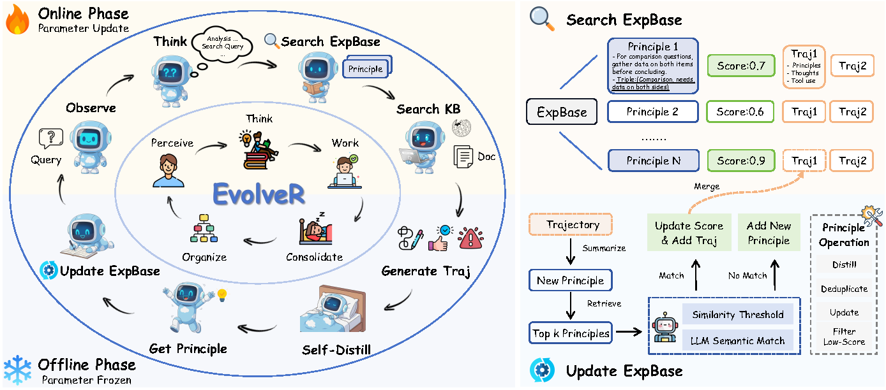

<div align="center">

# EvolveR: Self‑Evolving LLM Agents through an Experience‑Driven Lifecycle
</div>
<p align="center">
    <!-- Paper & License -->
    <a href="http://arxiv.org/abs/2510.16079" target="_blank">
        
    </a>
    <a href="LICENSE" target="_blank">
        
    </a>
    <!-- Hugging Face Resources -->
    <a href="https://huggingface.co/Edaizi/EvolveR" target="_blank">
        
    </a>
    <a href="https://huggingface.co/datasets/Edaizi/EvolveR-NQ-HotpotQA" target="_blank">
        
    </a>
</p>

This repository contains the official implementation of **EvolveR**, a framework enabling LLM agents to self-improve through a closed-loop experience lifecycle, where they distill abstract principles from past trajectories and retrieve them to guide future actions.


<div align="center">
    
</div>

---

## 📰 Updates
- **`2026-05-01`**: 🎉 Paper accepted at ICML 2026.
- **`2025-10-21`**: Paper is publicly available in [arxiv](http://arxiv.org/abs/2510.16079).
- **`2025-10-20`**: Codebase is publicly available.

## 🎯 Getting Started

### Installation
We recommend using Python 3.10 and Conda for environment management.

#### 1. Create Training Environment
```bash
# 1. Clone the repository
git clone https://github.com/Edaizi/EvolveR.git
cd EvolveR

# 2. Create and activate conda environment
conda create -n evolver python=3.10 -y
conda activate evolver

# 3. Install dependencies
# install pytorch
pip install torch==2.4.0 --index-url https://download.pytorch.org/whl/cu121
# install vllm
pip3 install vllm==0.6.3 # or you can install 0.5.4, 0.4.2 and 0.3.1

# verl
pip install -e .

# flash attention 2
pip3 install flash-attn --no-build-isolation
pip install wandb
```

#### 2. Create Embedding Server Environment
```bash
conda create -n vllm python=3.10
pip install vllm
```

#### 3. Create Local Retrieval Server Environment
```bash
conda create -n retriever python=3.10
conda activate retriever

# we recommend installing torch with conda for faiss-gpu
conda install pytorch==2.4.0 torchvision==0.19.0 torchaudio==2.4.0 pytorch-cuda=12.1 -c pytorch -c nvidia
pip install transformers datasets pyserini

## install the gpu version faiss to guarantee efficient RL rollout
conda install -c pytorch -c nvidia faiss-gpu=1.8.0

## API function
pip install uvicorn fastapi
```


### 🗄️ Data Preparation
We will provide the processed data on Hugging Face Hub. You can download it from the following link:

- **[EvolveR-Data](https://huggingface.co/datasets/Edaizi/EvolveR-NQ-HotpotQA)** 

Place your training and validation data in the following structure. The provided training script uses this path by default.
```
./data/nq_hotpotqa_train/
├── train.parquet
└── test.parquet
```
You can modify the `DATA_DIR` variable in `scripts/train_grpo-3b.sh` to point to your dataset location.

## 🚀 Training
### 1. Deploy Embedding Server
```bash
conda activate vllm
bash scripts/vllm_server.sh
```

### 2. Deploy Local Retrieval Server
#### Download the indexing and corpus.
```bash
conda activate retriever

save_path=data/Wiki-corpus-embedd
python scripts/download.py --save_path $save_path
cat $save_path/part_* > $save_path/e5_Flat.index
gzip -d $save_path/wiki-18.jsonl.gz
```

#### Launch Local Retrieval Server
```bash
conda activate retriever
bash scripts/retrieval_launch.sh
```


### 3. Execute the main training script. 

```bash
bash scripts/train_grpo-3b.sh
```
The script will handle all training steps, including lauching Launching Experience Vector Database (VDB), interacting with the Experience VDB.


## 🤗 Model Zoo
For those with limited resources or who wish to bypass the training process, we provide direct access to our open-sourced model weights on the Hugging Face Hub.

<div align="center">

| Model      | Base Architecture | Params | Hugging Face Hub Link                         |
|:----------:|:-----------------:|:------:|:---------------------------------------------:|
| EvolveR-3B | Qwen2.5           | 3B     | [Link](https://huggingface.co/Edaizi/EvolveR) |

</div>

## 🚀 Vision & Community
We believe the experience-driven lifecycle of EvolveR is a generalizable paradigm for agent self-improvement. We encourage and welcome the community to extend this framework to other exciting domains, such as `code generation`, `mathematical reasoning`, and beyond. We are excited to see what you build!

## Acknowledgements
We would like to thank the developers of the following projects for their open-source contributions.
- [Qwen2.5](https://github.com/QwenLM/Qwen3/tree/v2.5)
- [Search-R1](https://github.com/PeterGriffinJin/Search-R1)
- [O2-Searcher](https://github.com/KnowledgeXLab/O2-Searcher)

## Contact
For any questions or feedback, please:

- Open an issue in the GitHub repository
- Reach out to us at wurong1159@zju.edu.cn

## Citation
If you find our paper and code useful, please kindly cite us. A BibTeX entry will be provided upon publication.
```bibtex
@misc{wu2025evolverselfevolvingllmagents,
      title={EvolveR: Self-Evolving LLM Agents through an Experience-Driven Lifecycle}, 
      author={Rong Wu and Xiaoman Wang and Jianbiao Mei and Pinlong Cai and Daocheng Fu and Cheng Yang and Licheng Wen and Xuemeng Yang and Yufan Shen and Yuxin Wang and Botian Shi},
      year={2025},
      eprint={2510.16079},
      archivePrefix={arXiv},
      primaryClass={cs.CL},
      url={https://arxiv.org/abs/2510.16079}, 
}v
