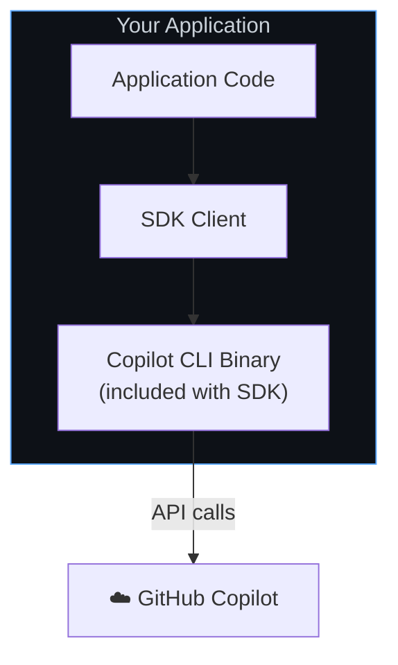
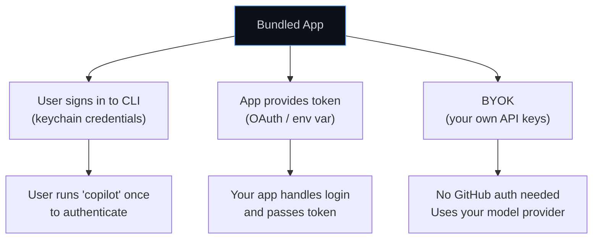

# Default setup (bundled CLI)

The Node.js and .NET SDKs include the Copilot CLI as a dependency—your app ships with everything it needs, with no extra installation or configuration required.

The Python SDK recommends a one-time download step after installation:

```bash
python -m copilot download-runtime
```

This downloads the matching runtime and caches it locally. If you skip this step, the SDK will attempt to download it automatically on first use as a fallback.

**Best for:** Most applications—desktop apps, standalone tools, CLI utilities, prototypes, and more.

## How it works

When you install the SDK, the Copilot runtime is included automatically (Node.js, .NET) or downloaded via `python -m copilot download-runtime` (Python). The SDK starts it as a child process and communicates over stdio. There's nothing extra to configure.



**Key characteristics:**
* CLI binary is included with the SDK—no separate install needed
* The SDK manages the CLI version to ensure compatibility
* Users authenticate through your app (or use env vars / BYOK)
* Sessions are managed per-user on their machine

## Quick start

> [!NOTE]
> Each SDK has a minimum language runtime requirement—see the Prerequisites section of the [Node.js](../../nodejs/README.md#prerequisites), [Python](../../python/README.md#prerequisites), [Go](../../go/README.md#prerequisites), [Rust](../../rust/README.md#prerequisites), [Java](../../java/README.md#prerequisites), or [.NET](../../dotnet/README.md#prerequisites) README—since an unsupported runtime (e.g. Python below the stated floor) can cause `pip`/package managers to silently resolve an outdated SDK release instead of reporting a version conflict.

<details open>
<summary><strong>Node.js / TypeScript</strong></summary>

```typescript
import { CopilotClient } from "@github/copilot-sdk";

const client = new CopilotClient();

const session = await client.createSession({ model: "gpt-5.4" });
const response = await session.sendAndWait({ prompt: "Hello!" });
console.log(response?.data.content);

await client.stop();
```

</details>

<details>
<summary><strong>Python</strong></summary>

```python
from copilot import CopilotClient
from copilot.session import PermissionHandler

client = CopilotClient()
await client.start()

session = await client.create_session(on_permission_request=PermissionHandler.approve_all, model="gpt-5.4")
response = await session.send_and_wait("Hello!")
print(response.data.content)

await client.stop()
```

</details>

<details>
<summary><strong>Go</strong></summary>

> [!NOTE]
> Unlike Node.js, Python, and .NET, the Go SDK does not include a CLI as an automatic dependency. With no explicit path, `NewClient(nil)` uses an embedded CLI when available, then falls back to `copilot` on `PATH`. To embed a CLI, run the [bundler tool](../../go/README.md#distributing-your-application-with-an-embedded-github-copilot-cli) at build time. You can also set `COPILOT_CLI_PATH` or point a `Connection` at an existing binary. See [Local CLI Setup](./local-cli.md) for details.

<!-- docs-validate: hidden -->
```go
package main

import (
	"context"
	"fmt"
	"log"
	copilot "github.com/github/copilot-sdk/go"
)

func main() {
	ctx := context.Background()

	client := copilot.NewClient(nil)
	if err := client.Start(ctx); err != nil {
		log.Fatal(err)
	}
	defer client.Stop()

	session, _ := client.CreateSession(ctx, &copilot.SessionConfig{Model: "gpt-5.4"})
	response, _ := session.SendAndWait(ctx, copilot.MessageOptions{Prompt: "Hello!"})
	if d, ok := response.Data.(*copilot.AssistantMessageData); ok {
		fmt.Println(d.Content)
	}
}
```
<!-- /docs-validate: hidden -->

```go
client := copilot.NewClient(nil)
if err := client.Start(ctx); err != nil {
    log.Fatal(err)
}
defer client.Stop()

session, _ := client.CreateSession(ctx, &copilot.SessionConfig{Model: "gpt-5.4"})
response, _ := session.SendAndWait(ctx, copilot.MessageOptions{Prompt: "Hello!"})
if d, ok := response.Data.(*copilot.AssistantMessageData); ok {
    fmt.Println(d.Content)
}
```

</details>

<details>
<summary><strong>.NET</strong></summary>

```csharp
await using var client = new CopilotClient();
await using var session = await client.CreateSessionAsync(
    new SessionConfig { Model = "gpt-5.4" });

var response = await session.SendAndWaitAsync(
    new MessageOptions { Prompt = "Hello!" });
Console.WriteLine(response?.Data.Content);
```

</details>

<details>
<summary><strong>Java</strong></summary>

> [!NOTE]
> The Java SDK does not bundle or embed the Copilot CLI. Install the CLI separately and either make `copilot` available on your `PATH` or set its location with `setCliPath(...)` (or connect to a running CLI server with `setCliUrl(...)`).

```java
import com.github.copilot.CopilotClient;
import com.github.copilot.rpc.*;

var client = new CopilotClient(new CopilotClientOptions()
    // Point to the CLI binary installed on the system
    .setCliPath("/path/to/vendor/copilot")
);
client.start().get();

var session = client.createSession(new SessionConfig()
    .setModel("gpt-5.4")
    .setOnPermissionRequest(PermissionHandler.APPROVE_ALL)
).get();

var response = session.sendAndWait(new MessageOptions()
    .setPrompt("Hello!")).get();
System.out.println(response.getData().content());

client.stop().get();
```

</details>

## Authentication strategies

You need to decide how your users will authenticate. Here are the common patterns:



### Option A: user's signed-in credentials (simplest)

The user signs in to the CLI once, and your app uses those credentials. No extra code needed—this is the default behavior.

```typescript
const client = new CopilotClient();
// Default: uses signed-in user credentials
```

### Option B: token via environment variable

Ship your app with instructions to set a token, or set it programmatically:

```typescript
const client = new CopilotClient({
    env: {
        COPILOT_GITHUB_TOKEN: getUserToken(),  // Your app provides the token
    },
});
```

### Option C: BYOK (no GitHub auth needed)

If you manage your own model provider keys, users don't need GitHub accounts at all:

```typescript
const client = new CopilotClient();

const session = await client.createSession({
    model: "gpt-5.4",
    provider: {
        type: "openai",
        baseUrl: "https://api.openai.com/v1",
        apiKey: process.env.OPENAI_API_KEY,
    },
});
```

See the **[BYOK guide](../auth/byok.md)** for full details.

## Session management

Apps typically want named sessions so users can resume conversations:

```typescript
const client = new CopilotClient();

// Create a session tied to the user's project
const sessionId = `project-${projectName}`;
const session = await client.createSession({
    sessionId,
    model: "gpt-5.4",
});

// User closes app...
// Later, resume where they left off
const resumed = await client.resumeSession(sessionId);
```

Session state persists at `~/.copilot/session-state/{sessionId}/`.

## When to move on

| Need | Next Guide |
|------|-----------|
| Users signing in with GitHub accounts | [GitHub OAuth](./github-oauth.md) |
| Run on a server instead of user machines | [Backend Services](./backend-services.md) |
| Use your own model keys | [BYOK](../auth/byok.md) |

## Next steps

* **[BYOK guide](../auth/byok.md)**: Use your own model provider keys
* **[Session Persistence](../features/session-persistence.md)**: Advanced session management
* **[Getting Started tutorial](../getting-started.md)**: Build a complete app
