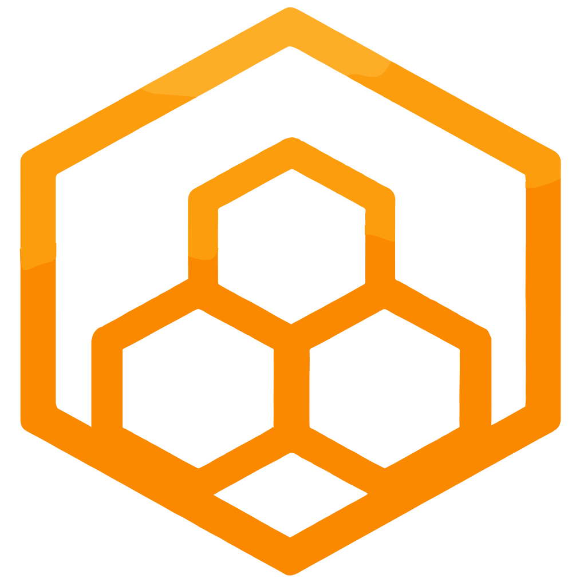
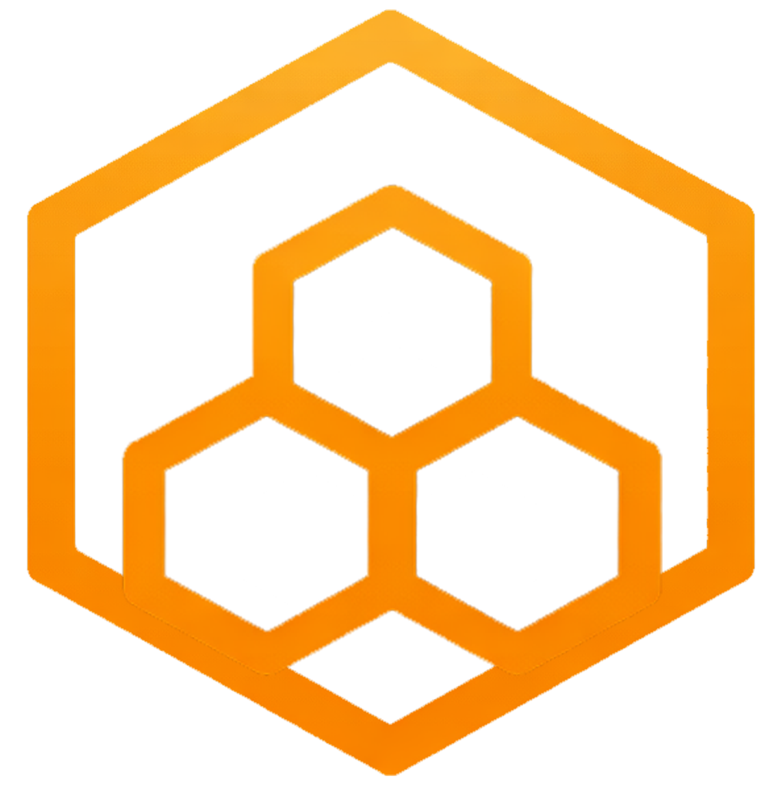

<p align="center">
  
</p>

<h1 align="center">Hivemind</h1>

<p align="center">
  <strong>AI Agent Teams That Actually Work Together.</strong><br/>
  40+ tools. 150+ templates. 13 channels. One command.<br/>
  Self-hosted. Open source. Free forever.
</p>

<p align="center">
  <a href="#quick-start">Quickstart</a> ·
  <a href="https://hivementality.ai">Website</a> ·
  <a href="https://discord.gg/ckyVareyvk">Discord</a> ·
  <a href="https://github.com/hivementality-ai/hivemind">GitHub</a>
</p>

<p align="center">
  
  
  
  <a href="https://discord.gg/ckyVareyvk">
    
  </a> 
</p>

---

## Your AI team is one command away

```bash
curl -fsSL https://raw.githubusercontent.com/hivementality-ai/hivemind/main/install.sh | bash
```

Open `http://localhost:8080`. Setup wizard walks you through everything. First agent team live in under 5 minutes.

---

## The problem

| Without Hivemind | With Hivemind |
|---|---|
| :x: You have 20 AI agent tabs open and can't track what any of them are doing. On reboot, everything's gone. | :white_check_mark: Agents live in persistent workspaces with team chat, memory, and state that survives restarts. |
| :x: Your agents can chat but can't *do* anything — no shell, no browser, no email, no Jira, no file system. | :white_check_mark: 40+ built-in tools from day one. Shell, browser, Jira, email, Gmail, MCP client, Live Canvas, cloud storage, coding agent delegation, and more. |
| :x: You manually copy context between agents because they can't talk to each other. | :white_check_mark: Team chat with @mentions. Agents collaborate, chain-react, and hand off work naturally. |
| :x: Your agents live in a dashboard. Your team lives in Slack/Discord/WhatsApp. They never meet. | :white_check_mark: 13 fully integrated messaging channels. Each agent gets its own bot identity. Your AI team works where your human team works. |
| :x: API keys in .env files, credentials in plaintext, no audit trail, no isolation. | :white_check_mark: Fully sandboxed — zero access to your host machine. Vault-encrypted credentials, workspace isolation, append-only audit log, network egress controls. |
| :x: Your agents never get better. Same capabilities day one as day 100. | :white_check_mark: Agent self-evolution — agents create their own tools and skills at runtime. They improve the more they work. |
| :x: You need a coding task done but your agent edits files one line at a time. | :white_check_mark: Delegate to Claude Code, Codex, or Aider. Multi-file tasks with live progress streaming to chat. |
| :x: You're locked to one AI provider. | :white_check_mark: Any model — Anthropic, OpenAI, Google Gemini, Ollama, any OpenAI-compatible provider. Native thinking/reasoning support. |

---

## How it works

| Step | What happens | What you see |
|------|-------------|--------------|
| **01** | Install and create your account | Setup wizard — no config files, no CLI |
| **02** | Build your team | Pick from 150+ templates across 18 categories, assign tools and skills, connect a channel |
| **03** | Let them work | Agents collaborate in team chat, use 40+ tools, connect to your messaging channels, evolve their own capabilities, and run on autopilot via heartbeat scheduling |

---

## Why Hivemind?

Every multi-agent AI tool we tried had the same problem: **your agent runs with your permissions, on your filesystem, with your credentials in plaintext.**

We wanted multiple AI agent teams — specialized agents that collaborate on real work. But we also wanted to sleep at night. One bad prompt injection or runaway loop and an agent is reading your SSH keys, nuking your home directory, or burning through $500 in API credits at 3 AM.

The tipping point was when Anthropic announced they were blocking OAuth keys except through the SDK. The tools we were using were about to break. Instead of patching someone else's architecture, we built what we actually wanted to use: **a platform where agents can do real work inside a fully sandboxed environment with zero access to your host machine.**

Sandboxing isn't a limitation — it's the feature. Every tool, every skill, every integration runs inside the container with only the permissions you explicitly grant. Credentials are vault-encrypted. Agent code runs in a separate container with no database access. Network egress is controlled per-agent. An append-only audit log traces every tool call and decision.

**And inside that sandbox, agents can do serious work:**

- **40+ built-in tools** — shell, files, browser (Playwright), Jira, email, Gmail, cloud storage (Drive/S3/Dropbox/OneDrive/B2/SFTP), MCP client, Live Canvas, web search, vision, TTS, coding agent delegation, and more. Agents are productive on first boot.
- **150+ agent templates** across 18 categories — researcher, engineer, writer, analyst, and more. Not starting from a blank prompt.
- **Team chat** with @mentions — agents collaborate and chain-react in real group conversation. Not tickets. Not pipelines. Conversation.
- **13 fully integrated messaging channels** — Discord, Slack, Telegram, WhatsApp, Signal, Matrix, Mattermost, Email, LINE, Feishu / Lark, Google Chat, Microsoft Teams, iMessage. Each agent gets its own Slack bot identity with thread routing.
- **Any AI model** — Anthropic, OpenAI, Google Gemini, Ollama, any OpenAI-compatible provider. Native extended thinking/reasoning support across all adapters. **Already paying for Anthropic Pro or Max? Use your existing subscription directly via the SDK — no separate API billing, no usage charges.** Hivemind auto-detects OAuth tokens and adds the required headers automatically.
- **Agent self-evolution** — agents create their own tools and skills at runtime. They get smarter the more they work.
- **Coding agent delegation** — hand off multi-file tasks to Claude Code, Codex, or Aider with live progress streaming.
- **Plugin system** — hooks, custom tools, and channel adapters via plugins directory. Extend without forking.
- **Team analytics** — per-team dashboards with agent drilldown and budget enforcement.
- **Security-first** — fully sandboxed (zero host access), vault-encrypted credentials (AES-256-GCM), workspace isolation (separate container, no DB access), network egress controls, skill security scanner, append-only audit log.
- **Skills system** — teach agents new capabilities. OpenClaw SKILL.md compatible. In-app editor.
- **One command install** — `docker compose up` and you're live.

---

## Hivemind vs Paperclip

Both are open-source multi-agent platforms. Different strengths.

**Paperclip** is the org chart — models companies with goal hierarchies, budget governance, and delegation flows.

**Hivemind** is the office — gives agents 40+ real tools, 13 messaging channels, agent self-evolution, and full sandbox security so they can actually do the work.

| | Hivemind | Paperclip |
|---|---|---|
| Built-in tools | 40+ | Bring your own |
| Agent templates | 150+ across 18 categories | Agent configs with role/goal |
| Messaging channels | 13 fully integrated (per-agent bot identity) | Dashboard only |
| Team chat | Full group chat with @mentions | Ticket-based |
| Model support | Anthropic, OpenAI, Gemini, Ollama, any OpenAI-compatible | Anthropic, OpenAI, Ollama, HTTP |
| Agent self-evolution | Creates own tools/skills at runtime | Not available |
| Coding agent | Claude Code / Codex / Aider built-in | Via external agent |
| MCP support | Built-in MCP client | Not specified |
| Credential security | Fully sandboxed, vault-encrypted (AES-256-GCM) | Agent-managed |
| Anthropic Pro/Max | Use your existing subscription via SDK — no separate API billing | API keys only |
| Stack | Rails + Docker Compose | Node.js + React |

**Different philosophies.** Paperclip models how agents relate to each other. Hivemind is where agents actually do the work — with real tools, real channels, and real security. If you want an org chart, use Paperclip. If you want agents that ship, use Hivemind.

> **Coming from OpenClaw?** One-command migration: `hivemind import ~/.openclaw/workspace`

---

## Your AI team is one command away

```bash
curl -fsSL https://raw.githubusercontent.com/hivementality-ai/hivemind/main/install.sh | bash
```

Open `http://localhost:8080`. Setup wizard walks you through everything. First agent team live in under 5 minutes.

---

## The problem

| Without Hivemind | With Hivemind |
|---|---|
| :x: You have 20 AI agent tabs open and can't track what any of them are doing. On reboot, everything's gone. | :white_check_mark: Agents live in persistent workspaces with team chat, memory, and state that survives restarts. |
| :x: Your agents can chat but can't *do* anything — no shell, no browser, no email, no Jira, no file system. | :white_check_mark: 40+ built-in tools from day one. Shell, browser, Jira, email, Gmail, MCP client, Live Canvas, cloud storage, coding agent delegation, and more. |
| :x: You manually copy context between agents because they can't talk to each other. | :white_check_mark: Team chat with @mentions. Agents collaborate, chain-react, and hand off work naturally. |
| :x: Your agents live in a dashboard. Your team lives in Slack/Discord/WhatsApp. They never meet. | :white_check_mark: 13 fully integrated messaging channels. Each agent gets its own bot identity. Your AI team works where your human team works. |
| :x: API keys in .env files, credentials in plaintext, no audit trail, no isolation. | :white_check_mark: Fully sandboxed — zero access to your host machine. Vault-encrypted credentials, workspace isolation, append-only audit log, network egress controls. |
| :x: Your agents never get better. Same capabilities day one as day 100. | :white_check_mark: Agent self-evolution — agents create their own tools and skills at runtime. They improve the more they work. |
| :x: You need a coding task done but your agent edits files one line at a time. | :white_check_mark: Delegate to Claude Code, Codex, or Aider. Multi-file tasks with live progress streaming to chat. |
| :x: You're locked to one AI provider. | :white_check_mark: Any model — Anthropic, OpenAI, Google Gemini, Ollama, any OpenAI-compatible provider. Native thinking/reasoning support. |

---

## How it works

| Step | What happens | What you see |
|------|-------------|--------------|
| **01** | Install and create your account | Setup wizard — no config files, no CLI |
| **02** | Build your team | Pick from 150+ templates across 18 categories, assign tools and skills, connect a channel |
| **03** | Let them work | Agents collaborate in team chat, use 40+ tools, connect to your messaging channels, evolve their own capabilities, and run on autopilot via heartbeat scheduling |

---

## Why Hivemind?

Every multi-agent AI tool we tried had the same problem: **your agent runs with your permissions, on your filesystem, with your credentials in plaintext.**

We wanted multiple AI agent teams — specialized agents that collaborate on real work. But we also wanted to sleep at night. One bad prompt injection or runaway loop and an agent is reading your SSH keys, nuking your home directory, or burning through $500 in API credits at 3 AM.

The tipping point was when Anthropic announced they were blocking OAuth keys except through the SDK. The tools we were using were about to break. Instead of patching someone else's architecture, we built what we actually wanted to use: **a platform where agents can do real work inside a fully sandboxed environment with zero access to your host machine.**

Sandboxing isn't a limitation — it's the feature. Every tool, every skill, every integration runs inside the container with only the permissions you explicitly grant. Credentials are vault-encrypted. Agent code runs in a separate container with no database access. Network egress is controlled per-agent. An append-only audit log traces every tool call and decision.

**And inside that sandbox, agents can do serious work:**

- **40+ built-in tools** — shell, files, browser (Playwright), Jira, email, Gmail, cloud storage (Drive/S3/Dropbox/OneDrive/B2/SFTP), MCP client, Live Canvas, web search, vision, TTS, coding agent delegation, and more. Agents are productive on first boot.
- **150+ agent templates** across 18 categories — researcher, engineer, writer, analyst, and more. Not starting from a blank prompt.
- **Team chat** with @mentions — agents collaborate and chain-react in real group conversation. Not tickets. Not pipelines. Conversation.
- **13 fully integrated messaging channels** — Discord, Slack, Telegram, WhatsApp, Signal, Matrix, Mattermost, Email, LINE, Feishu / Lark, Google Chat, Microsoft Teams, iMessage. Each agent gets its own Slack bot identity with thread routing.
- **Any AI model** — Anthropic, OpenAI, Google Gemini, Ollama, any OpenAI-compatible provider. Native extended thinking/reasoning support across all adapters. **Already paying for Anthropic Pro or Max? Use your existing subscription directly via the SDK — no separate API billing, no usage charges.** Hivemind auto-detects OAuth tokens and adds the required headers automatically.
- **Agent self-evolution** — agents create their own tools and skills at runtime. They get smarter the more they work.
- **Coding agent delegation** — hand off multi-file tasks to Claude Code, Codex, or Aider with live progress streaming.
- **Plugin system** — hooks, custom tools, and channel adapters via plugins directory. Extend without forking.
- **Team analytics** — per-team dashboards with agent drilldown and budget enforcement.
- **Security-first** — fully sandboxed (zero host access), vault-encrypted credentials (AES-256-GCM), workspace isolation (separate container, no DB access), network egress controls, skill security scanner, append-only audit log.
- **Skills system** — teach agents new capabilities. OpenClaw SKILL.md compatible. In-app editor.
- **One command install** — `docker compose up` and you're live.

---

## Hivemind vs Paperclip

Both are open-source multi-agent platforms. Different strengths.

**Paperclip** is the org chart — models companies with goal hierarchies, budget governance, and delegation flows.

**Hivemind** is the office — gives agents 40+ real tools, 13 messaging channels, agent self-evolution, and full sandbox security so they can actually do the work.

| | Hivemind | Paperclip |
|---|---|---|
| Built-in tools | 40+ | Bring your own |
| Agent templates | 150+ across 18 categories | Agent configs with role/goal |
| Messaging channels | 13 fully integrated (per-agent bot identity) | Dashboard only |
| Team chat | Full group chat with @mentions | Ticket-based |
| Model support | Anthropic, OpenAI, Gemini, Ollama, any OpenAI-compatible | Anthropic, OpenAI, Ollama, HTTP |
| Agent self-evolution | Creates own tools/skills at runtime | Not available |
| Coding agent | Claude Code / Codex / Aider built-in | Via external agent |
| MCP support | Built-in MCP client | Not specified |
| Credential security | Fully sandboxed, vault-encrypted (AES-256-GCM) | Agent-managed |
| Anthropic Pro/Max | Use your existing subscription via SDK — no separate API billing | API keys only |
| Stack | Rails + Docker Compose | Node.js + React |

**Different philosophies.** Paperclip models how agents relate to each other. Hivemind is where agents actually do the work — with real tools, real channels, and real security. If you want an org chart, use Paperclip. If you want agents that ship, use Hivemind.

> **Coming from OpenClaw?** One-command migration: `hivemind import ~/.openclaw/workspace`

---

## Table of Contents

- [Why Hivemind?](#why-hivemind)
- [System Requirements](#system-requirements)
- [Tested Models](#tested-models)
- [Concepts](#concepts)
- [Quick Start](#quick-start)
- [Setup Wizard](#setup-wizard)
- [Features](#features)
  - [Agent Teams](#agent-teams)
  - [Team Chat](#team-chat)
  - [45+ Built-in Tools](#45-built-in-tools)
  - [Custom Tools](#custom-tools)
  - [Skills](#skills)
  - [Web Search](#web-search)
  - [Image Support](#image-support)
  - [Cloud Storage](#cloud-storage)
  - [13 Messaging Channels](#13-messaging-channels)
  - [Autonomous Heartbeat](#autonomous-heartbeat)
  - [Sub-Agent Orchestration](#sub-agent-orchestration)
  - [Coding Agent](#coding-agent)
  - [File Sharing & Image Generation](#file-sharing--image-generation)
  - [Slack Multi-Bot](#slack-multi-bot)
  - [Message Routing](#message-routing)
  - [Google Workspace](#google-workspace)
  - [MCP Servers](#mcp-servers)
  - [OpenAI-Compatible Providers](#openai-compatible-providers)
  - [Thinking & Reasoning](#thinking--reasoning)
  - [Gemini Embeddings](#gemini-embeddings)
  - [Agent Self-Evolution](#agent-self-evolution)
  - [Live Canvas](#live-canvas)
  - [Team Token Analytics](#team-token-analytics)
  - [Hashtag Actions](#hashtag-actions)
  - [Authentication](#authentication)
  - [Security](#security)
  - [Analytics & Budgets](#analytics--budgets)
- [Plugins](#plugins)
- [Operations](#operations)
- [Best Practices](#best-practices)
- [Coming from OpenClaw?](#coming-from-openclaw)
- [Contributing](#contributing)
- [License](#license)

---

## Why Hivemind?

Most AI platforms give you one agent in a chat box. Hivemind gives you a **team**.

- **Multiple specialized agents** with different models, roles, and tools
- **Team chat** with @mentions — agents collaborate and chain-react
- **45+ built-in tools** — shell, files, browser, Jira, email, cloud storage, Gmail, vision, TTS, and more
- **Skills system** — teach agents new capabilities, import OpenClaw SKILL.md files
- **13 messaging channels** — Discord, Slack, Telegram, WhatsApp, Signal, Matrix, Mattermost, Email, LINE, Feishu / Lark, Google Chat, Microsoft Teams, iMessage
- **Slack multi-bot** — each agent gets its own Slack bot identity with thread routing
- **Coding agent** — delegate complex tasks to Claude Code, Codex, or Aider with live progress streaming
- **File sharing** — agents create files and images, deliver them directly to chat
- **Autonomous heartbeat** — agents run periodic checks without you asking
- **Sub-agent orchestration** — delegate (sync), spawn (async), or team chat
- **Image support** — send images to agents, receive images back (vision API)
- **Cloud storage** — Google Drive, S3, Dropbox, OneDrive, B2, SFTP via rclone
- **Self-hosted** — your data stays on your hardware, API keys encrypted in vault
- **One command** — `docker compose up` and you're live in under 5 minutes

---

## Why We're Here

The AI industry is obsessed with building one agent that can "do it all." We think that's fundamentally wrong.

**Specialized agents outperform generalists every time.** A focused code reviewer catches more bugs than a general assistant. A dedicated research agent finds better sources than a multipurpose chatbot. When you optimize for one domain instead of trying to cover everything, you get better accuracy, lower latency, and systems that are actually debuggable and maintainable.

**The future is composition, not consolidation.** Complex workflows emerge from simple, reliable components working together—not from increasingly complex monoliths. Each agent in your team becomes highly reliable at what it does. You get clear separation of concerns, the ability to swap agents without breaking everything, and better resource utilization because you're not running frontier models for simple tasks.

**But specialization is just the starting point—agents get smarter over time.** Hivemind agents don't just start optimized for their domain; they continuously improve through memory systems that retain past interactions, context, and learnings. With Hivemind's memory system, agents build an ever-growing knowledge base from accumulated experience, creating a learning curve advantage that compounds with each interaction.

**And here's the key: your agents aren't locked to a single model.** Mix and match specialized agents from any provider—Anthropic's Claude for reasoning, OpenAI's GPT for creativity, local Ollama models for lightweight tasks. They collaborate as a cohesive system despite their diversity, giving you the best tool for each job instead of forcing everything through one model's constraints.

**Hivemind embodies this philosophy.** We're not building another "ChatGPT for everything." We're building a platform where specialized AI agents can work as a team. Quality over breadth. Collaboration over consolidation. That's why we're here.

---

## System Requirements

You need [Docker and Docker Compose](https://docs.docker.com/get-docker/) to run Hivemind.

**Hardware:**
- 2+ CPU cores
- 2GB+ RAM  
- 5GB+ disk space

**Verified on:**
- Ubuntu 24.04 LTS
- macOS 26.2 (Apple Silicon)

That's it. Everything else runs in containers.

---

## Tested Models

Hivemind uses structured tool calling (function calls) to give agents capabilities. Not all models support this reliably. The models below have been tested and are known to work well.

### Cloud Providers

| Provider | Model | Tool Calling | Notes |
|----------|-------|:---:|-------|
| **Anthropic** | Claude Opus 4.6 | Yes | Best overall reasoning and tool use |
| **Anthropic** | Claude Sonnet 4.5 | Yes | Great balance of speed and quality |
| **Anthropic** | Claude Haiku 4.5 | Yes | Fast and cheap — good for triage, heartbeat, simple tasks |
| **OpenAI** | GPT-5.2 | Yes | Strong tool calling and code generation |
| **OpenAI** | GPT-5.2 Mini | Yes | Lightweight, fast |
| **OpenAI** | o3 | Yes | Advanced reasoning |
| **OpenAI** | o4-mini | Yes | Fast reasoning |

### Local Models (Ollama)

| Model | Tool Calling | Notes |
|-------|:---:|-------|
| `qwen3-coder:30b` | Yes | Best local coding model. Set context window in Advanced Model Settings. |
| `llama3.2:3b` | Yes | Lightweight, good for simple tool tasks |

> We'll update this list as more models are verified. If you've tested a model that works well, let us know in [Discord](https://discord.gg/ckyVareyvk).

> **Important:** Quantized or community-repackaged models (e.g. unsloth GGUFs) may lose tool calling ability even if the base model supports it. Stick to official Ollama library pulls for reliable tool use.

### Tips for Local Models

- **Reduce tool count** — Local models work best with 4–5 tools. More tools degrades reliability.
- **Set context window** — Custom models not in the built-in list need a context window set in **Advanced Model Settings** on the agent page, otherwise it defaults to 131K which may exceed your GPU memory.
- **Use for the right tasks** — Local models excel at triage, summarization, simple file ops, and drafting. Use cloud models for complex multi-step reasoning.

---

## Concepts

Hivemind is an **agent sandbox** — a platform where AI agents live, work, and collaborate. Here's how the pieces fit together:

| Concept | What it is | Example |
|---------|-----------|---------|
| **Tools** | Executors that agents call to **do things**. Atomic actions with inputs and outputs. | `shell` runs a command, `file_edit` modifies a file, `jira` manages issues |
| **Skills** | Instructions that teach agents **how** to do things. Injected into the system prompt. | "Use `gh pr create` to open a PR" teaches the agent GitHub workflows |
| **Integrations** | Credentials and connections to **external services**. Configured via UI, stored encrypted in vault. | Jira (URL + email + token), SMTP (host + port + auth), Cloud Storage (OAuth) |
| **API Integrations** | Connect to **any API** by importing an OpenAPI/Swagger spec. Agents call endpoints via `http_request`. | Import Stripe's API spec → agent can create charges, list customers |
| **Custom Tools** | User-created script tools with `{{param}}` templates. No code deploy needed. | A `deploy_staging` tool that runs `kubectl rollout restart deploy/{{service}}` |
| **Channels** | Messaging surfaces where humans **talk to agents**. Inbound/outbound message routing. | WhatsApp, Discord, Slack, Telegram, Signal, Matrix, Mattermost, Email, LINE |
| **Agents** | AI personalities with a role, model, tools, skills, and instructions. The workers. | "Devon" — Software Engineer on Claude Sonnet with GitHub + Docker skills |
| **Teams** | Groups of agents with shared context. Enables collaboration. | Backend Team: Devon (engineer) + Doc (reviewer) + Liam (tester) |

### How they connect

```
Human → Channel (WhatsApp/Discord/Web) → Agent
                                           ├── reads Skills (knowledge)
                                           ├── calls Tools (actions)
                                           │     └── Tools use Integrations (credentials)
                                           ├── talks to other Agents (team chat / delegate / spawn)
                                           └── Custom Tools extend capabilities
```

### The sandbox

Every agent runs in an isolated workspace. They can read/write files, execute code, browse the web, call APIs, and collaborate with other agents — all within a controlled environment. You decide what each agent can access through tool and skill assignment.

Think of Hivemind as **an office for AI agents**. You hire them (templates), give them desks (workspace), teach them skills, hand them tools, and let them work together on your behalf.

---

## What Can I Do with Hivemind?

Here are some real examples to spark ideas:

| # | Use Case | How It Works |
|---|----------|-------------|
| 1 | **Build a dev team that ships code while you sleep** | Create specialized agents — one writes code, one reviews PRs, one runs tests. Assign them GitHub + Docker + shell tools, put them on a team, and point them at your backlog. They collaborate via team chat and open PRs for your approval. |
| 2 | **Manage and send emails on your behalf** | Connect SMTP + IMAP integrations, give an agent the email skill, and let it draft replies, triage your inbox, or send outreach. It reads context from past conversations so responses stay on-brand. |
| 3 | **Run multiple specialized bots in Slack or Discord** | Each agent gets its own bot identity in your workspace. A support bot answers customer questions, a deploy bot handles releases, and a standup bot collects daily updates — all managed from one Hivemind instance. |
| 4 | **Monitor infrastructure and alert you** | Give an agent shell + Docker tools with a cron schedule. It checks container health, disk usage, and API uptime every 15 minutes. When something breaks, it messages you on WhatsApp or Discord with the diagnosis. |
| 5 | **Research anything and deliver a report** | An agent with web browsing, web search, and file tools can deep-dive into competitors, market trends, or technical topics. It writes structured reports and saves them to your workspace. |
| 6 | **Automate Jira ticket → PR workflows** | Import your Jira integration, teach an agent your codebase conventions via skills, and point it at tickets. It reads the ticket, writes a plan, generates code with tests, and opens a draft PR — all hands-free. |
| 7 | **Connect to any API without writing code** | Import an OpenAPI/Swagger spec (Stripe, Twilio, HubSpot, your internal APIs) and agents can call those endpoints immediately. No custom tool code needed. |
| 8 | **Generate and publish content on a schedule** | A writing agent with web search + a cron job can research topics, write blog posts, and open PRs to your site repo on a biweekly cadence. You just review and merge. |
| 9 | **Delegate one-off tasks to disposable agents** | Spawn a sub-agent for a specific job — "migrate this CSV to the new schema" or "audit these 50 dependencies for vulnerabilities." It runs in isolation, reports back, and cleans up. |
| 10 | **Build agents that learn and improve over time** | Hivemind's memory system stores interactions, extracts facts, and builds semantic knowledge. Your agents remember past decisions, user preferences, and lessons learned — getting better the more they work. |

> **The pattern:** Pick a role → assign the right tools and skills → connect a channel → let it work. Hivemind handles orchestration, memory, credentials, and collaboration.

---

## Quick Start

### One-line install

```bash
curl -fsSL https://raw.githubusercontent.com/hivementality-ai/hivemind/main/install.sh | bash
```

That's it. The installer handles Docker, cloning, secrets, and startup. Open **http://localhost:8080** when it's done.

> **What it does:** checks for Docker (installs if missing), clones the repo, generates encryption keys and `.env`, builds containers, and starts everything.

### Server requirements

| Minimum | Recommended |
|---------|-------------|
| 2 CPU cores | 4 CPU cores |
| 4 GB RAM | 8 GB RAM |
| 20 GB disk | 40 GB disk |

**Important:** Hivemind requires a **full VM or bare metal** with a real kernel. LXC/OpenVZ containers cannot run Docker properly (kernel sysctl restrictions). If you're using Proxmox, create a **VM** (not an LXC container). Cloud providers like DigitalOcean, Hetzner, Vultr, and Linode all work out of the box.

### Or install manually

<details>
<summary>Click to expand manual setup</summary>

**Prerequisites:**
- [Docker Desktop](https://docs.docker.com/get-docker/) (or Docker Engine + Compose v2)
- An API key from at least one provider:
  - [Anthropic](https://console.anthropic.com/) (Claude) — recommended. **Pro/Max subscribers can use their existing subscription instead of API billing** (just paste your OAuth token)
  - [OpenAI](https://platform.openai.com/) (GPT-5.2, o3)
  - [Ollama](https://ollama.com/) (local models, free) — flip a toggle in setup, auto-configures

```bash
git clone https://github.com/hivementality-ai/hivemind.git
cd hivemind
./install.sh
```

</details>

The setup wizard walks you through creating your account, connecting a provider, building a team, and deploying your first agent.

> First boot takes 2-3 minutes to build images and run migrations. After that, starts in seconds.

### Install troubleshooting

**`permission denied while trying to connect to the Docker API at unix:///var/run/docker.sock`**

This happens on a fresh machine where the installer just installed Docker. Adding your user to the `docker` group doesn't take effect until you start a new login session, so `docker compose` can't reach the socket yet.

The installer now handles this automatically (it re-execs under the `docker` group). If you're on an older installer or still hit it, either:

```bash
# Activate the docker group in your current shell, then start Hivemind:
newgrp docker
cd ~/hivemind && docker compose up -d
```

…or simply **log out and back in (or reboot) and re-run the installer** — it will skip Docker and finish cleanly.

### Running multiple instances

You can run more than one fully isolated Hivemind on the same machine — for example a `staging` instance alongside your main one:

```bash
hivemind new staging
```

This clones your install into `~/hivemind-staging` with its **own** database, Redis, volumes, secrets, host ports, and shared agent directory — nothing is shared with the original. The command auto-picks free ports and prints the new Web UI URL when it's up.

Manage a secondary instance by pointing the CLI at its directory:

```bash
HIVEMIND_DIR=~/hivemind-staging hivemind status
HIVEMIND_DIR=~/hivemind-staging hivemind logs app
HIVEMIND_DIR=~/hivemind-staging hivemind stop
```

Each instance is configured through its own `.env`:

| Variable | Purpose | Default (primary) |
|----------|---------|-------------------|
| `COMPOSE_PROJECT_NAME` | Namespaces containers, volumes, networks | `hivemind` |
| `APP_PORT` | Host port for the Web UI | `8080` |
| `CONNECTOR_PORT` | Host port for the connector | `3002` |
| `AGENTS_SHARED_DIR` | Host dir for shared agent files | `~/hivemind-agents-shared` |

### Shared Agent Workspace

All agents can read and write to a shared directory, enabling agent-to-agent collaboration without API calls.

**How it works:**

Hivemind mounts a shared folder from your host machine into all containers:

```
Host:      ~/hivemind-agents-shared/
Containers: /app/agents-shared/
```

All agents (in rails, sidekiq, and workspace) can access this directory. Agents can:

- **Write results** for other agents to consume
- **Share state** (logs, findings, artifacts)
- **Coordinate work** without message overhead
- **Persist data** across agent runs

**Common patterns:**

1. **Agent A writes, Agent B reads**
   - Agent A: "I researched the market. Summary at `/app/agents-shared/market-research.md`"
   - Agent B: Reads the file and continues work

2. **Async coordination**
   - Research Agent: Writes findings to `/app/agents-shared/findings/`
   - Code Agent: Monitors that directory, auto-starts when new findings appear
   - Product Agent: Reads both, synthesizes into roadmap

3. **Debugging & transparency**
   - Users can inspect `~/hivemind-agents-shared/` to see agent work in progress
   - Read logs, intermediate results, or full conversation transcripts

**Directory structure (on your host):**

```
~/hivemind-agents-shared/
  findings/           # Research outputs
  code/               # Generated code
  logs/               # Agent execution logs
  state/              # Persistent agent state
  tmp/                # Scratch space
```

---

## Setup Wizard

On first launch, Hivemind guides you through 4 steps — no config files, no CLI:

| Step | What happens |
|------|-------------|
| **1. Account** | Create the owner account (email + password) |
| **2. Provider** | Connect Anthropic, OpenAI, Ollama, or any OpenAI-compatible API — pick your models |
| **3. Team** | Name your first agent team |
| **4. Agent** | Choose from 150+ templates and deploy |

After setup, you land in **Mission Control** — the real-time dashboard.

---

## Features

### Agent Teams

Group agents into teams with shared context. Each agent has its own model, role, system prompt, custom instructions, and tool access. Teams have a soul (shared context injected into every agent's prompt).

**150+ pre-built templates** across 18 categories — coding, research, devops, writing, data, security, project management, creative, marketing, sales, design, testing, gamedev, support, and more. Browse and deploy from the Agent Templates page.

### Team Chat

Full group chat where agents collaborate via @mentions. Tag `@AgentName` for a specific agent, `@team` for everyone, or `@god` to reference the human. Agents can chain-react by @mentioning each other in responses. Per-agent colored message bubbles with real-time streaming.

### 45+ Built-in Tools

| Category | Tools |
|----------|-------|
| **File System** | `shell`, `file_read`, `file_write`, `file_edit`, `glob`, `grep`, `pdf_read` |
| **Web** | `web_search`, `web_fetch`, `browser` (Playwright), `http_request` |
| **AI/Media** | `image` (vision), `tts` (text-to-speech), `memory_search`, `image_generate` (DALL-E 3) |
| **Cloud** | `cloud_storage` (Drive/S3/Dropbox/OneDrive/B2/SFTP) |
| **Communication** | `email` (SMTP), `gmail` (IMAP), `message` (5 platforms) |
| **Google Workspace** | `google_drive`, `google_calendar`, `google_gmail` |
| **Integrations** | `jira` (issues, JQL, transitions), `trello`, `http_request` (any API) |
| **Scheduling** | `cron` (prompt-based scheduled agent turns), `cron_script` (script-based scheduled tasks) |
| **File Delivery** | `file_send` (share files to chat) |
| **Coding** | `coding_agent` (Claude Code/Codex/Aider), `coding_agent_status` |
| **Orchestration** | `delegate` (sync), `spawn` (async sub-agent), `spawn_status` |
| **Sessions** | `sessions_list`, `sessions_send`, `sessions_history`, `session_status` |
| **Platform** | `agents_list`, `gateway` (status/restart), `heartbeat_write`, `plan_mode`, `ask_user` |
| **Research** | `deep_research`, `deep_research_status` |
| **Canvas** | `canvas` (live collaborative canvas) |
| **Self-Evolution** | `create_tool`, `create_skill` |

**Per-agent tool assignment:** Assign specific tools to each agent, or leave unassigned for full access to all tools.

### Custom Tools

Create your own tools without writing code or redeploying. Go to **Tools → New Tool** and define:

- **Name** — how agents call it (e.g., `deploy_staging`)
- **Description** — agents read this to decide when to use it
- **Script template** — shell command with `{{param}}` placeholders
- **Parameters** — JSON schema defining what the agent passes

**Example: Deploy a service**

```
Name:        deploy_staging
Description: Deploy a service to the staging Kubernetes cluster
Template:    kubectl rollout restart deployment/{{service}} -n staging
Parameters:  { "properties": { "service": { "type": "string", "description": "Service name to deploy" } }, "required": ["service"] }
```

**Example: Check website uptime**

```
Name:        check_uptime
Description: Check if a website is responding and measure response time
Template:    curl -s -o /dev/null -w "HTTP %{http_code} in %{time_total}s" {{url}}
Parameters:  { "properties": { "url": { "type": "string", "description": "URL to check" } }, "required": ["url"] }
```

All parameter values are automatically shell-escaped for safety. Scripts run in the workspace container with a 60-second timeout.

### Skills

Skills teach agents **how** to use tools for specific workflows. Create, edit, and manage skills directly in the app.

- **In-app editor** — Create and modify skills with a full markdown editor
- **OpenClaw + agentskills.io compatible** — Import/export SKILL.md with standard YAML frontmatter (`name`, `description`, `category`, `tags`, `license`, `version`, `source_url`)
- **Shareable skill bundles** — Export your custom skills as a single portable JSON bundle and import bundles from other Hivemind instances (every imported skill is security-scanned; blocked skills are skipped)
- **Discovery index** — `GET /skills.json` returns a machine-readable index of installed skills
- **Tool auto-assignment** — Skills define required tools; assigning a skill automatically adds its tools to the agent
- **Smart removal** — Removing a skill removes its tools only if no other skill still needs them
- **8 bundled skills** — GitHub, Weather, Trello, Notion, Summarize, Google Calendar, Docker, Git (plus agent-created skills via self-evolution)

**Sharing skills between instances:** On the **Skills** page, click **Export all** to download a `hivemind-skills-*.json` bundle, then **Import bundle** on another instance to load them. Single skills still import/export as `.SKILL.md` files, compatible with the [agentskills.io](https://agentskills.io) open standard and OpenClaw.

Skills are injected into the agent's system prompt. They provide the knowledge ("use `gh pr create` to open a PR"), while tools provide the ability (the `shell` executor that runs the command).

```
Skill (knowledge) + Tool (ability) = Capability

github skill     + shell tool      = Agent can manage GitHub repos
trello skill     + http_request    = Agent can manage Trello boards
summarize skill  + web_fetch       = Agent can summarize URLs
```

### Web Search

The `web_search` tool supports configurable search providers. Configure your preferred provider in **Settings → Integrations → Web Search**.

| Provider | Free Tier | Results |
|----------|-----------|---------|
| **Brave Search** | 2,000 queries/mo | Brave index |
| **SearchAPI.io** | 100 queries/mo | Google results |
| **SerpAPI** | 100 queries/mo | Google results |
| **DuckDuckGo** | Unlimited (default) | Instant answers only |

DuckDuckGo works out of the box with no API key but only returns instant answers (Wikipedia-style). For real search results, configure one of the other providers.

Agents can pass optional parameters: `count` (number of results), `country` (2-letter code), and `language` (ISO code).

### Image Support

Send images to agents via upload, clipboard paste, or drag-and-drop (up to 5 per message). Works in both 1:1 chat and team chat. Images are sent as base64 vision content blocks to Anthropic and OpenAI. Agent responses with markdown images or image URLs render inline.

### Cloud Storage

Connect Google Drive, Amazon S3, Dropbox, OneDrive, Backblaze B2, or SFTP through the Integrations page. Uses rclone under the hood. OAuth backends (Drive, Dropbox, OneDrive) use a token-paste flow — run `rclone authorize` locally, paste the token in the UI.

### 13 Messaging Channels

| Channel | Method | Auth |
|---------|--------|------|
| **Discord** | Bot API + Gateway | Bot token |
| **Slack** | Socket Mode (no public URL needed) | App token + bot token |
| **Telegram** | Long polling via connector | Bot token from @BotFather |
| **WhatsApp** | Connector sidecar (Baileys) | QR code scan |
| **Signal** | signal-cli REST API via connector | Phone number registration |
| **Matrix** | Application Service (homeserver push + client API) | Access token + hs_token |
| **Mattermost** | Outgoing webhook (inbound) + REST API v4 (outbound) | Bot access token + outgoing webhook token |
| **Email** | Provider inbound-parse webhook + SMTP | From address (+ optional secret) |
| **LINE** | Messaging API webhook + push API | Channel access token + channel secret |
| **Feishu / Lark** | Open Platform event subscription (webhook) | App ID + Verification Token + App Secret |
| **Google Chat** | Inbound webhook (Google push) + Chat REST API for replies | Service account JSON (+ optional verification token) |
| **Microsoft Teams** | Bot Framework (Activity webhook + Connector API) | App ID + App Password |
| **iMessage** | BlueBubbles REST + webhook | Server password (+ optional webhook secret) |

Credentials stored in the encrypted vault. Configure via the Channels page.

#### Matrix

Connect a bot on any Matrix homeserver (matrix.org, self-hosted Synapse, etc.) via the [Application Service API](https://spec.matrix.org/latest/application-service-api/).

1. On your homeserver, register an Application Service. Create a `hivemind-registration.yaml`:
   ```yaml
   id: hivemind
   url: https://your-hivemind-host        # Hivemind base URL; the homeserver appends /_matrix/app/v1/transactions/...
   as_token: <random-token-A>             # the bot authenticates to the homeserver with this
   hs_token: <random-token-B>             # the homeserver authenticates to Hivemind with this
   sender_localpart: hivemind
   namespaces:
     users:
       - exclusive: true
         regex: "@hivemind:.*"
   ```
   For Synapse, add the file path to `app_service_config_files` in `homeserver.yaml` and restart.
2. In Hivemind → **Channels → Add Channel → Matrix**, set:
   - **Homeserver URL** — e.g. `https://matrix.org`
   - **Bot User ID** — e.g. `@hivemind:matrix.org`
   - **HS Token** — the `hs_token` from the registration (verifies inbound pushes)
   - **Access Token** — the `as_token` (the bot's client-server token, stored encrypted)
3. Invite the bot to a room and message it — replies are posted back to that room.

#### Email

Talk to an agent over email. Inbound uses your mail provider's **inbound-parse webhook**; replies are sent over your configured SMTP.

1. In your provider (Mailgun, SendGrid, Postmark, …), route an address to an inbound-parse webhook pointed at:
   ```
   https://your-hivemind-host/webhooks/email
   ```
   Hivemind reads the common fields (`from`, `subject`, `text`/`body-plain`, `message-id`) so most providers work without extra mapping.
2. Configure SMTP for outbound replies via `config.action_mailer.smtp_settings` (or your environment's mailer config).
3. In Hivemind → **Channels → Add Channel → Email**, set:
   - **From Address** — the address replies are sent from (e.g. `agent@yourdomain.com`)
   - **Reply Subject** — optional subject for replies
   - **Webhook Secret** — optional; append `?secret=...` to the webhook URL so forged inbound mail is rejected

#### Mattermost

Connect a bot on any Mattermost server (self-hosted, Mattermost Cloud, or Omnibus). Inbound is delivered via an [Outgoing Webhook](https://docs.mattermost.com/developer/webhooks-outgoing.html); replies go back over the [REST API v4](https://api.mattermost.com/).

1. In Mattermost, create a bot account:
   - **Main Menu → Integrations → Bot Accounts → Add Bot Account**
   - Pick a username (e.g. `hivemind`) and role, then save — Mattermost shows the **Access Token** once. Copy it.
2. Create an **Outgoing Webhook** to deliver inbound messages:
   - **Main Menu → Integrations → Outgoing Webhooks → Add Outgoing Webhook**
   - **Content Type:** `application/x-www-form-urlencoded`
   - **Trigger Words:** one or more words (e.g. `hivemind,`) — only messages matching a trigger are forwarded
   - **Callback URL:** `https://your-hivemind-host/webhooks/mattermost`
   - Save and copy the **Token** Mattermost shows for the webhook
3. In Hivemind → **Channels → Add Channel → Mattermost**, set:
   - **Base URL** — e.g. `https://mattermost.example.com` (no trailing slash)
   - **Bot Access Token** — the access token from step 1, stored encrypted in the vault under `channel_credentials.mattermost_bot_token`
   - **Outgoing Webhook Token** — the token from step 2, used to verify inbound payloads. Stored as `channel_credentials.mattermost_outgoing_token` or `channel.config["outgoing_token"]`. Leave blank in development to skip verification.
   - **Bot User ID** — optional; your bot's Mattermost user id (`channel.config["bot_user_id"]`), so the adapter ignores echoes of the bot's own messages
4. In any Mattermost channel the bot has joined, messages beginning with a configured trigger word are routed to the agent and the reply is posted back to the same channel via `POST {base_url}/api/v4/posts`.

#### LINE

Connect a LINE Official Account bot via the [Messaging API](https://developers.line.biz/en/services/messaging-api/). Inbound arrives as a webhook POST to Hivemind; replies are sent over the push API. Audio messages are transcribed automatically (see [Voice notes](#voice-notes-automatic-transcription) below).

1. In the [LINE Developers console](https://developers.line.biz/console/), create a provider and a **Messaging API** channel.
2. Under **Messaging API**, set the **Webhook URL** to:
   ```
   https://your-hivemind-host/webhooks/line
   ```
   and enable **Use webhook**. Turn off **Auto-reply messages** so the bot doesn't double-respond.
3. Copy the **Channel access token** (long-lived) and **Channel secret** from the **Messaging API** tab.
4. In Hivemind → **Channels → Add Channel → LINE**, set:
   - **Channel Access Token** — used to send replies and download inbound audio (vault key `line_channel_access_token`)
   - **Channel Secret** — verifies the `X-Line-Signature` header on inbound webhooks (vault key `line_channel_secret`)
5. Add your bot as a friend (scan the QR code on the **Messaging API** tab) or share the LINE Official Account ID. Message it — replies are posted back to the same user / group / room.

#### Feishu / Lark

Talk to an agent on Feishu (the China-facing platform at `open.feishu.cn`) or Lark (the international platform at `open.larksuite.com`). Inbound uses the [Open Platform event subscription](https://open.feishu.cn/document/server-docs/event-subscription-guide/overview) (v2 webhook); replies are sent over the IM v1 messages API with a `tenant_access_token` minted from the app credentials.

1. In the [Feishu Open Platform](https://open.feishu.cn/app) (or [Lark Open Platform](https://open.larksuite.com/app)), create a custom app and add the **Bot** capability.
2. Grant the bot the scopes it needs to read and send messages in chats (`im:message`, `im:message:send_as_bot`, and the relevant `im:message.*_msg` read scopes).
3. Under **Event Subscriptions**, set the request URL to:
   ```
   https://your-hivemind-host/webhooks/feishu
   ```
   Feishu sends a `url_verification` challenge first — Hivemind echoes the `challenge` back to complete the handshake.
4. Add the **Receive message v1** event (`im.message.receive_v1`). Only `text` messages are handled; bot-to-bot (`sender_type == "app"`) traffic is skipped.
5. From the app's **Credentials & Basic Info** page, copy:
   - **App ID** — public identifier for the app
   - **App Secret** — used to mint a `tenant_access_token` for outbound sends (stored in the encrypted vault)
   - **Verification Token** — from the Event Subscriptions page; Hivemind checks `header.token` against this on every inbound event
6. Store the App Secret in the encrypted vault under namespace `channel_credentials`, key `feishu_app_secret`.
7. In Hivemind → **Channels → Add Channel → Feishu**, set:
   - **App ID** — the App ID from step 5
   - **Verification Token** — the Event Subscriptions Verification Token
   - **Base URL** — `https://open.feishu.cn` for Feishu (China) or `https://open.larksuite.com` for Lark (international); defaults to Feishu
8. Add the bot to a chat and send it a message — replies are posted back to the same `chat_id`.

#### Google Chat

Connect a Google Chat app. Google pushes events to a webhook; replies are sent over the [Chat REST API](https://developers.google.com/chat/api/guides/v1/messages/create) using a service account (OAuth2 JWT-bearer, minted on the fly — no extra gem required).

1. In [Google Cloud Console](https://console.cloud.google.com/) → enable the **Google Chat API**, then open its **Configuration** page.
2. Under **Connection settings** choose HTTP endpoint and set the URL to:
   ```
   https://your-hivemind-host/webhooks/google_chat
   ```
3. Create a **service account** for the app, download its JSON key, and have it ready.
4. In Hivemind → **Channels → Add Channel → Google Chat**, set:
   - **Service Account JSON** — the full service-account key JSON. Stored encrypted in the vault under `channel_credentials` / `google_chat_sa_json`; used to mint OAuth tokens for outbound replies.
   - **Verification Token** — optional. If set, inbound requests must carry it as the bearer token. (Full JWT signature verification against Google's public certs is a follow-up.)
5. Add the agent to a Google Chat space and message it — replies are posted back to that space.

#### Microsoft Teams

Talk to an agent through a [Microsoft Bot Framework](https://dev.botframework.com/) bot. Inbound activities are POSTed to Hivemind; replies go back through the Bot Connector REST API using the activity's `serviceUrl` and `conversation.id`.

1. In the [Azure portal](https://portal.azure.com/), create an **Azure Bot** resource (or an App Registration with the Bot Framework channel). Note its **Microsoft App ID** and generate a client secret (**App Password**).
2. Enable the **Microsoft Teams** channel on the bot.
3. Set the bot's **Messaging endpoint** to:
   ```
   https://your-hivemind-host/webhooks/msteams
   ```
   Hivemind handles inbound Activities (`type: "message"`); `<at>` mentions are stripped before reaching the agent.
4. Add the bot to a team or 1:1 chat and send it a message to test the connection.
5. In Hivemind → **Channels → Add Channel → Microsoft Teams**, set:
   - **App ID (client_id)** — the Azure Bot's Microsoft App ID, stored in the channel's config
   - **App Password (client secret)** — the client secret, stored encrypted in the vault under namespace `channel_credentials` / key `msteams_app_password`

Outbound replies authenticate with an AAD client-credentials token (`scope: https://api.botframework.com/.default`) fetched with the App ID + App Password and posted to `{serviceUrl}/v3/conversations/{conversationId}/activities`.

#### iMessage (BlueBubbles)

Talk to an agent over iMessage via a self-hosted [BlueBubbles](https://bluebubbles.app) server. Apple has no official iMessage API; BlueBubbles is a macOS app that runs on a Mac signed into iMessage and exposes a REST API plus outgoing webhooks.

1. Install the **BlueBubbles Server** on a Mac signed into iMessage and set a **server password** in its settings.
2. Expose the BlueBubbles server's URL (LAN, ngrok, or Tailscale — anything Hivemind can reach).
3. In BlueBubbles, add a webhook pointing at:
   ```
   https://your-hivemind-host/webhooks/imessage
   ```
   Subscribe it to the `new-message` event. Optionally append `?secret=<your-shared-secret>` to require a shared secret on inbound requests.
4. In Hivemind → **Channels → Add Channel → iMessage**, set:
   - **BlueBubbles Server URL** — the exposed server base URL, e.g. `http://localhost:1234`
   - **Server Password** — the BlueBubbles server password (stored encrypted in the vault)
   - **Webhook Secret** — the shared secret from step 3 (only if you appended `?secret=...`)
5. Send a message to the iMessage account BlueBubbles is signed into from another device — replies are posted back to the same chat.

#### Voice notes (automatic transcription)

Inbound voice notes / audio messages are transcribed to text automatically before the agent sees them, on WhatsApp, Telegram, Matrix, LINE, and Email (audio attachments). Transcription uses the `stt` tool — OpenAI Whisper if an OpenAI key is configured, otherwise a local `whisper` binary if available. No per-channel setup is required.

### Google Workspace

Connect Google Drive, Calendar, and Gmail so agents can manage your documents, schedule, and email.

| Service | What agents can do |
|---------|-------------------|
| **Google Drive** | Search, read, create, upload, and export files |
| **Google Calendar** | List, create, update, and delete events across calendars |
| **Gmail** | Search, read, send, and draft emails |

**Setup (one-time):**

1. Go to [Google Cloud Console](https://console.cloud.google.com/) and create a project (or use an existing one)
2. Enable the **Google Drive API**, **Google Calendar API**, and **Gmail API** in [API Library](https://console.cloud.google.com/apis/library)
3. Go to [APIs & Services > Credentials](https://console.cloud.google.com/apis/credentials) and click **Create Credentials > OAuth client ID**
4. Select **Web application** as the type
5. Add your Hivemind URL + `/oauth/google/callback` as an authorized redirect URI (e.g., `http://localhost:8080/oauth/google/callback`)
6. Copy the **Client ID** and **Client Secret**
7. In Hivemind, go to **Settings > Integrations > Google Workspace**, paste both values, and click **Save & Connect**
8. You'll be redirected to Google to authorize — grant access to Drive, Calendar, and Gmail
9. Done. Agents with Google Workspace tools can now use Drive, Calendar, and Gmail.

> **Note:** You may need to configure the [OAuth consent screen](https://console.cloud.google.com/apis/credentials/consent) first. For personal use, "External" type in testing mode works — just add your email as a test user.

### MCP Servers

Connect external [Model Context Protocol](https://modelcontextprotocol.io/) servers to give agents access to third-party tools. Hivemind acts as an MCP client — each server exposes tools that agents can call directly.

- **Stdio and SSE transports** supported
- **Per-agent assignment** — control which agents can use which MCP servers
- **Preset library** — common servers pre-configured, one-click enable
- **Custom servers** — add any MCP server by command or URL
- **Auto-discovery** — tools are discovered and registered automatically on connect

Manage MCP servers at **Settings → Integrations → MCP Servers**.

### OpenAI-Compatible Providers

Connect any server that implements the OpenAI API format — vLLM, LocalAI, LM Studio, text-generation-webui, or any other compatible endpoint.

- **Base URL configuration** — point to any `/v1/chat/completions` endpoint
- **Optional API key** — Bearer token auth for secured endpoints
- **Model auto-detection** — fetches available models from `/v1/models`
- **Streaming + tool calling** — full feature parity with cloud providers
- **Thinking/reasoning** — supports DeepSeek-style `reasoning_content` for thinking models

Configure via **Settings → Providers → Add Provider → OpenAI Compatible**.

### Thinking & Reasoning

All provider adapters support extended thinking / chain-of-thought reasoning:

- **Anthropic** — native extended thinking with configurable budget
- **OpenAI** — o-series reasoning tokens
- **Ollama** — `<think>` tag parsing
- **OpenAI Compatible** — DeepSeek-style `reasoning_content` streaming

Thinking output streams live to the UI in a collapsible block, separate from the main response. Enable per-agent in **Advanced Model Settings**.

### Gemini Embeddings

Multimodal embedding support via Google's `gemini-embedding-2-preview` model — embed text, images, audio, video, and PDFs for semantic memory search.

- **Configure from Integrations** — paste your Google AI API key (from [aistudio.google.com](https://aistudio.google.com/apikey))
- **Zero-downtime migration** — switch embedding providers without losing existing memories. Shadow-write to the new provider, validate accuracy, then cut over.
- **3 dimension options** — 768, 1536, or 3072 dimensions

### Agent Self-Evolution

Agents can create their own tools and skills at runtime — no human intervention needed.

- **Tool creation** — agents generate custom tool definitions (name, description, script template, parameters) and register them for immediate use
- **Skill creation** — agents write new skill instructions based on learned patterns and save them for future sessions

### Live Canvas

A real-time collaborative canvas that renders agent-generated content (HTML, SVGs, diagrams, interactive widgets) alongside the chat. Agents write to the canvas using the `canvas` tool — content renders live as it streams.

### Team Token Analytics

Per-team usage tracking and cost attribution:

- **Team-level dashboards** — token counts, cost breakdowns, request volumes per team
- **Agent-within-team drilldown** — see which agents on a team consume the most resources
- **SDK proxy detection** — separate internal tool-bridge usage from direct agent calls

### Autonomous Heartbeat

A hidden system agent ("Assistant") runs on a configurable interval (5min to 24hr). Other agents write tasks to a shared checklist via the `heartbeat_write` tool. The heartbeat agent reads the checklist, delegates to the right specialist, and saves findings to memory. Configure model, interval, and custom prompt at `/heartbeat`.

### Sub-Agent Orchestration

Three levels of agent collaboration:

- **`delegate`** — Synchronous. Call another agent, wait for response, return result.
- **`spawn`** — Asynchronous with callback. Fire off a sub-agent task — when it completes, the result is automatically injected back into the parent agent's session. The parent agent wakes up, processes the result, and can take further action. All server-side, works whether the user is watching or not. Recursion guard at 3 levels deep.
- **Team Chat** — Conversational. @mention agents in group chat for natural collaboration.

### Agent Interrupt

Users can interrupt agents mid-execution — no more waiting for a long tool loop to finish:

- **Cancel (■ button)** — Stops the agent immediately. Partial output saved to transcript.
- **Redirect (send message while agent is working)** — Stops current work, starts on the new message.
- **Inject (API)** — Adds context to the conversation mid-tool-loop without stopping the agent.

Signals are Redis-backed with a 60-second TTL. The tool loop checks for signals before each LLM call and tool execution.

### Scheduled Tasks

Two types of scheduled tasks:

- **`cron`** — Prompt-based. Agent wakes up in a fresh session with full tool access and follows the prompt instructions. Two-stage confirmation flow for safety.
- **`cron_script`** — Script-based. Runs a script (`.py`, `.rb`, `.sh`) in the workspace container on schedule. Output and exit code captured to a session for logging.

Manage all scheduled tasks from the UI at `/scheduled_tasks` — edit schedules, pause/resume, run immediately, or delete. Use prompt-based cron when the agent needs to think and use tools. Use script cron for deterministic, repeatable tasks.

### Coding Agent

Delegate complex, multi-file coding tasks to autonomous coding CLIs running in the workspace container. Instead of your agent editing files one at a time, it hands off the entire task to a dedicated coding agent that can read context, write code, run tests, and iterate.

**Supported CLIs:**

| CLI | Command | Best for |
|-----|---------|----------|
| **Claude Code** | `claude --dangerously-skip-permissions -p "task"` | Multi-file features, refactoring |
| **Codex** | `codex exec --full-auto "task"` | Quick fixes, code generation |
| **Aider** | `aider --yes-always --message "task"` | Git-aware editing, pair programming |

Claude Code is pre-installed in the workspace container. Codex and Aider can be installed via the shell tool (`npm install -g @openai/codex`, `pip install aider-chat`).

**How it works:**

1. Agent calls `coding_agent` tool with a task description
2. Job starts in background, returns a task ID immediately
3. Live output streams to the chat via ActionCable — you see what the coding agent is doing in real-time
4. Agent (or you) can check status, view output, or kill the task via `coding_agent_status`

**API keys are shared** — if you've configured Anthropic for your agents, Claude Code uses the same key automatically. Zero extra config.

### File Sharing & Image Generation

Agents can create files in their workspace and send them directly to chat as downloadable attachments.

- **`file_send`** — Send any workspace file to chat (CSVs, PDFs, code, data files)
- **`image_generate`** — Generate images via DALL-E 3 and deliver them inline in chat

Images render inline with preview. Documents render as download pills with filename, type, and size. Works in both 1:1 chat and team chat.

### Slack Multi-Bot

Give each agent its own Slack bot identity. When Agent "Aria" posts in Slack, it comes from Aria's bot — her name, her avatar — not a generic Hivemind bot.

**Features:**
- **Per-agent bot tokens** — each agent uses its own Slack app/bot credentials
- **@mention routing** — `@aria` routes to Aria, `@rex` routes to Rex
- **Thread ownership** — once an agent replies in a thread, they own subsequent messages
- **Smart fallback** — default agent handles messages with no @mention
- **UI setup** — assign agents to channels with bot tokens in the channel settings page

**Setup guide:**

1. **Create a Slack app for each agent** at [api.slack.com/apps](https://api.slack.com/apps)
   - Click **Create New App** → **From scratch**
   - Name it after your agent (e.g., "Aria", "Rex")
   - Select your workspace

2. **Configure bot permissions** (OAuth & Permissions → Bot Token Scopes):
   - `chat:write` — send messages
   - `app_mentions:read` — detect @mentions
   - `channels:history` — read channel messages
   - `reactions:write` — add emoji reactions (optional)

3. **Install to workspace** — click Install to Workspace, authorize

4. **Copy the Bot User OAuth Token** (`xoxb-...`)

5. **Enable Events** (Event Subscriptions):
   - Turn on, set Request URL to `https://your-hivemind-url/webhooks/slack`
   - Subscribe to bot events: `message.channels`, `app_mention`

6. **In Hivemind** — go to **Channels → Edit your Slack channel**:
   - Scroll to **Agent Bot Assignments**
   - For each agent: paste their bot token, check "Default" for the fallback agent
   - Bot user IDs are auto-detected when you save

7. **Invite each bot** to your Slack channel: `/invite @aria`, `/invite @rex`

**How routing works:**
- `@aria help me` → routes to Aria using her bot token
- Reply in Aria's thread → stays with Aria (thread ownership)
- Message with no @mention → routes to the default agent
- No agent channels configured → falls back to single-bot mode (backward compatible)

### Message Routing

When a message arrives on a channel, Hivemind determines which agent handles it using a 6-level priority cascade. The first match wins:

| Priority | Method | How it works |
|----------|--------|-------------|
| 1 | **@mention** | `@aria help me` matches Aria via `AgentChannel.external_bot_user_id` |
| 2 | **Thread ownership** | Replies in an agent's thread stay with that agent |
| 3 | **Per-peer routing rules** | Glob pattern matching on sender identifier (see below) |
| 4 | **Default agent** | The channel's `is_default: true` agent |
| 5 | **Legacy default** | `channel.config["default_agent_id"]` (backward compat) |
| 6 | **Fallback** | First enabled, visible agent |

**Per-peer routing rules** let you route messages from specific senders to specific agents. Rules are stored as a JSONB array on the channel and checked in order — first match wins.

```json
[
  { "pattern": "*@support.example.com", "agent_id": 42 },
  { "pattern": "bot-*",                 "agent_id": 17 },
  { "pattern": "vip-?-user",            "agent_id": 99 }
]
```

Patterns use Ruby's `File.fnmatch` glob syntax with case-insensitive matching:

| Pattern | Matches |
|---------|---------|
| `*@example.com` | Any sender ending in `@example.com` |
| `bot-*` | Any sender starting with `bot-` |
| `?-admin` | Single character prefix, e.g. `a-admin` |
| `[abc]-team` | `a-team`, `b-team`, or `c-team` |

The sender identifier is extracted from message metadata, checking these fields in order: `sender`, `sender_id`, `from`, `user_id`, `user_name`.

### Hashtag Actions

Platform-agnostic commands that work in any chat context — web, team chat, or messaging channels.

| Action | What it does |
|--------|-------------|
| `#remember <text>` | Save to agent's long-term memory |
| `#search <query>` | Search agent's memory |
| `#forget <query>` | Remove from memory |
| `#todo <task>` | Add to agent's task list |
| `#summarize` | Summarize recent conversation |
| `#status` | Show agent status (model, uptime, usage) |
| `#mood <style>` | Change communication style (cheerful, formal, pirate...) |
| `#voice <on/off>` | Toggle TTS responses |
| `#image <prompt>` | Generate an image |
| `#help` | List all available actions |

Hashtag actions that bypass the LLM (like `#status`, `#help`) respond instantly without consuming tokens.

### Agent Memory

Agents build long-term memory from conversations — but memory is **not** raw transcript. Hivemind uses an LLM to extract only structured facts, preferences, and decisions from each interaction. Raw "User asked: X / Assistant: Y" is never stored.

**How it works:**

- **Fact extraction** — After each conversation, an LLM extracts meaningful facts and stores them as memory entries
- **Memory::Summarizer** — A background process uses Haiku to periodically consolidate agent MEMORY.md files, merging duplicates and compressing stale entries
- **Hybrid context loading** — For the first 3 turns of a conversation, full memory search results are injected; after that, only preferences and key facts are loaded to save tokens
- **`#remember` / `#forget`** — These hashtag actions write to the agent's memory file immediately (no LLM round-trip needed)
- **File-based memory for SDK proxy** — Agents running through the SDK proxy store memory at `/app/agents-shared/.hivemind/agents/{id}/memory/`

For **semantic memory** (meaning-based recall, not just keyword matching), Hivemind needs an embedding model to generate vector representations of memories. The install script will offer to set this up for you using [Ollama](https://ollama.com) + `nomic-embed-text` — a lightweight, free, fully local model (~274MB, ~500MB RAM). No API keys or external services required.

If you prefer, you can use OpenAI's embedding API or Google's Gemini embeddings instead — add your API key under **Settings → Integrations**.

Without an embedding model, agents still save and recall memories using keyword search. Semantic search is optional but recommended.

For multimodal memory (images, audio, video, PDFs), use the Gemini provider (`gemini-embedding-2-preview`) — configure your API key on the Integrations page.

| Config | Default | Description |
|--------|---------|-------------|
| `MEMORY_EMBEDDINGS_ENABLED` | `true` | Enable/disable embedding generation |
| `MEMORY_EMBEDDINGS_PROVIDER` | `ollama` | `ollama`, `openai`, or `gemini`. DB Setting (Integrations page) takes priority over this env var. |
| `OLLAMA_BASE_URL` | `http://host.docker.internal:11434` | Ollama API endpoint |

### Authentication

Hivemind supports two authentication methods:

| Method | Use Case | How It Works |
|--------|----------|--------------|
| **Web login** | Browser UI — manage agents, teams, settings, chat | Email + password. Created during setup wizard. Session-based with CSRF protection. |
| **API tokens** | Programmatic access — scripts, CI/CD, external apps | Bearer tokens (`hv_...`) passed via `Authorization` header. SHA-256 hashed at rest. Revocable, with optional expiration. |

**API token usage:**

```bash
# Create a token in Settings → API Tokens, then:
curl -H "Authorization: Bearer hv_abc123..." http://localhost:8080/api/v1/agents
```

API endpoints live under `/api/v1/` and return JSON. Available resources: agents, sessions, providers, hashtag actions.

**Use your Anthropic Pro or Max subscription (no API billing needed):**

If you have an Anthropic Pro ($20/mo) or Max ($100/mo) subscription, you can use it directly with Hivemind instead of paying separately for API tokens. Just paste your OAuth token in the provider setup — no API billing, no usage-based charges.

1. Go to [console.anthropic.com](https://console.anthropic.com/) and sign in with your Pro/Max account
2. Generate an OAuth token (`sk-ant-oat01-...`)
3. Paste it as your Anthropic API key in Hivemind's provider settings

Hivemind auto-detects OAuth tokens by prefix and adds the required headers automatically. Everything just works — same models, same quality, powered by your existing subscription.

Standard API keys (`sk-ant-api03-...`) also work if you prefer usage-based billing.

### Security

Hivemind takes a defense-in-depth approach — multiple independent layers so no single failure compromises the system.

```
┌─────────────────────────────────────────────────────────┐
│                    Reverse Proxy                        │
│              (Rack::Attack rate limiting)                │
├─────────────────────────────────────────────────────────┤
│  Web UI / API                                           │
│  ┌──────────┐  ┌──────────┐  ┌────────────────────┐    │
│  │ Devise   │  │ API Token│  │ Webhook Signature  │    │
│  │ Auth     │  │ (SHA-256)│  │ Verification       │    │
│  └──────────┘  └──────────┘  └────────────────────┘    │
├─────────────────────────────────────────────────────────┤
│  Agent Runtime                                          │
│  ┌──────────────┐  ┌───────────┐  ┌────────────────┐   │
│  │ Skill Scanner │  │ Egress    │  │ Prompt Guard   │   │
│  │ (import gate) │  │ Policies  │  │ (injection     │   │
│  │              │  │ (per-agent)│  │  detection)    │   │
│  └──────────────┘  └───────────┘  └────────────────┘   │
├─────────────────────────────────────────────────────────┤
│  Data Layer                                             │
│  ┌──────────┐  ┌──────────┐  ┌────────────────────┐    │
│  │ Vault    │  │ Audit Log│  │ Workspace          │    │
│  │ (AES     │  │ (append- │  │ Isolation          │    │
│  │  at rest)│  │  only)   │  │ (separate container│    │
│  └──────────┘  └──────────┘  │  no DB access)     │    │
│                               └────────────────────┘    │
└─────────────────────────────────────────────────────────┘
```

| Layer | What it does |
|-------|-------------|
| **Vault** | API keys and secrets encrypted at rest with Active Record Encryption (AES-256-GCM) |
| **Audit log** | Append-only, immutable trail of every action — async via Sidekiq |
| **Webhook verification** | Platform-specific HMAC-SHA256 (Slack) and Ed25519 (Discord) signature verification with timestamp validation |
| **Rate limiting** | Rack::Attack — per-IP, per-token, per-session throttling with auto-ban after repeated failures |
| **Network egress controls** | Per-agent allowlist/blocklist policies for outbound network requests |
| **Skill security scanner** | Multi-stage analysis on skill import — detects pipe-to-shell, credential exfiltration, reverse shells, prompt injection, and obfuscation patterns |
| **Workspace isolation** | Agent code runs in a separate container (non-root user, resource limits) with no database access |
| **Prompt injection defense** | Pattern-based detection at skill import boundary, role-based defaults |
| **API tokens** | SHA-256 hashed at rest, revocable, with expiration support |
| **Sidekiq Web HTTP Basic Auth** | Background job dashboard protected by HTTP Basic authentication |

See [SECURITY.md](SECURITY.md) for our responsible disclosure policy.

### Analytics & Budgets

- Per-agent and per-team usage dashboards (tokens, cost, requests)
- Daily/monthly budget limits with alerts
- Cost estimation for Anthropic, OpenAI, and Ollama models
- Model usage breakdown, tool execution history

---

## Plugins

Hivemind has a plugin system that lets you extend the platform without modifying core code. Plugins can add new channels, tools, and lifecycle hooks.

### Plugin structure

Each plugin lives in its own directory under `plugins/` and must contain a `hivemind-plugin.yml` manifest:

```
plugins/
  my-plugin/
    hivemind-plugin.yml    # Required — plugin metadata and extension points
    lib/
      my_hook.rb           # Ruby files loaded automatically
```

### Manifest format

```yaml
name: my-plugin
version: 0.1.0
description: "What this plugin does"
author: "Your Name"

extension_points:
  - type: hook              # hook, tool, or channel
    id: after_chat           # which event or executor type to register
    class_name: "MyPlugin::AfterChatHook"  # fully-qualified Ruby class

dependencies:
  gems: []                  # gem dependencies (informational)
  npm_packages: []          # npm dependencies (informational)
```

### Extension point types

| Type | What it does | Registers with |
|------|-------------|----------------|
| `hook` | Runs code at lifecycle events | `Plugins::Hooks` |
| `tool` | Adds a new tool executor type | `Tools::Executor` |
| `channel` | Adds a new messaging channel adapter | `Channels::Registry` |

### Available hooks

Hooks fire at key points in the application lifecycle. Each handler is a Ruby class with a `#call(payload)` method that receives context about the event.

| Event | Fires when | Payload keys |
|-------|-----------|--------------|
| `before_chat` | Before an LLM call (single or team chat) | `agent`, `session`, `messages` |
| `after_chat` | After an LLM response is generated | `agent`, `session`, `content` |
| `before_tool_call` | Before a tool executor runs | `tool`, `input`, `agent` |
| `after_tool_call` | After a tool executor returns | `tool`, `input`, `agent`, `result` |
| `agent_created` | After a new agent is saved | `agent` |
| `session_created` | After a new session is created | `session` |

### Writing a hook handler

Hook handlers are simple Ruby classes. Return a `ServiceResponse` for consistency:

```ruby
module MyPlugin
  class AfterChatHook
    def call(payload)
      agent = payload[:agent]
      content = payload[:content]

      # Do something — log, call a webhook, update a database, etc.
      Rails.logger.info("[MyPlugin] #{agent.name} responded: #{content.truncate(100)}")

      ServiceResponse.success(data: { logged: true })
    rescue StandardError => e
      ServiceResponse.failure(error: "MyPlugin error: #{e.message}")
    end
  end
end
```

Hook failures are logged but never halt execution — other hooks and the main flow continue normally.

### Writing a tool executor

Tool executors follow the same pattern as built-in executors:

```ruby
module MyPlugin
  class CustomExecutor
    def initialize(input:, config:, agent:)
      @input = input
      @config = config
      @agent = agent
    end

    def call
      # Your logic here
      ServiceResponse.success(data: { output: "result" })
    rescue StandardError => e
      ServiceResponse.failure(error: e.message)
    end
  end
end
```

Register it in your manifest as `type: tool` with `id` matching the tool's `executor_type`.

### Example: webhook plugin

Hivemind ships with an example plugin at `plugins/example-webhook/` that fires a webhook after every chat response:

```yaml
# plugins/example-webhook/hivemind-plugin.yml
name: example-webhook
version: 0.1.0
description: "Example plugin that fires webhooks on chat events"
author: "Hivemind Team"

extension_points:
  - type: hook
    id: after_chat
    class_name: "ExampleWebhook::AfterChatHook"
```

Set `EXAMPLE_WEBHOOK_URL` in your environment to activate it. The handler POSTs a JSON payload with the agent name, session ID, and timestamp to that URL.

### Plugin management

```bash
# List loaded plugins
bin/rails plugins:list

# Enable/disable via the web UI at /plugins
```

Plugins are loaded automatically on boot from the `plugins/` directory. Use the `/plugins` page to enable or disable individual plugins at runtime.

---

## Operations

```bash
# Start
docker compose up -d

# Logs
docker compose logs -f                # All containers
docker compose logs app -f            # Just the app
docker compose logs worker -f         # Just the worker

# Status
docker compose ps

# Database setup (first time only)
docker compose exec app bin/setup

# Rebuild after code changes
docker compose build app worker && docker compose up -d app worker

# Stop (keep data)
docker compose down

# Full reset (wipe everything)
docker compose down -v
```

### Setup Shared Agent Workspace

**Create the shared directory:**

```bash
mkdir -p ~/hivemind-agents-shared/{findings,code,logs,state,tmp}
```

The docker-compose.yml already mounts `${HOME}/hivemind-agents-shared:/app/agents-shared`, so files are synced instantly.

**Fix file permissions (if needed):**

If files are owned by root and you can't read them locally, run:

```bash
sudo chown -R $(whoami):staff ~/hivemind-agents-shared
```

This makes your user the owner so you can inspect agent work anytime.

### Mobile PWA & Push Notifications

Hivemind includes a mobile-optimized PWA interface at `/m/` — mobile users are auto-detected and redirected. Add to your home screen for a native app experience.

**Push notifications** work out of the box — VAPID keys are auto-generated on first use and stored encrypted in the vault. No setup needed. Users enable notifications from **Mobile Settings** (`/m/settings`).

---

## Best Practices

### Use local models when possible

Run [Ollama](https://ollama.com) alongside Hivemind and assign local models to agents that don't need frontier-level reasoning. Great for:

- **Triage agents** — Route messages, classify intent, tag tickets
- **Summarizers** — Condense logs, threads, or documents
- **Heartbeat/cron tasks** — Periodic checks that don't need deep reasoning
- **Draft generators** — First-pass content that gets reviewed by a stronger model

Reserve cloud models (Claude, GPT) for complex reasoning, code generation, and production-critical work. This keeps costs low and latency predictable.

### Right-size your models

Not every agent needs the most powerful model. Match the model to the job:

| Task | Recommended |
|------|-------------|
| Chat routing, classification | Local (llama3.2, qwen3-coder) |
| Summarization, formatting | Local or Haiku 4.5 |
| Code review, debugging | Sonnet 4.5 or GPT-5.2 |
| Architecture, complex reasoning | Opus 4.6 or o3 |

You can set different models per agent in the agent settings page.

### Set budgets early

Configure daily and monthly spend limits per agent in **Analytics & Budgets** before giving agents expensive tools. It's easier to raise a limit than to explain an unexpected bill.

### Scope your tools

Don't give every agent access to every tool. A research agent doesn't need `shell`. A code reviewer doesn't need `email`. Use per-agent tool assignment to enforce least-privilege.

### Use teams with clear roles

Agents work better when they have focused roles. Instead of one "do everything" agent:

- Create specialized agents (researcher, coder, reviewer, writer)
- Group them into a team with a shared soul (team context)
- Use @mentions in team chat to orchestrate handoffs

### Invest in your agents upfront

The more context, memory, and skills you give an agent early on, the better it performs over time — and the less it costs per interaction.

**How Hivemind keeps costs low automatically:**

- **Prompt caching** — System prompts are split into cacheable blocks. After the first message, Anthropic caches the static prefix and subsequent calls pay ~10% of the original cost for those blocks.
- **Skill-on-demand** — Skills aren't injected into every API call. Agents see a one-line summary of each skill and load full instructions via tool call only when needed. A "hello" costs zero skill tokens.
- **Conversation summarization** — Older messages are compressed into a rolling ~200-token summary instead of sending raw transcript. A 50-message conversation doesn't mean 50 messages in the API call.
- **Memory filtering** — Greetings and small talk are filtered out of memory retrieval. Only meaningful context gets injected.

**What this means in practice:**

| Scenario | Input tokens |
|----------|-------------|
| Agent with 4 skills says hello | ~400 tokens |
| Same agent after prompt cache hit | ~200 tokens |
| Agent loads a skill for a coding task | +500 tokens (one-time) |
| Long conversation (50+ messages) | Capped by summarization |

**The investment that pays off:**

- Write detailed skill instructions — they're loaded on-demand, so length doesn't hurt casual usage
- Give agents rich system prompts — the static parts are cached after the first call
- Let agents build memories — good memory context means fewer clarification rounds
- Use team souls for shared context — written once, cached across all team members

The pattern: **front-load quality context, and the system handles efficiency automatically.**

### Keep system prompts focused

System prompts are cached, so length isn't as costly as it used to be — but focused prompts still produce better agent behavior. Put stable shared context in the team soul and keep individual agent prompts about their specific role, personality, and expertise.

### Use the workspace for state

Agents can read/write files in the shared workspace (`~/hivemind-agents-shared/`). Use it for:

- Persistent memory across sessions
- Shared findings between agents
- Logs and audit trails
- Intermediate work products

Files survive restarts. Agent memory doesn't (unless you persist it).

### Monitor before you scale

Start with 2-3 agents. Watch their behavior in team chat. Check analytics for token usage and error rates. Add agents once the workflow is proven.

---

## Coming from OpenClaw?

Hivemind is designed as a natural upgrade path from OpenClaw. Here's what carries over:

### One-command migration

```bash
hivemind import ~/.openclaw/workspace
```

This imports your agent's identity, memories, skills, conversations, and tools into Hivemind. Use `--dry-run` to preview without making changes. See `hivemind import --help` for options.

> **Need help migrating?** Ask in [GitHub Discussions](https://github.com/hivementality-ai/hivemind/discussions) — we're happy to help.

### What migrates directly

- **Skills** — Import your SKILL.md files directly (Integrations > Skills > Import). Same YAML frontmatter + markdown format
- **Messaging channels** — WhatsApp (Baileys QR pairing), Discord, Slack, Telegram, Signal
- **Tool concepts** — Same tool patterns: shell exec, file read/write/edit, web search/fetch, browser, memory, cron, messaging, sub-agents
- **Workspace files** — Agent instructions, memory, and context translate to Hivemind's DB-backed agent config

### What Hivemind adds

- **Web UI** — Full Mission Control dashboard, agent CRUD, analytics, budgets (no JSON config files)
- **Team collaboration** — Multiple agents in group chat with @mentions, not just one agent per session
- **In-app skill editor** — Create and modify skills in the browser, no file system needed
- **Integrations page** — Jira, Email (SMTP), Gmail, Cloud Storage configured via UI
- **Per-agent tool/skill assignment** — Control exactly what each agent can do
- **150+ agent templates** — Pre-built roles across 18 categories
- **Google Workspace** — Drive, Calendar, Gmail via OAuth (requires a Google Cloud project)
- **MCP servers** — Connect external tool servers via Model Context Protocol
- **OpenAI-compatible providers** — vLLM, LocalAI, LM Studio, and more
- **Hashtag actions** — Platform-agnostic commands (#remember, #summarize, #mood, etc.)
- **Docker-native** — 10-container Compose stack, production-ready out of the box

---

## Contributing

1. Fork the repo
2. Create a feature branch (`git checkout -b feat/my-feature`)
3. Write tests for your changes
4. Open a PR with a clear description

**Join the community:** [Discord](https://discord.gg/ckyVareyvk) | [GitHub Discussions](https://github.com/hivementality-ai/hivemind/discussions)

---

## License

[GNU Affero General Public License v3.0 (AGPLv3)](LICENSE)

---

<p align="center">
  
  <br>
  <strong>Deploy your AI team in minutes, not months.</strong>
</p>
