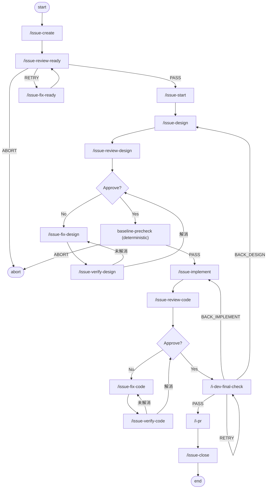
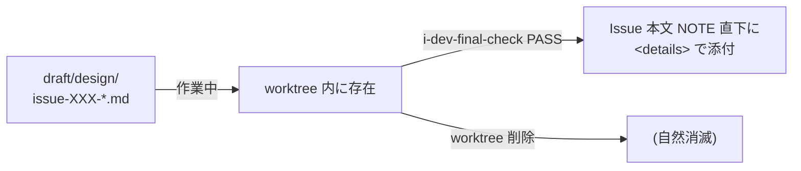

# Development Workflow

実装を伴う Issue 向けの開発ワークフロー。
入口と共通原則は [workflow_overview.md](./workflow_overview.md) を参照し、本書では dev workflow に限定して扱う。

## 対象

- コード変更を含む Issue
- テスト追加や品質ゲート実行が必要な Issue
- 設計書の昇格または既存 docs の更新が必要な Issue

docs-only の Issue は [docs_maintenance_workflow.md](./docs_maintenance_workflow.md) を使用する。

## フロー



## フェーズ概要

| フェーズ | コマンド | 主な責務 |
|----------|----------|-----------|
| 起票 | `/issue-create` | Issue 作成、ラベル付与 |
| レディネスレビュー | `/issue-review-ready` → `/issue-fix-ready` ループ | Issue 本文の記述品質ゲート |
| 着手 | `/issue-start` | worktree 作成、Issue 本文 NOTE ブロックに Worktree / Branch を追記 |
| 設計 | `/issue-design` | 設計書作成（`draft/design/issue-XXX-*.md`）、影響ドキュメント整理、テスト方針整理、ハンドオフ前 **design self-check**（review-design rubric 単一情報源） |
| 設計レビュー | `/issue-review-design` | 一次情報・設計整合性・影響評価の確認 |
| Baseline | `baseline-precheck` | agent を起動せず変更前 pytest を構造化し、clean / known_failures / blocked / invalid を判定 |
| 実装 | `/issue-implement` | 実装、docs 更新、品質ゲート（`make check`）実行、ハンドオフ前 **pre-handoff review**（Claude Code: `kaji-code-reviewer` subagent / 非対応 agent: main-session self-check） |
| コードレビュー | `/issue-review-code` | 設計整合、テスト証跡、docs 更新漏れの確認 |
| 最終チェック | `/i-dev-final-check` | PR 前の最終品質ゲート（`make check`）、docs 整合、設計書 NOTE 直下添付、Issue 本文更新 |
| PR 作成 | `/i-pr` | branch/worktree 解決、push、`kaji pr create`（`--no-ff` merge 前提） |
| 完了 | `/issue-close` | PR merge、worktree cleanup、Issue close、完了報告コメント（※手動実行） |

## type 別の差分

dev workflow のフローそのものは type に依存しないが、各スキル内での処理は Issue の `type:` ラベルにより分岐する。

| フェーズ | feat | bug | refactor |
|----------|------|-----|----------|
| review-ready | ユーザーストーリー / スコープ境界を追加確認 | OB / EB / 再現手順が必須 | 測定可能な改善指標を追加確認 |
| create | feat 用テンプレートを適用 | bug 用テンプレートを適用 | refactor 用テンプレートを適用 |
| design | `_shared/design-by-type/feat.md` を適用（IF 設計・使用例中心） | `_shared/design-by-type/bug.md` を適用（OB/EB + 根本原因） | `_shared/design-by-type/refactor.md` を適用（ベースライン計測・改善指標） |
| review-design | IF / 使用例に重み | OB/EB 整合・再現可能性に重み | 測定指標の定量性・振る舞い非変更に重み |
| implement | `_shared/implement-by-type/feat.md` を適用（標準 TDD） | `_shared/implement-by-type/bug.md` を適用（再現テスト先行） | `_shared/implement-by-type/refactor.md` を適用（計測 → safety net → 改修 → 再計測） |
| review-code | IF 契約の忠実性 | 再現テストの Red→Green 証跡・同根欠陥の波及修正 | 振る舞い非変更の保証・改善指標の達成 |

**fix/verify 系スキル（`issue-fix-*` / `issue-verify-*` / `pr-fix` / `pr-verify`）には type 分岐を入れない**。レビューサイクルの収束保証（`issue-verify-code/SKILL.md` の「新規指摘は行わない」原則）を損なうため。

**type:docs は dev workflow の対象外**。docs-only workflow（`/i-doc-update` 起点）を使用する。

**canonical 外 type（`type:test` / `type:chore` / `type:perf` / `type:security`）**は、上記分岐対象スキルでは `type:feature` と同等に扱う（フォールバック規則）。

## type → ラベル マッピング

> **参照**: [docs/rfc/github-labels-standardization.md](../rfc/github-labels-standardization.md)（GitHub Labels 標準化）

| type | ラベル | 用途 |
|------|--------|------|
| `feat` | `type:feature` | 新機能追加 |
| `fix` | `type:bug` | バグ修正 |
| `refactor` | `type:refactor` | リファクタリング |
| `docs` | `type:docs` | ドキュメント |
| `test` | `type:test` | テスト追加・改善 |
| `chore` | `type:chore` | 雑務・依存の掃除 |
| `perf` | `type:perf` | パフォーマンス改善 |
| `security` | `type:security` | セキュリティ対応 |

## 完了条件の考え方

- 各フェーズは、その段階で確認可能な workflow 内完了条件を終盤で確認し、Issue コメントに証跡を残す
- `i-dev-final-check` が前段の証跡を横断確認し、PR に進めるか最終判定する
- docs 更新判断は design / implement / review-code / final-check の各段で確認する
- `i-dev-final-check` の PASS 時に事後確認を除く完了条件チェックボックスを更新し、設計書を NOTE 直下に添付する
- `issue-close` は未完了の `### ワークフロー完了後の確認項目` を follow-up Issue へ移管してから親 Issue を close する

## Pre-Handoff Review

`design / implement の hand-off 直前ゲート`。`design → review-design` および `implement → review-code` の hand-off 直前に、review 側 rubric と作業成果物を突き合わせる **pre-handoff review** を必須化する。重複チェックリストは作らず、`/issue-review-design` / `/issue-review-code` SKILL.md を **rubric の単一情報源** として参照する。

| フェーズ | スキル内ステップ | 経路（capability-based） |
|---------|------------------|------------------------|
| design hand-off | `/issue-design` Step 2.6 (Self-Check) | main-session self-check（rubric: review-design SKILL.md Step 1.5 / Step 2 § type 重み付け / § 重要判断 audit / § レビュー基準 1〜5）|
| implement hand-off | `/issue-implement` Step 8.5 (Pre-Handoff Review) | Claude Code: `kaji-code-reviewer` subagent / Codex・Antigravity 等: main-session self-check（同 rubric） |

`/issue-implement` は開始時に [implement-quickref.md](./implement-quickref.md) を読み、正本規約を状況依存で部分 Read する。Baseline Check は [baseline-check.md](./baseline-check.md) と構造化 artifact、Pre-Handoff Review の詳細手順と実装完了報告 template は skill 配下を正本とする。

**verdict 階層分離**: pre-handoff review が返すのは `Yes` / `No` / `With fixes` の **自己評価** であり、kaji workflow の正式 verdict（`PASS` / `RETRY` / `BACK` / `ABORT`）ではない。正式 verdict は `/issue-review-design` / `/issue-review-code` が後段で発行する。

`kaji-code-reviewer` subagent の定義は `.claude/agents/kaji-code-reviewer.md`（tools: `Read` / `Grep` / `Glob` のみの hard boundary、`Bash` / `Edit` / `Write` / `WebFetch` 等は不付与）。Claude Code 以外の agent runtime では Agent tool 起動が失敗するため、main session が同 markdown 内の rubric を自セッションで適用する fallback ブランチを取る。

詳細は以下を参照:

- [workflow_completion_criteria.md](./workflow_completion_criteria.md) — フェーズ別確認項目、証跡責務、Issue 本文更新プロトコル
- [documentation_update_criteria.md](./documentation_update_criteria.md)
- [shared_skill_rules.md](./shared_skill_rules.md)

## 重要判断と one-way door

`review-ready → design → review-design` では、人間が決めた重要方針と source of truth を
弱化せずに伝播する。`issue-design` は意思決定フェーズではなく、決定済み方針を
実装可能な粒度へ詳細化し、人間決定の出典と AI の仮定を provenance に分けて記録する。

判定軸は「重要そうか」ではなく「誤ったとき後段で安く直せるか」。安く直せる
two-way door は仮定と検査先を明記して進める。one-way door の代表軸と停止条件は
[`critical-decision-checklist.md`](../../.claude/skills/_shared/critical-decision-checklist.md)
を正本とし、人間未決なら `ABORT` して決めるべき項目を返す。決定済みだが記述や
provenance が不足しているだけなら `RETRY` で補完する。

## workflow 起動時の provider 整合 fail-fast（Phase 4 以降）

`kaji run <workflow.yaml> <issue>` は workflow load 直後に
`workflow.requires_provider` と `config.provider.type` を突合する。
不整合は **exit 2** + 切替手順を stderr に出して dispatcher 起動前に止まる。

- official workflow（`.kaji/wf/official/**/*.yaml`）はすべて `requires_provider` を明示済
  （[workflow_guide.md](workflow_guide.md) § provider × workflow の対応表）
- 例: `provider.type='local'` 配下で `kaji run .kaji/wf/official/dev.yaml ...` を
  打つと、step `i-pr` まで進む前に exit 2 で停止する
- `requires_provider: any` の workflow は両 provider で通る（`design-only.yaml`）

CLI 層（`kaji pr` の bare-provider error）／Skill 層（`pr-fix` / `pr-verify` /
`i-pr` の Step 0 ガード）と組み合わせて、3 層で forge 機能の誤起動を止める。

## GitHub CLI の最低 version 管理（Issue #372）

`GitHubProvider`（`kaji_harness/providers/github.py`）は `_MIN_GH_VERSION` 定数で
kaji が要求する `gh` の最低 version を単一情報源として保持する。`_run_gh()` が
最初の業務 `gh` 実行より前に `gh --version` を検査し、未満なら検出 version・
必要 version・理由・公式インストール手順 URL を含む `GitHubProviderError` で
mutation 前に停止する（`gh --version` の出力が解析できない場合は fail-open）。

新しい `gh --json` field や flag を採用する場合は、以下を同時に行う。

1. cli/cli の release note / compare（`https://github.com/cli/cli/compare/vX...vY`）で、
   その機能が追加された version を確認する
2. 既存の下限より新しければ `_MIN_GH_VERSION` を更新する
3. `README.md` / `README.ja.md` の prerequisites と
   [github-mode.md](../cli-guides/github-mode.md#11-required-tools) /
   [github-mode.ja.md](../cli-guides/github-mode.ja.md#11-必須ツール) の
   必須ツール表を同時に更新する

## テストと品質ゲート

kaji は Python 単一スタックであり、通常の品質ゲートは `make check` に統一されている。

- 日常開発・コミット前の統合ゲート: `make check`（`ruff check` → `ruff format --check` → `mypy` → `pytest`。非破壊。整形は `make fmt`）
- docs-only 変更時のリンク整合性ゲート: `make verify-docs`
- packaging-only 変更時の独立検証: `make verify-packaging`
- マーカー別個別実行: `make test-small` / `make test-medium` / `make test-large` / `make test-large-local`
- 既知 baseline failure がある場合: 非 pytest gate + `baseline_precheck --compare` の等価分離 gate

詳細は以下を参照:

- [testing-convention.md](./testing-convention.md) — テスト規約 + 恒久テスト追加不要の 4 条件（docs-only / metadata-only / packaging-only）
- [../reference/testing-size-guide.md](../reference/testing-size-guide.md)
- [../../AGENTS.md](../../AGENTS.md) — 常時適用ルール（pre-commit 契約等）。コマンド一覧の正本は Makefile（`make help`）

## コミットメッセージ規約（Conventional Commits）

kaji は Conventional Commits を採用する。Squash merge は禁止し、`--no-ff` merge を必須とする。詳細は [../guides/git-commit-flow.md](../guides/git-commit-flow.md) を参照。

| prefix | 用途 |
|--------|------|
| `feat:` | 新機能 |
| `fix:` | バグ修正 |
| `refactor:` | リファクタリング |
| `docs:` | ドキュメント変更 |
| `test:` | テスト追加・改善 |
| `chore:` | 雑務・依存の掃除 |
| `perf:` | パフォーマンス改善 |
| `build:` / `ci:` | ビルド / CI |

PR title も Conventional Commits に揃える。`--no-ff` merge により merge commit が残るため、PR title が直接の commit message にはならないが、履歴可読性のために統一する。

## 設計書の扱い

- 作業中の設計書は `draft/design/issue-XXX-*.md`（worktree 内、コミット対象）
- `/i-dev-final-check` の PASS 時に Issue 本文の NOTE ブロック直下に `<details>` で添付（worktree 削除後も Issue から辿れる）
- アーキテクチャ決定は `docs/adr/` に ADR として永続化（従来通り）
- 既存 docs の更新が必要な場合は `_shared/promote-design.md` を参照



## Issue 本文の構造

`/issue-start` 実行後、Issue 本文の先頭に NOTE ブロックが追記される:

```markdown
> [!NOTE]
> **Worktree**: `../kaji-feat-123`
> **Branch**: `feat/123`

(元の Issue 本文)
```

PR 作成後（`/i-pr` が PR 番号を追記）:

```markdown
> [!NOTE]
> **Worktree**: `../kaji-feat-123`
> **Branch**: `feat/123`
> **PR**: #456
```

`/i-dev-final-check` PASS 時、設計書が NOTE 直下に添付される（詳細は [workflow_completion_criteria.md](./workflow_completion_criteria.md) の「Issue 本文更新プロトコル」を参照）。

## コマンド一覧

### ライフサイクル管理

| コマンド | 説明 |
|----------|------|
| `/issue-create` | Issue 作成 + ラベル付与 |
| `/issue-review-ready` | Issue 本文レディネスレビュー（全 workflow 共通ゲート） |
| `/issue-fix-ready` | レディネス RETRY 指摘への対応 |
| `/issue-start` | worktree 構築 + Issue 本文 NOTE ブロックに Worktree/Branch 追記 |
| `/i-dev-final-check` | エビデンス集約 + 品質チェック + 設計書 NOTE 直下添付 + Issue 本文更新 |
| `/i-pr` | コミット整理 + push + PR 作成 |
| `/issue-close` | PR merge + worktree 削除 + ブランチ安全削除 + Issue クローズ（※手動実行） |

### 設計フェーズ

| コマンド | 説明 |
|----------|------|
| `/issue-design` | `draft/design/` に設計書作成 |
| `/issue-review-design` | 設計レビュー（新規指摘可） |
| `/issue-fix-design` | 設計修正 |
| `/issue-verify-design` | 設計再確認（新規指摘不可） |

### 実装フェーズ

| コマンド | 説明 |
|----------|------|
| `/issue-implement` | TDD で実装 + `make check` |
| `/issue-review-code` | コードレビュー（新規指摘可） |
| `/issue-fix-code` | コード修正 |
| `/issue-verify-code` | コード再確認（新規指摘不可） |
