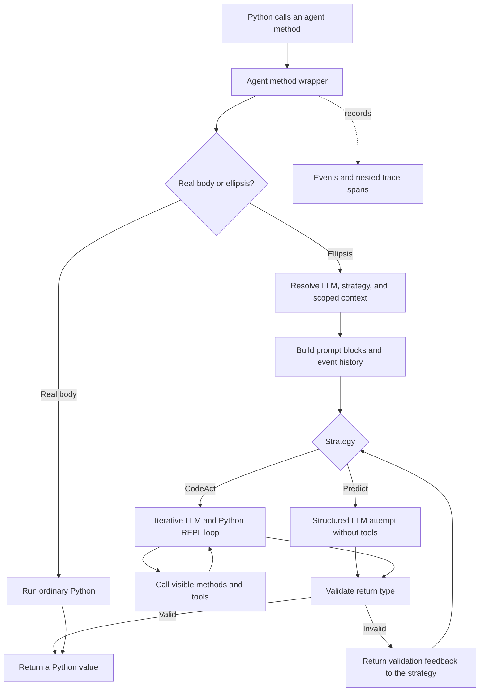

# How NOOA runs an agent method

NOOA keeps two kinds of execution in one Python class:

- A method with a real body runs as regular Python.
- An asynchronous method ending in `...` delegates its implementation to an
  LLM through a generation strategy.

Agentic methods and asynchronous real-body methods are awaited. Synchronous
helpers are called normally. The caller does not need a separate graph or tool
invocation API: both remain ordinary Python method calls.

## The call path



This is not a remote worker abstraction. The agent is a live Python object in
the current process. CodeAct-generated Python can work with its method
arguments as live objects and call the visible API on `self`.

## 1. Class creation identifies agentic methods

`Agent` uses a metaclass to inspect methods when the class is defined. An async
method whose body ends in `...` is wrapped as an agentic method. Other methods
keep their Python implementation and are wrapped only for runtime services such
as tracing.

```python
class Analyst(Agent, llm=llm):
    async def classify(self, text: str) -> str:
        """Classify the text."""
        ...  # agentic

    def normalize(self, text: str) -> str:
        return text.strip().lower()  # deterministic
```

No tool registry or graph compiler is needed to connect these methods. The
Python class is the executable definition.

## 2. The runtime resolves the call configuration

For an agentic method, the runtime resolves:

- the LLM client, including call-, method-, instance-, class-, and parent-level
  overrides;
- the generation strategy, defaulting to CodeAct;
- method-scoped context and event-history filters;
- truncation and execution settings.

The built-in Predict and CodeAct strategies lock an agent instance while a
generation call is active. This prevents per-instance events, history, and
active generation or tool work from interleaving. CodeAct creates a fresh REPL
session for each agentic call; its local variables persist only across cells
within that call. Use separate agent instances for ordinary parallel fan-out.

## 3. The prompt is assembled from Python structure

The model receives more than the method docstring. The runtime assembles a set
of named blocks:

- the class role and framework instructions;
- strategy instructions;
- `doc(type(self))`, which describes visible methods and annotated fields;
- current visible instance state;
- developer context blocks;
- the event history selected for this call;
- the method name, signature, docstring, and arguments.

Arguments are rendered by the strategy. They do not need to be interpolated
again with `{argument}` in the docstring.

See [Prompts and context](concepts/prompts-and-context.md) for where each kind of
information belongs.

## 4. The strategy implements the ellipsis

`PredictStrategy` makes a structured model attempt and validates the response.
It has no iterative tool loop, but validation failures can trigger additional
provider attempts. It fits classification, extraction, and other tasks that do
not need tools or code execution.

`CodeActStrategy` gives the model two core actions: execute a Python cell and
return a result. Its REPL state persists across cells for the duration of the
method. Generated code can inspect objects with `doc()`, call methods on
`self`, and use tools attached to the agent.

Both strategies enforce the declared return type. Validation errors become
feedback for another attempt instead of leaking an invalid value to the
caller.

## 5. Events preserve the agent's working history

Tasks, model messages, reasoning, generated-code output, errors, feedback, and
summaries are recorded as events. That history supplies the conversational
part of later prompts and can be filtered or summarized.

Context blocks and events serve different purposes:

- Context blocks are named information deliberately inserted into the prompt.
- Events are the chronological record of what happened.

Both belong to one agent instance. A child agent begins with its own context
and history unless the application passes information explicitly.

## 6. Tracing records the complete call tree

Tracing follows Python nesting rather than capturing only an LLM transcript. A
typical trace looks like:

```text
method.run
└── method.research
    └── generation
        ├── litellm.acompletion
        ├── code_execution
        └── method_call.search
```

This makes deterministic orchestration, generated code, nested agent calls,
and external tools visible in one timeline. See [Tracing](concepts/tracing.md).

## What remains ordinary Python

NOOA intentionally leaves application architecture in the language:

- use `if`, `for`, exceptions, and `asyncio` for control flow;
- use Pydantic and validators for local data contracts;
- use tests for deterministic helpers and orchestrators;
- use separate objects when work needs isolated state;
- use operating-system isolation when generated code is allowed to execute.

That boundary is the central design choice: the LLM supplies judgment inside
selected methods, while Python retains control over program structure and
acceptance criteria.

## Continue

- [Agents and methods](concepts/agents-and-methods.md)
- [Strategies](concepts/strategies.md)
- [Orchestration](concepts/orchestration.md)
- [Framework tour](tour.md)
