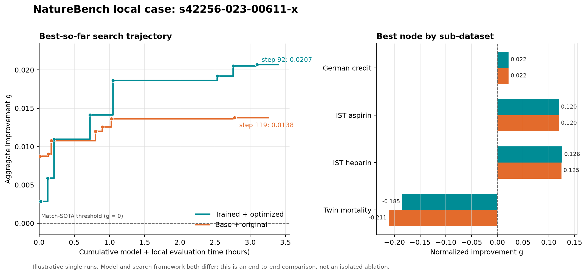
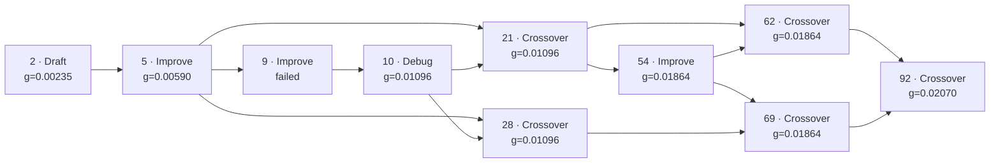

# Reading the local NatureBench trajectory

This note explains how to interpret a complete local run of
`s42256-023-00611-x` (Categorical Counterfactual Outcome Estimation). It uses
two archived single-run trajectories as an illustration:

- **Trained + optimized**: a trained checkpoint with experience memory,
  three-factor parent selection (`score=1.0`, `delta=0.4`, `novelty=0.25`),
  and `fresh_draft_prob=0.2`.
- **Base + original**: the corresponding base-model family with experience
  disabled and `fresh_draft_prob=0.0`.

Both runs used the same local task, evaluator contract, four-hour configured
effective budget, six-hour wall-clock limit, and 160-node ceiling. The model
and search framework both change between the runs, so this is an
**end-to-end example, not an isolated model or framework ablation**. A single
run also does not measure variance across random seeds.

## Metric

For each of the four sub-datasets, NatureBench computes a SOTA-normalized gap:

```text
g_i = direction_i * (metric_i - paper_sota_i) / abs(paper_sota_i)
aggregate_improvement = mean(g_i)
```

- `aggregate_improvement >= 0`: Match-SOTA.
- `aggregate_improvement > 0.1`: Surpass-SOTA.
- A positive aggregate does not require every sub-dataset to be positive.
- Failed candidates remain useful search evidence but are not valid final
  solutions.

## End-to-end comparison



| Run | Nodes | Successful | Best step | Best operator | Best aggregate `g` | Match | Surpass |
| --- | ---: | ---: | ---: | --- | ---: | :---: | :---: |
| Trained + optimized | 101 | 76 (75.2%) | 92 | Crossover | **0.02070** | Yes | No |
| Base + original | 139 | 133 (95.7%) | 119 | Improve | 0.01377 | Yes | No |

The trained + optimized run improves the observed best by `0.00693`, or
`50.3%` relative to the base + original best. It also explores more
aggressively: 17 fresh Draft nodes and deeper repair branches produce more
failed candidates, while the original run spends most nodes exploiting
already-valid parents. The lower success rate is therefore not itself evidence
of a worse search; the best-so-far curve is the relevant outcome.

Because both systems already match SOTA (`g >= 0`) and neither surpasses the
official threshold (`g > 0.1`), the meaningful comparison here is solution
quality and search dynamics rather than a change in the binary leaderboard
category.

## Optimization milestones

The optimized run reaches a valid, Match-SOTA solution after one Debug node,
then makes seven further best-so-far updates:

| Step | Operator | Best `g` | Cumulative model + evaluation time |
| ---: | --- | ---: | ---: |
| 1 | Debug | 0.00284 | 1.3 min |
| 5 | Improve | 0.00590 | 7.4 min |
| 10 | Debug | 0.01096 | 12.7 min |
| 29 | Crossover | 0.01412 | 43.3 min |
| 42 | Crossover | 0.01864 | 63.1 min |
| 79 | Improve | 0.01921 | 152.0 min |
| 87 | Improve | 0.02050 | 165.3 min |
| 92 | Crossover | **0.02070** | 185.7 min |

The best node is not a linear sequence of edits. Its ancestry is a small search
graph in which a failed Improve attempt becomes useful after Debug, and later
Crossover nodes recombine two independently refined branches:



Operator statistics reinforce that interpretation:

| Operator | Nodes | Successful | Match-SOTA nodes | Role in this run |
| --- | ---: | ---: | ---: | --- |
| Draft | 17 | 8 | 6 | Restore diversity and establish independent branches |
| Debug | 23 | 17 | 16 | Turn malformed or crashing candidates into usable parents |
| Improve | 30 | 21 | 20 | Tune modeling choices within one branch |
| Crossover | 31 | 30 | 30 | Recombine strong branches; produced the final best |

## Where the score gain comes from

| Sub-dataset | Trained + optimized `g` | Base + original `g` | Difference |
| --- | ---: | ---: | ---: |
| German credit | 0.02197 | 0.02197 | 0.00000 |
| IST aspirin | 0.11970 | 0.11970 | 0.00000 |
| IST heparin | 0.12600 | 0.12456 | +0.00144 |
| Twin mortality | -0.18488 | -0.21114 | **+0.02627** |

About `94.8%` of the aggregate difference comes from reducing the
Twin-mortality deficit; another `5.2%` comes from IST heparin. German credit
and IST aspirin are unchanged. This is why the aggregate improves even though
Twin mortality still remains below its paper SOTA.

The final optimized candidate differs qualitatively from the base-run best:

- it augments factual and counterfactual rows into one intervention-aware
  training table instead of fitting two unrelated outcome models;
- it explicitly aligns factual and counterfactual treatment columns;
- it preserves categorical features for LightGBM;
- it uses stratified five-fold ensembling, class balancing, a lower learning
  rate, and higher model capacity.

These choices mainly improve the difficult Twin-mortality branch while
retaining the already-strong results on the other three sub-datasets.

## Smoke versus full search

`--smoke` intentionally generates only one Draft candidate. It answers whether
model access, candidate execution, output generation, and evaluation are wired
correctly. It does **not** exercise the optimization trajectory above and its
score should not be compared with a four-hour result.

For a complete run, remove `--smoke`. Inspect these files afterward:

- `summary.csv`: batch-level completion status.
- `runner_failures.json`: runner failures; an empty array means orchestration
  completed normally.
- `program_ep_0/s42256-023-00611-x/stat.json`: final and best task metrics.
- `program_ep_0/s42256-023-00611-x/step_*/stat.json`: per-node operator,
  parent, status, score, token, and timing fields.
- `step_*/valid_code.py`, `raw_run_log.txt`, and `feedback.txt`: the code and
  execution evidence behind each transition.

When comparing systems, use the same task package, evaluator, time budget, and
node ceiling. Compare best-so-far against cumulative model-plus-evaluation time,
not just node count, because candidates can have very different execution
costs. Change one axis at a time when making a causal claim about the model or
the search framework.
