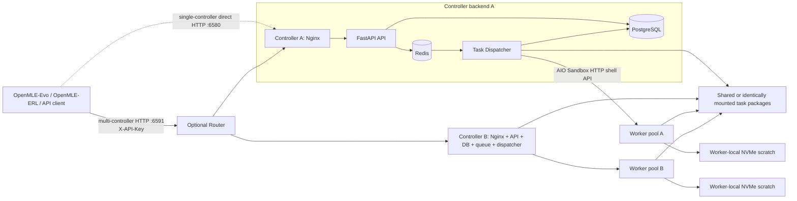
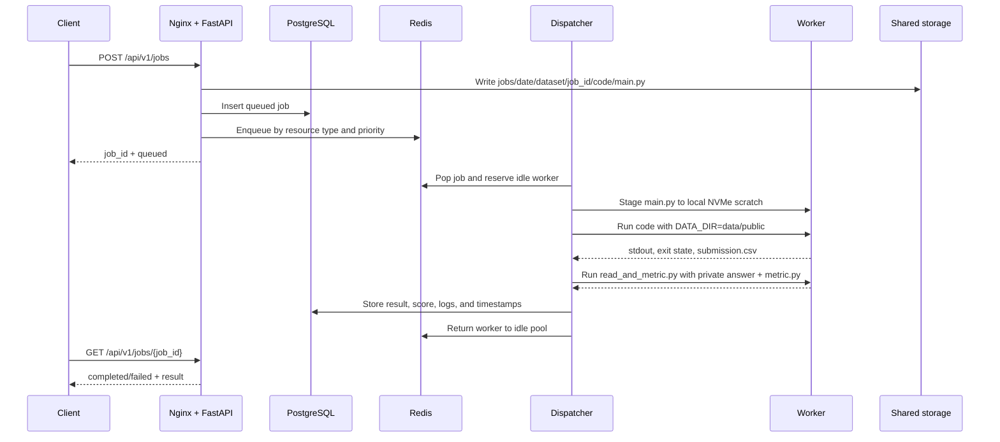

# OpenMLE Sandbox

OpenMLE Sandbox is the distributed code-execution and automatic-evaluation component of [OpenMLE-Gym](../README.md). It serves as the sandbox execution and scoring backend for [OpenMLE-Evo](../../OpenMLE-Evo/README.md) and [OpenMLE-ERL](../../OpenMLE-ERL/README.md). A client submits machine-learning code and a task-package path; the controller schedules the job to an available CPU or GPU sandbox, runs the code in an isolated worker container, evaluates the generated `submission.csv`, and returns the score and logs through a REST API.

## Architecture

### Flow chart



### Components

| Component            | Responsibility                                                                                                                      |
| -------------------- | ----------------------------------------------------------------------------------------------------------------------------------- |
| Router               | Selects a controller for each new job, persists the job-to-controller route, and aggregates controller status and job lists.       |
| Nginx                | Exposes controller port `6580` and proxies `/api/v1/*` to FastAPI.                                                                 |
| FastAPI              | Authenticates requests, validates jobs, creates the job envelope, persists metadata, and enqueues jobs.                             |
| PostgreSQL           | Stores job lifecycle, timing, result, score, errors, and idempotency metadata.                                                      |
| Redis                | Holds priority queues and the current CPU/GPU worker inventory.                                                                     |
| Dispatcher           | Selects an idle worker, stages code, executes it, evaluates the submission, records the result, and returns the worker to the pool. |
| AIO Sandbox worker   | A long-running container that exposes an HTTP shell API and executes one assigned job at a time.                                    |
| Shared storage       | Makes datasets, job envelopes, evaluation code, and shared caches visible at the same container path on every node.                 |
| Worker-local scratch | Keeps active code, output, and stdout on the selected worker's local disk instead of running the workload directly on NFS.          |

Workers do not self-register. The dispatcher loads a static endpoint inventory from [`node_controller/task_dispatcher/config/sandbox_config.json`](node_controller/task_dispatcher/config/sandbox_config.json) when it starts.

### Job execution flow

The sequence below describes one controller backend. When the optional Router is used, it first selects that backend, forwards the submission with the caller's API key, stores the returned job-to-controller mapping, and proxies later status, log, and cancellation requests to the same backend.



The detailed lifecycle is:

1. The API checks `X-API-Key`, validates `resource_type`, priority, timeout, and idempotency, then creates a job ID.
2. Submitted source is stored as `main.py` under the NFS job envelope. PostgreSQL receives a `queued` row and Redis receives the queue item.
3. The dispatcher chooses the matching CPU or GPU queue and reserves an idle endpoint from the configured worker pool.
4. Through the worker's `/v1/shell/*` API, the dispatcher copies `main.py` to that worker's local scratch directory and executes it there.
5. The dispatcher exports `DATA_DIR=<task-package>/data/public`. User code must write `submission.csv` beside `main.py`.
6. On the same worker, the dispatcher runs `read_and_metric.py` against `data/private/test_answer.csv` and `utils/metric.py`.
7. The dispatcher parses the `##SCORE##<value>` marker, saves the result and logs, and releases the worker.

Top-level job states are `queued`, `running`, `completed`, `failed`, and `cancelled`. The nested result distinguishes `success`, `code_missing`, `code_execution_error`, `submission_missing`, `metric_or_answer_missing`, `scoring_failed`, `timeout`, and `sandbox_unconfirmed`.

### Task-package and storage contract

A task package must have this minimum layout:

```text
task-name/
├── data/
│   ├── public/
│   │   ├── train.csv
│   │   └── test.csv
│   └── private/
│       └── test_answer.csv
└── utils/
    └── metric.py
```

`metric.py` must expose a class with callable `validate_submission(...)` and `evaluate(...)` methods. The private directory is an evaluation convention in this source snapshot, not a security boundary: the default worker mount exposes the shared filesystem read-only except for selected writable paths.

The default deployment uses these paths:

| Host path                                         | Container path                           | Purpose                                                      |
| ------------------------------------------------- | ---------------------------------------- | ------------------------------------------------------------ |
| `/nfs2/users/pubdatasets2`                      | `/mnt/pubdatasets2`                    | Shared datasets, job envelopes, evaluation code, and caches. |
| `/nfs2/users/pubdatasets2/mlsandbox/jobs/...`   | `/mnt/pubdatasets2/mlsandbox/jobs/...` | Persistent source envelope, markers, and job metadata files. |
| `/local_nvme/sandbox_workdir` on each worker    | `/mnt/local_sandbox_workdir`           | Active job code, `submission.csv`, and sandbox stdout.       |
| `/local_nvme/mlsandbox_cache` on the controller | `/mlsandbox_cache`                     | Controller runtime and observability logs.                   |

The host NFS path may be changed, but all controller and worker containers must still see the same dataset tree at `/mnt/pubdatasets2`, unless the Compose file, worker script, test clients, and dispatcher configuration are changed consistently.

## Repository layout

The directory is organized by deployment role:

- `node_controller/` provides the complete controller stack: Nginx, FastAPI, PostgreSQL, Redis, and the dispatcher for scheduling, execution, evaluation, timeouts, cancellation, and worker recovery.
- `node_workers/` contains the evaluator and scripts for starting prebuilt AIO Sandbox worker containers across multiple machines.
- `node_router/` is an optional multi-controller entry point that selects a controller, preserves job routing, and aggregates status.
- `node_client/` contains the Titanic single-job, parallel, and cancellation test clients.

A single controller can manage workers on many machines. Larger installations can deploy several independent controllers behind the included Router. The monitoring stack and worker-image build pipeline are not included in this module.

```text
OpenMLE-Gym/openmle-sandbox/
├── node_router/
│   ├── gateway.py                    # Existing multi-controller routing and proxy API
│   ├── backends.yaml                 # Public example controller inventory
│   ├── requirements.txt
│   ├── Dockerfile                    # Maintainer image definition
│   └── README.md
├── node_controller/
│   ├── api_server/                   # FastAPI source and image definition
│   ├── database/                     # Initial PostgreSQL schema and migration
│   ├── nginx/                        # API reverse-proxy configuration
│   ├── task_dispatcher/
│   │   └── config/sandbox_config.json
│   └── docker-compose.yaml           # PostgreSQL, Redis, API, dispatcher, Nginx
├── node_workers/
│   ├── read_and_metric.py            # Generic task-package evaluator
│   └── sandbox_builder/
│       ├── start_sandboxes.sh         # Interactive worker launcher
│       ├── rm_sandboxes.sh            # Destructive worker cleanup helper
│       └── v0.9/requirements_v0.9.2.lock
└── node_client/test_titanic/
    ├── test_1shot.py
    ├── test_parallel.py
    └── test_canclejob.py
```

The canonical Titanic package is already tracked at [`../examples/real-run-3-concurrency/task_package/titanic`](../examples/real-run-3-concurrency/task_package/titanic). The deployment below copies that package to shared storage; it is intentionally not duplicated under `node_workers/`.

## Cluster deployment

### 1. Choose the topology

The smallest useful distributed deployment is:

- one controller host that runs PostgreSQL, Redis, FastAPI, the dispatcher, and Nginx;
- one or more worker hosts that run AIO Sandbox containers;
- one shared POSIX/NFS filesystem mounted on the controller and every worker;
- a client that can reach controller TCP port `6580`;
- controller-to-worker connectivity on the selected worker port range, for example `10150-10157`.

For a multi-controller deployment, repeat the controller-plus-worker-backend setup, then add one Router endpoint on TCP port `6591`. The Router must reach every controller on `6580`, every controller must accept the same job API key, and every backend must expose each submitted `data_dir` at the same container-visible path. The Router moves HTTP requests only; it does not copy datasets or job files between storage systems.

For the first deployment, start with one sandbox container per physical GPU. The launcher supports oversubscription by cycling over GPU IDs, but validate the one-container-per-GPU setup before increasing the count.

### 2. Prerequisites

The current deployment has been validated on Ubuntu 22.04 with:

- Docker Engine and the Docker Compose v2 plugin;
- NVIDIA driver, NVIDIA Container Toolkit, and Docker GPU runtime on GPU workers;
- Python 3.10 or newer on the client;
- cgroup v1 for the `1.0.0` release's worker runtime (AIO Sandbox `v0.9.2`);
- at least 100 GiB free under each worker's local scratch root, matching `LOCAL_SCRATCH_MIN_FREE_BYTES` in Compose;
- synchronized time across nodes;
- a shared filesystem mounted at the same host path on every node.

Check the cgroup filesystem on every worker host:

```sh
stat -fc %T /sys/fs/cgroup
```

The OpenMLE worker hosts used to validate this release run cgroup v1, whose
filesystem normally reports `tmpfs`; unified cgroup v2 reports `cgroup2fs`.
We recommend using the same cgroup v1 configuration for the `1.0.0` worker
image. On an Ubuntu 22.04 worker that uses GRUB, the reference configuration
adds `systemd.unified_cgroup_hierarchy=0` to the existing
`GRUB_CMDLINE_LINUX_DEFAULT` value while preserving its other parameters:

```sh
sudoedit /etc/default/grub
# Preserve the existing value and add systemd.unified_cgroup_hierarchy=0.
sudo update-grub
sudo reboot

# Run after the host returns.
stat -fc %T /sys/fs/cgroup
```

These are manual host-administration steps. The deployment and worker-launch
scripts in this repository do not edit the host boot configuration or reboot
the host.

Changing the cgroup hierarchy affects the whole host. Schedule this as a host
maintenance operation and verify compatibility with other container runtimes
or Kubernetes installations on that machine. A dedicated worker host is the
simplest deployment choice when an existing workload requires cgroup v2.

Before continuing, confirm on every GPU worker that `nvidia-smi` works on the host and that Docker can expose the GPUs to containers. Confirm that every node can read the shared filesystem and that the controller can connect to every planned worker host and port.

#### Container images

Normal deployments pull all required images and do not build images locally.
The Dockerfiles remain in the repository for maintainers and source review.
The four OpenMLE images published for this release target `linux/amd64`.
Tencent Cloud Container Registry (TCR) is the default source; a public personal
GHCR mirror is retained as a fallback:

| Component | Default: Tencent TCR | Fallback: GHCR mirror |
| --- | --- | --- |
| Worker | `ccr.ccs.tencentyun.com/frontisai-openmle/openmle-sandbox-worker:1.0.0` | `ghcr.io/lifeissosolong/openmle-sandbox-worker:1.0.0` |
| Controller API | `ccr.ccs.tencentyun.com/frontisai-openmle/openmle-sandbox-controller-api:1.0.0` | `ghcr.io/lifeissosolong/openmle-sandbox-controller-api:1.0.0` |
| Controller dispatcher | `ccr.ccs.tencentyun.com/frontisai-openmle/openmle-sandbox-controller-dispatcher:1.0.0` | `ghcr.io/lifeissosolong/openmle-sandbox-controller-dispatcher:1.0.0` |
| Router | `ccr.ccs.tencentyun.com/frontisai-openmle/openmle-sandbox-router:1.0.0` | `ghcr.io/lifeissosolong/openmle-sandbox-router:1.0.0` |

Both sources are public and can be pulled anonymously. The deployment files use
the TCR prefix by default. If TCR is unavailable or slow from your network,
export the fallback prefix before running the worker, controller, or Router
commands on that host:

```sh
export OPENMLE_SANDBOX_IMAGE_PREFIX="ghcr.io/lifeissosolong"
```

Keep the variable exported for both `pull` and startup. Unset it, or set it to
`ccr.ccs.tencentyun.com/frontisai-openmle`, to return to the default TCR source.

The controller also pulls these exact third-party image versions:

| Component | Default image |
| --- | --- |
| Nginx | `docker.m.daocloud.io/library/nginx:1.25.5` |
| PostgreSQL | `docker.m.daocloud.io/library/postgres:15.14` |
| Redis | `docker.m.daocloud.io/library/redis:7.4.6` |

The controller images provide the pinned Python
runtime and dependencies. The default Compose file bind-mounts the checked-out
`api_server/` and `task_dispatcher/` directories over the image source, so
source or configuration changes normally require only a restart of the affected
service, not an image rebuild.

The `1.0.0` Worker image is large (about 20 GB compressed). Check free Docker
storage and connectivity to the selected registry before starting a multi-node
rollout, and avoid launching many first-time pulls simultaneously through a
bandwidth-limited cluster egress.

The last three entries are unmodified upstream images accessed through the
DaoCloud Docker Hub proxy; FrontisAI does not republish them. If that proxy is
not reachable in your region, replace the corresponding `image:` values in
`node_controller/docker-compose.yaml` with the Docker Hub references
`nginx:1.25.5`, `postgres:15.14`, and `redis:7.4.6`.

#### Public ingress and the client Base URL

The published commands listen on every host interface for the two client-facing
services:

- the controller Compose mapping `6580:80` publishes Nginx as
  `0.0.0.0:6580`;
- the Router command uses `--host 0.0.0.0 --port 6591`, and its Docker example
  publishes `6591:6591`.

The URL that clients use still depends on the host network:

- If the server has a public IP directly assigned to it, no port translation is
  normally required. Allow inbound TCP `6580` for a directly accessed
  controller, or TCP `6591` for a Router.
- If the server is behind NAT, a shared public IP, a load balancer, or a cloud
  port-forwarding service, map a public port to the host's `6580` or `6591`.
  The public and internal ports do not need to match; for example, public
  `18080` may forward to controller port `6580`.
- If clients connect only through a private network or VPN, use the reachable
  private address as the Base URL and do not create a public mapping.

For a multi-controller deployment, normally expose only the Router to clients.
Keep each controller address in `backends.yaml` on the private cluster network.
PostgreSQL `5432`, Redis `6380`, FastAPI `8000`, and worker ports such as
`10150-10165` are not client entry points and should not be exposed publicly.

Listening on `0.0.0.0` is necessary for direct remote access, but it does not
configure a firewall, security group, NAT rule, DNS record, or load balancer.
Before public use, replace the bootstrap API key as described below, restrict
inbound source networks where practical, and terminate TLS at a trusted reverse
proxy or load balancer.

### 3. Clone the repository

Clone OpenRSI on the controller. Make the same repository, or at least `node_workers/`, available on each worker host.

```sh
git clone https://github.com/FrontisAI/OpenRSI.git
cd OpenRSI

OPENRSI_ROOT="$(pwd)"
SANDBOX_ROOT="$OPENRSI_ROOT/OpenMLE-Gym/openmle-sandbox"
NFS_ROOT="/nfs2/users/pubdatasets2"
```

The remaining commands assume these values. Run filesystem commands as a user that can create directories on the shared mount and local NVMe; add `sudo` where required by your environment.

### 4. Prepare shared storage and the Titanic test package

Run this once from the controller clone, or from any machine with read/write access to the shared filesystem:

```sh
install -d \
  "$NFS_ROOT/mlsandbox/jobs" \
  "$NFS_ROOT/mlsandbox/uploads" \
  "$NFS_ROOT/mlsandbox/workdir/evaluation" \
  "$NFS_ROOT/mlsandbox/hf_home" \
  "$NFS_ROOT/mlsandbox/torch_home" \
  "$NFS_ROOT/mlsandbox_dev" \
  "$NFS_ROOT/mlsandbox_3" \
  "$NFS_ROOT/MLTasks/Selected_Dojo/titanic"

install -m 0644 \
  "$SANDBOX_ROOT/node_workers/read_and_metric.py" \
  "$NFS_ROOT/mlsandbox/workdir/evaluation/read_and_metric.py"

cp -a \
  "$OPENRSI_ROOT/OpenMLE-Gym/examples/real-run-3-concurrency/task_package/titanic/." \
  "$NFS_ROOT/MLTasks/Selected_Dojo/titanic/"
```

The three `mlsandbox*` directories are created because the current worker launcher binds them as writable compatibility paths. The task package itself should be readable by worker-container users; `mlsandbox`, `mlsandbox_dev`, and `mlsandbox_3` must be writable by the controller/worker container users.

For a shared or long-running deployment, configure ownership or default ACLs
on the NFS server for the UID/GID that the controller and worker containers
use. If the export enables `root_squash`, use the UID/GID to which container
root is mapped on that export. Confirm the mapping with the storage
administrator instead of assuming that host UID `0` retains write access.

For a disposable private-cluster smoke test, the following broader permissions
provide a simple bring-up path:

```sh
chmod -R a+rwX \
  "$NFS_ROOT/mlsandbox" \
  "$NFS_ROOT/mlsandbox_dev" \
  "$NFS_ROOT/mlsandbox_3"
```

After validation, replace these broad permissions with the ownership or ACL
policy selected for the deployment.

Verify the required files from another node before starting services:

```sh
test -r "$NFS_ROOT/MLTasks/Selected_Dojo/titanic/data/public/train.csv"
test -r "$NFS_ROOT/MLTasks/Selected_Dojo/titanic/data/public/test.csv"
test -r "$NFS_ROOT/MLTasks/Selected_Dojo/titanic/data/private/test_answer.csv"
test -r "$NFS_ROOT/MLTasks/Selected_Dojo/titanic/utils/metric.py"
test -r "$NFS_ROOT/mlsandbox/workdir/evaluation/read_and_metric.py"
```

### 5. Start workers

The worker image is prebuilt and is not built by this directory:

```sh
OPENMLE_SANDBOX_IMAGE_PREFIX="${OPENMLE_SANDBOX_IMAGE_PREFIX:-ccr.ccs.tencentyun.com/frontisai-openmle}"
WORKER_IMAGE="$OPENMLE_SANDBOX_IMAGE_PREFIX/openmle-sandbox-worker:1.0.0"
docker pull "$WORKER_IMAGE"
```

On every worker host, set the local paths and run the interactive launcher:

```sh
OPENRSI_ROOT="/absolute/path/to/OpenRSI"
SANDBOX_ROOT="$OPENRSI_ROOT/OpenMLE-Gym/openmle-sandbox"
NFS_ROOT="/nfs2/users/pubdatasets2"
OPENMLE_SANDBOX_IMAGE_PREFIX="${OPENMLE_SANDBOX_IMAGE_PREFIX:-ccr.ccs.tencentyun.com/frontisai-openmle}"
WORKER_IMAGE="$OPENMLE_SANDBOX_IMAGE_PREFIX/openmle-sandbox-worker:1.0.0"

cd "$SANDBOX_ROOT/node_workers/sandbox_builder"
NFS_MOUNT="$NFS_ROOT" \
SANDBOX_IMAGE="$WORKER_IMAGE" \
LOCAL_SCRATCH_HOST_ROOT="/local_nvme/sandbox_workdir" \
./start_sandboxes.sh
```

On a multi-NIC host, the first automatically detected address may
belong to a storage, container, or cluster network that the controller cannot
reach. Check the address shown by the launcher instead of accepting it blindly.
If it is not the worker address reachable from the controller, answer `n`, enter
the correct address, and then confirm it. The selected address is used both in
the published Docker port bindings and in the generated worker inventory.

The launcher asks for:

1. the worker's controller-reachable IP address;
2. the number of physical GPUs;
3. the number of GPU sandbox containers;
4. the first GPU worker port;
5. the number of CPU sandbox containers;
6. the first CPU worker port, even when the CPU count is zero;
7. final confirmation.

For an eight-GPU first deployment, a reasonable input is eight physical GPUs, eight GPU sandboxes, GPU base port `10150`, zero CPU sandboxes, and any unused CPU base port such as `10250`. This creates `ml-sandbox-gpu-0` through `ml-sandbox-gpu-7` on ports `10150-10157`.

After startup, validate every container on that worker:

```sh
docker ps --filter 'name=ml-sandbox-' --format 'table {{.Names}}\t{{.Status}}\t{{.Ports}}'
docker exec ml-sandbox-gpu-0 nvidia-smi
docker exec ml-sandbox-gpu-0 test -r /mnt/pubdatasets2/MLTasks/Selected_Dojo/titanic/data/public/train.csv
docker exec ml-sandbox-gpu-0 test -d /mnt/local_sandbox_workdir
docker exec ml-sandbox-gpu-0 sh -lc \
  'probe=/mnt/pubdatasets2/mlsandbox/.openmle-write-check-$$; : > "$probe"; rm -f "$probe"'
```

The final command verifies that the container can create and remove a file on
the writable NFS path. If it fails, correct the export-side ownership, mapped
UID/GID, or ACL before starting the controller.

The launcher writes `sandbox_config_<worker-ip>.json` in its current directory. Keep those generated files: the next step combines their ranges into the controller inventory.

### 6. Configure the controller's worker inventory

Edit [`node_controller/task_dispatcher/config/sandbox_config.json`](node_controller/task_dispatcher/config/sandbox_config.json) and replace all example hosts with your own worker addresses. For two eight-worker GPU hosts:

```json
{
  "gpu": {
    "ranges": [
      {"host": "10.0.0.21", "start": 10150, "end": 10157},
      {"host": "10.0.0.22", "start": 10150, "end": 10157}
    ]
  },
  "cpu": {
    "ranges": []
  }
}
```

The configuration also accepts explicit `endpoints` or `hosts` with a list of ports. All configured endpoints are expanded to `http://<host>:<port>`. The controller must be able to reach every endpoint directly.

Validate the JSON before starting the dispatcher:

```sh
python3 -m json.tool \
  "$SANDBOX_ROOT/node_controller/task_dispatcher/config/sandbox_config.json" \
  >/dev/null
```

### 7. Pull and start the controller

The Compose file uses the two published OpenMLE controller images and the exact
Nginx, PostgreSQL, and Redis versions listed above. Pull them before startup:

```sh
cd "$SANDBOX_ROOT/node_controller"
docker compose -p openmle-sandbox pull
```

Prepare the controller's local cache and start all five services:

```sh
install -d /local_nvme/mlsandbox_cache

cd "$SANDBOX_ROOT/node_controller"
docker compose -p openmle-sandbox config >/dev/null
docker compose -p openmle-sandbox up -d
docker compose -p openmle-sandbox ps
```

If your host-side NFS mount is not `/nfs2/users/pubdatasets2`, update both host bind sources in `docker-compose.yaml` before startup. Keep the container destination `/mnt/pubdatasets2` unless you are also changing all code and test paths.


### 8. Verify the controller and worker pool

Set the address that clients use to reach Nginx:

```sh
CONTROLLER_URL="http://10.0.0.10:6580"
SANDBOX_API_KEY="mlsandbox-oss-3fad186210e530e6b4cc53576cd2723e"
```

For a public deployment, set `CONTROLLER_URL` to the exact external URL. A host
with its own public IP may use `http://sandbox.example.com:6580`; a NAT or
port-forwarded installation may instead use a different external port such as
`http://sandbox.example.com:18080`.

Check Nginx, then check FastAPI's internal database/Redis health from inside the API container:

```sh
curl -fsS "$CONTROLLER_URL/"

docker exec sandbox_api python -c \
  'import urllib.request; print(urllib.request.urlopen("http://127.0.0.1:8000/health").read().decode())'
```

The first command should print `ML Sandbox API Gateway is running.` and the second should report healthy Redis and database connections.

The current Nginx configuration does not proxy the public `/health` path to FastAPI. Therefore `GET /health` through port `6580` is not a controller dependency check in this snapshot.

Inspect the dispatcher-visible worker pool:

```sh
curl -fsS \
  -H "X-API-Key: $SANDBOX_API_KEY" \
  "$CONTROLLER_URL/api/v1/workers/status" \
  | python3 -m json.tool
```

Before accepting jobs, confirm that `summary.gpu_total` or `summary.cpu_total` matches the configured inventory, the expected workers are `idle`, and the corresponding `*_quarantined` count is zero.

If the inventory is empty or quarantined, inspect:

```sh
docker logs --tail 200 sandbox_dispatcher
docker compose -p openmle-sandbox ps
```

For an intended public deployment, repeat the Nginx and authenticated worker
status requests from a separate client machine using the exact public Base URL.
Do not run this final check only on the controller host, through an SSH tunnel,
or against a private address: those paths validate the application but not the
public firewall, NAT, DNS, or load-balancer path. Only treat the public endpoint
as ready after the external requests and a real Titanic job both succeed.

## Optional: deploy the Router for multiple controllers

Skip this section when one controller is sufficient. In that case, clients should continue to use the controller's `http://<controller>:6580` address directly.

### How routing works

The Router is a lightweight FastAPI proxy with a persistent SQLite route store:

1. For a new `POST /api/v1/jobs`, it requests `/api/v1/workers/status` from every enabled controller.
2. With the default `idle_gpu_first` strategy, it prefers the controller with the largest `gpu_idle` count after subtracting a short-lived in-memory virtual load. This spreads burst submissions before the next worker-status refresh.
3. If worker status cannot be obtained, it falls back to weighted round-robin using each backend's `weight`.
4. It forwards the request and `X-API-Key` to the selected controller, then stores `job_id -> backend_id` in SQLite.
5. Status, log, and cancellation calls for that job are sent to the recorded controller. If a mapping is missing, the Router probes known controllers once and reconstructs it.
6. Job lists and worker status are fetched from all enabled controllers and returned as one aggregate view with `backend_id` fields.

The Router does not authenticate job keys itself. The same client API key must be accepted by every enabled controller. Its separate admin token protects only Router configuration inspection and forced reloads.

The current strategy is designed for GPU-heavy Evo workloads. CPU jobs are API-compatible, but the controller choice is still based on GPU availability; use a direct CPU controller or validate the resulting load distribution before relying on it for a CPU-only fleet.

### 1. Prepare and verify every controller backend

Repeat the controller deployment above for each backend and give each controller its own PostgreSQL, Redis, dispatcher, and worker pool. From the future Router host, verify every controller independently:

```sh
SANDBOX_API_KEY="replace-with-a-key-accepted-by-every-controller"

curl -fsS \
  -H "X-API-Key: $SANDBOX_API_KEY" \
  "http://10.0.0.10:6580/api/v1/workers/status" \
  | python3 -m json.tool

curl -fsS \
  -H "X-API-Key: $SANDBOX_API_KEY" \
  "http://10.0.0.11:6580/api/v1/workers/status" \
  | python3 -m json.tool
```

Do not place a failed or only partially deployed controller behind the Router. Also verify that the same Titanic task path is readable in the worker containers of every backend.

### 2. Configure controller backends

Edit [`node_router/backends.yaml`](node_router/backends.yaml). Replace the example addresses, assign stable unique IDs, and enable the controllers that should accept new jobs:

```yaml
backends:
  - id: controller-a
    base_url: http://203.0.113.10:6580
    enabled: true
    weight: 1
  - id: controller-b
    base_url: http://203.0.113.11:6580
    enabled: true
    weight: 1

routing:
  strategy: idle_gpu_first
  fallback: round_robin
  worker_status_ttl_seconds: 2.0
```

The addresses above are documentation-only TEST-NET values. Replace them before startup. `base_url` is the controller's Nginx root and must not include `/api/v1`. `weight` affects the round-robin fallback; it does not override a successful idle-GPU decision.

Backend IDs are part of the persistent job routing record. To drain a controller, keep its entry and change `enabled` to `false`: old mapped jobs remain queryable, while new jobs avoid it. Do not reuse an ID for a different controller, and do not delete an old entry while its job IDs may still be queried after a Router restart.

### 3. Start the Router

Choose Option A to run the published Docker image, or Option B to start the
Router source with a selected Python environment.

#### Option A: Docker

This method keeps the Router dependencies isolated from the host Python
installation and requires no local image build:

```sh
cd "$SANDBOX_ROOT/node_router"
mkdir -p router-state
export SANDBOX_GATEWAY_ADMIN_TOKEN="$(openssl rand -hex 32)"
OPENMLE_SANDBOX_IMAGE_PREFIX="${OPENMLE_SANDBOX_IMAGE_PREFIX:-ccr.ccs.tencentyun.com/frontisai-openmle}"
ROUTER_IMAGE="$OPENMLE_SANDBOX_IMAGE_PREFIX/openmle-sandbox-router:1.0.0"

docker pull "$ROUTER_IMAGE"

docker run --rm \
  --name openmle-sandbox-router \
  -p 6591:6591 \
  -e SANDBOX_GATEWAY_CONFIG=/app/backends.yaml \
  -e SANDBOX_GATEWAY_DB=/router-state/gateway_routes.sqlite3 \
  -e SANDBOX_GATEWAY_ADMIN_TOKEN="$SANDBOX_GATEWAY_ADMIN_TOKEN" \
  -v "$PWD/backends.yaml:/app/backends.yaml:ro" \
  -v "$PWD/router-state:/router-state" \
  "$ROUTER_IMAGE"
```

#### Option B: Python process

Use a Python 3.10 or newer environment with `pip` on a host that clients can
reach and that can reach all controller URLs. Set `PYTHON_BIN` to the
corresponding interpreter; the example defaults to `python3.10`:

```sh
cd "$SANDBOX_ROOT/node_router"

PYTHON_BIN="${PYTHON_BIN:-python3.10}"
"$PYTHON_BIN" --version
"$PYTHON_BIN" -m pip install -r requirements.txt

export SANDBOX_GATEWAY_CONFIG="$PWD/backends.yaml"
export SANDBOX_GATEWAY_ADMIN_TOKEN="$(openssl rand -hex 32)"
"$PYTHON_BIN" -m uvicorn gateway:app --host 0.0.0.0 --port 6591
```

Both commands run in the foreground for first-time validation. After one of
them passes, run the same command and environment under your normal process
supervisor. Port `6591` is exposed by default. Store
`SANDBOX_GATEWAY_ADMIN_TOKEN` in your service's secret manager. It is not a
sandbox API key and must not be put in Evo or ERL configuration.

With Option A, `SANDBOX_GATEWAY_DB` overrides the YAML value and stores the database at `node_router/router-state/gateway_routes.sqlite3` on the host. With Option B, the example YAML creates `gateway_routes.sqlite3` in the Router working directory. Back up the route store as operational state. Run one Uvicorn process per route store; scale controllers and workers behind the Router rather than starting several Router processes against the same SQLite file.

### 4. Verify routing and configuration

```sh
ROUTER_URL="http://10.0.0.5:6591"

curl -fsS "$ROUTER_URL/health" | python3 -m json.tool

curl -fsS \
  -H "X-API-Key: $SANDBOX_API_KEY" \
  "$ROUTER_URL/api/v1/workers/status" \
  | python3 -m json.tool

curl -fsS \
  -H "X-Gateway-Admin-Token: $SANDBOX_GATEWAY_ADMIN_TOKEN" \
  "$ROUTER_URL/admin/config" \
  | python3 -m json.tool
```

Keep Router administration on the private or local URL. For public use, run
only the client-facing checks from an external machine with the exact public
Router URL:

```sh
PUBLIC_ROUTER_URL="http://router.example.com:6591"

curl -fsS "$PUBLIC_ROUTER_URL/health" | python3 -m json.tool
curl -fsS \
  -H "X-API-Key: $SANDBOX_API_KEY" \
  "$PUBLIC_ROUTER_URL/api/v1/workers/status" \
  | python3 -m json.tool
```

On a NAT deployment, replace `6591` with the mapped public port. A localhost,
private-address, VPN, or SSH-tunnel check does not by itself prove that the
public Router URL is reachable.

`/health` reports Router-to-controller HTTP reachability. The existing implementation also returns backend IDs and backend health responses, so use non-sensitive backend IDs and do not expose this diagnostic endpoint beyond the intended network. Because the controller's public `/health` path is not a deep PostgreSQL/Redis check in this snapshot, the authenticated aggregate worker-status call and a real job are the stronger validation.

The Router watches `backends.yaml` modification time and normally reloads it automatically. To force an immediate reload after a safe edit:

```sh
curl -fsS -X POST \
  -H "X-Gateway-Admin-Token: $SANDBOX_GATEWAY_ADMIN_TOKEN" \
  "$ROUTER_URL/admin/reload" \
  | python3 -m json.tool
```

Keep `/admin/*` private: its response includes configured controller addresses. Set `SANDBOX_GATEWAY_ADMIN_TOKEN` in deployed environments; the public bootstrap key retained in `gateway.py` only preserves the original local bring-up behavior and is not a production secret.

### 5. Validate a routed job

First complete the direct-controller checks for every backend. Then set the Titanic client's `BASE_URL` to the Router URL and run the single-job test from the next section. Query the returned job ID through the Router, not directly through a guessed controller. The result is valid when submission, polling, logs, and cancellation all follow the same stored backend route.

The Router supports the asynchronous endpoints used by OpenMLE-Evo and OpenMLE-ERL: submit, list, poll, logs, cancellation, and worker status. It currently returns `501 Not Implemented` for `/api/v1/jobs/submit_and_wait` and `/api/v1/uploads`; clients must submit with `POST /api/v1/jobs` and poll the returned ID.

## Run the Titanic end-to-end test

The test client submits real model-training code. The worker reads the copied Titanic package, writes `submission.csv`, and the dispatcher evaluates it. This validates the full API, queue, scheduler, worker, shared-storage, local-scratch, and scoring path.

The two public test clients contain only `task_id=1`, which is the bundled
Titanic task prepared in the deployment steps above.

### 1. Prepare the client

From a machine that can reach the chosen entry point: controller port `6580`, or Router port `6591` for a multi-controller deployment:

```sh
cd "$SANDBOX_ROOT/node_client/test_titanic"
python3 -m venv .venv
. .venv/bin/activate
python -m pip install httpx
```

The local test client only needs `httpx`; pandas, scikit-learn, and the other ML dependencies are required inside the worker image.

When the sandbox is intended for public clients, perform this test from an
external machine and use the final public Base URL. This is the end-to-end
acceptance check for both the sandbox service and its public ingress.

In both `test_1shot.py` and `test_parallel.py`, replace the placeholder `BASE_URL` with the controller or Router URL being tested:

```python
BASE_URL = "http://10.0.0.10:6580"
```

For a routed test, use the Router instead:

```python
BASE_URL = "http://10.0.0.5:6591"
```

The source snapshot contains this public bootstrap key in both the API and the test clients:

```text
mlsandbox-oss-3fad186210e530e6b4cc53576cd2723e
```

It is only a deployment default. Before exposing the service outside a trusted
network, replace `valid_keys` in
`node_controller/api_server/api_server.py`, and update the matching `API_KEY`
in `test_1shot.py`, `test_parallel.py`, and `test_canclejob.py`. The default
Compose deployment bind-mounts `node_controller/api_server/` into the API
container, so if the controller is already running, restart only the API
service. Do not rebuild the published image:

```sh
cd "$SANDBOX_ROOT/node_controller"
docker compose -p openmle-sandbox restart api
```

### 2. Run one job

For a GPU pool:

```sh
python test_1shot.py --task_id 1 --resource_type gpu --priority 1
```

For a CPU-only pool, use `--resource_type cpu` instead. A successful run ends with:

```text
job_status: completed
run_result_status: success
score: <numeric value>
```

Record the returned job ID. You can query the stored result and logs directly:

```sh
API_KEY="mlsandbox-oss-3fad186210e530e6b4cc53576cd2723e"
JOB_ID="job_replace_me"
SANDBOX_URL="http://10.0.0.10:6580"  # Or http://10.0.0.5:6591 for the Router.

curl -fsS \
  -H "X-API-Key: $API_KEY" \
  "$SANDBOX_URL/api/v1/jobs/$JOB_ID" \
  | python3 -m json.tool

curl -fsS \
  -H "X-API-Key: $API_KEY" \
  "$SANDBOX_URL/api/v1/jobs/$JOB_ID/logs"
```

On the selected worker, the local artifacts will be under a path shaped like:

```text
/local_nvme/sandbox_workdir/jobs/YYYY-MM-DD/titanic/<job-id>/
```

### 3. Run the 16-job parallel test

Only after the single job passes, run the bundled parallel client. Its default concurrency is `16`:

```sh
python test_parallel.py --task_id 1 --resource_type gpu --priority 1
```

The final summary should report `16 normal completions`, `0 unexpected results`, and each completed result should contain `result=success` with a numeric score. Sixteen requests may exceed the number of workers; queued jobs should run as workers become idle.

## Connect the sandbox to OpenMLE-Evo and OpenMLE-ERL

After the Titanic single-job and parallel tests pass, the sandbox can be used as the execution-and-reward service for the other OpenRSI modules. The integration consists of passing the tested sandbox entry URL and API key to each module under the environment-variable names it expects.

For a single-controller deployment, use:

- **Base URL:** the Nginx root, for example `http://10.0.0.10:6580`;
- **API key:** a value accepted by `valid_keys` in `node_controller/api_server/api_server.py`.

For a multi-controller deployment, use:

- **Base URL:** the Router root, for example `http://10.0.0.5:6591`;
- **API key:** one value accepted by every configured controller.

The Router admin token is never passed to OpenMLE-Evo or OpenMLE-ERL. Training clients use only the normal sandbox API key.

The examples below show the repository's public bootstrap key so they match an unchanged deployment. If you changed that key before deployment, replace every example with the key actually accepted by your running API.

Do not append `/api/v1`, `/jobs`, or `/health` to the Base URL: the clients append their own API paths. Do not use a worker endpoint such as `http://10.0.0.21:10150`; training clients always talk to a controller or the Router.

### 1. Verify access from the training runtime

Run these checks from the environment that will actually launch training. For distributed ERL runs, check from the relevant training/Ray containers or nodes rather than only from an administrator laptop.

The following two names are temporary shell helpers for this check; the modules use the names in the next table.

```sh
OPENMLE_SANDBOX_ENDPOINT="http://10.0.0.10:6580"
OPENMLE_SANDBOX_KEY="mlsandbox-oss-3fad186210e530e6b4cc53576cd2723e"

curl -fsS \
  -H "X-API-Key: $OPENMLE_SANDBOX_KEY" \
  "$OPENMLE_SANDBOX_ENDPOINT/api/v1/jobs?limit=1" \
  | python3 -m json.tool

curl -fsS \
  -H "X-API-Key: $OPENMLE_SANDBOX_KEY" \
  "$OPENMLE_SANDBOX_ENDPOINT/api/v1/workers/status" \
  | python3 -m json.tool
```

Use `http://10.0.0.5:6591` instead for the Router. The first request verifies access and the API key against an authenticated route without creating a job; the second verifies that the required worker pool is available. A `401` response means that the training configuration and deployed controller APIs do not use the same key.

### 2. Variable mapping

The current modules intentionally use different configuration names:

| Consumer                           | Sandbox Base URL                                                    | Sandbox API key                                                     | Notes                                                                                                                                    |
| ---------------------------------- | ------------------------------------------------------------------- | ------------------------------------------------------------------- | ---------------------------------------------------------------------------------------------------------------------------------------- |
| OpenMLE-Evo standard mode          | `SANDBOX_URL`                                                     | `SANDBOX_CPU_API_KEY`, `SANDBOX_GPU_API_KEY`                    | The task metadata selects the CPU or GPU key.                                                                                            |
| OpenMLE-Evo multi-GPU mode         | `SANDBOX_ROUTER_URL`                                              | `SANDBOX_GPU_API_KEY` and, for CPU tasks, `SANDBOX_CPU_API_KEY` | Use the included Router for multiple controllers; a direct controller URL remains compatible for one backend.                            |
| OpenMLE-ERL RL                     | `SANDBOX_BASE_URL`                                                | `SANDBOX_API_KEY`                                                 | Launchers derive `GPU_BASE_URL` and `CPU_BASE_URL` from this value; either a controller or Router URL is accepted.                    |
| OpenMLE-ERL SFT rollout/evaluation | `OPENMLE_SANDBOX_GPU_URL`, optionally `OPENMLE_SANDBOX_CPU_URL` | `SANDBOX_GPU_API_KEY`, optionally `SANDBOX_CPU_API_KEY`         | These settings are needed while collecting or scoring executable rollouts, not during later SFT optimization over already selected data. |

If one controller manages both CPU and GPU workers and accepts one shared key, set all URL fields to the same controller URL and all sandbox key fields to the same key. This does not create a missing resource pool: CPU-tagged jobs still require configured CPU workers, and GPU-tagged jobs require configured GPU workers.

### 3. OpenMLE-Evo

OpenMLE-Evo loads its ignored local `.env` file. Starting from [`OpenMLE-Evo/.env.example`](../../OpenMLE-Evo/.env.example):

```sh
cd "$OPENRSI_ROOT/OpenMLE-Evo"
cp .env.example .env
```

For a multi-controller deployment with the Router, set these four entries in `.env`:

```dotenv
SANDBOX_URL=http://10.0.0.10:6580
SANDBOX_ROUTER_URL=http://10.0.0.5:6591
SANDBOX_CPU_API_KEY=mlsandbox-oss-3fad186210e530e6b4cc53576cd2723e
SANDBOX_GPU_API_KEY=mlsandbox-oss-3fad186210e530e6b4cc53576cd2723e
```

`SANDBOX_URL` is used by `scripts/run_standard.sh`; it may remain a directly tested controller. `SANDBOX_ROUTER_URL` is used by `scripts/run_multi_gpu.sh` and should point to the included Router when sharing several controllers. For a single-controller installation, set both variables to the same controller URL and skip Router deployment.

After filling the model, dataset, leaderboard, and output settings described in the [OpenMLE-Evo usage guide](../../OpenMLE-Evo/docs/usage.md), start with one standard task or a two-worker multi-GPU smoke:

```sh
./scripts/run_standard.sh \
  'search.runner.task_list=[spooky-author-identification]'

OPENMLE_CONFIG_NAME=experiment/openmle_evo_smoke \
AIRAEVO_WORKERS=2 \
./scripts/run_multi_gpu.sh \
  'search.runner.task_list=[spooky-author-identification]'
```

The integration is working when Evo receives sandbox job IDs, those jobs reach `completed`, and successful search steps contain the sandbox score and `submission.csv` result.

### 4. OpenMLE-ERL reinforcement learning

OpenMLE-ERL RL uses one selected `configs/*.env.example` file as its launch configuration. Copy the chosen template to a private path as described in the [RL usage guide](../../OpenMLE-ERL/RL/docs/usage.md), then set:

```dotenv
SANDBOX_MODE="remote"
SANDBOX_BASE_URL="http://10.0.0.5:6591"
SANDBOX_API_KEY="mlsandbox-oss-3fad186210e530e6b4cc53576cd2723e"
```

The four RL launchers convert `SANDBOX_BASE_URL` into their internal `GPU_BASE_URL` and default `CPU_BASE_URL` to the same endpoint. The example above uses the Router; a direct controller URL is also valid. Users do not need to edit `reward_func_utils.py` or the launcher source.

Run the launcher's configuration precheck before allocating GPUs:

```sh
PRECHECK_ONLY=1 \
  bash examples/openmle_rl/scripts/run_openmle_rl_async_single_node.sh \
  /absolute/path/to/my_async_single_node.env
```

The precheck validates configuration and paths but does not prove that a real sandbox job completes. Follow it with the smallest supported rollout/training smoke and confirm that the resulting sandbox jobs reach `completed/success` before starting the full run.

### 5. OpenMLE-ERL supervised-fine-tuning rollouts

The ERL SFT stage needs the sandbox while generating or evaluating executable rollout data. Export the endpoint and key before running the parallel or evolutionary rollout scripts:

```sh
export OPENMLE_SANDBOX_GPU_URL="http://10.0.0.5:6591"
export OPENMLE_SANDBOX_CPU_URL="http://10.0.0.5:6591"
export SANDBOX_GPU_API_KEY="mlsandbox-oss-3fad186210e530e6b4cc53576cd2723e"
export SANDBOX_CPU_API_KEY="mlsandbox-oss-3fad186210e530e6b4cc53576cd2723e"
```

The example uses the Router for both resource types. A direct controller URL is also valid. The CPU URL is optional and defaults to the GPU URL in the public configuration. Set both resource-specific keys for evolutionary rollouts because that path selects the key according to each task's CPU/GPU metadata. See the [SFT usage guide](../../OpenMLE-ERL/SFT/docs/usage.md) for the remaining model, task-data, and output variables and the rollout commands.

Once rollout data has already been scored and selected, the subsequent full-parameter SFT optimization does not call this sandbox service.

### 6. Task paths and final integration check

Connecting the URL and key establishes API access, but the submitted task paths must also be valid inside the workers. Every task's `data_dir` should use the container-visible path, for example:

```text
/mnt/pubdatasets2/MLTasks/Selected_Dojo/titanic
```

Do not submit the worker-host path `/nfs2/users/pubdatasets2/...` as `data_dir`. Before a training run, copy every required task package to shared storage with its `data/public`, `data/private/test_answer.csv`, and `utils/metric.py` files, then ensure the training manifest points to that container-visible path.

For the first integration run:

1. use one task and low training-side sandbox concurrency;
2. confirm the module logs a returned sandbox job ID;
3. query that job through `/api/v1/jobs/{job_id}`;
4. require top-level `status=completed`, nested `result=success`, and a numeric score;
5. only then raise `AIRAEVO_WORKERS`, `SANDBOX_CONCURRENCY`, or the ERL rollout size to match the deployed worker capacity.

Keep real keys in ignored `.env` files, private launch configurations, or a secret manager. Do not commit them to the repository.

## API summary

Authenticated job endpoints require the `X-API-Key` header. The Router also requires this header for its aggregate worker-status endpoint and forwards it to every controller.

| Method   | Path                           | Controller | Router | Purpose                                                                                      |
| -------- | ------------------------------ | ---------- | ------ | -------------------------------------------------------------------------------------------- |
| `POST`   | `/api/v1/jobs`                 | Yes        | Yes    | Submit a job and return immediately with a job ID.                                           |
| `POST`   | `/api/v1/jobs/submit_and_wait` | Yes        | No     | Submit and wait up to the request's polling timeout. The Router returns `501`.               |
| `GET`    | `/api/v1/jobs/{job_id}`        | Yes        | Yes    | Read job state, result, metrics, and timing.                                                 |
| `GET`    | `/api/v1/jobs/{job_id}/logs`   | Yes        | Yes    | Stream the captured run log.                                                                 |
| `GET`    | `/api/v1/jobs`                 | Yes        | Yes    | List jobs owned by the API key; the Router aggregates enabled controllers.                  |
| `DELETE` | `/api/v1/jobs/{job_id}`        | Yes        | Yes    | Cancel a queued or running job.                                                              |
| `GET`    | `/api/v1/workers/status`       | Yes        | Yes    | Inspect worker endpoints and aggregate CPU/GPU state.                                       |
| `POST`   | `/api/v1/uploads`              | Yes        | No     | Upload working files into controller storage. The Router returns `501`.                      |

Router administration uses a different credential:

| Method | Path            | Header                   | Purpose                                                  |
| ------ | --------------- | ------------------------ | -------------------------------------------------------- |
| `GET`  | `/admin/config` | `X-Gateway-Admin-Token` | Inspect the active Router config and route-store path.     |
| `POST` | `/admin/reload` | `X-Gateway-Admin-Token` | Force an immediate reload of `node_router/backends.yaml`.  |

A minimal job payload is:

```json
{
  "name": "titanic-example",
  "code": "import os, shutil; shutil.copy(os.path.join(os.environ['DATA_DIR'], 'sample_submission.csv'), 'submission.csv')",
  "data_dir": "/mnt/pubdatasets2/MLTasks/Selected_Dojo/titanic",
  "timeout": 3600,
  "resource_type": "gpu",
  "gpu_count": 1,
  "priority": 1,
  "idempotency_key": "client-generated-unique-key",
  "environment": {
    "EXECUTION_MODE": "shell"
  }
}
```

Submit retries for the same logical job should reuse the same `idempotency_key` and identical payload. Reusing a key with a different payload returns a conflict.

## Acknowledgements

OpenMLE Sandbox builds its worker execution layer on [AIO Sandbox](https://sandbox.agent-infra.com/) and uses its shell APIs to run and manage jobs inside worker containers. We thank the [AIO Sandbox maintainers and contributors](https://github.com/agent-infra/sandbox) for providing this open-source runtime.

## License

This module is released under the repository's
[CC BY-NC 4.0 License](../../LICENSE).
[AIO Sandbox](https://github.com/agent-infra/sandbox) remains subject to its
[Apache License 2.0](https://github.com/agent-infra/sandbox/blob/main/LICENSE).
The Nginx, PostgreSQL, and Redis images listed above are third-party upstream
artifacts and remain subject to their respective licenses. In particular,
Redis `7.4.6` is distributed by Redis under its RSALv2/SSPLv1 licensing terms;
the repository's CC BY-NC 4.0 License does not relicense AIO Sandbox or any of
these third-party artifacts.
