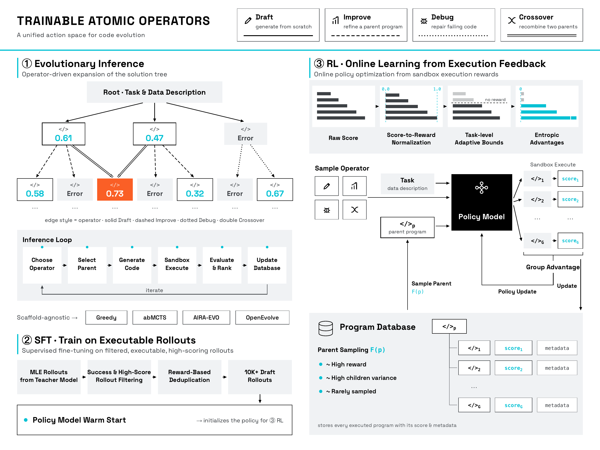
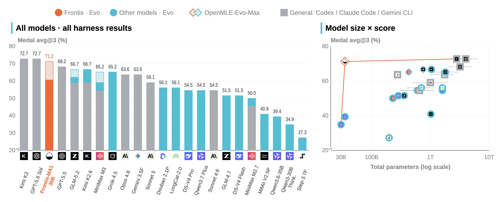

<div align="center">


**Making “AI improving AI” executable, measurable, and reproducible.**

[](LICENSE)
[](https://arxiv.org/abs/2607.28568)
[](https://huggingface.co/papers/2607.28568)
[](https://frontisai.github.io/OpenRSI/)

[](https://huggingface.co/collections/FrontisAI/frontis-ma1)
[](https://huggingface.co/FrontisAI/Frontis-MA1-35B)
[](https://huggingface.co/datasets/FrontisAI/OpenMLE-Tasks)

[📖 OpenRSI](#openrsi) · [🚀 Frontis-MA1](#frontis-ma1) · [🧩 OpenMLE](#openmle) · [📊 Results](#results) · [✨ Getting Started](#getting-started) · [🤝 Contribute](#contribute)

> **FIRST RELEASE · MACHINE LEARNING ENGINEERING**<br>
> **Frontis-MA1 + OpenMLE**

</div>

## 📰 News

- **[2026-08-25]** 🎉 **EEMA (Experience-Evolving Meta Agents)**, a foundational technology behind **OpenMLE-Evo**, has been accepted to the **EMNLP 2026 Main Track**. Congratulations to our collaborators! The related code will be updated in this repository soon.
- **[2026-08-09]** 🧰 We open-sourced **[OpenMLE Sandbox](OpenMLE-Gym/openmle-sandbox/README.md)**, the self-hosted distributed code-execution and automatic-evaluation backend for **OpenMLE-Evo** and **OpenMLE-RL**, with CPU/GPU job scheduling and optional multi-controller routing.
- **[2026-07-31]** 🎉 First OpenRSI release: **Frontis-MA1** ([35B](https://huggingface.co/FrontisAI/Frontis-MA1-35B) / [30B](https://huggingface.co/FrontisAI/Frontis-MA1-30B), with [GGUF](https://huggingface.co/collections/FrontisAI/frontis-ma1) derivatives), the **OpenMLE** stack (Gym / RL / Evo), and the [OpenMLE Tasks](https://huggingface.co/datasets/FrontisAI/OpenMLE-Tasks) and [OpenMLE SFT Traces](https://huggingface.co/datasets/FrontisAI/OpenMLE-SFT-Traces) datasets.
- **[2026-06-25]** 📚 We released our RSI survey: [*Self-Improving Agents in the Era of Experience: A Survey of Self- to Meta-Evolution*](https://openreview.net/pdf?id=IUltZSgLMm) ([paper list](https://github.com/FrontisAI/Awesome-Self-Improving-Agents)) — the conceptual roadmap from self-evolution to meta-evolution behind OpenRSI.
- **[2026-06-23]** 📄 We released **NatureBench**: [*NatureBench: Can Coding Agents Match the Published SOTA of Nature-Family Papers?*](https://arxiv.org/abs/2606.24530) ([code](https://github.com/FrontisAI/NatureBench)) — a benchmark testing whether coding agents can match the published SOTA of Nature-family papers, later used as the held-out transfer benchmark for RSI.

<a id="openrsi"></a>

## 📖 OpenRSI

OpenRSI is Frontis's open initiative for turning “AI improving AI” into an executable engineering problem. It develops AI4AI systems through three connected routes:

- **AI4AI foundation models** that internalize reusable research processes
- **World models and research taste** that identify where additional compute is worth spending
- **Open tasks, environments, and evaluations** that convert real research into scalable training and search pipelines

Search produces experience, experience enters training, and trained models return to search and evaluation. The goal is not a one-off benchmark result, but to make each generation of AI R&D **faster, more efficient, and more capable** in ways that are verifiable and attributable.

> **OpenRSI makes the rate of improvement itself an optimization target.**

The mechanism ladder moves from **Evolution** to **Self-Evolution**, **Meta-Evolution**, and ultimately RSI. OpenRSI begins with Meta-Evolution—training the improver itself in bounded, executable domains—without claiming that general recursive self-improvement has been solved.

<p align="center">
  
</p>

<a id="frontis-ma1"></a>

## 🚀 Frontis-MA1: The First OpenRSI Release

Our first executable domain is **machine learning engineering (MLE)**. MLE provides a concrete setting in which an AI system can draft, improve, debug, and recombine programs; execute them; observe measurable feedback; and learn from the resulting trajectories.

<!-- GitHub only plays videos uploaded via the web editor (user-attachments URL on its own line).
     To update: drag the new mp4 into any GitHub comment/edit box and paste the generated URL here. -->

https://github.com/user-attachments/assets/176247a4-c28e-4e30-b65e-45873a7ae946

<p align="center">
  <sub>Video not playing? <a href="docs/assets/videos/frontis-ma1-openmle-release-teaser.mp4">Download the full-quality release video</a> or watch it on the <a href="https://frontisai.github.io/OpenRSI/">project page</a>.</sub>
</p>

The first release introduces:

- **OpenMLE**, an open full-stack system for executable RSI research in MLE.
- **Frontis-MA1**, a post-trained AI4AI model that acts as a meta-evolution agent for MLE.
- **OpenMLE Tasks**, executable task artifacts and construction pipelines for training and evaluation.

### Paper

**[Frontis-MA1: Training an AI4AI Model towards Recursive Self-Improvement in Machine Learning Engineering](https://arxiv.org/abs/2607.28568)**

[📄 arXiv](https://arxiv.org/abs/2607.28568) · [🤗 Hugging Face Papers](https://huggingface.co/papers/2607.28568)

<details>
<summary><strong>Abstract</strong></summary>

Recursive self-improvement (RSI) requires AI systems that improve the process of building AI (i.e., AI4AI); machine learning engineering (MLE) offers a concrete, executable testbed for studying this capability.

We introduce OpenMLE, an open full-stack system for RSI research in MLE, spanning verifiable task environments with execution feedback (OpenMLE-Gym), operator learning (OpenMLE-RL), and long-horizon search (OpenMLE-Evo). On this stack we post-train Frontis-MA1 (35B) as a meta-evolution agent for MLE, aligning post-training and inference around four atomic program-evolution operators (Draft, Improve, Debug, Crossover): the same operators are trained via execution-grounded SFT and RL on data deduplicated against all evaluation benchmarks, then composed into long-horizon search, coupling learning and evolution in a single loop.

On MLE-Bench Lite under a 12-hour per-task budget on one RTX 4090 capped at 12 GB VRAM, Frontis-MA1 (35B) improves Medal Average from 39.39% to 60.61% over its base model with OpenMLE-Evo, and reaches 71.21% with OpenMLE-Evo-Max (benchmark-independent experience priors and asynchronous search), exceeding GPT-5.5 + Codex and approaching GPT-5.6 Sol and the 2.8T Kimi K3.

On held-out NatureBench Lite, both components transfer: with the framework fixed, swapping in the trained model raises Match-SOTA from 50% to 70%; with the model fixed, swapping in OpenMLE-Evo raises it from 20% to 50%.

We release the model weights and the full OpenMLE stack to enable reproducible research on executable AI4AI toward RSI.

</details>

<a id="openmle"></a>

## 🧩 OpenMLE: The Executable Stack

OpenMLE aligns post-training and inference around a shared action space. The same program-evolution operators are learned from execution-grounded data and composed into long-horizon search.

| Component | Role | Entry point |
| --- | --- | --- |
| **OpenMLE-Gym** | Build, describe, execute, and quality-check verifiable MLE task packages | [`OpenMLE-Gym/`](OpenMLE-Gym/) |
| **OpenMLE-RL** | Learn program-evolution operators through execution-grounded SFT and online RL | [`OpenMLE-ERL/SFT/`](OpenMLE-ERL/SFT/) · [`OpenMLE-ERL/RL/`](OpenMLE-ERL/RL/) |
| **Frontis-MA1** | Apply the learned operators as a meta-evolution agent for MLE | [35B](https://huggingface.co/FrontisAI/Frontis-MA1-35B) · [30B](https://huggingface.co/FrontisAI/Frontis-MA1-30B) |
| **OpenMLE-Evo** | Compose the operators into standard or asynchronous long-horizon search | [`OpenMLE-Evo/`](OpenMLE-Evo/) |

OpenMLE-Evo-Max is the asynchronous multi-GPU search profile inside `OpenMLE-Evo`, not a separate source tree. OpenMLE-RL ships in the [`OpenMLE-ERL/`](OpenMLE-ERL/) directory, which bundles both of its stages: execution-grounded SFT and online RL.

Distributed code execution and automatic evaluation for OpenMLE-Evo and OpenMLE-ERL are provided by [OpenMLE Sandbox](OpenMLE-Gym/openmle-sandbox/README.md), which is maintained as part of OpenMLE-Gym.

### Trainable Atomic Operators

| Operator | Function |
| --- | --- |
| **Draft** | Generate a program from scratch. |
| **Improve** | Refine a parent program using execution feedback. |
| **Debug** | Repair a failing program. |
| **Crossover** | Recombine two parent programs. |

<p align="center">
  
</p>

<a id="results"></a>

## 📊 Results

On MLE-Bench Lite, Frontis-MA1 and OpenMLE separate model improvement from search-system improvement through controlled comparisons:

| Finding | Controlled comparison | Result |
| --- | --- | ---: |
| **Post-training gain** | Base model → Frontis-MA1-35B, OpenMLE-Evo fixed | **39.39% → 60.61%** Medal Average |
| **End-to-end system** | Frontis-MA1-35B + OpenMLE-Evo-Max | **71.21%** Medal Average |
| **Held-out model transfer** | Model swapped, NatureBench adapter fixed | **50% → 70%** Match-SOTA |
| **Held-out framework transfer** | Framework swapped, base model fixed | **20% → 50%** Match-SOTA |

These are **model–harness results**, not standalone one-shot model scores. The OpenMLE-Evo-Max result changes the search system through benchmark-independent experience priors and asynchronous search, and should not be interpreted as a pure model gain.

<p align="center">
  
</p>

See [`docs/results.md`](docs/results.md) for the complete controlled-comparison tables, evaluation protocol, search-efficiency study, long-horizon cases, and interpretation boundaries.

## 📦 Releases

| Artifact | Release | Contents |
| --- | --- | --- |
| **Frontis-MA1 Collection** | [Collection](https://huggingface.co/collections/FrontisAI/frontis-ma1) | All Frontis-MA1 models and OpenMLE datasets in one place |
| **Frontis-MA1-35B** | [Model weights](https://huggingface.co/FrontisAI/Frontis-MA1-35B) · [GGUF](https://huggingface.co/FrontisAI/Frontis-MA1-35B-GGUF) | Canonical BF16 model and GGUF derivative |
| **Frontis-MA1-30B** | [Model weights](https://huggingface.co/FrontisAI/Frontis-MA1-30B) · [GGUF](https://huggingface.co/FrontisAI/Frontis-MA1-30B-GGUF) | Canonical BF16 model and GGUF derivative |
| **OpenMLE SFT Traces** | [Dataset](https://huggingface.co/datasets/FrontisAI/OpenMLE-SFT-Traces) | Supervised trajectories used by Frontis-MA1 |
| **OpenMLE Tasks** | [Dataset](https://huggingface.co/datasets/FrontisAI/OpenMLE-Tasks) | Audited task inventory and releasable task artifacts |
| **OpenMLE-Gym** | [`OpenMLE-Gym/`](OpenMLE-Gym/) | Task construction and evaluation source |
| **OpenMLE-RL** | [`OpenMLE-ERL/`](OpenMLE-ERL/) | SFT and reinforcement-learning source |
| **OpenMLE-Evo** | [`OpenMLE-Evo/`](OpenMLE-Evo/) | Search runtime and benchmark adapters |

See [`docs/release.md`](docs/release.md) for the full artifact map, source boundaries, and external runtime requirements.

<a id="getting-started"></a>

## ✨ Getting Started

```bash
git clone https://github.com/FrontisAI/OpenRSI.git
cd OpenRSI
```

OpenRSI contains several independently runnable stages rather than one synthetic top-level command. Each component manages its own environment and dependencies — start from the one that matches your goal:

| Goal | Start here |
| --- | --- |
| Construct or evaluate executable task packages | [`OpenMLE-Gym/README.md`](OpenMLE-Gym/README.md) |
| Generate or select SFT data and launch supervised training | [`OpenMLE-ERL/SFT/README.md`](OpenMLE-ERL/SFT/README.md) |
| Configure and launch execution-grounded RL | [`OpenMLE-ERL/RL/README.md`](OpenMLE-ERL/RL/README.md) |
| Run OpenMLE-Evo or a benchmark adapter | [`OpenMLE-Evo/README.md`](OpenMLE-Evo/README.md) |

### Quick Start: Run One NatureBench Case Locally

Run a real OpenMLE-Evo search and evaluation loop on
`s42256-023-00611-x` (Categorical Counterfactual Outcome Estimation). The
following smoke profile generates and evaluates one candidate; task data,
generated code, and evaluation stay on the local machine.

```bash
# Continue from the Getting Started commands above.
cd ..
git clone https://github.com/FrontisAI/NatureBench.git
cd OpenRSI/OpenMLE-Evo

python3.12 -m venv .venv
source .venv/bin/activate
python -m pip install -r requirements.txt
conda env create -f environments/naturebench-local.yml

export PRIMARY_KEY='your-api-key'
.venv/bin/python scripts/run_naturebench_local.py \
  --naturebench-repo ../../NatureBench \
  --conda-env naturebench-local \
  --model-base-url https://model.example/v1 \
  --model-id served-model-name \
  --smoke
```

The same runner also supports local or remote SGLang endpoints. Remove
`--smoke` for the full single-task search profile. See the
[local NatureBench tutorial](OpenMLE-Evo/benchmarks/naturebench_local_quick/README.md)
for SGLang commands, the four-hour search budget, advanced overrides, and the
local-execution security boundary, then read the
[example trajectory analysis](OpenMLE-Evo/benchmarks/naturebench_local_quick/RESULTS.md)
for score attribution and optimization dynamics.

Model weights, task artifacts, training corpora, external benchmark environments, service credentials, and private infrastructure configuration are distributed separately from this source repository.

## 🗂️ Repository Contents

```text
.
├── assets/                  # Figures and Frontis branding
├── docs/                    # Project page, results, training, and release scope
├── OpenMLE-Gym/             # Executable task construction and evaluation
├── OpenMLE-ERL/
│   ├── SFT/                 # Rollout collection, selection, and SFT
│   └── RL/                  # Execution-grounded reinforcement learning
├── OpenMLE-Evo/             # Long-horizon search and benchmark adapters
├── LICENSE
└── NOTICE
```

## 📚 Documentation

| Document | Contents |
| --- | --- |
| [Interactive project page](https://frontisai.github.io/OpenRSI/) | Visual overview, release artifacts, results, and project video |
| [`docs/results.md`](docs/results.md) | Result tables, evaluation protocol, and comparison boundaries |
| [`docs/training.md`](docs/training.md) | Task pipeline, supervised corpus, and reinforcement-learning summary |
| [`docs/release.md`](docs/release.md) | Public artifact map, dependencies, and release boundaries |
| [`OpenMLE-Gym/docs/usage.md`](OpenMLE-Gym/docs/usage.md) | Task construction, metadata, evaluation, and smoke workflow |
| [`OpenMLE-ERL/SFT/docs/usage.md`](OpenMLE-ERL/SFT/docs/usage.md) | Rollout generation, selection, and supervised training |
| [`OpenMLE-ERL/RL/docs/usage.md`](OpenMLE-ERL/RL/docs/usage.md) | RL configuration, launch profiles, and validation |
| [`OpenMLE-Evo/docs/usage.md`](OpenMLE-Evo/docs/usage.md) | Installation, configuration, launch, resume, and outputs |
| [`OpenMLE-Evo/docs/validation.md`](OpenMLE-Evo/docs/validation.md) | Source-level and runtime validation boundary |

<a id="contribute"></a>

## 🤝 Build OpenRSI with Us

OpenRSI is intended to be built in the open. We welcome contributions that make AI4AI research more executable and more reproducible:

- Real research tasks, isolated environments, and verifiable evaluators
- Research trajectories, experience corpora, and deduplication methods
- Operator learning, long-horizon search, and credit-assignment methods
- AI4AI world models and rewards for research judgment
- Transfer benchmarks and executable industrial-domain problems

[Open an issue](https://github.com/FrontisAI/OpenRSI/issues) to propose a task, method, benchmark, reproduction, or collaboration.

## 🎈 Citation

**Frontis-MA1: Training an AI4AI Model towards Recursive Self-Improvement in Machine Learning Engineering**

```bibtex
@misc{yang2026frontisma1trainingai4aimodel,
  title={Frontis-MA1: Training an AI4AI Model towards Recursive Self-Improvement in Machine Learning Engineering},
  author={Junlin Yang and Che Jiang and Yu Fu and Tianwei Luo and Can Ren and Weizhi Wang and Kaikai Zhao and Hongyi Liu and Yuxin Zuo and Yuru Wang and Yuchen Fan and Kai Tian and Zhenzhao Yuan and Xiaojian Lin and Li Sheng and Rushi Qiang and Guoli Jia and Xingtai Lv and Ermo Hua and Dianqiao Lei and Youbang Sun and Ning Ding and Bowen Zhou and Kaiyan Zhang},
  year={2026},
  eprint={2607.28568},
  archivePrefix={arXiv},
  primaryClass={cs.CL},
  url={https://arxiv.org/abs/2607.28568},
}
```

## ⚖️ License

Original OpenRSI and OpenMLE material in this repository is released under [CC BY-NC 4.0](LICENSE) for attribution-required, non-commercial use. Commercial use is not granted by this license.

Third-party components and dependencies retain their own terms; see [NOTICE](NOTICE).

## 🙏 Acknowledgements

We thank the communities behind Qwen, SLIME, Ray, SGLang, Megatron-LM, Transformers, MLE-Bench, NatureBench, and the broader executable AI4AI ecosystem.

## Star History

<a href="https://www.star-history.com/?repos=FrontisAI%2FOpenRSI&type=date&legend=top-left">
 <picture>
   <source media="(prefers-color-scheme: dark)" srcset="https://api.star-history.com/chart?repos=FrontisAI/OpenRSI&type=date&theme=dark&legend=top-left&sealed_token=UWbC_3WnIT3WDncJggzeSTAlJGo18V4FuMpMk_g3mE4bJ4Wf-8gJbcqVJjIIYMkrsCgnZOSiAOdeY7zdVmumjZxTDEMDQ54DVIw7xBdh39hvcZTqtHr76w" />
   <source media="(prefers-color-scheme: light)" srcset="https://api.star-history.com/chart?repos=FrontisAI/OpenRSI&type=date&legend=top-left&sealed_token=UWbC_3WnIT3WDncJggzeSTAlJGo18V4FuMpMk_g3mE4bJ4Wf-8gJbcqVJjIIYMkrsCgnZOSiAOdeY7zdVmumjZxTDEMDQ54DVIw7xBdh39hvcZTqtHr76w" />
   
 </picture>
</a>
