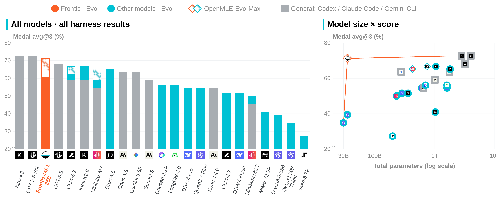

# Paper Results

This document collects the detailed result tables and evaluation boundaries for *Frontis-MA1: Training an AI4AI Model towards Recursive Self-Improvement in Machine Learning Engineering*. The repository [README](../README.md) keeps only the visual summary.

## Evaluation protocol

Unless otherwise stated, OpenMLE-Evo configurations use the official 22-task MLE-Bench Lite split, three independent runs, and a per-task sandbox-compute budget of 12 hours on one NVIDIA RTX 4090 capped at 12 GB VRAM.

- **Valid Rate** is the mean number of the 22 tasks with a valid submission.
- **Medal Average** is the mean fraction of tasks receiving a Kaggle medal.
- **Human Rank** is the mean fraction of human leaderboard participants surpassed by the selected submission.

All three metrics are higher-is-better.

## Controlled model and search gains

The base and Frontis-MA1 rows below use the same OpenMLE-Evo harness. Those paired rows isolate post-training within that harness. OpenMLE-Evo-Max changes the search system by adding MLE-Bench-disjoint experience priors and asynchronous multi-GPU search while keeping total sandbox compute fixed.

| Model | Harness | Valid Rate ↑ | Medal Average ↑ | Human Rank ↑ |
| --- | --- | ---: | ---: | ---: |
| Qwen3-30B-A3B-Thinking-2507 | OpenMLE-Evo | 17.33/22 | 34.85% | 0.5573 |
| **Frontis-MA1-30B** | OpenMLE-Evo | **21.67/22** | **53.03%** | **0.7055** |
| **Frontis-MA1-30B** | OpenMLE-Evo-Max | **22.00/22** | **66.67%** | **0.8053** |
| Qwen3.6-35B-A3B | OpenMLE-Evo | 19.67/22 | 39.39% | 0.5828 |
| **Frontis-MA1-35B** | OpenMLE-Evo | **21.67/22** | **60.61%** | **0.7647** |
| **Frontis-MA1-35B** | OpenMLE-Evo-Max | **22.00/22** | **71.21%** | **0.8126** |

The strongest controlled model effects are:

| Fixed harness comparison | Δ Valid Rate | Δ Medal Average | Δ Human Rank |
| --- | ---: | ---: | ---: |
| Frontis-MA1-30B vs. its base, OpenMLE-Evo fixed | +4.34 tasks | +18.18 pp | +0.1482 |
| Frontis-MA1-35B vs. its base, OpenMLE-Evo fixed | +2.00 tasks | +21.22 pp | +0.1819 |

These are **model–harness results**, not standalone one-shot model scores. The OpenMLE-Evo-Max rows are end-to-end system results and must not be presented as pure model gains.

## Search-system comparisons

Holding the model fixed, the paper compares general-purpose coding harnesses, original AIRA-Evo, OpenMLE-Evo, and OpenMLE-Evo-Max.

| Model | Harness | Valid Rate ↑ | Medal Average ↑ | Human Rank ↑ |
| --- | --- | ---: | ---: | ---: |
| Frontis-MA1-35B | Original AIRA-Evo | — | 53.03% | — |
| Frontis-MA1-35B | OpenMLE-Evo | 21.67/22 | **60.61%** | 0.7647 |
| GLM-5.2 | Claude Code | 21.00/22 | 59.09% | 0.7948 |
| GLM-5.2 | OpenMLE-Evo | 19.67/22 | 62.12% | 0.7069 |
| GLM-5.2 | OpenMLE-Evo-Max | 22.00/22 | **66.67%** | **0.8164** |
| MiniMax M3 | Codex | 22.00/22 | 54.55% | 0.7099 |
| MiniMax M3 | OpenMLE-Evo | 22.00/22 | 59.09% | 0.7994 |
| MiniMax M3 | OpenMLE-Evo-Max | 22.00/22 | **65.15%** | **0.8007** |

The matched rows support a harness-level claim: domain-specific evolutionary search can improve an end-to-end MLE system for a fixed model. They do not rank the underlying models independently of their harnesses.

  

The vertical axes begin at 20%. Orange denotes Frontis-MA1, cyan denotes other models using OpenMLE-Evo, hatching denotes OpenMLE-Evo-Max, and gray denotes general-purpose coding harnesses. The tables above remain the source for exact controlled-comparison values.

## Search efficiency against original AIRA-Evo

On 66 matched task–runs using the same Frontis-MA1-35B checkpoint, seed, and 12-hour task budget, OpenMLE-Evo evaluates slightly fewer nodes while using substantially shorter contexts and fewer model tokens.

| Metric | Original AIRA-Evo | OpenMLE-Evo | Change |
| --- | ---: | ---: | ---: |
| Total model tokens | 129.3M | 75.3M | -41.7% |
| Prompt tokens | 83.5M | 41.5M | -50.3% |
| Evaluated nodes | 3,430 | 3,004 | -12.4% |
| New-best validation updates | 229 | 246 | +7.4% |
| New-best updates / 1M model tokens | 1.77 | 3.27 | +84.3% |
| Improve calls that establish a new best | 44/931 (4.73%) | 72/769 (9.36%) | +4.63 pp |

The paper characterizes efficiency with token use, context length, and validation-trajectory productivity—not wall-clock speed.

## Long-horizon case studies

Two task-level trajectories test whether useful progress continues after an executable solution has already been found.

| Task | Validation Human Rank | Held-out Human Rank | Medal | Validation gain from later Improve/Crossover |
| --- | ---: | ---: | --- | ---: |
| `leaf-classification` | 0.7713 | 0.9455 | Bronze | 85.0% |
| `mlsp-2013-birds` | 0.7284 | 0.8889 | Silver | 91.9% |

These traces support the mechanism claim that later refinement and recombination can dominate total improvement in the analyzed cases. They are case studies, not additional aggregate benchmark scores.

## Transfer to NatureBench Lite

NatureBench Lite uses a fixed 10-task subset spanning all six NatureBench scientific domains. It retains the hidden evaluator, web-search-disabled setting, and four-hour search budget. **Surpass-SOTA** counts tasks with direction-normalized gap `g > 0.1`; **Match-SOTA** counts tasks with `g ≥ 0`.

| Model | Harness | Surpass-SOTA ↑ | Match-SOTA ↑ |
| --- | --- | ---: | ---: |
| **Frontis-MA1-35B** | OpenMLE-Evo NatureBench adapter | **30.0% (3/10)** | **70.0% (7/10)** |
| Qwen3.6-35B-A3B | OpenMLE-Evo NatureBench adapter | 20.0% (2/10) | 50.0% (5/10) |
| Qwen3.6-35B-A3B | Original AIRA-Evo | 10.0% (1/10) | 20.0% (2/10) |

Holding the adapter fixed isolates a 10-point Surpass-SOTA and 20-point Match-SOTA gain from the post-trained model. Holding the base model fixed isolates 10-point and 30-point gains from the adapted search framework. Because this study has only ten tasks, it is focused transfer evidence rather than a claim about the full 90-task benchmark or general scientific autonomy.
