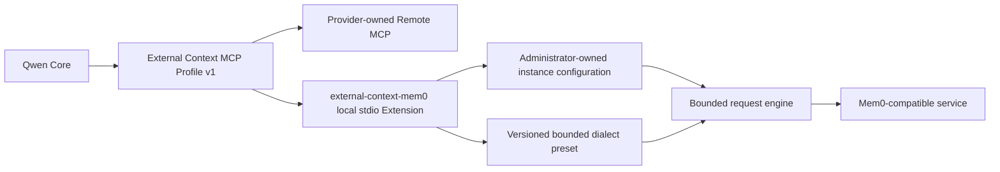

# Configurable Mem0 Provider Extension

**Status:** Partially implemented through PR1 (no live presets)

**Date:** 2026-08-26

**Related profile:**
[External Context Provider Extensions](./external-context-provider-extensions.md)

**Related implementation proposal:**
[PR #9952](https://github.com/QwenLM/qwen-code/pull/9952)

## Decision

Mem0-compatible services integrate through a self-contained local stdio
Extension named `external-context-mem0`. The Extension implements External
Context MCP Profile v1 and translates the fixed `context_search({ query })`
contract into a bounded, versioned REST dialect selected by administrator
configuration.

External Context MCP Profile v1 remains the only public Qwen interoperability
boundary. Qwen Core does not gain a provider registry, a public provider SDK,
dynamic module loading, or new third-party cases in its private
`ProviderConfig` union. The existing direct `mem0-platform-v3` integration
remains available for compatibility, but it does not become a registry for
Mem0 product variants.

This document defines the architecture and compatibility policy. PR1 adds the
self-contained runtime skeleton, configuration schemas, packaging, and
synthetic contract tests. Live provider presets and provider-specific tests
remain later rollout steps.

## Goals

- Add common Mem0-compatible REST services through versioned preset data rather
  than Qwen Core changes.
- Keep the model-facing contract stable as `context_search({ query })` while
  endpoint, credential, scope, timeout, and dialect remain operator-owned.
- Give providers whose protocols do not fit the bounded REST grammar a clear
  path to publish their own local or remote MCP Extension.
- Preserve the current direct integration while a portable retrieval-only path
  is introduced incrementally.

## Non-goals

- Include live provider presets, provider-specific adapters, or
  provider-specific tests in PR1.
- Define a dynamic provider ABI, arbitrary request templates, JSONPath,
  scripting, or custom executable hooks.
- Probe V3, V2, and V1 endpoints automatically or silently fall back between
  product versions.
- Add memory creation, update, deletion, or Auto Recall behavior to the
  portable Extension.
- Migrate or remove the existing direct External Context provider.

## Architecture



The local Extension owns the HTTP translation and ships as a self-contained
artifact. Qwen sees only the MCP profile. A service with a protocol outside the
bounded grammar owns a separate MCP implementation instead of extending the
grammar or Qwen Core.

## Version model

Four independent version axes must remain explicit:

1. **MCP Profile version** defines the Qwen-to-Extension tool contract. This
   proposal implements External Context MCP Profile v1.
2. **Instance schema version** defines the operator configuration shape, such
   as `schemaVersion: 1`.
3. **Dialect version** defines preset interpretation, such as
   `dialectVersion: 1`.
4. **Upstream product or API version** belongs to the provider and may differ
   between operations in one product.

An upstream product must not be labeled simply "V1", "V2", or "V3" at the
Extension boundary. For example, a Hologres long-memory deployment can expose
a mixture of versioned operation paths; its preset records the exact verified
contract for each operation.

## Instance configuration

An instance selects one immutable preset and supplies deployment-specific
values. The following shape is illustrative; PR1's published canonical schema
is authoritative.

```json
{
  "schemaVersion": 1,
  "preset": "aliyun-polardb-mysql-2026-08",
  "endpoint": {
    "origin": "http://10.0.0.8:8080",
    "basePath": "",
    "allowInsecureHttp": true
  },
  "credentialEnv": "MEMORY_API_KEY",
  "scope": {
    "userId": "repository-memory",
    "agentId": "qwen-code"
  },
  "timeoutMs": 5000
}
```

The endpoint is split into an origin and a base path so the implementation can
validate the authority separately from path joining. Credentials are
referenced by environment-variable name and are never stored in this document.
Scope values are fixed operator input, not tool arguments. A preset declares
which of `userId`, `agentId`, and `appId` it consumes; startup validation
rejects a missing required value or a configured value that the preset does
not use. For example, a Mem0 Platform V3 instance uses
`"scope": { "appId": "shared-repository" }` instead of the PolarDB-oriented
scope above.

### Configuration ownership and loading

One environment variable, `QWEN_EXTERNAL_CONTEXT_MEM0_CONFIG`, points to the
absolute path of the instance JSON file. The local Extension reads and
validates that file once at startup and fails closed before exposing its tool
when the path is relative, the file is unavailable, the schema is unsupported,
or the selected preset is unknown. The instance file can name the environment
variable holding a credential, but cannot contain the credential value.

An Extension setting may populate this non-secret path after its
installation-to-child-process behavior is covered by E2E. Managed deployments
instead supply it through an administrator-owned launcher, system settings, or
pinned MCP configuration. Repository-controlled configuration is trusted only
when the repository itself is inside the deployment's trust boundary.

Each MCP server instance binds exactly one endpoint, preset, and scope. A
deployment that needs several memory services registers separately named MCP
server instances. The model does not choose or switch the provider for a call.

## Dialect presets

A preset describes only the small set of differences required to issue a
retrieval request and normalize its response. For example:

```json
{
  "dialectVersion": 1,
  "id": "aliyun-polardb-mysql-2026-08",
  "auth": "authorization-token",
  "search": {
    "method": "POST",
    "path": "/v2/memories/search",
    "queryLocation": "json",
    "userIdLocation": "json.filters",
    "agentIdLocation": "json",
    "appIdLocation": "omit",
    "limitField": "limit"
  },
  "response": {
    "collection": "results",
    "idField": "id",
    "contentField": "memory",
    "titleField": "omit",
    "uriField": "omit",
    "scoreField": "score",
    "updatedAtField": "omit"
  }
}
```

The initial grammar is deliberately closed:

- Authentication is one of `authorization-token`, `authorization-bearer`, or
  `x-api-key`.
- Search uses `GET` or `POST`.
- Query, user, agent, and app values use only `json`, `json.filters`, `query`,
  or `omit` locations supported by the relevant field. Their request names are
  selected from an explicit allowlist such as `query`, `user_id`, `agent_id`,
  and `app_id`.
- Result limits use `top_k`, `limit`, or `omit`.
- Response collections are `results` or a root array.
- Identifier fields are selected from known simple names such as `id` and
  `memory_id`; content fields are selected from `memory`, `content`, and
  `text`. Other normalized fields follow the same explicit allowlist model.
- Optional behaviors such as `threshold` and `rerank` are typed preset fields,
  not free-form request fragments.
- Request paths are static exact paths. Path joining preserves a required
  trailing slash.

Presets cannot define arbitrary headers, body interpolation, JSONPath, code,
environment-variable expansion, redirects, or response transformations. If a
new service requires one of those capabilities, it does not fit this grammar.

Built-in preset identifiers include a provider and a stable contract version,
for example:

- `mem0-platform-v3`
- `mem0-oss-rest-2026-08`
- `aliyun-polardb-mysql-2026-08`
- `aliyun-hologres-mem0-2.0.6`
- `aliyun-rds-postgresql-memory-2026-08`

The names above reserve design intent; each preset lands only after its exact
request and response contract is verified. A published identifier never
silently changes to an incompatible mapping. A breaking mapping receives a new
identifier.

## Adding another service

The integration decision is mechanical:

1. If the service fits the bounded grammar, add a versioned preset and contract
   fixtures to the Extension package. Qwen Core does not change.
2. If the service does not fit the grammar but can implement External Context
   MCP Profile v1, publish a separate local or remote MCP Extension. Qwen Core
   still does not change.
3. Change the profile only when multiple independent implementations prove a
   missing interoperable capability. A single provider exception is not
   sufficient.

A later implementation may accept an administrator-owned custom preset file
for retrieval-only deployments. Such a file must use an absolute path, pass
the same closed schema and semantic validation as built-in presets, and contain
neither credentials nor executable behavior. Custom presets do not expand the
grammar and cannot enable write operations.

This keeps new data sources configurable where their differences are data, and
plugin-owned where their differences require behavior. It avoids making every
new provider a Qwen release while also avoiding an unbounded HTTP programming
language in configuration.

## Security and failure behavior

- The model supplies only `query`. It cannot select the endpoint, credential,
  user, agent, filter, dialect, timeout, or result limit.
- Credentials are read from the named process environment variable. Presets
  and instance configuration never contain credential values.
- HTTPS is required by default. Plain HTTP requires an explicit
  `allowInsecureHttp` opt-in intended for trusted private networks.
- Endpoint validation treats `origin` and `basePath` separately and rejects
  embedded credentials, query strings, fragments, dot traversal, and encoded
  traversal.
- The request engine does not follow redirects, retry requests, probe protocol
  versions, or cache provider responses.
- The provider timeout is shorter than the enclosing MCP timeout so the
  Extension can return a bounded error. A provider response is capped at 1 MiB
  before parsing.
- Error results redact the query, endpoint, credential, upstream response body,
  and raw exception. Retrieved content remains untrusted external context.
- Fixed `userId`, `agentId`, and `appId` values are routing values, not
  authorization boundaries. Shared multi-user deployments should use a
  provider-operated Remote MCP service with OAuth subject binding and
  provider-side authorization.
- Managed deployments enforce the exact Extension and environment through
  operator-owned system settings or pinned MCP configuration. An Extension is
  a distribution unit, not a security binding or sandbox; a local Extension
  runs with the Qwen process user's privileges.

## Retrieval and write boundary

The portable Mem0 Extension v1 manifest exposes exactly:

```json
{
  "includeTools": ["context_search"]
}
```

Memory creation, update, and deletion require a separate future profile or
Extension. A custom preset cannot enable them. Write protocols differ in
idempotency, duplicate handling, ambiguous timeout outcomes, asynchronous
status, inference behavior, and identifier formats; treating them as another
search mapping would hide data-loss and duplication risks.

## Relationship to PR #9952

[PR #9952](https://github.com/QwenLM/qwen-code/pull/9952) provides useful
PolarDB protocol and test evidence. This proposal is independent of that
branch and does not add a `polardb-mem0` case to the private `ProviderConfig`
union.

A later Extension implementation can port verified request fixtures and
normalization cases without cherry-picking the full provider-specific change.
If PR #9952 merges first, its behavior remains backward-compatible until a
separate migration decision. If it does not merge, superseding it with the
Extension requires an explicit maintainer decision; this design document alone
does not make that decision.

## Rollout

1. **PR0:** Land this architecture decision and its link from the External
   Context provider-extension proposal. No runtime behavior changes.
2. **PR1:** Add the self-contained Extension skeleton, canonical instance and
   dialect schemas, the bounded request engine, and contract tests against
   synthetic fixtures. Do not enable a live provider.
3. **PR2:** Add verified retrieval presets for Mem0 Platform V3 and PolarDB
   MySQL.
4. **PR3:** Add Hologres, Mem0 OSS, RDS PostgreSQL, and other presets only after
   each contract is verified independently.
5. Design any portable write capability separately.

Each implementation pull request remains independently reviewable and can be
rolled back by disabling or uninstalling the Extension. No step silently
migrates existing direct-provider configuration.

## PR0 verification

PR0 changes documentation only. It introduces no user-visible behavior and
does not require an E2E plan. Verification consists of Markdown formatting,
link consistency, `git diff --check`, and two consecutive clean design audits
covering architecture boundaries, failure paths, compatibility,
maintainability, complexity, security, testing strategy, and simpler
alternatives.

## PR1 verification

PR1 keeps the built-in preset registry empty, so the shipped Extension fails
closed instead of enabling a live provider. Verification covers the canonical
schemas, startup configuration boundary, bounded request engine, normalized
result profile, MCP tool surface, package build and typecheck, release wiring,
and synthetic GET and POST dialect fixtures. Live provider verification
belongs to the pull request that adds each preset.
