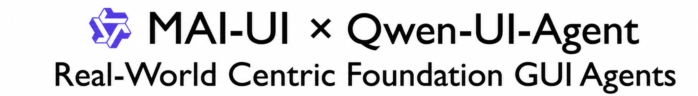
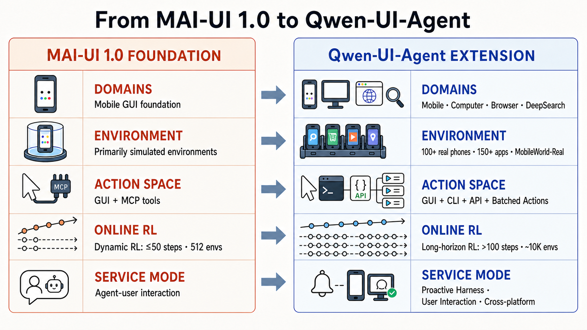
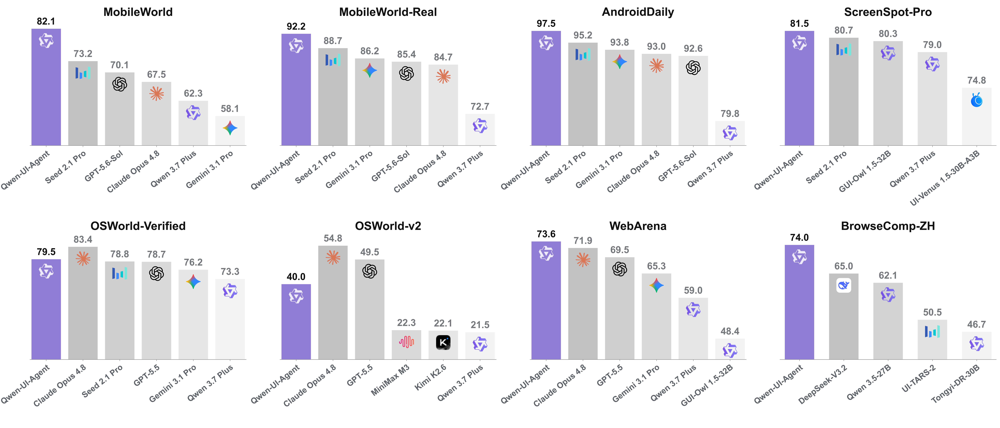
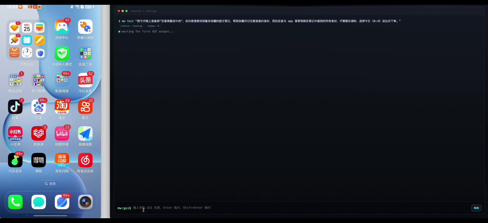
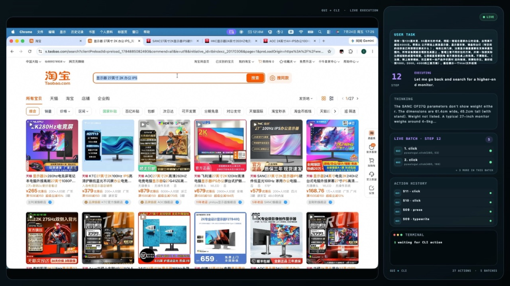
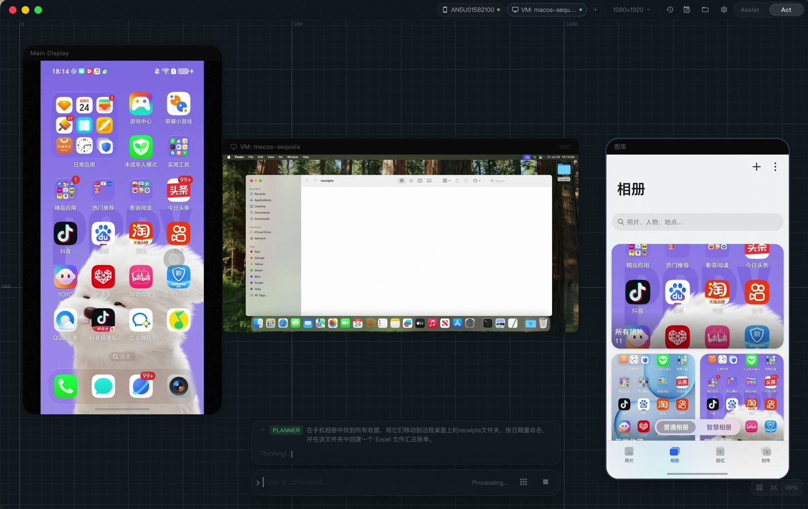
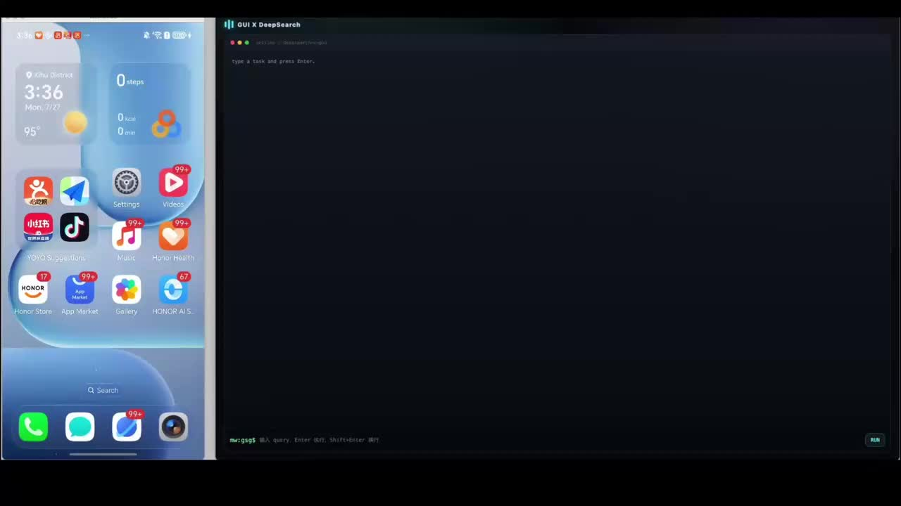
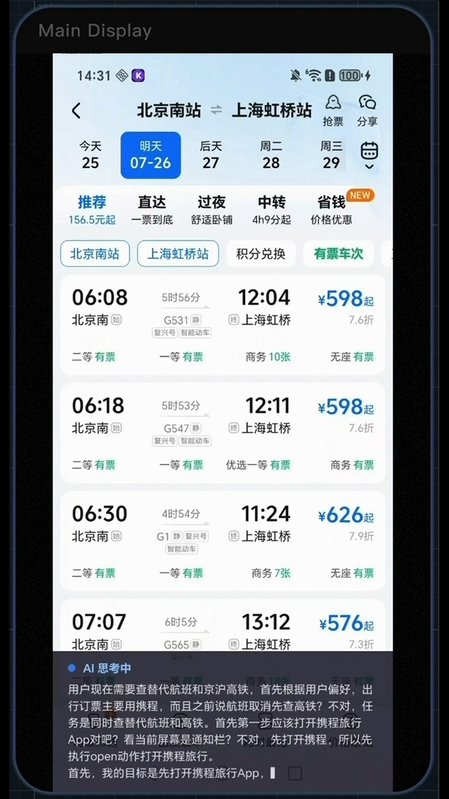

<p align="center">
  <a href="https://tongyi-mai.github.io/Qwen-UI-Agent">
    
  </a>
</p>

<p align="center">
  <a href="https://tongyi-mai.github.io/Qwen-UI-Agent/"></a>
  <a href="https://tongyi-mai.github.io/Qwen-UI-Agent/Qwen-UI-Agent-Technical-Report.pdf"></a>
  <a href="https://arxiv.org/abs/2607.28227"></a>
  <a href="https://tongyi-mai.github.io/MAI-UI-blog/"></a>
  <a href="https://tongyi-mai.github.io/MobileWorld/"></a>
</p>

<p align="center">
  
</p>

We present **Qwen-UI-Agent**, a real-world-centric foundation GUI agent that unifies **mobile**, **computer**, **browser**, and **DeepSearch** scenarios in a single model. Our core contributions include:

- 📱 **Real-device training & evaluation**: We build a live mobile environment of **100+** physical smartphones covering **150+** apps for task construction, trajectory collection, training, and evaluation, together with **MobileWorld-Real**, a self-built real-device benchmark (**400+** tasks across **100+** apps) that closes the sim-to-real gap.

- ⌨️ **Hybrid GUI + CLI action space with batched actions**: Beyond GUI operations, the agent directly executes Bash commands and emits multiple actions in a single decision. In computer-use tasks, CLI commands and GUI clicks emerge as the two dominant action types, and ~**40%** of action outputs are batched.

- 📈 **Scalable long-horizon online RL**: We run online reinforcement learning over trajectories exceeding **100** steps, with ~**10,000** parallel environments rolling out concurrently to accelerate rollout generation.

- 🔄 **AutoResearch-style data flywheel**: Agents construct tasks, environments, and verifiers, diagnose failures, and plan subsequent iterations, significantly reducing human effort in capability iteration.

- 🔔 **Proactive service & cross-platform workflows**: A harness layer enables the agent to proactively initiate tasks from real-world signals (e.g., a flight-cancellation notification), present decision-ready plans for user confirmation, and execute stateful workflows across mobile and computer.

- 🏆 **State-of-the-art performance**: **82.1%** on MobileWorld, **92.2%** on MobileWorld-Real, **97.5%** on AndroidDaily, **79.5%** on OSWorld-Verified, **40.0%** (partial score) on OSWorld-v2, **73.6%** on WebArena, and **81.5%** on ScreenSpot-Pro.

<p align="center">
  
  <br>
  <em>Qwen-UI-Agent performance across eight GUI benchmarks</em>
</p>

## Projects

- [**Qwen-UI-Agent**](./Qwen-UI-Agent/) — continuation work of MAI-UI. Visit the [project website](https://tongyi-mai.github.io/Qwen-UI-Agent).
- [**MAI-UI 1.0**](./MAI-UI/) — original MAI-UI repository content. Visit the [project website](https://tongyi-mai.github.io/MAI-UI-blog/).

## 📰 News

* **[2026-07-30]** 🚀 **Introducing Qwen-UI-Agent**: Our follow-up work, [**Qwen-UI-Agent**](https://tongyi-mai.github.io/Qwen-UI-Agent), extends MAI-UI into a real-world centric foundation GUI agent spanning **mobile, computer-use, web, and DeepSearch** environments. It unifies GUI operations with CLI execution in a single action space, emits batched actions per model turn, and is trained with online RL on trajectories exceeding **100 turns** across over **10,000 concurrent environments**. Qwen-UI-Agent achieves **82.1%** on MobileWorld, **92.2%** on MobileWorld-Real, **97.5%** on AndroidDaily, **79.5%** on OSWorld-Verified, **73.6%** on WebArena, **75.0%** on BrowseComp-ZH, and **81.5%** on ScreenSpot-Pro — competitive with or surpassing frontier models including Claude Opus 4.8, Gemini 3.1 Pro, and GPT-5.6 Sol.
* **[2026-03-20]** 📄 **Blog Posts**: Our [Grounding](https://tongyi-mai.github.io/MAI-UI-blog/Grounding-Blog) and [Navigation](https://tongyi-mai.github.io/MAI-UI-blog/MobileWorld-Blog-Post) Blog Posts are available now!
* **[2026-01-15]** 🥇 **New Record on AndroidWorld**: MAI-UI-235B takes #1 on the [AndroidWorld Leaderboard](https://docs.google.com/spreadsheets/d/1cchzP9dlTZ3WXQTfYNhh3avxoLipqHN75v1Tb86uhHo/edit?gid=0#gid=0) for pure-vision, end-to-end models with a 76.7% success rate.
* **[2026-01-13]** 🥇 **MAI-UI Sweeps ScreenSpot-Pro**: MAI-UI (32B, 8B, 2B) now ranks #1 in all size categories on the [ScreenSpot-Pro leaderboard](https://gui-agent.github.io/grounding-leaderboard/). We achieved record scores of 67.9%, 65.7%, and 57.4% respectively—notably reaching these benchmarks **without any zoom-in tricks**.
* **[2026-01-04]** 🤝 We're Hiring! We're actively looking for Research Scientists, Engineers, and Interns to work on foundational GUI agents and their applications. Interested candidates please send your resume to: yue.w@alibaba-inc.com
* **[2025-12-29]** 🏆 **New Leaderboard Record**: MAI-UI achieves a 41.7% success rate on the [MobileWorld](https://tongyi-mai.github.io/MobileWorld/#leaderboard) benchmark, setting a new record for end-to-end model performance!
* **[2025-12-29]** 📄 **Technical Report & Website**: Our technical report is now available on [arXiv](https://arxiv.org/abs/2512.22047), and the official project [website](https://tongyi-mai.github.io/MAI-UI-blog/) is live.
* **[2025-12-29]** 🤗 **Model Release**: We are excited to release the weights for [MAI-UI-8B](https://huggingface.co/Tongyi-MAI/MAI-UI-8B) and [MAI-UI-2B](https://huggingface.co/Tongyi-MAI/MAI-UI-2B) on Hugging Face.

## 📑 Table of Contents

- [🎥 Demo](#-demo)
- [📝 Citation](#-citation)
- [📧 Contact](#-contact)
- [📄 License](#-license)

## 🎥 Demo

Explore all interactive examples on the [Qwen-UI-Agent project website](https://tongyi-mai.github.io/Qwen-UI-Agent/#demos). Click a preview below to watch the corresponding demo.

### Demo 1 - Real-device Mobile Use

**Recipe research + e-shopping**

The agent extracts a recipe and its ingredients from Douyin, then carries that information into Hema to complete a time-constrained grocery order.

> **User instruction:** I’m planning to make “passion-fruit sour-soup beef” tonight. Search Douyin for the most-saved photo-and-text post, save it, and remember the ingredients I need to prepare. Then, in the Hema app, purchase all the ingredients mentioned in the post—excluding seasonings—select delivery for 18:45 today, and place the order.

<p align="center">
  <a href="https://tongyi-mai.github.io/Qwen-UI-Agent/demos/source/mobile-gui-shopping-hd.mp4">
    
  </a>
</p>

### Demo 2 - Computer Use

**Home-office setup + scaled layout**

The agent researches products across public websites, checks price, compatibility, and physical dimensions, then produces three source-linked plans and a to-scale HTML desk layout.

> **User instruction:** I have a 120 × 60 cm desk and want a home-office setup with a total budget no more than CNY 4,000. Using public websites, compare several monitors, monitor arms, keyboards, and desk lamps in each category, and add other useful items if space allows. Ensure every monitor is within its arm’s weight capacity and that all equipment fits reasonably on the desk. Prepare three value-focused plans at approximately CNY 1,000, CNY 2,000, and CNY 4,000, with recommendation rationales, product reviews, and corresponding links. Draw each desktop layout to scale so I can see how it fits. Do not purchase anything. Present the final result as an HTML file.

<p align="center">
  <a href="https://tongyi-mai.github.io/Qwen-UI-Agent/demos/source/computer-use-home-office-hd.mp4">
    
  </a>
</p>

### Demo 3 - Cross-device GUI Use

**Mobile receipts → PC expense report**

The agent finds receipt images on the phone, transfers and renames them in the designated PC folder, then extracts the details into a consolidated Excel expense report.

> **User instruction:** Locate and organize receipt images in the photo gallery, transfer them to the designated PC directory, and generate a consolidated expense report from the receipt details.

<p align="center">
  <a href="https://tongyi-mai.github.io/Qwen-UI-Agent/demos/source/cross-device-mobile-receipts-pc-hd.mp4">
    
  </a>
</p>

### Demo 4 - Mobile Use + Deep Research

**Weight-loss fact-check → Douyin comment**

The agent extracts claims from a live social video, verifies them against papers and authoritative health sources, then returns to the mobile app to write an evidence-aware response.

> **User instruction:** First, open Douyin and find a video discussing evidence-based weight loss, then identify its main claims. Search for relevant research papers, official sources, and authoritative health information to determine whether the video contains any false or misleading statements or omits important conditions and caveats. After completing the verification, return to Douyin. If the video contains false or misleading information, write a comment that identifies the specific issue and briefly explains the supporting evidence. If the content is largely accurate, write a comment that acknowledges its main points while adding any necessary conditions or caveats.

<p align="center">
  <a href="https://www.bilibili.com/video/BV1mt3C6AEJm/">
    
  </a>
</p>

### Demo 5 - Proactive Service

**Cancelled flight → alternatives**

The agent detects a cancellation in the notification stream, opens live travel services, compares air and rail inventory, and returns ranked alternatives without booking on the user’s behalf.

> **User instruction:** When a notification says that CA1517 from Beijing Capital T3 to Shanghai Hongqiao T2 on July 26 has been cancelled, proactively find alternative flights and high-speed trains from Beijing to Shanghai. Compare departure and arrival times, fares, seat availability, and reliability; recommend options that still arrive before the user’s 14:00 CTO presentation, and leave the final booking choice to the user.

<p align="center">
  <a href="https://tongyi-mai.github.io/Qwen-UI-Agent/demos/source/proactive-flight-recovery-hd.mp4">
    
  </a>
</p>

## 📝 Citation

If you find this project useful for your research, please consider citing our works:

```bibtex
@article{zhou2026qwen_ui_agent,
  title={{Qwen-UI-Agent} Technical Report: Toward Next-Generation Real-World Centric Foundation {GUI} Agents},
  author={Zhou, Hanzhang and Tong, Panrong and Zhang, Xu and Kong, Quyu and Cai, Chenglin and Xia, Tianyu and Zhang, Gongjie and Zhang, Jianan and Li, Long and Chen, Long and Wang, Lei and Dai, Gaole and Li, Pengxiang and Chen, Liangyu and Wang, Yue and Hoi, Steven},
  journal={arXiv preprint arXiv:2607.28227},
  year={2026}
}

@article{zhou2025mai,
  title={MAI-UI Technical Report: Real-World Centric Foundation GUI Agents},
  author={Zhou, Hanzhang and Zhang, Xu and Tong, Panrong and Zhang, Jianan and Chen, Liangyu and Kong, Quyu and Cai, Chenglin and Liu, Chen and Wang, Yue and Zhou, Jingren and others},
  journal={arXiv preprint arXiv:2512.22047},
  year={2025}
}
@article{kong2025mobileworld,
  title={MobileWorld: Benchmarking Autonomous Mobile Agents in Agent-User Interactive and MCP-Augmented Environments},
  author={Kong, Quyu and Zhang, Xu and Yang, Zhenyu and Gao, Nolan and Liu, Chen and Tong, Panrong and Cai, Chenglin and Zhou, Hanzhang and Zhang, Jianan and Chen, Liangyu and others},
  journal={arXiv preprint arXiv:2512.19432},
  year={2025}
}
@article{chen2025ui,
  title={UI-Ins: Enhancing GUI Grounding with Multi-Perspective Instruction-as-Reasoning},
  author={Chen, Liangyu and Zhou, Hanzhang and Cai, Chenglin and Zhang, Jianan and Tong, Panrong and Kong, Quyu and Zhang, Xu and Liu, Chen and Liu, Yuqi and Wang, Wenxuan and others},
  journal={arXiv preprint arXiv:2510.20286},
  year={2025}
}
```

## 📧 Contact

For questions and support, please contact:

- **Hanzhang Zhou**  
  Email: [hanzhang.zhou@alibaba-inc.com](mailto:hanzhang.zhou@alibaba-inc.com)

- **Panrong Tong**  
  Email: [panrong.tpr@alibaba-inc.com](mailto:panrong.tpr@alibaba-inc.com)

- **Xu Zhang**  
  Email: [hanguang.zx@alibaba-inc.com](mailto:hanguang.zx@alibaba-inc.com)

- **Yue Wang**  
  Email: [yue.w@alibaba-inc.com](mailto:yue.w@alibaba-inc.com)

## 📄 License

Qwen-UI-Agent is a foundation GUI agent developed by Alibaba and licensed under the Apache License (Version 2.0).

This product contains various third-party components under other open source licenses.
See the [archived NOTICE](./MAI-UI/NOTICE) file for more information.
