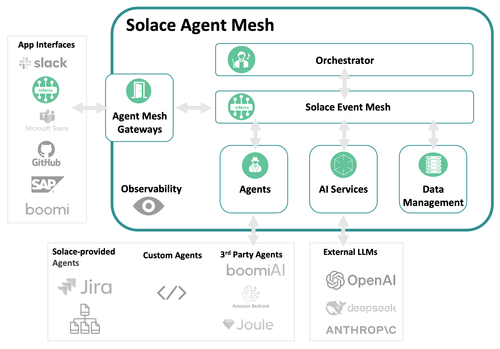

> ⚠️ **Solace Agent Mesh in Python is now deprecated**
>
> 👋 Thank you to everyone who has built with Solace Agent Mesh! This Python version is now **deprecated** — it's no longer under active development and won't receive new features, bug fixes or security updates.
>
> 🚀 **Check out the new version of Solace Agent Mesh** → https://docs.solace.com/Agent-Mesh/agent-mesh.htm
>
> 🖥️ A free edition of the Solace Agent Mesh desktop app is available: https://solace.com/products/agent-mesh/download
>
> This repository will be archived (read-only) but stays available for reference, so your existing links and installs keep working.

<p align="center">
  
</p>
<h2 align="center">
  Solace Agent Mesh
</h2>
<h3 align="center">Open-source framework for building event driven multi-agent AI systems</h3>
<h5 align="center">Star ⭐️ this repo to stay updated as we ship new features and improvements.</h5>

<p align="center">
  <a href="https://github.com/SolaceLabs/solace-agent-mesh/blob/main/LICENSE">
    
  </a>
  <a href="https://pypi.org/project/solace-agent-mesh">
    
  </a>
  <a href="https://pypi.org/project/solace-agent-mesh">
    
  </a>
  <a href="https://pypi.org/project/solace-agent-mesh">
      
  </a>
</p>
<p align="center">
  <a href="#-key-features">Key Features</a> •
  <a href="#-quick-start-5-minutes">Quickstart</a> •
  <a href="#️-next-steps">Next Steps</a> •
  <a href="https://solacelabs.github.io/solace-agent-mesh/">Docs</a>
</p>


---

**Solace Agent Mesh** is a framework that supports building AI applications where multiple specialized AI agents work together to solve complex problems. It uses the event messaging of [Solace Platform](https://solace.com) for true scalability and reliability.

With Solace Agent Mesh (SAM), you can create teams of AI agents, each having distinct skills and access to specific tools. For example, you could have a Database Agent that can make SQL queries to fetch data or a MultiModal Agent that can help create images, audio files and reports.

The framework handles the communication between agents automatically, so you can focus on building great AI experiences.

SAM creates a standardized communication layer where AI agents can:
* Delegate tasks to peer agents
* Share data and artifacts
* Connect with diverse user interfaces and external systems
* Execute multi-step workflows with minimal coupling

SAM is built on top of the Solace AI Connector (SAC) which allows Solace Platform Event Brokers to connect to AI models and services and Google's Agent Development Kit (ADK) for AI logic and tool integrations.

<p align="center">

</p>


The result? A fully asynchronous, event-driven and decoupled AI agent architecture ready for production deployment. It is robust, reliable and easy to maintain. 


---

## 🔑 Key Features 
- **[Multi-Agent Event-Driven Architecture](https://solacelabs.github.io/solace-agent-mesh/docs/documentation/getting-started/architecture)** – Agents communicate via the Solace Event Mesh for true scalability
- **[Agent Orchestration](https://solacelabs.github.io/solace-agent-mesh/docs/documentation/components/agents)** – Complex tasks are automatically broken down and delegated by the [Orchestrator](https://solacelabs.github.io/solace-agent-mesh/docs/documentation/components/orchestrator) agent
- **[Flexible Interfaces](https://solacelabs.github.io/solace-agent-mesh/docs/documentation/components/gateways)** – Integrate with REST API, web UI, [Slack](https://solacelabs.github.io/solace-agent-mesh/docs/documentation/developing/tutorials/slack-integration), or build your own integration
- **[Extensible](https://solacelabs.github.io/solace-agent-mesh/docs/documentation/components/plugins)** – Add your own agents, gateways, or services with minimal code
- **[Agent-to-Agent Communication](https://solacelabs.github.io/solace-agent-mesh/docs/documentation/getting-started/architecture)** – Agents can discover and delegate tasks to each other seamlessly using the Agent2Agent (A2A) Protocol
- **[Dynamic Embeds](https://solacelabs.github.io/solace-agent-mesh/docs/documentation/components/builtin-tools/embeds)** – Embed dynamic content like real-time data, calculations and file contents in responses

📚 **Want to know more?** Check out the full Solace Agent Mesh [documentation](https://solacelabs.github.io/solace-agent-mesh/docs/documentation/getting-started/introduction/).

---

## 🚀 Quick Start (5 minutes)

Set up Solace Agent Mesh in just a few steps.

### ⚙️ System Requirements

To run Solace Agent Mesh locally, you'll need:

- **Python 3.10.16 – 3.13.x**
- **pip** (comes with Python)
- **OS**: MacOS, Linux, or Windows (with [WSL](https://learn.microsoft.com/en-us/windows/wsl/))
- **LLM API key** (any major provider or custom endpoint)

### 🎸 Vibe Coding
To quickly setup and customize your Agent Mesh, check out the [Vibe Coding Quickstart Guide](docs/docs/documentation/vibe_coding.md). This guide walks you through the essential steps to get Solace Agent Mesh up and running with minimal effort.

### 💻 Setup Steps

#### 1. Create a directory for a new project
```bash
mkdir my-sam && cd my-sam
```
#### 2. Create and activate a Python virtual environment
```bash
python3 -m venv .venv && source .venv/bin/activate
```
#### 3. Install Solace Agent Mesh (SAM)
Check if you have a version of SAM already installed.
```bash
sam -v
```
If you have an earlier version, uninstall it and **start from scratch**:
```bash
pip3 uninstall solace-agent-mesh
```
Note: Optionally, you can try to upgrade versions but this action is not officially supported at this time. (`pip3 install --upgrade solace-agent-mesh`)

If no previous version exists, install the latest version with:
```bash
pip3 install solace-agent-mesh
```
#### 4. Initialize the new project via a GUI tool
```bash
sam init --gui
```
Note: This initialization UI runs on port 5002
#### 5. Run the project
```bash
sam run
```
#### 6. Verify SAM is running
Open the Web UI at [http://localhost:8000](http://localhost:8000) for the chat interface and ask a question

### 🔧 Customize SAM

#### New agents can be added via a GUI interface
```bash
sam add agent --gui
```

#### Existing plugins can be installed
```bash
sam plugin add <your-component-name> --plugin <plugin-name>
```

---

## 🏗️ Architecture Overview

Solace Agent Mesh provides a "Universal A2A Agent Host," a flexible and configurable runtime environment built by integrating Google's Agent Development Kit (ADK) with the Solace AI Connector (SAC) framework.

The system allows you to:

- Host AI agents developed with Google ADK within the SAC framework
- Define agent capabilities (LLM model, instructions, tools) primarily through SAC YAML configuration
- Use Solace Platform as the transport for standard Agent-to-Agent (A2A) protocol communication
- Enable dynamic discovery of peer agents running within the same ecosystem
- Allow agents to delegate tasks to discovered peers via the A2A protocol over Solace
- Manage file artifacts using built-in tools with automatic metadata injection
- Perform data analysis using built-in SQL, JQ, and visualization tools
- Use dynamic embeds for context-dependent information resolution

### Key Components

- **SAC** handles broker connections, configuration loading, and component lifecycle
- **ADK** provides the agent runtime, LLM interaction, tool execution, and state management
- **A2A Protocol** enables communication between clients and agents, and between peer agents
- **Dynamic Embeds** allow placeholders in responses that are resolved with context-dependent information
- **File Management** provides built-in tools for artifact creation, listing, loading, and metadata handling

---

## ➡️ Next Steps

Want to go further? Here are some hands-on tutorials to help you get started:

| 🔧 Integration | ⏱️ Est. Time | 📘 Tutorial |
|----------------|--------------|-------------|
| 🌤️ **Weather Agent**<br>Learn how to build an agent that gives Solace Agent Mesh the ability to access real-time weather information.  | **~15 min** | [Weather Agent Plugin](https://solacelabs.github.io/solace-agent-mesh/docs/documentation/developing/tutorials/custom-agent) |
| 🗃️ **SQL Database Integration**<br>Enable Solace Agent Mesh to answer company-specific questions using a sample coffee company database.| **~10–15 min** | [SQL Database Tutorial](https://solacelabs.github.io/solace-agent-mesh/docs/documentation/developing/tutorials/sql-database) |
| 🧠 **MCP Integration**<br>Integrating a Model Context Protocol (MCP) Servers into Solace Agent Mesh. | **~10–15 min** | [MCP Integration Tutorial](https://solacelabs.github.io/solace-agent-mesh/docs/documentation/developing/tutorials/mcp-integration) |
| 💬 **Slack Integration**<br>Chat with Solace Agent Mesh directly from Slack. | **~20–30 min** | [Slack Integration Tutorial](https://solacelabs.github.io/solace-agent-mesh/docs/documentation/developing/tutorials/slack-integration) |
| 👔 **Microsoft Teams Integration (Enterprise)**<br>Connect Solace Agent Mesh Enterprise to Microsoft Teams with Azure AD authentication. | **~30–40 min** | [Teams Integration Tutorial](https://solacelabs.github.io/solace-agent-mesh/docs/documentation/developing/tutorials/teams-integration) |

---

## 👥 Contributors

Solace Agent Mesh is built with the help of our amazing community. Thanks to everyone who has contributed ideas, code and time to make this project better!

View the full list of contributors here: [GitHub Contributors](https://github.com/SolaceLabs/solace-agent-mesh/graphs/contributors) 💚

**Looking to contribute?** Check out [CONTRIBUTING.md](CONTRIBUTING.md) to get started and see how you can help!

---

## 📄 License

This project is licensed under the **Apache 2.0 License**. See the full license text in the [LICENSE](LICENSE) file.

---

## 🧪 Running Tests

This project uses `pytest` for testing. You can run tests using either `hatch` or `pytest` directly.

### Using Hatch

The recommended way to run tests is through the `hatch` environment, which ensures all dependencies are managed correctly.

```bash
# Run all tests
hatch test

# Run tests with tags
hatch test -m "<tag>"
```

### Using Pytest Directly

If you prefer to use `pytest` directly, you must first install the project with its test dependencies.

```bash
# Install the project in editable mode with the 'test' extras
pip install -e .[test]

# Run all tests
pytest
```

---

<h3 align="center">
  
</h3>
