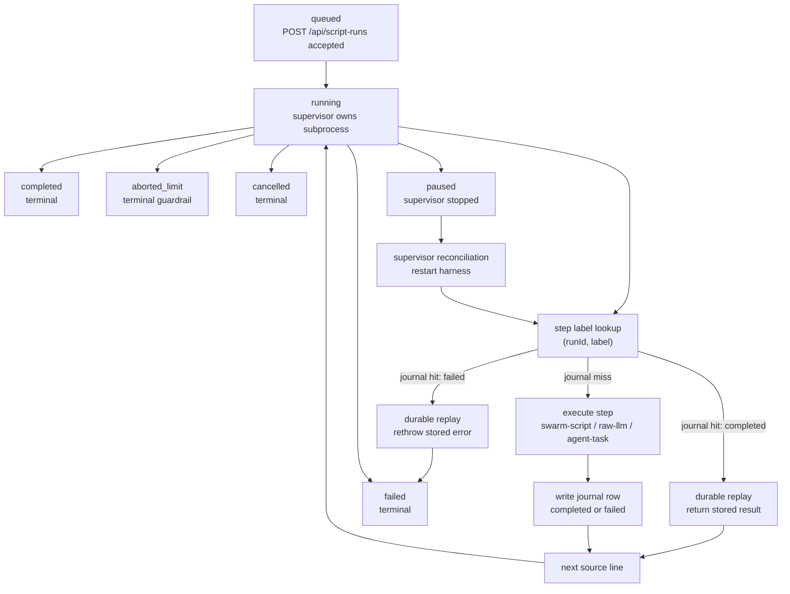

One-off Script Workflow runs give agents a workflow-shaped execution surface for ad-hoc jobs. Use them when a task needs durable multi-step execution, but the work is not yet worth turning into a named workflow definition.

They run TypeScript source, persist a `script_runs` row, execute in the background through the script-workflow supervisor, and journal each durable step in `script_run_journal`. The journal is the contract: if the process restarts or the source is re-executed from the top, completed steps are replayed by label instead of run again.

## When to use this

Use a one-off Script Workflow run when the job has more shape than a single `script-run`, for example:

- call a catalog script to gather context
- summarize or classify the result with a raw LLM call
- spawn an agent task for review or follow-up work
- inspect the run later from the dashboard, MCP tools, SDK, or API

If the job should recur on a schedule, be versioned as a product workflow, or be edited by operators, use a normal workflow definition instead.

## Launch from MCP

Load the tools with `ToolSearch` if they are not visible:

```text
launch-script-run
get-script-run
list-script-runs
```

Then launch TypeScript source:

```ts
export default async function main(args, ctx) {
  const recalled = await ctx.step.swarmScript("recall-task-context", {
    name: "task-context-gathering",
    scope: "global",
    args: {
      taskId: args.taskId,
      queries: [
        "script workflows durable runs",
        "DES-541 QA journal replay",
        "swarm scripts catalog",
      ],
    },
    intent: "script-workflow-guide-context",
  });

  const summary = await ctx.step.rawLlm("summarize-context", {
    prompt: `Summarize this task context for an operator:\n${JSON.stringify(recalled)}`,
  });

  return { recalled, summary };
}
```

Call `launch-script-run` with:

```json
{
  "scriptName": "task-context-summary",
  "idempotencyKey": "task-context-summary:<task-short-id>",
  "args": { "taskId": "<task-id>" },
  "source": "export default async function main(args, ctx) { /* ... */ }"
}
```

The tool calls `POST /api/script-runs` with `background: true`, preserves the invoking agent identity, and returns the run ID plus dashboard URL.

## Inspect from MCP

Use `get-script-run` for a single run:

```json
{ "id": "<script-run-id>" }
```

The response includes the `run` object and `journal` entries. Each journal entry has:

- `stepKey` - the durable label
- `stepType` - `swarm-script`, `raw-llm`, or `agent-task`
- `config` - the step config recorded for audit/debugging
- `status` - `completed` or `failed`
- `result` or `error`
- timestamps

Use `list-script-runs` to find recent runs:

```json
{ "status": "completed", "agentId": "<agent-id>", "limit": 25 }
```

`status`, `agentId`, `limit`, and `offset` map directly to the list API.

## Copy-paste workflow patterns

Thariq Shihipar's dynamic workflows post, ["A harness for every task"](https://x.com/trq212/status/2061907337154367865), is the motivating pattern: use a workflow-shaped harness when a single context window is likely to drift, stop early, or verify its own work too generously. These examples adapt the post's patterns to one-off Script Workflow runs.

For each example, paste the TypeScript into `launch-script-run.source`, set the shown `args`, and give the run an `idempotencyKey` if you might launch it twice.

### Classify-and-act triage

Use this when an inbound item needs a cheap classifier before it spends agent time.

```ts
export default async function main(args, ctx) {
  const classification = await ctx.step.rawLlm("classify-item", {
    schema: {
      type: "object",
      properties: {
        kind: { type: "string", enum: ["bug", "docs", "question", "ops"] },
        urgency: { type: "string", enum: ["low", "medium", "high"] },
        nextAction: { type: "string" },
      },
      required: ["kind", "urgency", "nextAction"],
      additionalProperties: false,
    },
    prompt: `Classify this item and choose the next action:\n${args.item}`,
  });

  const result = classification.result;
  if (result.urgency !== "high") {
    return { classification: result, createdTask: false };
  }

  const followUp = await ctx.step.agentTask("high-urgency-follow-up", {
    task: `Handle this ${result.kind} item.\n\nItem:\n${args.item}\n\nRecommended action:\n${result.nextAction}`,
    priority: 80,
    tags: ["script-workflow", "triage"],
  });

  return { classification: result, createdTask: true, followUp };
}
```

Launch args:

```json
{
  "scriptName": "classify-and-act-triage",
  "idempotencyKey": "classify-and-act-triage:support-1842",
  "args": {
    "item": "Customer reports that script runs disappear from the dashboard after refresh."
  }
}
```

### Fan-out-and-synthesize verification

Use this when a post, report, or PR description has multiple claims that should be checked independently before one synthesis step.

```ts
export default async function main(args, ctx) {
  const checks = [];

  for (const [index, claim] of args.claims.entries()) {
    checks.push(
      await ctx.step.agentTask(`verify-claim-${index + 1}`, {
        task: `Verify this claim against the repo or linked source. Return pass/fail and concise evidence.\n\nClaim: ${claim}`,
        tags: ["script-workflow", "claim-check"],
        outputSchema: {
          type: "object",
          properties: {
            pass: { type: "boolean" },
            evidence: { type: "string" },
          },
          required: ["pass", "evidence"],
          additionalProperties: false,
        },
      }),
    );
  }

  const synthesis = await ctx.step.rawLlm("synthesize-verification", {
    prompt: `Summarize these independent claim checks. Call out any failed or weak claims.\n${JSON.stringify(checks, null, 2)}`,
  });

  return { checks, synthesis };
}
```

Launch args:

```json
{
  "scriptName": "fan-out-claim-verification",
  "idempotencyKey": "fan-out-claim-verification:script-workflows-post-v1",
  "args": {
    "claims": [
      "Script Workflow runs journal every ctx.step.* call by label.",
      "A repeated durable label replays the first journaled result.",
      "SCRIPT_RUN_MAX_AGENT_TASKS defaults to 50."
    ]
  }
}
```

### Loop-until-done refinement

Use this when the stop condition is qualitative and you want the run to keep a durable audit trail of each pass.

```ts
export default async function main(args, ctx) {
  let draft = args.startingDraft;
  const maxPasses = args.maxPasses ?? 3;

  for (let pass = 1; pass <= maxPasses; pass++) {
    const revision = await ctx.step.rawLlm(`revise-pass-${pass}`, {
      prompt: `Revise this draft against the rubric.\n\nRubric:\n${args.rubric}\n\nDraft:\n${draft}`,
    });
    draft = revision.result;

    const review = await ctx.step.rawLlm(`review-pass-${pass}`, {
      schema: {
        type: "object",
        properties: {
          done: { type: "boolean" },
          feedback: { type: "string" },
        },
        required: ["done", "feedback"],
        additionalProperties: false,
      },
      prompt: `Decide whether this draft satisfies the rubric.\n\nRubric:\n${args.rubric}\n\nDraft:\n${draft}`,
    });

    if (review.result.done) {
      return { done: true, pass, draft, feedback: review.result.feedback };
    }
  }

  return { done: false, passes: maxPasses, draft };
}
```

Launch args:

```json
{
  "scriptName": "loop-until-done-copy-review",
  "idempotencyKey": "loop-until-done-copy-review:homepage-hero-v1",
  "args": {
    "maxPasses": 3,
    "rubric": "Clear, specific, no invented claims, under 120 words.",
    "startingDraft": "Agent Swarm lets teams run durable agent workflows and inspect each step."
  }
}
```

### SDK launch wrapper

From a normal swarm script, launch the same source through the SDK and inspect the durable journal later:

```ts
export default async function main(args, ctx) {
  const source = `export default async function main(args, ctx) {
    const recalled = await ctx.step.swarmScript("recall", {
      name: "smart-recall",
      scope: "global",
      args: { queries: args.queries },
      intent: "sdk-launch-wrapper"
    });

    const summary = await ctx.step.rawLlm("summarize", {
      prompt: "Summarize these recalled memories for the operator:\\n" + JSON.stringify(recalled)
    });

    return { recalled, summary };
  }`;

  const launched = await ctx.swarm.script_launchRun({
    scriptName: "sdk-launched-memory-summary",
    idempotencyKey: `sdk-launched-memory-summary:${args.topic}`,
    args: { queries: [`${args.topic} gotchas`, `${args.topic} previous fixes`] },
    source,
  });

  return launched;
}
```

## SDK methods

Inside a swarm script, the same tools are exposed as SDK methods:

```ts
await ctx.swarm.script_launchRun({
  scriptName: "memory-search-as-code",
  source,
  args: { query: "DES-541 script workflows" },
  idempotencyKey: "memory-search-as-code:DES-541",
});

await ctx.swarm.script_getRun({ id });

await ctx.swarm.script_listRuns({
  status: "aborted_limit",
  limit: 10,
});
```

The SDK names use underscores/camel case because they are TypeScript method names. They proxy to the MCP tools:

| SDK method | MCP tool |
|---|---|
| `ctx.swarm.script_launchRun` | `launch-script-run` |
| `ctx.swarm.script_getRun` | `get-script-run` |
| `ctx.swarm.script_listRuns` | `list-script-runs` |

## API flow

The public launch/inspect API is:

- `POST /api/script-runs` - create a run and, with `background: true`, start the supervisor subprocess
- `GET /api/script-runs` - list runs, optionally filtered by `status` and `agentId`
- `GET /api/script-runs/{id}` - return the run and journal
- `DELETE /api/script-runs/{id}` - cancel a running run; terminal runs are left unchanged

The internal journal flow is:

1. The launch endpoint creates a `script_runs` row with status `running`.
2. The supervisor starts the harness subprocess and records `pid` plus `lastHeartbeatAt`.
3. `ctx.step.*` checks `GET /api/internal/script-runs/{runId}/steps/{stepKey}` before executing.
4. If a journal entry exists, the step replays it: a `completed` entry returns the stored result, a `failed` entry rethrows the stored error. A recorded failure must not replay as a success — otherwise a harness that died after journaling the failure but before reporting it would let the resumed run continue past a failed step and finish `completed`.
5. If no journal entry exists, the step executes and writes through `POST /api/internal/script-runs/{runId}/steps`.
6. When the subprocess exits, the supervisor marks the run `completed` or `failed`.

This is why step labels matter. A label is not display text. It is the durability key for that logical step.

## Step types

`ctx.step.rawLlm(label, config)` runs one raw LLM call and journals the response.

`ctx.step.swarmScript(label, config)` calls the reusable scripts runtime. It can run a named catalog script:

```ts
await ctx.step.swarmScript("daily-ops-snapshot", {
  name: "compound-insights",
  scope: "global",
  args: { days: 1, includeScriptUsage: true, includeCostAndTokens: true },
});
```

`compound-insights` now reports actual `script_runs` usage separately from MCP-call log signals and can surface a cost-and-token headline in the same snapshot.

or an inline script:

```ts
await ctx.step.swarmScript("normalize-records", {
  source: "export default async function main(args) { return args.rows.map((row) => row.id); }",
  args: { rows },
  intent: "normalize-records",
});
```

`ctx.step.agentTask(label, config)` dispatches a swarm task and **blocks until it reaches a terminal status**, journaling its real output as the step result. This is the natural semantic for a durable step — a sequential `plan → review → implement` chain will not fan out or pass a placeholder downstream.

Dispatch and wait are journal-separable: the server looks up an existing `script-run-step` task by a `(runId, label)` context key before creating one. Once selected, the wait stays pinned to that task ID, so an unrelated task that later reuses the same context key cannot hijack the result. If the harness process restarts mid-wait (crash, supervisor reconciliation, `SCRIPT_RUN_MAX_WALL_MS` eviction), replay resumes polling the same task instead of dispatching a duplicate. The step is only journaled once the task reaches a terminal status.

Config options beyond the task-dispatch fields (`template`/`task`/`agentId`/`tags`/…):

| Option | Default | Behavior |
|---|---|---|
| `waitForCompletion` | `true` | `false` reverts to the legacy fire-and-forget shape: a single dispatch call that journals `{taskId, status}` immediately (usually `status: "pending"`). |
| `timeoutMs` | 2 hours | Max time to wait for a terminal status before throwing. Checked with ~30s granularity (each poll round-trip already long-polls server-side). Only applies when `waitForCompletion` is true. |
| `failOnTaskFailure` | `true` | When the task ends `failed`/`cancelled`/`superseded`: `true` throws so the failure surfaces to the workflow author; `false` resolves with `{taskId, status: "failed", error}` instead. |

```ts
const review = await ctx.step.agentTask("implement-fix", {
  task: "Implement the fix described in the plan output.",
  timeoutMs: 4 * 60 * 60 * 1000, // this step commonly runs long — give it more room
  failOnTaskFailure: false, // let the workflow decide how to handle a rejected/failed implementation
});
if (review.status === "failed") {
  // review.taskId / review.error are available here
}
```

`timeoutMs` is a per-step request; the *effective* deadline is always clamped to the run's own shared, absolute wall-clock cap (`SCRIPT_RUN_MAX_WALL_MS`, computed from the run's persisted start time — not per-process, not divided across concurrent steps). If the run-level cap arrives first, every step waiting at that moment times out together, the supervisor may kill the harness process, and — per the replay-safety guarantee above — resumed steps poll the same taskId on the next reconciliation rather than duplicating work.

### Fan-out with Promise.all

`ctx.step.agentTask` calls made inside `Promise.all` dispatch and wait **concurrently** — there is no shared mutex or serializing queue, so wall time is bounded by the slowest step, not the sum. Give each parallel step a label derived from its loop index (not a literal), same rule as any other loop:

```ts
export default async function main(args, ctx) {
  const reviews = await Promise.all(
    args.items.map((item, i) =>
      ctx.step.agentTask(`review-${i}`, { task: `Review ${item.name}` }),
    ),
  );
  return { reviews };
}
```

This is durable and replay-safe exactly like the sequential case: each label gets its own `(runId, label)` context key, so a crash mid-fan-out resumes every still-pending label against its already-dispatched task, and results come back in the same order as `args.items`.

If one step in a `Promise.all` throws (e.g. `failOnTaskFailure` on a sibling), the *other* in-flight steps are not silently discarded — the harness gives them a bounded grace period to finish their own journal write before it finalizes the run, so a task that was about to complete on the server is not orphaned by the sibling's failure. "In flight" covers the whole step lifecycle from the moment `ctx.step.*` is called, including a sibling still waiting on its very first journal lookup — not just one that has already dispatched.

`ctx.step.humanInTheLoop()` exists in the type surface but is stubbed in Script Workflows v1.

## Lifecycle

The persisted run lifecycle is a small state machine, while each `ctx.step.*` call follows the journal lookup path shown inside `running`.



Persisted statuses:

| Status | Meaning |
|---|---|
| `running` | The run is active or waiting for the supervisor to resume it. |
| `paused` | The run was stopped and can be resumed by supervisor reconciliation. |
| `completed` | The script finished and `output` may be present. |
| `failed` | The script ended with an error. |
| `cancelled` | The run was cancelled before completion. |
| `aborted_limit` | A runtime guardrail stopped the run. |

Terminal statuses are `completed`, `failed`, `cancelled`, and `aborted_limit`.

`label_lint_violation` is not a persisted run status. It is a launch-time rejection from `POST /api/script-runs` when the TypeScript syntax tree places a repeated literal step label inside a loop or an iteration callback such as `map`, `forEach`, or `reduce`. Similar-looking text in comments, strings, or unrelated code does not trigger the lint.

## Durability and replay

Every `ctx.step.*` call follows the same durable pattern:

```text
look up journal row by (runId, label)
if found and completed: return stored result
if found and failed:    rethrow stored error
if missing:             execute step, write result or error, return/throw
```

In live QA, a run called `ctx.step.swarmScript("durable-double", ...)` twice with different source. The second call returned the first journaled result, and the run kept exactly one `durable-double` journal row. That behavior is intentional: label reuse means "this is the same logical step", not "run another step with the same name".

For loops, include an item identifier in the label:

```ts
for (const item of args.items) {
  await ctx.step.agentTask(`review-${item.id}`, {
    task: `Review ${item.name}`,
  });
}
```

Do not do this:

```ts
for (const item of args.items) {
  await ctx.step.agentTask("review", {
    task: `Review ${item.name}`,
  });
}
```

That pattern is rejected at launch with `label_lint_violation` when the lint can detect the repeated literal label.

## Guardrails

Script Workflow runs are intended for bounded one-off work. The runtime enforces limits:

| Guardrail | Default | Effect |
|---|---:|---|
| `SCRIPT_RUN_MAX_STEPS` | `1000` | Maximum total journal entries for one run. |
| `SCRIPT_RUN_MAX_AGENT_TASKS` | `50` | Maximum `agent-task` journal entries for one run. |
| `SCRIPT_RUN_MAX_WALL_MS` | `86400000` | Maximum wall-clock runtime before supervisor abort. |

When a run exceeds a limit, the supervisor records `aborted_limit` and stores the limit message in `run.error`. The deployed QA path confirmed the `SCRIPT_RUN_MAX_AGENT_TASKS` default by writing the 51st `agent-task` journal row and ending the run with `SCRIPT_RUN_MAX_AGENT_TASKS exceeded (51/50)`.

## Dashboard

The dashboard has a Script Runs section at `/script-runs`.

Use the list view to scan recent runs by status, script name, agent, start time, and journal count. Open a run to inspect the source, args, output/error, heartbeat, and each journaled step.

## Related

- [Scripts runtime](/docs/guides/scripts-runtime)
- [Workflows](/docs/concepts/workflows)
- [Receipts](/docs/receipts)
- [Script Runs API reference](/docs/api-reference/script-runs)
- [MCP tools reference](/docs/reference/mcp-tools)
