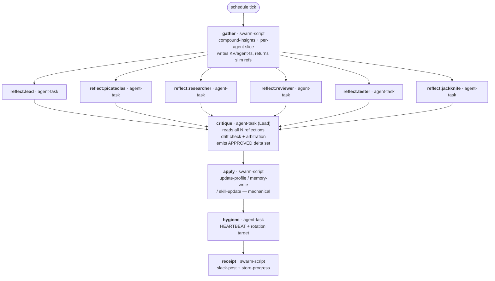
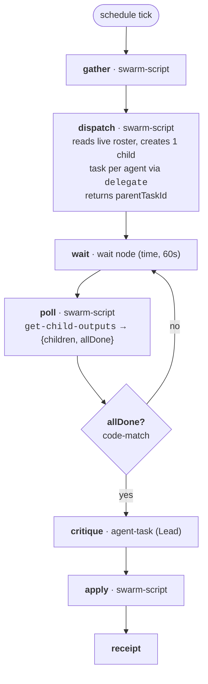
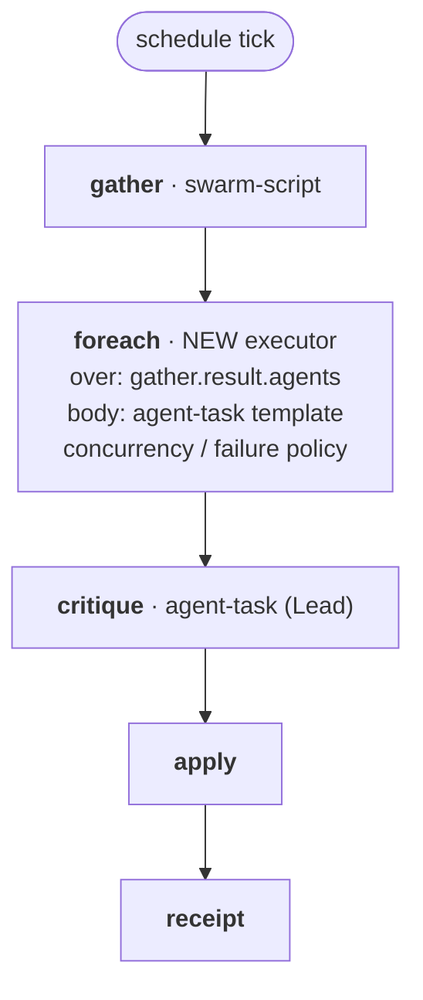
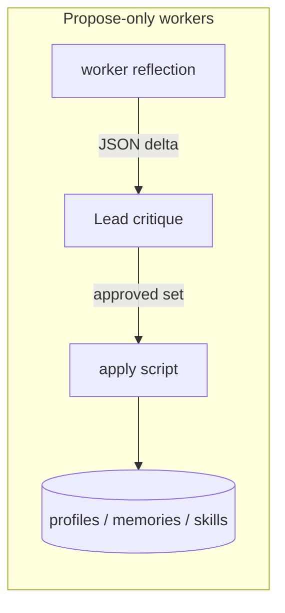
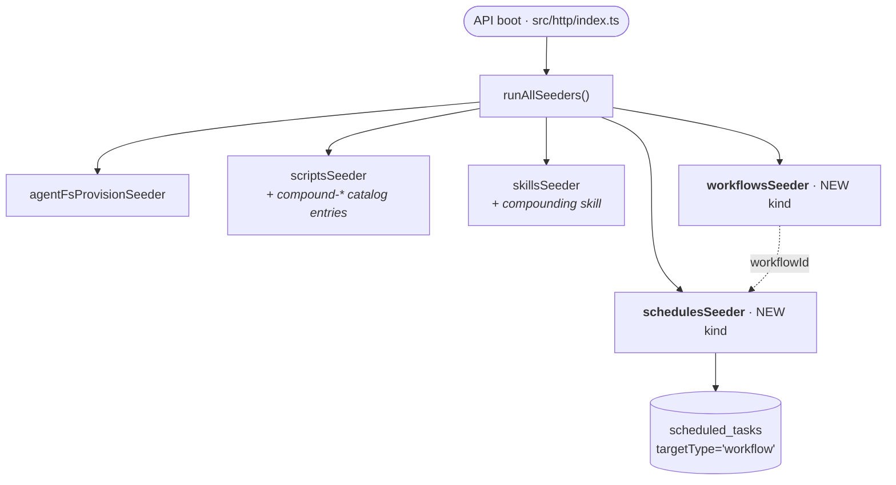
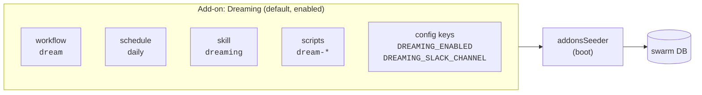
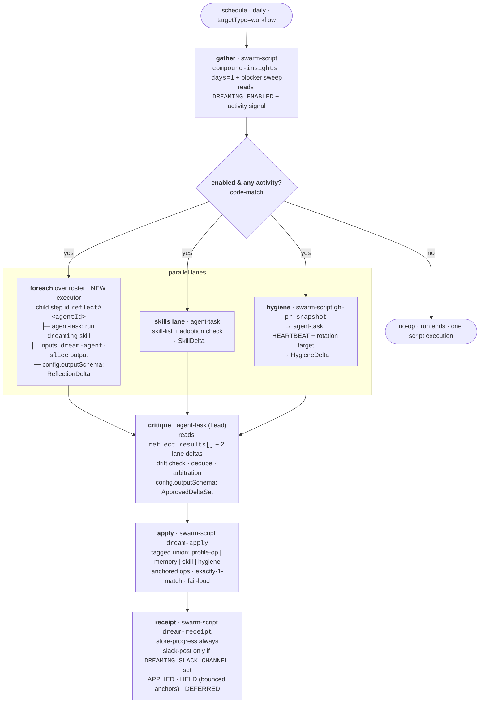

# Dreaming — Brainstorm

> Shipped as the **Dreaming** add-on. Formerly called the *compounding engine* / *daily evolution* —
> that older name still appears throughout this document's early sections and in existing swarm
> memories, schedules, and Slack history.

## Context

### Where we are today

The swarm's daily evolution is a **single monolithic scheduled task** assigned to Lead
(schedule `cdfa3f00-0e10-4bcd-8d69-9f10b30cb9a2`). One agent, one session, four folds:

1. **Fold 1 — Memory**: extract learnings, curate/consolidate, fill gaps
2. **Fold 2 — Agent Evolution**: review each agent's perf, surgically edit SOUL/IDENTITY/CLAUDE/TOOLS.md via `update-profile`
3. **Fold 3 — Skill Evolution**: create/update/install skills
4. **Fold 4 — Hygiene**: HEARTBEAT drift check + one rotating deep-clean target

Plus a Slack receipt to `C0A4J7GB0UD` and a `store-progress` verification checklist.

**Structural problems with the monolith:**

| Problem | Evidence in the current prompt |
|---|---|
| Lead is a context bottleneck | The prompt itself is ~4.5K words and spends a whole section teaching Lead to avoid `get-swarm includeFull` because it "overflows the result cap and dumps to a file" |
| Lead has no lived experience of other agents' work | It reads task tallies, not sessions. Fold 2A ("did they need retries? did any task reveal a gap?") is guesswork from metrics |
| Rotation-by-vibes | "Pick 1-3 agents to evolve today (rotate — don't always pick the same ones)" — no state, no guarantee an agent is ever evolved |
| Serial | 4 folds × N agents in one session = long wall-clock, high single-session cost, high failure blast radius |
| Anti-patterns are enforced by prose, not structure | "❌ Completing in under 2 minutes", "❌ Claiming agent evolution without calling `update-profile`" — hopeful instructions instead of a DAG that can't skip a node |

### Taras's proposed design

> - Run compounding **per agent in parallel** (deterministic gather + reasoning)
> - Then a **lead session** that takes everyone's reflections, critiques (e.g. if an agent drifts on
>   scope/responsibility), and does a final synthesis/update
> - Lead is useful because workers lack full context; lead can correct drift
> - Simpler alternative: reusable workflow per agent ID only — but Taras prefers the lead critique
>   step for second-order evolution

Ship as: **workflow + seed scripts + auto-seeded schedule on swarm startup + a skill.**

### What the engine actually gives us (verified 2026-07-31)

Grounding facts, so the design doesn't invent capabilities:

- **Parallel fan-out + join is native.** `src/workflows/engine.ts:268` executes all pending nodes in
  one `Promise.all` batch; `:316-327` gates a downstream node until *every active predecessor* has
  completed. So `gather → [a1, a2, … aN] → lead` is a real barrier with zero new engine code.
- **Agent-task nodes are async.** A node that spawns a task returns `waiting`, the run pauses
  (`:308`), and `task.completed` re-walks the graph (`src/workflows/resume.ts`). Output shape is
  `{ taskId, taskOutput }`; downstream nodes need an explicit `inputs` mapping or refs silently
  resolve to `""` (runbooks/workflows.md).
- **Structured output is enforceable.** `config.outputSchema` on an agent-task node is validated by
  `store-progress` — so "return your reflection as JSON" is a hard contract, not a request.
- **`swarm-script` nodes** run catalog TypeScript with real `ctx.swarm.*` MCP access. **Hard caps:**
  `timeoutMs` ≤ 60s, 30s default wall-clock, 60s CPU ulimit. **A script cannot wait for an agent
  task.**
- **No `foreach` / `map` node exists.** Executors are: `agent-task`, `script`, `swarm-script`,
  `raw-llm`, `notify`, `validate`, `vcs`, `wait`, `human-in-the-loop`, `code-match`,
  `property-match`. Dynamic N-way fan-out has no first-class primitive.
- **Schedules can already target a workflow.** `scheduled_tasks.targetType = 'workflow'` +
  `workflowId` (migration `103_schedule_target_type.sql`). No new schema needed for the schedule.
- **Seeding is a solved, generic mechanism.** `src/be/seed/` — a `Seeder` declares `items()`,
  `upstreamHash()`, `apply()`, registers in `registry.ts`, and runs at API boot + `bun run seed:scripts`.
  Today: `agentFsProvisionSeeder`, `scriptsSeeder`, `skillsSeeder`. **Workflows and schedules are not
  yet seedable kinds** — that's net-new work, but the runbook says adding a kind touches nothing else.
  Pristine-vs-user-modified hashing means a hand-edited workflow is never clobbered.

---

## Candidate topologies

### Option A — Static per-agent nodes (roster baked into the definition)

> **Review note (resolved):** the "the good one" comment landed here by accident — Taras confirmed
> **Option C (dynamic `foreach`)** is the choice. Option A's *diagram* is still the target shape;
> `foreach` is how we materialize it from the live roster instead of hardcoding it.



- ✅ Zero engine changes, trivially readable in the UI waterfall, per-agent retry is native
- ✅ Join barrier is exactly what we want
- ❌ Roster is hardcoded — a new agent needs a workflow edit (and a seed re-hash)
- ❌ A node for an agent that's offline/decommissioned fails or hangs

### Option B — Dispatcher + poll-join loop (dynamic N, no engine changes)



- ✅ Fully data-driven — roster changes need no workflow edit
- ✅ Reuses existing catalog scripts (`delegate`, `get-child-outputs`, `wait-for-task`)
- ❌ Loop burns node executions against `maxIterations()`; needs a hard deadline branch
- ❌ Waterfall UI shows a poll loop, not per-agent lanes — worse observability
- ❌ Per-agent failure/retry semantics are hand-rolled inside the poll script

### Option C — New `foreach` node type (engine change)



- ✅ The primitive we'll want for a dozen other workflows (per-PR, per-repo, per-failure-cluster)
- ✅ Keeps the DAG honest: real lanes in the UI, native join, per-item retry
- ❌ Net-new executor + definition schema + validation + UI rendering + resume semantics
- ❌ Biggest scope; blocks the compounding engine on engine work

### Option D — Hybrid: A now, C later

Ship Option A with the roster expressed as a **seeded, regenerable** definition (a small codegen in
the workflow seeder reads a role list, not the live DB), and treat `foreach` as the follow-up that
collapses A's N nodes into one. The compounding engine ships this week; the primitive lands when
it's earned.

---

## The write-authority question (independent of topology)

Who is allowed to *mutate* state — profiles, memories, skills?



| Model | Worker may write | Lead role | Risk |
|---|---|---|---|
| **W1 — Full self-serve** | own profile + own memories + skills | advisory only | Drift compounds; Lead's critique has no teeth |
| **W2 — Split authority** | own **memories** directly; profile edits are **proposals** | approves/rejects/rewrites profile deltas | Balanced; memories are low-blast-radius, identity is not |
| **W3 — Propose-only** | nothing | applies everything | Lead context balloons again — the exact bottleneck we're removing |

Related sub-question: does the `apply` step belong to the **Lead agent-task** (it has judgment but
burns context) or to a **mechanical `swarm-script`** fed by Lead's structured output (auditable,
cheap, but can only apply what the schema encodes)?

---

## Seeding & startup



Open mechanics:
- **Ordering** — `schedulesSeeder` needs the `workflowId` that `workflowsSeeder` just produced.
  Registry is an ordered array, so ordering works, but the schedule item's `contentHash` must not
  churn when the workflow id changes.
- **Enabled by default?** An auto-seeded schedule that fires on every fresh DB is great for new
  installs and dangerous for a dev box (real tokens, real profile writes).
- **Collision with the existing schedule** — `cdfa3f00-…` already runs the monolith daily on prod.
  Seeding a second one double-evolves. Migration path needed: retire, or seed disabled and cut over.

---

## Exploration

### Q1: Does this REPLACE the daily-evolution monolith, or run alongside it?

**Taras:** Full replacement. But the workflow should be **global, not per-agent**. Instead it should
run a task for each agent **pointing to a skill** → output a **deterministic schema** → Lead critiques
and generates the final outcome → **deterministic update at the end**.

**Insights:**

- This settles decisions **2, 3, and 10** in one move:
  - **Write authority = W3 (propose-only).** Workers emit JSON, nothing else. Lead arbitrates.
  - **Apply = mechanical `swarm-script`**, not a Lead agent-task.
  - **The skill is the runtime playbook** loaded *inside* each reflection task — not an authoring aid.
- **"Pointing to a skill" is the strongest idea here.** It decouples the *procedure* from the
  *workflow definition*: the reflection playbook can evolve every week via `skill-update` without
  re-seeding or re-hashing the workflow. The agent-task prompt collapses to ~3 lines
  ("run the `compounding-reflection` skill for yourself; here is your metrics ref; return the schema").
  It also makes the procedure itself compoundable — the engine can improve its own playbook.
- **W3 doesn't reintroduce the Lead bottleneck *because of* the schema.** The old monolith's problem
  was Lead reading raw sessions and `get-swarm includeFull` dumps. N bounded JSON reflections
  (~2–5K tokens each × 6 agents ≈ 30K) is a Lead session that comfortably fits. The schema is what
  makes propose-only affordable.
- **Two real tensions this opens:**
  1. **"Global, not per-agent" needs a fan-out primitive the engine does not have.** One workflow
     definition + N tasks derived from the live roster = Option B (dispatcher + poll loop) or
     Option C (new `foreach` executor). Option A's static lanes are per-agent-in-the-definition,
     which is exactly what Taras is rejecting. → **This is now the crux decision.**
  2. **"Deterministic update" collides with "surgical edit."** Fold 2C's hard rule is *never
     template-overwrite a SOUL.md* — but a script can only apply what the delta schema encodes.
     Anchored patch ops are compact but fail when the anchor drifts; full-file emission is safe but
     makes Lead re-emit every profile it touches. → next question.
- Full replacement means **folds 3 (skills) and 4 (hygiene) need an owner in the new DAG** — they are
  swarm-global, not per-agent, so they don't fit a reflection lane. Still open (decision 5).

### Q2: "Global workflow, one task per agent" needs a fan-out primitive we don't have. How do we get dynamic N?

**Taras:** Build a `foreach` executor. *(Option C)*

**Insights:**

- Accepts that engine work gates the compounding engine — the right call if `foreach` is a primitive
  we'd build anyway. It is: per-PR, per-repo, per-failure-cluster, per-connection workflows all want
  it, and every one of them would otherwise hand-roll the same poll loop.
- **The engine already has the hard half.** `walkGraph` (`src/workflows/engine.ts:256-330`) batches
  siblings through one `Promise.all` and gates a successor on *all active predecessors completing*
  (`:316-327`). `foreach` doesn't need new scheduling semantics — it needs **dynamic node
  materialization**: expand `over: <array>` into N synthetic child steps at execution time, then
  converge them on the single downstream successor.
- **The genuinely new surface is resume.** Agent-task children return `waiting` and the run pauses
  (`:308`); `task.completed` re-walks the graph. So materialized children must be **stable and
  addressable across walks** — a deterministic step id like `<nodeId>[<itemKey>]` (keyed on
  `agent.id`, not array index, so a roster change mid-run doesn't re-key surviving lanes).
- **Policy fields that need deciding at build time** (worth pinning in the plan, not here):
  `concurrency` (all-at-once vs bounded — 6 agents is fine, 50 repos is not), and `failurePolicy`
  (`fail-fast` vs `continue` — for compounding we almost certainly want `continue`, since one agent
  failing to reflect must not block the other five from being evolved).
- **Scope discipline:** build `foreach` generic but validate it against exactly one consumer (this
  workflow). Resist adding `reduce`/nested-foreach in v1.
- Also settles **decision 1: Option C.**

### Q3: How does "deterministic update" avoid template-overwriting a SOUL.md?

**Taras:** Anchored section ops — `{ agentId, file, op, anchor, content }` with
`append-under | replace-section | remove-section`, fail-loud on a missing/ambiguous anchor.

**Insights:**

- Right trade. It keeps Lead's output cheap (only deltas cross the wire) and encodes *surgical intent
  in the data*, so the anti-overwrite rule stops being prose in a prompt and becomes a schema the
  script literally cannot violate.
- **Anchor drift is smaller than it looks, because Lead reads the profile in the same turn.** The
  critique node already has the current SOUL/IDENTITY/CLAUDE/TOOLS text in context — the instruction
  is "quote an anchor verbatim from the text you just read." Drift only bites across a *stale* read,
  which this DAG doesn't have.
- **Fail-loud needs a destination, not just a failure.** A bounced op must land in the Slack receipt
  as `HELD: <agent> <file> — anchor "## Values" not found` so it's visible the same day. Silent
  no-op is the one outcome that would let evolution quietly stop working. Optional v2: one bounded
  re-ask of the critique node with the bounced ops + current file text.
- **Ambiguity rule matters as much as absence.** `replace-section` against an anchor that appears
  twice must reject, not pick the first. Cheap to enforce: count matches, require exactly 1.
- **This pressures profile structure.** Anchored ops work best against stable, canonical H2 headings.
  Worth considering a lightweight *profile section contract* (a seeded skeleton of expected headings
  per file) so anchors are predictable across agents — otherwise every agent's profile has bespoke
  headings and Lead is guessing.
- `remove-section` is what keeps profiles from monotonically growing — it's the Fold-4 hygiene lever
  living inside the same mechanism. Good that it's in v1.

### Q4: Who owns folds 3 (skills) and 4 (hygiene) in the new DAG?

**Taras:** Parallel global lanes — `skills` and `hygiene` run concurrently with the `foreach`, all
three converge on the same critique node.

**Insights:**

- Keeps the invariant that makes this design good: **one run, one critique, one apply, one receipt.**
  Everything Lead arbitrates in a single turn, everything commits atomically-ish, and the Slack post
  stays a receipt for exactly one graph.
- **The join is free.** `walkGraph` already gates `critique` on all active predecessors, so adding
  two more lanes alongside `foreach` costs zero engine work beyond `foreach` itself.
- **The delta schema has to generalize past profiles.** Lead's approved output now spans four target
  kinds — profile ops, memory writes/deletes, skill create/update/install, and hygiene edits
  (HEARTBEAT lines, rotation cursor). Cleanest shape is one tagged union the apply script switches on:
  `{ kind: "profile-op" | "memory" | "skill" | "hygiene", ... }`. Anchored-section ops generalize to
  HEARTBEAT.md for free.
- **The hygiene lane wants a script, not just an agent.** The HEARTBEAT PR-merge sweep is already
  mechanized (`gh-pr-snapshot`, `Heartbeat Audit`); the lane should be `swarm-script` (batch
  `gh pr view`, emit `resolvedStalePRs`) → `agent-task` (judgment on what to lift). Same
  deterministic-gather-then-reason split as the agent lanes.
- **Rotation cursor becomes real state.** Today it's a file read/written by prose instruction. In a
  DAG it should be an explicit input to the hygiene lane and an explicit output of the apply script,
  so "advance the cursor" is a committed op rather than something Lead might forget.
- Deferred (my recommendation, object in review): **no peer-critique lane in v1** (decision 4).
  Lead-corrects-drift is the second-order loop Taras asked for; agent-critiques-agent is a third
  loop that multiplies cost before we know the first one works.

### Q5: What's the startup/seeding posture, given dev-box spend and collision with `cdfa3f00`?

**Taras:** Seed enabled + retire the monolith via migration.

**Insights:**

- **The dev-box spend risk has a better fix than a flag: make the workflow self-limiting.** Put an
  activity gate in the `gather` node — if the window has zero completed tasks, zero failures, and
  zero memory writes, emit `{ skip: true }` and route to a terminal no-op via `code-match`. A fresh
  dev DB then costs one script execution per day, not six agent sessions. This is strictly better
  than an env flag because it also protects prod during quiet periods, and it needs no operator knob.
- **Watch the seeder ordering contract.** `SEEDERS` is an ordered array, so `workflowsSeeder` before
  `schedulesSeeder` works — but the schedule item's `contentHash` must be computed over its *stable*
  fields (cron, target kind, workflow **name**), never the generated `workflowId`, or every fresh DB
  produces a different hash and the pristine-vs-modified logic breaks.
- **`cdfa3f00-…` is prod-only state, not seeded content.** It was hand-created, so a migration
  targeting that UUID is a no-op on every other install — that's fine and safe, but it means the
  migration is really a *prod cutover script wearing a migration's clothes*. Acceptable; just make
  the comment explicit (`-- superseded by the compounding-engine workflow; see runbooks/…`) so the
  leave-no-regrowth rule holds and nobody re-enables it in six months.
- **Retiring the monolith deletes a 4.5K-word prompt that encodes real knowledge.** The rotation
  list, the AgentMail-is-REST-not-MCP gotcha, the RESOLVED-STALE post-mortem rule, the migrated-host
  list — those must land in the **skill** (and the hygiene lane's inputs) before `cdfa3f00` goes
  dark, or the cutover silently loses institutional knowledge. This is the single most likely way
  the migration goes wrong.
- **New seedable kinds land as a pair.** `workflowsSeeder` and `schedulesSeeder` are both net-new
  `Seeder` implementations (runbooks/seed-scripts.md § "Adding a new seedable kind" — registry entry
  only, no harness changes). Workflow `contentHash` should hash the *definition*, so a hand-edited
  workflow in the UI is preserved, not clobbered on next boot.

**Taras (follow-up):** a swarm must be able to change or disable it after install, and restarts must
not overwrite that.

**Confirmed — that's exactly what the framework already guarantees, with one trap to avoid.**

The seed harness records the hash it last wrote per `(kind, key)` in `seed_state` and re-seeds by
comparison (runbooks/seed-scripts.md § "Versioning rule"):

| upstream state | source state | action |
|---|---|---|
| absent | — | create |
| pristine (== last-seeded hash) | changed | update |
| pristine | unchanged | no-op |
| **user-modified (≠ last-seeded hash)** | any | **preserve** |

So an operator who retimes the cron or flips the schedule off diverges the upstream hash, and the
seeder never touches it again — including across restarts and including when we later ship a new
version of the source definition.

⚠️ **The trap: this only holds if `enabled` and `cron` are inside the hashed upstream state.** If
`upstreamHash()` hashes only the target (workflow name + args) and ignores `enabled`, then a disabled
schedule still hashes as pristine — it survives today only because the source is unchanged, and the
*next* time we edit the shipped definition the harness would classify it "pristine + source changed"
→ **update** → silently re-enabling a schedule an operator deliberately turned off. So:

- `schedulesSeeder.upstreamHash()` must cover **`enabled`, `cron`/schedule spec, target, and args**.
- Same rule for `workflowsSeeder`: hash the full definition, so any UI edit to the DAG is preserved.
- Worth a regression test in `src/tests/seed-*.test.ts`: *disable the seeded schedule → change the
  source definition → re-run seeders → assert it is still disabled.*

---

### Q6: Cadence, and how do we bound cost/contention?

**Taras:** Daily everything — *"it's easy to change later from the user side if they want."*
Cost/contention is **not an issue** — instead, ship scripts so each agent can cheaply gather what it
needs (some already exist) plus a skill, so the runs are cheap *by construction*.

**Insights:**

- This reframes the cost question correctly: **don't throttle the runs, make each run cheap.** A
  reflection lane whose gather is one deterministic script call and whose procedure is a versioned
  skill is a short, bounded session — the expensive version is the one where an agent free-explores
  with 25 tool roundtrips. Cheapness is a property of the *inputs*, not a budget cap bolted on top.
- **The per-agent gather script does not exist yet.** Verified: `compound-insights` is
  *swarm-wide by design* — its own docstring says "every section aggregates across ALL agents via
  direct read-only SQL (no per-agent scoping)", and it has no `agentId` arg. `byAgent` gives task
  *counts*, which is exactly the thin gruel that made the monolith's Fold 2A guesswork. → **new
  script needed: `compound-agent-slice`.**
- What already exists and should be reused rather than rebuilt: `compound-insights` (swarm-wide
  gather), `task-failure-audit`, `tool-usage`, `schedule-health`, `gh-pr-snapshot` (hygiene sweep),
  `memory-eval` + `memory-dedup-check` (Fold 1B curation), `smart-recall`, `catalog-report`.
- **Daily-everything is safe here because of the activity gate** (Q5) plus anchored ops being small
  and reversible. If churn does turn out to be noise, the cheapest later fix is a per-anchor cooldown
  in the apply script — no schedule change, no DAG change.

---

## Open decisions — resolved

| # | Decision | Resolution |
|---|---|---|
| 1 | Topology | **Option C — build a `foreach` executor** |
| 2 | Write authority | **W3 — propose-only workers, Lead arbitrates** |
| 3 | Apply step | **Mechanical `swarm-script`**, anchored section ops, fail-loud |
| 4 | Peer critique | **Deferred to v2** (Claude's recommendation, not yet contested) |
| 5 | Folds 3 & 4 | **Parallel global lanes** converging on the same critique node |
| 6 | Cost shape | **Not throttled** — made cheap via gather scripts + skill |
| 7 | Contention | **Not a concern** per Taras |
| 8 | Cadence | **Daily, everything** |
| 9 | Seeded schedule | **Enabled on boot** + migration retires `cdfa3f00`; operator edits/disables survive restarts (hash must cover `enabled` + `cron`) |
| 10 | The skill | **Runtime playbook** loaded inside each reflection task |
| 11 | Naming | **"Dreaming" all the way down** (wf/skill/scripts/config/docs); docs must note the old name *compounding* |
| 12 | Packaging | **Add-ons** — a bundle of schedule + workflow + skills + scripts + config; Dreaming is the first default add-on, user-authored add-ons are the next iteration of the template system |
| 13 | Kill switch | **`DREAMING_ENABLED`** config key, default **on**, checked at the top of the workflow, surfaced in Settings → Configuration |
| 14 | Slack receipt | **Optional** — only posts when `DREAMING_SLACK_CHANNEL` is set; `store-progress` always records |

---

## Synthesis

### Naming: **Dreaming** (fka *compounding*)

Taras's call: take the metaphor **all the way down**, not just docs prose. The swarm processes its
day, consolidates what mattered, and wakes up changed — that's dreaming.

| Surface | Name |
|---|---|
| Workflow | `dream` |
| Skill | `dreaming` |
| Scripts | `dream-agent-slice`, `dream-apply`, `dream-receipt` |
| Config keys | `DREAMING_ENABLED`, `DREAMING_SLACK_CHANNEL` |
| Docs page | **Dreaming** (under **Add-ons**) |
| Slack receipt header | 🌙 Dreaming — <date> |

**Continuity rule (Taras):** docs and the skill must state up front that *"dreaming is also referred
to as **compounding** — the earlier name — which you'll still see in older memories, schedules, and
Slack history."* Without that line, the swarm's own institutional knowledge (a year of memories
tagged `compounding`, `daily evolution`, `compound-insights`) reads as unrelated to the thing now
called dreaming.

Two names that **do not** change:

- **`compound-insights`** — an already-seeded catalog script with a recorded `seed_state` key.
  Renaming it orphans the seed row and re-creates it as a new entity; keep the name, note the lineage.
- **The `daily-blocker-digest` schedule** — retired or absorbed (see ironed-out Q8), not renamed.

### The **Add-ons** concept

Taras's reframe, and it's a better idea than the docs section it started as: **an add-on is a bundle
— schedule + workflow + skills + scripts + config keys shipped and reasoned about as one unit.**
Dreaming becomes the *first default add-on*; later, users author their own. It is the natural next
iteration of the template system (`src/workflows/templates.ts` today only templates a single
workflow definition with `{{variable}}` substitution — no schedule, no skills, no scripts).



Proposed layout, mirroring the existing skills convention (`templates/skills/<name>/config.json` +
`content.md`):

```
templates/addons/dreaming/
  manifest.json     # name, description, enabledByDefault, config keys, docs url
  workflow.json     # the DAG
  schedule.json     # cron + targetType=workflow
  skills/           # → references templates/skills/dreaming
  scripts/          # → references seed-scripts catalog names
```

⚠️ **Design call this forces — hash granularity.** If the add-on is one `SeedItem` with one
`contentHash`, then an operator disabling the schedule marks the *whole bundle* user-modified,
freezing future script and skill updates too. **Recommendation: the add-on is a composition layer,
not a hash unit** — it groups entities for provenance, UI, docs, and enable/disable, while
`workflowsSeeder` / `schedulesSeeder` / `scriptsSeeder` / `skillsSeeder` keep hashing per entity.
That preserves the pristine-vs-modified guarantee at the granularity operators actually act on.

Docs: new section **Add-ons** in `docs-site/content/docs/(documentation)/`, with an index page
("what ships on by default, and how to turn any of it off") and a **Dreaming** page.

### Target architecture



### Key decisions

- **One global workflow, dynamic fan-out over the live roster** — no agent names in the definition.
- **Build `foreach`** as a generic executor (dynamic child materialization + stable child step ids
  keyed on item identity), validated against this one consumer.
- **Workers propose, Lead disposes, a script commits.** Nothing mutates state except `dream-apply`.
- **The procedure lives in a skill, not the workflow.** `dreaming` is loaded by each lane; the
  playbook can evolve weekly without re-seeding the DAG — and the swarm can improve its own playbook.
- **Anchored section ops** (`append-under` / `replace-section` / `remove-section`) with verbatim
  anchors quoted from the profile Lead read in the same turn; exactly-one-match required; bounced
  ops surface in the receipt as `HELD`.
- **`DREAMING_ENABLED` gate at the top of the workflow** *(Taras)* — a `swarm_config` key,
  **default `true`**, read by the `gather` node and branched on via `code-match`. Two reasons this is
  better than only having the activity gate: it's the honest kill-switch for anyone who doesn't want
  their agents self-editing, and it **showcases the configuration system** — registered in
  `apps/ui/src/lib/configuration-catalog.ts` so it's flippable from **Settings → Configuration**.
  It composes with the activity gate: `enabled && hasActivity` in one `code-match`.
- **Slack receipt is optional** *(Taras)* — gated on `DREAMING_SLACK_CHANNEL`. Unset ⇒ no Slack post,
  `store-progress` still records everything, so the swarm still has the receipt even when humans
  aren't watching a channel. Removes the hardcoded `C0A4J7GB0UD` from the shipped default.
  ⚠️ **It is a config key, not a secret** — a channel ID isn't credential material, and
  `CLAUDE.md` explicitly forbids secrets in the configuration catalog. It belongs on
  Settings → Configuration next to `DREAMING_ENABLED`, not on the Secrets page.
- **Activity gate** makes quiet days (and fresh dev DBs) cost one script execution.
- **Seed enabled, but never clobber operators** — `upstreamHash()` covers `enabled` + `cron` so a
  disable or retime is permanently preserved.

### New artifacts to build

| Kind | Name | Purpose |
|---|---|---|
| engine | `foreach` executor | dynamic child materialization + join; `over`, `body`, `itemKey`, `concurrency` |
| engine | resume child→parent mapping | `resume.ts` must resolve `reflect#<id>` back to the `foreach` node (see ironed-out Q1 — without this the run silently completes early) |
| seeder | `addonsSeeder` | composition layer: groups entities into a named add-on for provenance/UI/enable-disable |
| seeder | `workflowsSeeder` | new seedable kind; hashes the full definition |
| seeder | `schedulesSeeder` | new seedable kind; hashes `enabled` + `cron` + target |
| script | `dream-agent-slice` | **the missing piece** — per-agent window: tasks + failure reasons + retries, tool usage, memories written & their usefulness, cost/context, current profile text with its anchors, skills installed vs actually invoked |
| script | `dream-apply` | deterministic commit of the approved tagged-union delta set |
| script | `dream-receipt` | `store-progress` always; Slack post only when `DREAMING_SLACK_CHANNEL` is set |
| skill | `dreaming` | runtime playbook for a reflection lane (schema, evidence rules, what earns a profile op) + the "fka compounding" note |
| workflow | `dream` | the seeded DAG above |
| schedule | daily | `targetType='workflow'` |
| config | `DREAMING_ENABLED` (bool, default `true`) | catalog entry in `apps/ui/src/lib/configuration-catalog.ts` |
| config | `DREAMING_SLACK_CHANNEL` (string, optional) | same catalog; **not** a secret |
| docs | **Add-ons** section + **Dreaming** page | `docs-site/content/docs/(documentation)/` |
| UI | `step-card.tsx` fallback | resolve synthetic child ids to their parent node (see ironed-out Q6) |
| migration | retire `cdfa3f00` | with a leave-no-regrowth comment |

### Constraints identified

- No `foreach` primitive today — engine work gates everything else.
- `swarm-script` nodes cannot wait on agent tasks (≤60s `timeoutMs`, 60s CPU ulimit); all waiting
  must be DAG-level.
- Agent-task outputs need explicit `inputs` mappings or refs resolve to `""` silently — check
  `diagnostics.unresolvedTokens`.
- `workflowEventBus` is in-process; single API instance only (irrelevant for `foreach`, relevant if
  we ever fall back to event-mode joins).
- The seed harness's pristine-vs-modified rule is the *only* thing protecting operator edits — it
  must be exercised by a regression test.

### Core requirements

1. A single global workflow evolves every agent in the live roster, daily, with no per-agent nodes in
   the definition.
2. Every reflection returns schema-validated JSON; free-text reflections are rejected by
   `store-progress`.
3. Lead sees all reflections plus the skills and hygiene lanes in one turn and emits one approved
   delta set.
4. Only the apply script mutates state, and it cannot template-overwrite a profile by construction.
5. Every rejected/bounced op is visible in the same day's receipt.
6. A fresh install dreams with zero manual steps; an operator's disable or retime survives every
   restart.
7. The knowledge currently encoded in the monolith prompt (rotation list, AgentMail-is-REST gotcha,
   RESOLVED-STALE post-mortem rule, migrated-host list) is transplanted into the `dreaming` skill and
   lane inputs **before** `cdfa3f00` is retired.
8. Docs and the skill state that dreaming was formerly called *compounding*, so a year of existing
   memories stays findable.

### Open questions — ironed out

Answered against the code on 2026-07-31. Line refs are the evidence, not decoration.

#### Q1 — `foreach` resume semantics · **RESOLVED (and it found a landmine)**

Three facts force the design:

1. **Idempotency is node-id-scoped.** `executeStep` computes
   `iteration = getStepCountForNode(runId, node.id)` and
   `idempotencyKey = ${runId}:${node.id}:${iteration}` (`engine.ts:425-426`). N children sharing the
   parent's `nodeId` all compute the *same* iteration inside one `Promise.all` batch → key collision.
   ⇒ **children need distinct persisted node ids**: `<foreachNodeId>#<itemKey>`, `itemKey = agent.id`
   (id, not array index — a roster change mid-run must not re-key surviving lanes).
2. **The schema allows it.** `workflow_run_steps.nodeId` is free `TEXT` with no FK to the definition
   (`003_workflows.sql:32`, `008_workflow_redesign.sql:49`) — synthetic ids persist fine.
3. **🚨 The landmine.** `resumeFromTaskCompletion` routes via
   `getSuccessors(workflow.definition, step.nodeId)` (`resume.ts:138`), and `getSuccessors` does
   `def.nodes.find(n => n.id === nodeId)` (`definition.ts:76`). A synthetic child id **is not in the
   definition** ⇒ `[]` successors ⇒ `finalizeOrWait(run.id)` (`:152`). When the *last* child
   completes, no steps are `waiting`, so the run is marked **`completed`** — and `critique` never
   runs. Silent wrong-completion, no error, plausible-looking green run. Same path in
   `handleTaskFailure` (`:211`).

⇒ **Design:** the `foreach` **parent step owns the join**. It materializes children, stays `waiting`,
and resume maps child → parent: on a child's terminal event, look up the parent step, recount
outstanding children, and only when all are terminal complete the *parent* with an aggregated output
and walk `getSuccessors(def, parentNodeId)`. This confines the change to (a) the new executor,
(b) a child→parent branch in `resume.ts`, (c) parent completion/aggregation. Everything else — the
batch scheduler, the `activeEdges` join at `engine.ts:316-327`, ctx propagation — is reused as-is.

Also: `retryFailedRun` does `definition.nodes.find(n => n.id === failedStep.nodeId)` and throws
`Node X not found in workflow definition` (`resume.ts:269-270`) ⇒ same parent resolution needed there.

#### Q2 — How does `critique` read N dynamic outputs? · **RESOLVED (new finding)**

`checkpointStep(run.id, step.id, step.nodeId, { output }, ctx)` writes `ctx[nodeId]`. Children would
each write `ctx["reflect#<agentId>"]` — but `inputs` mappings are **static path strings**
(`engine.ts:477-488`), so `critique` cannot enumerate dynamic keys. ⇒ The `foreach` parent must
**aggregate** into one key:

```jsonc
ctx["reflect"] = {
  results: [ { itemKey, status, output }, … ],
  okCount: 5, failedCount: 1
}
```

so `critique` declares `inputs: { reflections: "reflect.results" }` and reads
`{{reflections}}` normally. Without this the lane is unreadable downstream.

#### Q3 — Binding each item to `config.agentId` · **RESOLVED**

`executeStep` interpolates via `interpolateNodeConfig(node, interpolationCtx)` (`engine.ts:512`)
against a context built from declared `inputs` + built-ins. Since the `foreach` executor runs its
body itself, it does its **own** per-item interpolation with `{ item, index }` injected:

```yaml
- id: reflect
  type: foreach
  inputs: { roster: "gather.result.agents" }
  config:
    over: "{{roster}}"
    itemKey: "id"
    body:
      type: agent-task
      config:
        agentId: "{{item.id}}"
        template: "Run the `dreaming` skill for yourself. Slice: {{item.slicePath}}"
        outputSchema: { …ReflectionDelta… }
```

The primitives are already shared, not engine-private — `template.ts` re-exports `interpolate` /
`deepInterpolate` from `@/utils/template` precisely so non-engine callers can use them
(`template.ts:1-13`).

#### Q4 — Does `outputSchema` still bind on children? · **RESOLVED — yes, for free**

`AgentTaskExecutor` is `mode = "async"` (`executors/agent-task.ts:49`) and passes
`outputSchema: config.outputSchema` into the created task (`:113`), where **`store-progress` enforces
it worker-side**. The engine's own `node.outputSchema` check (`engine.ts:609`) only runs for
non-async results, so it never applied to agent-task nodes anyway. ⇒ Put `ReflectionDelta` in the
body's `config.outputSchema`; children are validated exactly like an ordinary agent-task node. **No
foreach-specific work.**

#### Q5 — Per-child failure policy · **RESOLVED — v1 needs no new plumbing**

`onNodeFailure` already exists at **definition level** (`fail` | `continue`, `resume.ts:190`). With
`continue`, a failed task is checkpointed as *completed* carrying
`taskOutput: "[FAILED: <reason>] …"` (`:202-206`). ⇒ Ship the `dream` workflow with
`onNodeFailure: "continue"`: one agent failing to dream never kills the run, and `critique` sees the
failure marker as evidence. A per-node `failurePolicy` on `foreach` is a v2 nicety, not a
prerequisite — **drop it from v1 scope.**

#### Q6 — UI rendering · **RESOLVED — mostly free, one fallback needed**

`workflow-runs/[id]/page.tsx` renders `run.steps` **data-driven** (`:267 steps.map(...)`), so
synthetic children show up in the waterfall automatically. But `step-card.tsx:57` does
`workflowNodes?.find(n => n.id === step.nodeId)` → `undefined` for a child id, degrading its label
and type badge; selection/highlighting (`:101`, `:108-110`) also keys on definition ids. ⇒ One small
change: strip the `#<itemKey>` suffix and fall back to the parent node for presentation, showing the
item key as a sub-label (`reflect · picateclas`).

#### Q7 — Skill availability · **RESOLVED**

`seed-skills` seeds built-ins **at swarm scope** and versions them through the same harness
(`src/be/seed-skills/index.ts:1-8`). ⇒ Seeding `dreaming` as a swarm-scoped built-in makes it
available to every agent the `foreach` targets; no per-agent install step, nothing to silently
degrade. Skill body lives at `templates/skills/dreaming/{config.json,content.md}` like every other
built-in.

#### Q8 — The blocker-digest prelude · **RESOLVED — absorb it into the DAG**

Today's Phase 0 depends on the `daily-blocker-digest` schedule having run **5 minutes earlier**, and
the prompt spends a full paragraph on what to do when it didn't ("digest FAILED — prelude
reconstructed"). That is an implicit cross-schedule dependency held together by clock arithmetic —
exactly what a DAG exists to make explicit. ⇒ **Make the blocker sweep the first node of `dream`**
(or an input to `gather`), and delete the fallback prose along with the separate schedule. One less
schedule, one less failure mode, and the "is the digest stale?" branch disappears entirely.

> Keep the digest's *Slack post* if humans want it in the morning — that's a `notify` node in the
> same run, not a reason to keep a second schedule.

### Still genuinely open

- **Add-on hash granularity** — recommendation above is per-entity hashing with the add-on as a
  composition layer; needs a decision before `addonsSeeder` is written.
- **Peer critique (decision 4)** — deferred to v2 by my recommendation, never explicitly contested.
- **`concurrency` on `foreach`** — 6 agents needs no cap; do we ship the field unused, or omit it
  until a consumer needs it? (Leaning: ship the field, default unbounded.)
- **Where `ReflectionDelta` / `ApprovedDeltaSet` schemas live** — inline in the workflow definition,
  or as named schemas the skill and the apply script both reference? (Leaning: one source, referenced
  by both, or they *will* drift.)

## Next Steps

- `/desplega:create-plan` on this doc. Phase shape suggested by the ironed-out answers:
  1. **`foreach` executor + resume child→parent mapping + UI fallback** — pure engine, independently
     testable, and the landmine in Q1 is the acceptance test (a run with a `foreach` must not
     complete before its successor runs).
  2. **Seeders** — `workflowsSeeder`, `schedulesSeeder`, `addonsSeeder`, plus the
     disable-survives-reseed regression test.
  3. **The Dreaming add-on** — `dream` workflow, `dream-*` scripts, `dreaming` skill, config catalog
     entries, docs.
  4. **Cutover** — transplant the monolith's knowledge into the skill, then retire `cdfa3f00`.
