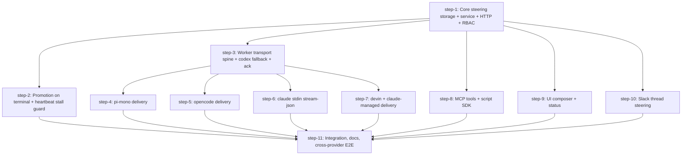

# Harness Steering — Plan (DAG)

## Overview

Deliver **steering**: sending an additional user/lead message into a task that is *already running*, across all six harness providers, exposed via MCP (agent + user), the script SDK, HTTP, the UI, and Slack — with an explicit `mode: "steer" | "queue"` and a graceful per-provider degradation ladder.

- **Motivation**: Today nothing can reach an `in_progress` task. Every "give the agent more input" path creates a new task row consumed only by *idle* agents via `/api/poll` (`src/http/poll.ts:320-321`). Corrections land after the agent has already gone the wrong way.
- **Related**: [`thoughts/taras/research/2026-07-24-harness-steering.md`](../../research/2026-07-24-harness-steering.md) — binding decisions 1–15.

## Current State Analysis

- **No steering primitive exists.** Zero hits for `steer`/`interrupt` in `src/`. The only proven live-injection channel is cancellation: `GET /cancelled-tasks` (`src/http/core.ts:354-406`) polled by the runner (`src/commands/runner.ts:5230-5260`, ≤5s cadence while active) and by adapters on `tool_start` (`src/providers/swarm-events-shared.ts:107-142`, 500ms throttle). It carries a boolean, but the transport skeleton generalizes.
- **`ProviderSession` is a 4-member interface** (`src/providers/types.ts:128-133`): `sessionId`, `onEvent`, `waitForCompletion`, `abort`. Adding `deliverSteering?()` as **optional** is purely additive across all 6 implementers.
- **The runner already holds a live session handle per task**: `RunningTask.session` inside `state.activeTasks: Map<string, RunningTask>` (`runner.ts:1753-1798`, populated `:5095`/`:5633`). The cancel block reaches `task.session.abort()` the same way steering will reach `task.session.deliverSteering()`.
- **Provider readiness is uneven and now fully verified** — and this asymmetry is **advertised, not hidden** (decision 16; see "Mode support is advertised" under Implementation Approach):
  - `pi-mono` — `this.agentSession` is already a private field (`pi-mono-adapter.ts:691`); `steer(text)` / `followUp(text)` confirmed in `node_modules/@earendil-works/pi-coding-agent/docs/sdk.md:76-77`. **Both modes native.**
  - `devin` — `sendMessage(orgId, apiKey, sessionId, message)` (`devin-api.ts:150-155`) already called in prod for approvals (`devin-adapter.ts:704`); `orgId`/`devinApiKey`/`_sessionId` are session-scoped fields.
  - `claude-managed` — `this.client.beta.sessions.events.send(this._sessionId, { events: [{ type: "user.message", content }] })` is the *exact* init-send shape (`claude-managed-adapter.ts:629-638`); handles are `private readonly` (`:235-236`).
  - `opencode` — SDK **does** expose `session.promptAsync` (`sdk.gen.d.ts:182`) and `session.abort` (`:150`). But `client` is a local `let` in `createSession()` (`opencode-adapter.ts:801`) and is **not** a constructor param of `OpencodeSession` (`:290-300`) — it must be lifted to a field.
  - `claude` — `Bun.spawn` at `:546-571`, argv built by `buildCommand()` (`:576-612`) which passes the prompt as `-p <prompt>`; **no `stdin` key at all**. `processStreams()` (`:624-733`) only reads stdout/stderr, so adding `stdin: "pipe"` is non-perturbing.
  - `codex` — `stdin.write(config); stdin.end()` in the same tick (`codex-adapter.ts:1607-1608`). **No injection path.** Fallback-only (decision 4).
- **Two gaps the research didn't surface, resolved in this plan**:
  1. **"The thread's latest *lead* task" is not retrievable today.** None of `getAgentWorkingOnThread` (`db.ts:2315-2330`), `getLatestActiveTaskInThread` (`:2336-2350`), `getMostRecentTaskInThread` (`:2357-2368`) filter on lead-ness; there is no `isLead` on `agent_tasks` — lead-ness lives on `agents.isLead` and is resolved in application code (`router.ts:81`). Decisions 5 and 6 both depend on it. **step-1 adds `getLatestLeadTaskInThread()` (join `agent_tasks.agentId → agents.isLead`) and a derived `isLeadTask` field on task read responses** so Slack (server-side) and the UI (client-side) apply one policy.
  2. **No segmented-control primitive exists in the UI.** `apps/ui/src/components/ui/` has no `ToggleGroup`/`RadioGroup`. step-9 adds the Queue/Interrupt control from existing `Button` variants rather than pulling in a new dependency.
- **Surface extension patterns are all well-worn** and quoted verbatim in the step files: MCP agent + user registration (`src/server.ts:341-343`, `src/server-user.ts:150-162`), RBAC verb + legacy-policy entry (`src/rbac/permissions.ts:44-47`, `src/rbac/legacy-policy.ts:149-153`), `route()` factory with inline `rbac:` (`src/http/tasks.ts:149-161` + `src/http/config.ts:195`), script SDK (`sdk-allowlist.ts` + hand-authored `SCRIPT_SDK_TYPES` at `src/be/scripts/typecheck.ts:137-139`), prompt registry gating (`src/prompts/base-prompt.ts:181-188`).

## Desired End State

A user or lead agent can send a message to a running task from the UI, Slack, an MCP tool, a script, or `curl`, choosing Queue (turn-boundary, default) or Interrupt. **Modes the target harness can't honor are surfaced up front** — the UI doesn't offer Interrupt on `claude` or `codex` — and a caller who passes `onUnsupported:"fail"` gets a `422` rather than a silent downgrade. By default the message still lands: in live model context on `pi-mono`, `claude-managed`, and `opencode`; degraded to queue on `claude` and `devin`; promoted to a follow-up task on `codex` — and the caller is *told which happened*. The agent explicitly acknowledges handling. If the task dies or finishes before delivery, the message is promoted into a follow-up task rather than lost.

**Verified by**: the Global Verification block below plus the per-step Automated QA.

## What We're NOT Doing

- **Adopting `@anthropic-ai/claude-agent-sdk`** (decision 13). Claude stays on raw `Bun.spawn`; `mode:"steer"` degrades to queue there. Not deferred — not planned.
- **Abort-and-rerun for codex** (decision 4). Codex steering always falls back to a queued follow-up task.
- **Server-side auto-detection** of steer-vs-queue (decision 14). Mode is always explicit; only *degradation* is implicit, and it is reported.
- **Hook-based delivery.** `src/hooks/hook.ts` only ever emits `HookBlockResponse` (`:137-140`); it has no `hookSpecificOutput`/`additionalContext` path. Delivery goes through the runner's live `ProviderSession` handle instead.
- **Websockets/SSE in the UI.** Steering status renders off the existing REST polling (10s global, 5s logs).
- **Rendering steering messages through the `src/logs-parser/` normalized IR.** step-9 renders them from a dedicated list endpoint as their own section. IR integration is a derail note.

## Implementation Approach

- **step-1 is the contract.** It is deliberately the largest node: it owns **every** change to `src/be/db.ts`, `src/types.ts`, and `src/be/migrations/` for this feature, including helpers only later steps consume. This is what makes the 5-wide fan-out safe — no other step touches those files.
- **Split at the architecture boundary.** step-1 is server-side (API owns the DB); step-3 is worker-side (HTTP only, no `src/be/db` imports — enforced by `scripts/check-db-boundary.sh`). This mirrors the repo's hard invariant rather than cutting across it.
- **The fallback ladder lives in the core service, not in callers.** `steer → queue → follow-up task` is decided server-side from the target task's provider + status, and returned as a discriminated `outcome`. Every surface just renders the outcome.
- **Mode support is advertised, and failing is opt-in** (decision 16). Silent degradation is a trust problem: Interrupt and Queue differ in a way that matters — if the agent is doing something destructive *right now*, a downgraded Interrupt lets the destructive turn finish. The fix is to stop *offering* a mode the target can't honor, not to break the majority of the fleet:
  - A static `PROVIDER_STEER_CAPABILITIES` map (server-side, step-1) is surfaced as **`supportedSteerModes`** on task read responses. The UI disables/annotates Interrupt on `claude` and `codex` **before** the user picks it (step-9); the MCP tool description states per-provider support (step-8).
  - `POST /api/tasks/{id}/steer` takes **`onUnsupported: "degrade" | "fail"`, default `"degrade"`**. Programmatic callers who need true interrupt semantics pass `"fail"` and get a `422` instead of a silent downgrade.
  - Default stays `degrade` so the message is never dropped — claude is the fleet's most-used provider and would otherwise fail every Interrupt, and codex would lose steering entirely rather than falling back to a follow-up task.
  - The static map **must** stay in sync with each adapter's `traits.steerModes` — enforced by a test, not by convention (step-11).
- **step-3 ships with codex's null implementation as its own QA.** The transport spine is provable end-to-end before any provider work lands, because "codex falls back to a follow-up task" exercises the whole path.
- **Shared-doc edits are centralised in step-11** (`runbooks/harness-providers.md`, `MCP.md`, `docs-site/`) to avoid four parallel provider agents conflicting on the same files. `runbooks/heartbeat-crash-recovery.md` is the exception — it belongs to step-2, which is the only step touching heartbeat logic.
- **Trade-off accepted**: step-1 has ~7 sub-steps, above the usual split threshold. Splitting it would produce a purely sequential chain (storage → service → routes) with zero added parallelism, so it stays one node.

## Quick Verification Reference

- `bun test` · `bun test src/tests/<file>.test.ts`
- `bun run lint` (read-only — CI runs `lint`, not `lint:fix`)
- `bun run tsc:check`
- `bash scripts/check-db-boundary.sh` · `bash scripts/check-api-key-boundary.sh`
- `bun run check:rbac-coverage` · `bun run check:dep-graph`
- `bun run docs:openapi` → commit `openapi.json` + `docs-site/content/docs/api-reference/**`
- `bun run build:script-types` → commit `src/scripts-runtime/types/*.d.ts`
- UI: `cd apps/ui && bun install --frozen-lockfile && bun run lint && bunx tsc -b`

## DAG



## Steps

| ID | Name | Depends on | Status | File |
|----|------|------------|--------|------|
| step-1 | Core steering storage + service + HTTP + RBAC | — | ready | [step-1.md](./step-1.md) |
| step-2 | Promotion on terminal + heartbeat stall guard | step-1 | ready | [step-2.md](./step-2.md) |
| step-3 | Worker transport spine + codex fallback + ack | step-1 | ready | [step-3.md](./step-3.md) |
| step-4 | pi-mono delivery (both modes native) | step-3 | ready | [step-4.md](./step-4.md) |
| step-5 | opencode delivery (promptAsync / abort+prompt) | step-3 | ready | [step-5.md](./step-5.md) |
| step-6 | claude stdin stream-json (queue-only) | step-3 | ready | [step-6.md](./step-6.md) |
| step-7 | devin + claude-managed delivery | step-3 | ready | [step-7.md](./step-7.md) |
| step-8 | MCP tools (agent + user) + script SDK | step-1 | ready | [step-8.md](./step-8.md) |
| step-9 | UI steer composer + status rendering | step-1 | ready | [step-9.md](./step-9.md) |
| step-10 | Slack thread steering (config-gated) | step-1 | ready | [step-10.md](./step-10.md) |
| step-11 | Integration, docs, cross-provider E2E | step-2, step-4, step-5, step-6, step-7, step-8, step-9, step-10 | ready | [step-11.md](./step-11.md) |

> **Canonical dependencies and execution status live in each `step-<n>.md`'s frontmatter.** This table is a derived snapshot at plan creation.

### File-ownership map (read this before fanning out)

| File / area | Owned by | Everyone else |
|---|---|---|
| `src/be/migrations/*`, `src/be/db.ts`, `src/types.ts` | **step-1** | consume only — do not edit |
| `src/http/tasks.ts`, `src/http/core.ts` (steering routes) | **step-1** | consume only |
| `src/rbac/permissions.ts`, `src/rbac/legacy-policy.ts` | **step-1** | consume only |
| `src/heartbeat/*`, `runbooks/heartbeat-crash-recovery.md` | **step-2** | — |
| `src/commands/runner.ts`, `src/providers/types.ts`, `src/tools/accept-steer.ts` | **step-3** | providers implement the interface only |
| `src/providers/pi-mono-adapter.ts` | step-4 | — |
| `src/providers/opencode-adapter.ts` | step-5 | — |
| `src/providers/claude-adapter.ts` | step-6 | — |
| `src/providers/devin-adapter.ts`, `claude-managed-adapter.ts`, `devin-api.ts` | step-7 | — |
| `src/tools/steer-task.ts`, `src/server.ts`, `src/server-user.ts`, `src/be/scripts/typecheck.ts` | step-8 | — |
| `apps/ui/**` | step-9 | — |
| `src/slack/**` | step-10 | — |
| `runbooks/harness-providers.md`, `MCP.md`, `docs-site/**`, `openapi.json` final regen | **step-11** | do not edit |

⚠️ **Two shared files with split ownership** — keep edits in disjoint regions:
- `src/tools/tool-config.ts` (`ALL_TOOLS`): step-3 adds `accept-steer`; step-8 adds `steer-task`.
- `src/scripts-runtime/sdk-allowlist.ts`: step-3 adds `accept-steer` to **`EXCLUDED_TOOLS`**; step-8 adds `task_steer` to **`SDK_TOOL_NAME_MAP`**. Each step must land its own entry so `scripts/check-sdk-tool-registration.ts` stays green independently.

## Pre-flight Verification

- [ ] Working tree is clean (or only intentional in-flight work)
- [ ] Baseline tests pass: `bun test`
- [ ] Baseline typecheck passes: `bun run tsc:check`
- [ ] Migration number is still free: `ls src/be/migrations/ | sort -V | tail -3` shows `120_task_title.sql` as the highest. **If PR #1003 (extension system, migrations 118–121) has merged, renumber step-1's migration to the next free slot.**
- [ ] Claude Code CLI in the worker image is **≥ 2.1.205** (required by step-6): `docker run --rm agent-swarm-worker:latest claude --version`
- [ ] `bun run docker:build:worker` succeeds on the current branch

## Global Verification

Run after all steps complete:

- [ ] Whole-repo typecheck: `bun run tsc:check`
- [ ] Full test suite: `bun test`
- [ ] Lint (read-only, as CI runs it): `bun run lint`
- [ ] Boundary checks: `bash scripts/check-db-boundary.sh && bash scripts/check-api-key-boundary.sh`
- [ ] RBAC coverage: `bun run check:rbac-coverage`
- [ ] Dep graph: `bun run check:dep-graph`
- [ ] SDK tool registration: `bun run scripts/check-sdk-tool-registration.ts`
- [ ] OpenAPI is fresh: `bun run docs:openapi && git diff --exit-code openapi.json docs-site/content/docs/api-reference/`
- [ ] Script types are fresh: `bun run build:script-types && git diff --exit-code src/scripts-runtime/types/`
- [ ] UI builds: `cd apps/ui && bun install --frozen-lockfile && bun run lint && bunx tsc -b`
- [ ] Fresh-DB migration: `rm -f agent-swarm-db.sqlite* && bun run start:http` boots and creates `task_steering_messages`
- [ ] Existing-DB migration: boot against a pre-existing `agent-swarm-db.sqlite` and confirm migration `121` applies cleanly
- [ ] Docker images build: `docker build -f Dockerfile.worker .`
- [ ] **Cross-provider matrix** — see Manual E2E below; every provider reports its expected `outcome`

## Manual E2E

Real commands, adapted from [LOCAL_TESTING.md](../../../../LOCAL_TESTING.md). Run from repo root. Replace `<TASK_ID>` with a real UUID from the API.

### 0. Bring up a clean local swarm

```bash
# Check the port is free first — worktrees collide here
lsof -i :3013

rm -f agent-swarm-db.sqlite agent-swarm-db.sqlite-wal agent-swarm-db.sqlite-shm
bun run start:http &

bun run docker:build:worker

SUFFIX=$(git branch --show-current | tr '/' '-')
docker run --rm -d --name e2e-lead-$SUFFIX --env-file .env.docker-lead \
  -e AGENT_ROLE=lead -e MAX_CONCURRENT_TASKS=1 -p 3201:3000 agent-swarm-worker:latest
docker run --rm -d --name e2e-worker-$SUFFIX --env-file .env.docker \
  -e MAX_CONCURRENT_TASKS=1 -p 3203:3000 agent-swarm-worker:latest

sleep 15
curl -s -H "Authorization: Bearer 123123" http://localhost:3013/api/agents \
  | jq '.agents[] | {name, isLead, status}'
```

### 1. Create a long-running task, then steer it (HTTP)

```bash
# Create a task that will run long enough to steer
TASK_ID=$(curl -s -X POST http://localhost:3013/api/tasks \
  -H "Authorization: Bearer 123123" -H "Content-Type: application/json" \
  -d '{"task":"Count slowly from 1 to 40, printing one number every few seconds.","source":"api"}' \
  | jq -r '.task.id')
echo "task=$TASK_ID"

# Wait until it is actually in_progress
until [ "$(curl -s -H "Authorization: Bearer 123123" \
  http://localhost:3013/api/tasks/$TASK_ID | jq -r '.task.status')" = "in_progress" ]; do sleep 3; done

# QUEUE mode (the default)
curl -s -X POST http://localhost:3013/api/tasks/$TASK_ID/steer \
  -H "Authorization: Bearer 123123" -H "Content-Type: application/json" \
  -d '{"message":"Stop at 10 and tell me the sum so far.","mode":"queue"}' | jq

# INTERRUPT mode
curl -s -X POST http://localhost:3013/api/tasks/$TASK_ID/steer \
  -H "Authorization: Bearer 123123" -H "Content-Type: application/json" \
  -d '{"message":"Actually stop right now.","mode":"steer"}' | jq

# Lifecycle readout — expect pending -> delivered -> handled
curl -s -H "Authorization: Bearer 123123" \
  http://localhost:3013/api/tasks/$TASK_ID/steering-messages \
  | jq '.messages[] | {mode, status, deliveredMode, createdAt, deliveredAt, handledAt}'
```

**Expect**: the `outcome` in each POST response names what actually happened (`steered` / `queued` / `promoted`), and the message text appears in the worker's session logs:

```bash
docker logs e2e-worker-$SUFFIX 2>&1 | grep -i "steer"
curl -s -H "Authorization: Bearer 123123" \
  "http://localhost:3013/api/tasks/$TASK_ID/session-logs?limit=50" | jq '.logs[].eventType' | sort | uniq -c
```

### 2. Per-provider matrix

Repeat step 1 with `HARNESS_PROVIDER` set on the worker container. Expected `outcome` for `mode:"steer"`:

| Provider | Worker env | Expected `outcome` |
|---|---|---|
| pi-mono | `-e HARNESS_PROVIDER=pi` | `steered` |
| claude-managed | `-e HARNESS_PROVIDER=claude-managed` | `steered` |
| devin | `-e HARNESS_PROVIDER=devin` | `queued` (degraded — step-7 finding: Devin does not guarantee interruption) |
| opencode | `-e HARNESS_PROVIDER=opencode -e MODEL=openrouter/deepseek/deepseek-v4-flash` | `steered` (abort+prompt) |
| claude | `-e HARNESS_PROVIDER=claude` | `queued` (degraded — decision 13) |
| codex | `-e HARNESS_PROVIDER=codex` | `promoted` + a new follow-up task exists |

```bash
docker stop e2e-worker-$SUFFIX
docker run --rm -d --name e2e-worker-$SUFFIX --env-file .env.docker \
  -e HARNESS_PROVIDER=<provider> -e MAX_CONCURRENT_TASKS=1 -p 3203:3000 agent-swarm-worker:latest
```

For codex, confirm the promotion produced a real task:

```bash
curl -s -H "Authorization: Bearer 123123" \
  "http://localhost:3013/api/tasks?parentTaskId=$TASK_ID" | jq '.tasks[] | {id, taskType, task}'
```

### 3. Promotion on terminal status (step-2)

```bash
# Steer a task, then immediately cancel it before delivery can happen
curl -s -X POST http://localhost:3013/api/tasks/$TASK_ID/steer \
  -H "Authorization: Bearer 123123" -H "Content-Type: application/json" \
  -d '{"message":"This should get promoted, not lost.","mode":"queue"}' | jq
curl -s -X POST http://localhost:3013/api/tasks/$TASK_ID/cancel \
  -H "Authorization: Bearer 123123" | jq '.task.status'

curl -s -H "Authorization: Bearer 123123" \
  http://localhost:3013/api/tasks/$TASK_ID/steering-messages \
  | jq '.messages[] | {status, promotedTaskId}'   # expect status="promoted", promotedTaskId set
```

### 4. MCP tool round-trip (step-8)

Full handshake per LOCAL_TESTING.md § "MCP tool testing over HTTP":

```bash
AGENT_ID=$(uuidgen)
curl -sN -X POST http://localhost:3013/mcp \
  -H "Authorization: Bearer 123123" -H "X-Agent-ID: $AGENT_ID" \
  -H "Accept: application/json, text/event-stream" -H "Content-Type: application/json" \
  -d '{"jsonrpc":"2.0","id":1,"method":"initialize","params":{"protocolVersion":"2024-11-05","clientInfo":{"name":"curl","version":"1"},"capabilities":{}}}' \
  -D -   # grab mcp-session-id

curl -s -X POST http://localhost:3013/mcp \
  -H "Authorization: Bearer 123123" -H "X-Agent-ID: $AGENT_ID" \
  -H "mcp-session-id: <session-id>" \
  -H "Accept: application/json, text/event-stream" -H "Content-Type: application/json" \
  -d '{"jsonrpc":"2.0","method":"notifications/initialized"}'

curl -sN -X POST http://localhost:3013/mcp \
  -H "Authorization: Bearer 123123" -H "X-Agent-ID: $AGENT_ID" \
  -H "mcp-session-id: <session-id>" \
  -H "Accept: application/json, text/event-stream" -H "Content-Type: application/json" \
  -d "{\"jsonrpc\":\"2.0\",\"id\":2,\"method\":\"tools/call\",\"params\":{\"name\":\"steer-task\",\"arguments\":{\"taskId\":\"$TASK_ID\",\"message\":\"steer via mcp\",\"mode\":\"queue\"}}}"
```

### 5. UI (step-9)

```bash
cd apps/ui && bun run dev    # port 5274; use --port 5275 if taken
```

Open `http://localhost:5274/tasks/<TASK_ID>` while it is `in_progress` → the steer composer is visible with **Queue preselected**; send in each mode and confirm the status badge moves `pending → delivered → handled`. Then open `http://localhost:5274/sessions/<ROOT_TASK_ID>` and confirm `SessionComposer` shows the toggle only when the latest lead task is `in_progress`, and still creates a chained task otherwise.

**PR requirement**: this touches `apps/ui/` → a `qa-use` session with screenshots is required by the merge gate.

### 6. Slack (step-10)

Dev channel `#swarm-dev-2` (`C0AR967K0KZ`), bot `@dev-swarm` (`U0ALZGQCF96`).

```bash
# enable steering, then reload config
curl -s -X PUT http://localhost:3013/api/config \
  -H "Authorization: Bearer 123123" -H "Content-Type: application/json" \
  -d '{"SLACK_THREAD_STEERING":"lead"}' | jq
curl -s -X POST http://localhost:3013/api/config/reload -H "Authorization: Bearer 123123" | jq
```

Post `<@U0ALZGQCF96> start a long task` in `#swarm-dev-2`, then reply in-thread while it runs. **Expect**: the reply flows through the `ADDITIVE_SLACK` debounce window (default 10s, `ADDITIVE_SLACK_BUFFER_MS`), then flushes as **one** steering message (not a dependent follow-up task), the bot adds an `:eyes:` reaction, and the tree message shows a "steered" marker. Reply again after the task finishes → confirm it still creates a new task (today's behavior, unchanged).

### 7. Cleanup

```bash
docker stop e2e-lead-$SUFFIX e2e-worker-$SUFFIX
kill $(lsof -ti :3013)
```

## Appendix

- **Derail notes**:
  - `GET /cancelled-tasks` (`src/http/core.ts:354-406`) is a raw `matchRoute` handler predating the `route()` factory, so it is absent from OpenAPI. Worth migrating, out of scope here.
  - `canResume()` is on `ProviderAdapter` for all 6 adapters but has **zero production call sites** (only tests). Dead interface member.
  - Steering messages are rendered as their own UI section, not through the `src/logs-parser/` normalized IR. Folding them into the shared timeline IR is a follow-up.
  - `SLACK_THREAD_FOLLOWUP_REQUIRE_MENTION` is read via raw `process.env` in `router.ts:33-34` rather than a typed config accessor; the new `SLACK_THREAD_STEERING` flag follows the same pattern for consistency, but both would be better as typed accessors.
- **References**:
  - Research: `thoughts/taras/research/2026-07-24-harness-steering.md`
  - Runbooks: `runbooks/heartbeat-crash-recovery.md`, `runbooks/harness-providers.md`, `runbooks/ci.md`
  - Testing: `LOCAL_TESTING.md`, `swarm-local-e2e` skill
