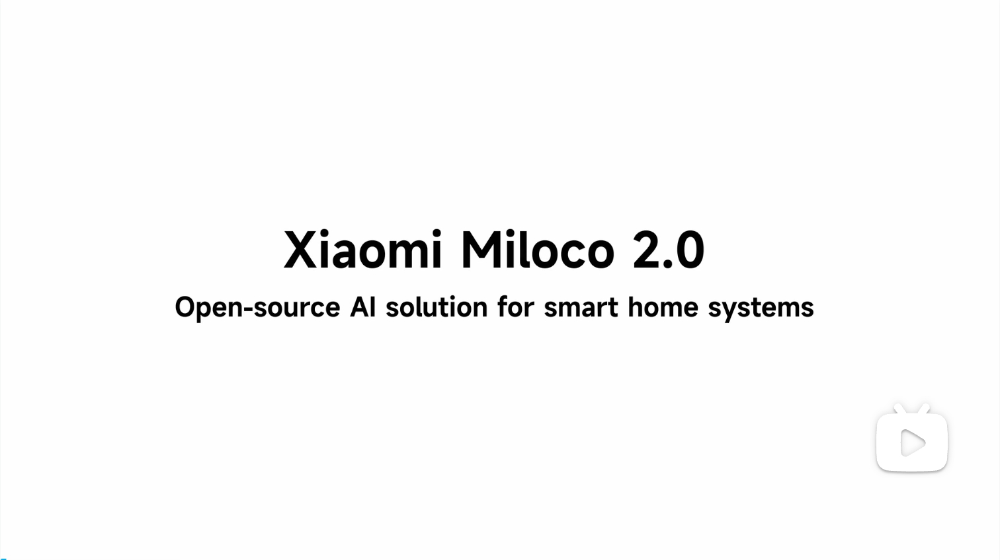

<div align="center">

# Xiaomi Miloco

English | [简体中文](README.zh.md)

[](https://github.com/XiaoMi/xiaomi-miloco/releases/latest)
[](https://github.com/XiaoMi/xiaomi-miloco/releases)
[](https://github.com/XiaoMi/xiaomi-miloco/stargazers)
[](https://github.com/XiaoMi/xiaomi-miloco/pulls)

</div>

Xiaomi's open-source AI solution for the future of whole-home intelligence. It uses the video and audio from Mi Home cameras as a full-modal perception gateway, the in-house MiMo large model as its intelligent brain, and runs as an Agent plugin on top of [OpenClaw](https://openclaw.ai) to orchestrate whole-home devices for a proactive, intelligent experience.

Miloco 2.0 perceives what happens at home, makes proactive decisions and controls devices based on common sense, breaks down "vague and long-term" goals into trackable household tasks, recognizes family members, and—drawing on home memory—delivers personalized service to each member: querying and controlling devices, tuning the home to each member's comfort, or offering useful reminders at the right moment.

<p align="center"><a href="https://www.bilibili.com/video/BV1p4jw6nEVX"></a></p>

## What's New

- **2026-08-06** — Release v2026.8.6: hotfix for v2026.8.5 — reverts camera IP direct-connect, whose bundled native library could crash the camera process with SIGSEGV on some older camera models; everything else from v2026.8.5 stays, plus Smart Crop scaling reworked to fit the same-tier panorama frame per axis.
- **2026-08-05** — Release v2026.8.5: adds experimental pet recognition with a full registration and roster workflow, Smart Crop adaptive resolution that crops the active region before omni inference, and one-click self-upgrade from the dashboard; plus camera IP direct-connect with cross-NAT streaming diagnostics, an agent action ledger, process CPU / thread-count charts on the Perf page, and leaner default thread pools.
- **2026-07-17** — Release v2026.7.17: adds a Hermes Agent compatibility layer for pluggable agent runtimes, dual-camera multi-channel dual-stream perception, and omni multi-model support with runtime FPS hot-reload; plus a dedicated Tasks tab, per-camera mic toggle, and timezone / version / install hardening.
- **2026-07-03** — Release v2026.7.3: adds event-feedback packaging and a conversational first-run setup, proactively initiated on fresh installs; plus improvements to in-dashboard model-config management, perception stability (false-"person" detection guarding), camera lifecycle, and CLI diagnostics.
- **2026-06-18** — Miloco 2.0 officially released: re-architected as an OpenClaw plugin, adding general common sense, identity recognition, home memory, household tasks, proactive intelligence, and a home dashboard. See [Core Features](#core-features) below.

## Core Features

- **General Common Sense** — No preset rules required. Built-in common sense automatically detects hazards and raises tiered alerts (e.g. a child playing with knives, an elderly person falling).
- **Identity Recognition** — Fuses identity signals such as faces and body posture, with the large model recognizing family members. Supports proactively registering new members and identity-based personalized operations.
- **Home Memory** — Distills long-term habits and preferences of family members from perception and interaction, used as a reference when the Agent makes proactive decisions. Stable long-term habits can also trigger proactive reminders or be promoted into automatically executed household tasks.
- **Household Tasks** — Upgrades from single "condition-triggered rules" to complex, long-running household tasks: conditional automation ("turn on the lights when someone enters"), scheduled reminders ("remind me to take medicine every day"), habit tracking ("exercise half an hour daily"), and more. Once triggered, the Agent understands the intent and executes autonomously.
- **Proactive Intelligence** — Built on the four foundational capabilities—general common sense, identity recognition, home memory, and household tasks—the system observes, reasons, and intervenes at the right time like a butler with common sense who knows the family and can plan ahead, getting things done before the user even asks.
- **Home Dashboard** — A user-facing web dashboard for viewing a real-time overview of the home, Mi Home devices, family members and profiles, and the history of past events.

> [!TIP]
> **Raise your own Miloco.** Its out-of-the-box behavior won't always match your taste—just tell Miloco through OpenClaw (e.g. "don't remind me when the place is messy"), and it remembers your preference and adjusts what it does proactively. Every remark "raises" a Miloco that's tuned to your home, and it knows you better the longer you live with it.

## Prerequisites

- **Hardware**: ≥ 4GB RAM and ≥ 256GB storage recommended, running 24/7. A Mac mini is recommended.
- **Operating System**: macOS / Linux (run under WSL on Windows).
- **OpenClaw** — Miloco runs as a plugin on top of it, so [install it](https://openclaw.ai) first with version ≥ 2026.5.2.
- **Xiaomi account** + devices already added to Mi Home.
- **Multimodal large model API key** — [Xiaomi MiMo](https://platform.xiaomimimo.com) is recommended: MiMo-v2.5 for perception, MiMo-v2.5-pro for the Agent (configured in OpenClaw).

> [!CAUTION]
> **Cost note**: Miloco 2.0's perception and Agent rely primarily on cloud-based large models and will incur ongoing API usage costs—keep an eye on your usage. You can review token consumption on the "Models" page of the home dashboard.

## Install

### Option 1: Install via the Agent (recommended)

Works with both **OpenClaw** and **[Hermes Agent](https://github.com/NousResearch/hermes-agent)** — send this instruction to your agent:

```text
Please install the Miloco plugin for me: https://raw.githubusercontent.com/XiaoMi/xiaomi-miloco/main/scripts/install-guide.md
```

### Option 2: One-line command-line install

```bash
curl -LsSf https://github.com/XiaoMi/xiaomi-miloco/releases/latest/download/install.sh | bash
```

Default: OpenClaw. To install for Hermes Agent, specify it explicitly:

```bash
curl -LsSf https://github.com/XiaoMi/xiaomi-miloco/releases/latest/download/install.sh | bash -s -- --agent-platform=hermes
```

### Option 3: Build from source

From the project root, run:

```bash
bash scripts/install.sh --dev   # build from source (scripts/build.sh), then install locally
```

---

### Windows (WSL)

Whichever method you choose above, native Windows is not supported—install and run everything inside [WSL](https://learn.microsoft.com/en-us/windows/wsl/install).

> [!IMPORTANT]
> **Local camera streaming requires extra WSL networking setup.** The dashboard's live "right now at home" view pulls camera streams over the LAN, and WSL's default NAT mode blocks the UDP packets cameras send—so the feed won't load until you enable mirrored networking and allow the Hyper-V firewall.

1. **On Windows** — Add the following to `%USERPROFILE%\.wslconfig` (i.e. `C:\Users\<you>\.wslconfig`; create the file if missing), then run `wsl --shutdown` in PowerShell to restart WSL:

   ```ini
   [wsl2]
   networkingMode=mirrored
   ```

2. **On Windows (elevated PowerShell)** — Allow inbound traffic to WSL:

   ```powershell
   Set-NetFirewallHyperVVMSetting -Name '{40E0AC32-46A5-438A-A0B2-2B479E8F2E90}' -DefaultInboundAction Allow
   ```

3. **In WSL** — Once Miloco is installed, verify with `miloco-cli doctor` (it checks both the firewall and WSL networking).

## Quick Start

After installation, restart the OpenClaw gateway so the plugin takes effect:

```bash
openclaw gateway restart
```

Then open the home dashboard to complete the initial setup:

```bash
miloco-cli dashboard   # open the home dashboard in your browser (or visit http://<host>:1810/ directly)
```

Get started in three steps from the dashboard:

1. **Configure the model** — On the "Models" page, enter your MiMo `api_key` (skip if already filled in during installation). The model name and Base URL default to MiMo and need no changes.
2. **Bind your Xiaomi account** — Mi Home devices are pulled in automatically once bound.
3. **Enable camera perception** — On the "Overview" page, turn on the switch for cameras you want perceived (the rest stay off and are not analyzed).

You can also do this from the command line:

```bash
miloco-cli config set model.omni.api_key sk-xxx   # configure the model key (defaults to MiMo; usually the only thing needed)
miloco-cli account bind                           # bind your Xiaomi account
miloco-cli scope camera enable <did>              # enable perception for a specific camera
```

Once it's running, see the [User Manual](user_guide.md) for how to use Miloco day to day.

## Project Structure

```text
miloco-plugin/
├── backend/             # uv workspace
│   ├── miloco/          # main service: perception engine, rules, MIoT gateway
│   └── miot/            # MIoT SDK (standalone subpackage)
├── cli/                 # miloco-cli command-line tool
├── plugins/
│   ├── openclaw/        # OpenClaw plugin (TypeScript)
│   └── skills/          # Agent Skill docs
├── web/                 # home dashboard (React 19 + Vite)
├── scripts/             # build.sh / install.sh / manifest.json
└── knowledge/           # project knowledge base
```

## Further Documentation

- [Backend service](backend/README.md) — FastAPI + perception engine + rules + MIoT gateway
- [Command-line miloco-cli](cli/README.md) — service, device, and config management
- [Home dashboard web](web/README.md) — deployment architecture and local development
- [Full knowledge base](knowledge/README.md) — architecture / modules / features / API quick reference

## Community

Run into issues, want to give feedback, or just chat about use cases? Scan the QR code to join our Feishu user group (the QR code never expires):


## Acknowledgements

Miloco stands on the shoulders of the following open-source projects:

- [OpenClaw](https://openclaw.ai) — AI Agent runtime and plugin platform
- [jMuxer](https://github.com/samirkumardas/jmuxer) (MIT) — real-time video stream muxing for the home dashboard
- [BGE / bge-small-zh-v1.5](https://huggingface.co/BAAI/bge-small-zh-v1.5) (BAAI, MIT) — text embedding model
- [Silero VAD](https://github.com/snakers4/silero-vad) (Silero Team, MIT) — voice activity detection, gating the perceived speech field

## License

See [LICENSE.md](LICENSE.md) for the full license terms.

**Important notice**: This project is for non-commercial use only. Without written authorization from Xiaomi Inc., it may not be used to develop applications (apps), web services, or other forms of software.
