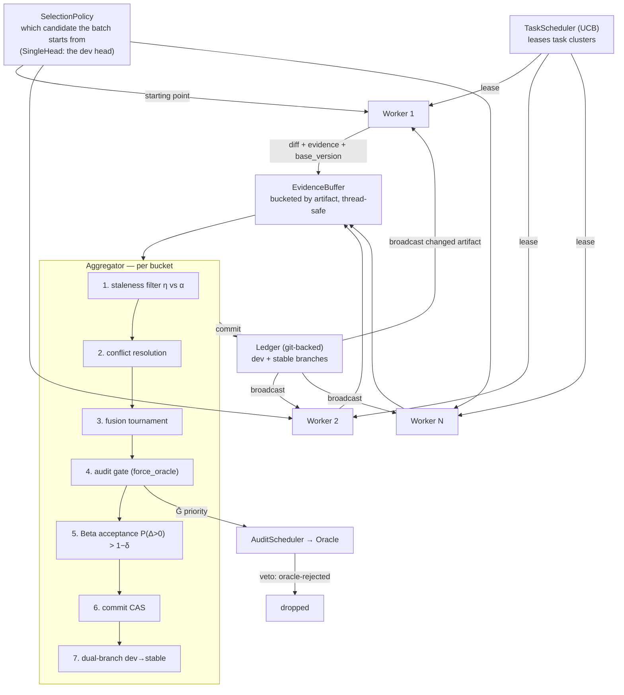
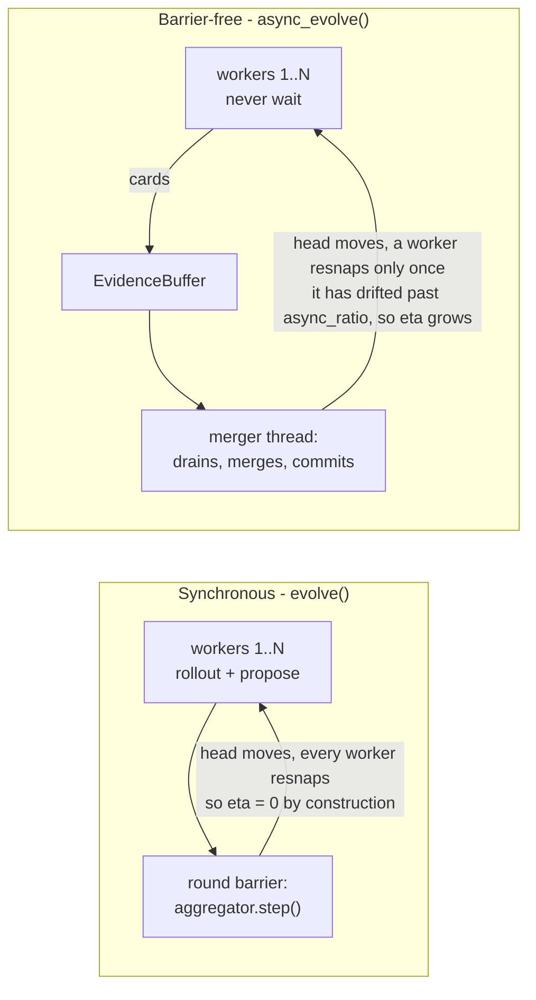

# Architecture

This document explains how AgentDescent's components fit together and how a diff
travels from a worker to a committed change in the shared artifact library.

For the *why* behind each mechanism see [concepts.md](concepts.md); for how to
run the system see [install and first run](install.md); for extending it, [run everything, and extend it](usage.md).

---

## 1. The one-paragraph model

AgentDescent runs **N workers in parallel**. Each worker takes a snapshot of a
shared, versioned **artifact library** (the `Ledger`), runs tasks against it,
and emits a **diff + evidence card** (a "gradient"). A single **Aggregator**
(the "optimizer") collects these diffs per-artifact, resolves conflicts, fuses
complementary ones, accepts them by a statistical test, and commits the winner
back to the Ledger — which is then broadcast to workers. Everything else
(schedulers, verifier, governance) exists to make that loop fast, safe, and
resistant to the three long tails.

---

## 2. Data flow



The same flow, with the design-doc section numbers annotated:

```
                ┌──────────────────────────────────────────────┐
                │            TaskScheduler (UCB)                │  §5.2
                │   leases task clusters to workers              │
                └───────────────┬──────────────────────────────┘
                     lease tasks │
        ┌─────────────┬──────────┴────────┬─────────────┐
        ▼             ▼                    ▼             ▼
   Worker 1      Worker 2       ...     Worker N      each holds a Ledger
   rollout+      rollout+               rollout+      snapshot  V_i  (may lag
   propose       propose                propose       head → staleness η)
        │             │                    │             │
        └──── Diff + EvidenceCard + base_version ─────────┘
                              │
                              ▼
                  EvidenceBuffer  (bucketed by artifact, thread-safe)   §4.1
                              │
                              ▼
        ┌─────────────────────────────────────────────────────┐
        │                 Aggregator  (per bucket)             │  §4
        │  1. staleness filter   η vs α  → ACCEPT/REBASE/DISCARD│  §4.2
        │  2. conflict resolve   contradictions dropped         │  §4.3
        │  3. fusion tournament  complementary diffs merged     │  §4.3
        │  4. audit gate         oracle may VETO here            │  §5.3
        │  5. Beta acceptance    P(Δ>0) > 1−δ                    │  §4.4
        │  6. commit             CAS (one artifact per merge)     │  §4.1
        │  7. dual-branch        dev → stable, K clean rounds     │  §4.5
        └───────────────────────────┬─────────────────────────┘
                                     ▼
                    Ledger  (git-backed, version-vectored)         §3.1
                     dev branch (fast)   stable branch (EMA-confirmed)
                                     │
                    broadcast changed artifact → Workers refresh

           (step 4 above submits the candidate to the AuditScheduler,
            which spends the oracle budget by Ĝ and may VETO it)      §5.3
```

Two decisions in that picture are easy to confuse, and they are different
questions asked by different components:

* the **`TaskScheduler`** picks *which task* a worker rolls out;
* the **[`SelectionPolicy`](selection.md)** picks *which candidate* it starts
  from.

The default `SingleHead` answers the second with "the `dev` head", for every
worker, which is what the engine has always done — so the two arrows into each
worker carry a task and an artifact respectively. Selection sits **above** the
merge rather than instead of it: `k` starting points, `N/k` workers under each,
and the aggregator merging their diffs back into their own starting point.

The three-layer **verifier** (rule / learned / oracle) is the evaluation backend
the Aggregator calls at steps 1–3 and 5 (cheap) and at step 4 (oracle, budgeted).

!!! note "The audit is a gate, not a spot-check"
    It runs *before* the acceptance test and can return `oracle-rejected` outright,
    so it sits on the critical path of every merge that trips `force_oracle` — the
    diagrams used to place it after the commit with a dotted "spot-check" arrow,
    which reads as advisory when it holds a veto.

---

## 3. Component responsibilities

| Component | Module | Responsibility |
|---|---|---|
| [**Evolvable**](data-model.md) | [`evolvable.py`](https://github.com/Birfy/agentdescent/blob/main/agentdescent/evolvable.py) | The interface every unit of evolution implements (`diff`/`apply`/`evidence_eval`). Also `Diff`, `EvidenceCard`, version-vector math. |
| [**Ledger**](ledger.md) | [`ledger.py`](https://github.com/Birfy/agentdescent/blob/main/agentdescent/ledger.py) | Git-backed store. Per-artifact integer versions form the version vector. CAS commits and `dev`/`stable` branches; `commit_atomic` (2PC across artifacts) is provided and tested but not used by any engine path today. Runs git with an isolated config (no system/user `gitconfig`, no hooks, no signing) so a personal git preference cannot decide whether the ledger can write. |
| [**Aggregator**](aggregator.md) | [`aggregator.py`](https://github.com/Birfy/agentdescent/blob/main/agentdescent/aggregator.py) | The optimizer. Buckets evidence by artifact and runs the 7-step merge pipeline. Owns the per-artifact Beta posteriors. |
| [**StalenessPolicy**](staleness.md) | [`staleness.py`](https://github.com/Birfy/agentdescent/blob/main/agentdescent/staleness.py) | Full / Guarded / Reflective. Decides `ACCEPT/REBASE/DISCARD` for a stale diff. Swappable without touching the pipeline. |
| [**Verifier**](verifier.md) | [`verifier.py`](https://github.com/Birfy/agentdescent/blob/main/agentdescent/verifier.py) | rule (cheap subset), learned (noisy + uncertainty), oracle (ground truth, budgeted). The cheap subset is **fixed for the run**, so candidates ranked against each other are always scored on the same tasks; `evolve(cheap_eval_tasks=)` sizes it. |
| [**Schedulers**](duration-scheduling.md) | [`scheduler.py`](https://github.com/Birfy/agentdescent/blob/main/agentdescent/scheduler.py) | `TaskScheduler` (UCB over task **clusters** — the design's `× artifact` axis is not implemented), `AuditScheduler` (oracle-budget allocation + trust; its priority queue has no consumer), `ResumeQueue` (straggler records; nothing resumes them — see §4). |
| [**Governance**](governance.md) | [`governance.py`](https://github.com/Birfy/agentdescent/blob/main/agentdescent/governance.py) | `classify` is the single definition of the L1/L2 boundary (`FAST_MAX = 0.30`), used by the aggregator's staleness tolerance and the audit gate rather than re-derived. L0 is reached by name, not radius, and is read-only to the loop. `L1SerialGate` is a primitive for concurrent merging, not in the path — the shipped runtimes merge on one thread. |
| **Worker (role)** | the `run` / `propose` callables the engine takes ([orchestrator](orchestrator.md)) | rollout + propose. Emits evidence cards; never mutates the Ledger directly. There is no `Worker` class — the role is two callables. |
| [**Sync runtime**](orchestrator.md) | [`orchestrator.py`](https://github.com/Birfy/agentdescent/blob/main/agentdescent/orchestrator.py) | `AgentDescent`: round-barrier DP loop + fork baseline. |
| [**Async runtime**](async.md) | [`async_runtime.py`](https://github.com/Birfy/agentdescent/blob/main/agentdescent/async_runtime.py) | `AsyncAgentDescent`: barrier-free thread pipeline + `async_ratio` + backpressure. |
| [**Parallel paradigms**](parallelism.md) | [`parallel.py`](https://github.com/Birfy/agentdescent/blob/main/agentdescent/parallel.py) | DP / TP / PP partition & recombine primitives. |
| **Reference domain** | [`domains/router.py`](https://github.com/Birfy/agentdescent/blob/main/agentdescent/domains/router.py) | A deterministic keyword-router skill so the whole loop runs with no LLM. See [Orchestrator](orchestrator.md#why-a-synthetic-domain-exists-at-all). |
| **Strategies** | [`evolution.py`](https://github.com/Birfy/agentdescent/blob/main/agentdescent/evolution.py) | What the artifact *is* and how a proposal becomes a diff: `SingleSlot` / `AppendRules` / `KeyedRules`. The key space is the op-space the aggregator merges over. See [Strategies](strategies.md). |
| **Directory evolution** | [`filetree.py`](https://github.com/Birfy/agentdescent/blob/main/agentdescent/filetree.py) · [`treestrategy.py`](https://github.com/Birfy/agentdescent/blob/main/agentdescent/treestrategy.py) · [`runners.py`](https://github.com/Birfy/agentdescent/blob/main/agentdescent/runners.py) | A directory as artifact state: state keys are file paths, so file-level fuse/contradict semantics come from the existing aggregator unchanged. The runner materialises each candidate into a throwaway workspace for a real agent. See [Directory evolution](directory-evolution.md). |
| **Agent layer** | [`agents.py`](https://github.com/Birfy/agentdescent/blob/main/agentdescent/agents.py) · [`backends.py`](https://github.com/Birfy/agentdescent/blob/main/agentdescent/backends.py) | The provider-agnostic `prompt -> text` contract, `WorkspaceAgent` for agents that act in a directory, and the document-task adapter. See [Agents](agents.md) and [Backends](backends.md). |
| **Task sampling** | [`sampling.py`](https://github.com/Birfy/agentdescent/blob/main/agentdescent/sampling.py) | Which task inside a worker's shard to roll out next — `RoundRobin` or UCB over learning signal. See [Sampling](sampling.md). |

---

## 3.5 What the infrastructure owns, and what the algorithm owns

An evolution algorithm decides *what to try and what to keep*. Everything else --
where a rollout runs, how many run at once, what happens when one dies -- is
machinery. `agentdescent/policies.py` is where that line is written down, as
`Protocol` definitions with no implementations.

| | owns |
|---|---|
| **the algorithm** | task sampling · proposal generation · conflict resolution · fusion · staleness · acceptance · promotion |
| **the infrastructure** | sandbox provisioning, placement, reuse and reclamation · quotas and admission · processes and re-dispatch · secret injection · environment fingerprints · all measurement |

And one thing neither owns, stated as a rule because it is easy to violate by
accident:

> **The algorithm may not see sandbox, process or host identity.** A policy that
> decides differently because a candidate came from worker 3 makes the run
> irreproducible, and makes any comparison between parallel configurations
> meaningless.

The testable form of that rule is purity: the default policies are functions of
`(artifact, cards, versions)` and read no ambient process state -- not
`os.environ`, not the working directory, not the clock. Multiple agents running
the same algorithm in different sandboxes is only a coherent idea if this holds.

Two consequences worth knowing when you write a policy:

* **Contracts are written from the call sites, not from these docs.** This page
  once described the verifier as three methods when the merge path calls four; a
  verifier written from the page raised `AttributeError` half an hour into a run.
  `tests/test_policy_contract.py` now greps the call sites and fails if the
  contract drifts.
* **Everything replaceable arrives in one argument.** `evolve(policies=...)`
  takes a [`Policies`](https://github.com/Birfy/agentdescent/blob/main/agentdescent/policies.py)
  bundle; the individual keyword arguments are shortcuts onto its fields and keep
  working. A field whose implementation has not landed raises rather than being
  accepted and ignored.

## 4. The two runtimes

!!! note "There is one engine now, and two runtimes on top of it"
    There used to be two *stacks*. The data-flow diagram above described the
    reference one --
    [`AgentDescent`](https://github.com/Birfy/agentdescent/blob/main/agentdescent/orchestrator.py)
    and [`AsyncAgentDescent`](https://github.com/Birfy/agentdescent/blob/main/agentdescent/async_runtime.py)
    with their own loops, worker dispatch and merger thread — while
    [`evolve()` / `async_evolve()`](evolution.md), the entry point every algorithm
    port uses, implemented the same shape again. This page called that "a known
    wart rather than a design intent", and it kept costing: two measured fixes
    hand-ported, two early-stop epsilons nobody chose, and three mechanisms the
    general engine re-derived — and got wrong — because the reference stack
    already had them.

    Both reference classes are now **adapters**: they describe the reference
    domain in the vocabulary `evolve()` and `async_evolve()` speak and run that.
    Their public surface is unchanged, and the numbers on the
    [results page](results.md) still come out of them.

    What the general engine gained on the way, each of which was a real gap for
    ordinary callers and not just migration scaffolding:

    | | |
    |---|---|
    | `evolve(refresh_interval=N)` | synchronous staleness. Without it `eta` was **0 by construction**, so `staleness_policy=` could not change a single decision on that path |
    | `RoundInfo.considered` / `discarded_stale` / `conflicts_dropped` / `fused` | what the merge *did*, per round — which `RoundStat` and `AsyncStats` had all along |
    | [`ClusterParallel`](parallelism.md) + `ParallelStrategy.observe` | UCB task-cluster leasing (§5.2 / L-task) moves to the general engine rather than being lost with the reference `TaskScheduler` |

    Partial-rollout **resume** is still unimplemented — `run(rendered, task) ->
    output` is opaque, so there is no continuation state to check point; both
    paths *detect* and count stragglers. What does exist is recovery one level
    coarser: a
    [task whose worker is lost is re-dispatched whole](execution.md#recovery-is-at-task-granularity),
    under the same lease id so a late answer from the original can be dropped.

    Three things the domain translation does not preserve exactly, listed in
    `agentdescent/domains/router.py`: `before_after_delta` and `evidence_eval`
    are measured over the whole cluster rather than the failing subset, and noise
    is per proposal rather than per worker — the general engine has one `propose`
    for every worker and, by design, no worker identity to branch on.

AgentDescent separates *what to merge* (the Aggregator, identical in both) from
*when workers and the aggregator run relative to each other* (the runtime).

That one sentence is the whole difference, and it is worth seeing rather than
reading — because everything the async path has to deal with follows from the
barrier being gone:



The consequence that costs the most to rediscover: with the default
`refresh_interval=1` the synchronous path hands every worker the round's fresh
snapshot, so `η` is **zero by construction** and the staleness policy cannot
change a single decision there. Staleness is a property of the *runtime*, not of
the algorithm — which is why `evolve(refresh_interval=N)` exists and why the
[staleness sweep](staleness.md) is meaningless without it.

### 4.1 Synchronous DP — `AgentDescent` (orchestrator.py)

A round barrier:

```
for round in range(R):
    leases = scheduler.select_batch(n_workers)   # UCB-ordered, cycling if
                                                 # there are fewer clusters
    for worker, cluster in zip(workers, leases):
        card = worker.run(snapshot, base_version, cluster.tasks)
        aggregator.ingest(card)
    aggregator.step()                            # <-- barrier: one sweep per round
```

Deterministic and easy to reason about. Used for the RQ1 (merge-vs-fork) and
RQ2 (staleness sweep) experiments.

### 4.2 Asynchronous stage orchestration — `AsyncAgentDescent` (async_runtime.py)

No barrier. Threads run independently:

```
 worker thread (× N)                    aggregator thread (× 1)
 ──────────────────                     ───────────────────────
 loop:                                  loop:
   if drift > async_ratio: refresh        reports = aggregator.step()
   cluster = lease_round_robin()          update published head on commit
   card = worker.run(...)                 sample accuracy
   aggregator.ingest(card)                if stalled: bump refresh epoch
```

Connected only through the thread-safe `EvidenceBuffer`. The rollout/propose and
aggregate/commit **stages overlap** — a worker keeps proposing while the
aggregator is still merging the previous batch.

---

## 5. Concurrency & correctness

Because the reference runtime uses in-process threads, shared state is guarded
explicitly:

- **Ledger** — an `RLock` serializes all git operations; **CAS** is what makes
  the *logical* concurrency safe (a commit whose declared base version is stale
  is rejected, forcing a rebase).
- **EvidenceBuffer** — an internal lock guards the per-artifact buckets so many
  worker threads can `add()` while the aggregator thread `drain()`s.
- **TaskScheduler** — a lock guards UCB state so concurrent `lease_*` / `record`
  calls don't race.
- **Verifier / posteriors** — touched only by the single aggregator thread, so
  they need no locking.

A ledger failure is its own category, distinct from a caller bug (`ContractError`,
propagated) and a backend blip (absorbed and retried): it is infrastructure, it
ends the run, and the drivers still return the artifact evolved so far rather than
raising. See the failure-category table in [evolution.md](evolution.md).

The GIL means threads don't give true CPU parallelism, but the **pipeline
overlap** and every concurrency-control mechanism (CAS, version vectors,
per-diff staleness, backpressure) are real — the same code shape drives a
genuinely parallel process or multi-host pool.

---

## 6. Version vectors & staleness in one picture

```
head (dev):     {mol-router: 7}
worker A base:  {mol-router: 7}   → η = 0   → ACCEPT
worker B base:  {mol-router: 5}   → η = 2   → REBASE (if η ≤ α) or DISCARD
worker C base:  {mol-router: 1}   → η = 6   → DISCARD (Guarded) / REBASE (Reflective)
```

`η(d) = max over touched artifacts (head_version − base_version)`. The active
`StalenessPolicy` maps `(η, α, contract_breaking)` to an action; `async_ratio`
(async runtime only) bounds how large η is allowed to grow before a worker is
forced to refresh. See [concepts.md §3](concepts.md#3-staleness) for the full
treatment.
