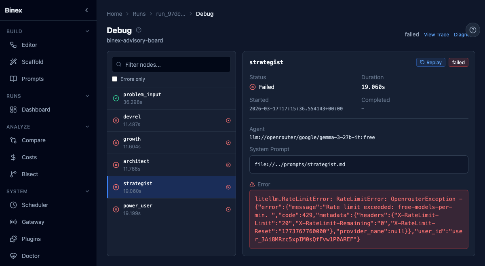
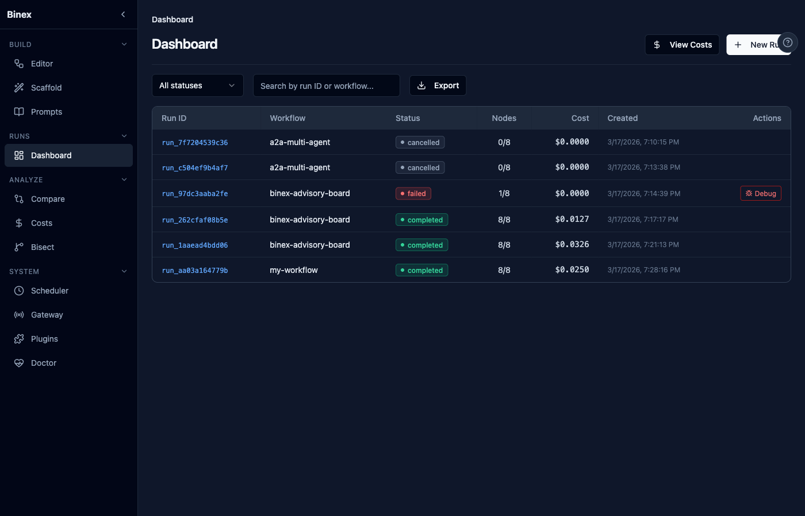
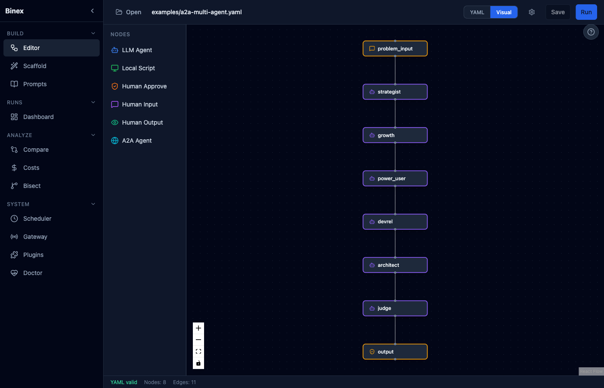
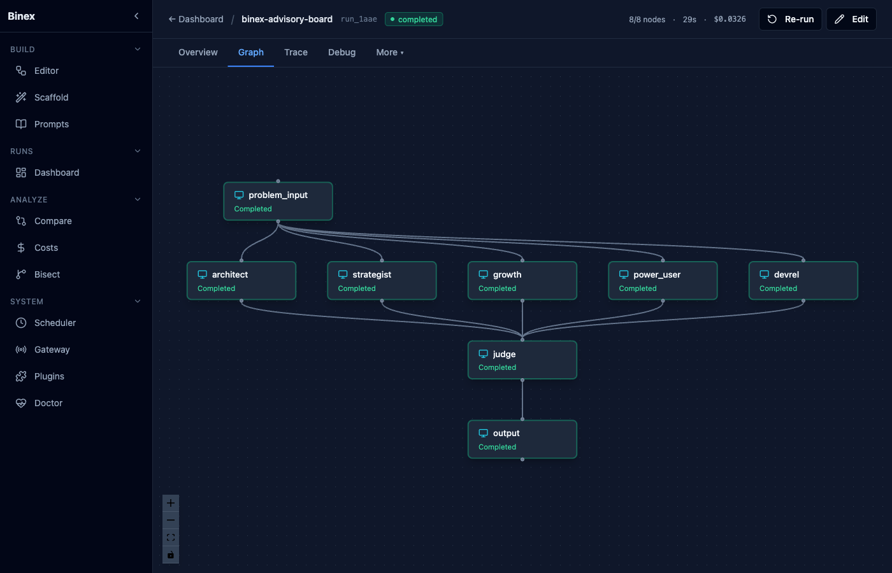
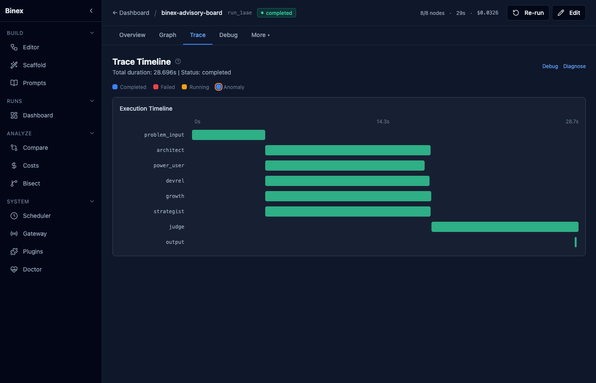
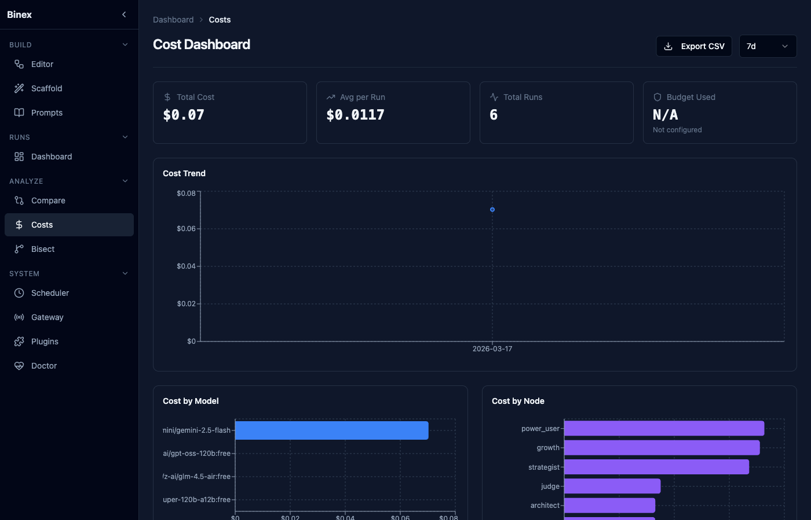

# Spec-Driven Development with LLMs: What Actually Worked Building Binex

I watched $40 disappear in one evening.

Not on hosting. Not on a SaaS tool. On a single LLM chain that got stuck in a loop, calling itself over and over while I stared at a terminal that told me nothing. No trace. No cost breakdown. No way to see which step failed or why. Just a growing bill and a black box.

I closed the terminal. Not in frustration — in decision. *I'm going to build the thing that would have saved me tonight.*



Ten days later (~6-8 hours/day), that thing had a name — Binex — 2,393 passing tests, 96% coverage, and a 19-page Web UI. Built with the same technology that burned me: LLMs.

Someone on Reddit asked me HOW I steered the LLMs to produce something functional. Fair question. Here's the actual process — the parts that worked, the parts that didn't, and the specific tools I used.

**TL;DR**: Spec-driven development + living context file + architecture debates + structured QA + domain-specific skills + parallel agents. 60 design docs and 200+ spec files written before code. 16 features in 10 days. Total LLM cost: ~$30-40.

**About me**: Senior engineer, 8+ years. Automation infrastructure, internal dev tools, CI/CD pipelines, QA automation team lead. I know what production-grade tooling looks like — that matters, because the LLM doesn't always.

---

## 1. Spec-Driven Development (the non-negotiable)

From day one, every feature started with specs, not code. I'd seen enough chaotic LLM output to know that "build me X" produces confident garbage.

The pipeline:
1. **Brainstorm** — explore the idea, clarify requirements, propose 2-3 approaches with trade-offs
2. **Design doc** — what we're building, why, architecture decisions with rationale
3. **Implementation plan** — exact file list, interfaces, data flow, phased tasks
4. **Task breakdown** — scoped units with inputs, outputs, boundaries, parallelization markers

I use speckit to generate these. Each feature gets a full package: `spec.md` (user stories + acceptance criteria), `plan.md`, `data-model.md`, `contracts/` (API/CLI schemas), `tasks.md`. Over 10 days this produced **60 design documents** and **200+ spec files** across 16 features.

A real task looks like:
```
Task 1.1: Backend API GET /api/v1/tools/builtins
New: src/binex/ui/api/tools.py
Modify: src/binex/ui/server.py (register router)
Pattern: follow providers.py router pattern
Returns: 10 built-in tools with name, description, category
```

vs "add a tools API endpoint" which gave me hardcoded mock data that didn't touch the actual tool registry.

Tasks marked `[P]` run in parallel (no file deps). Peak day: 73 commits.

## 2. Architecture by Argument

The planning phase is where the real work happens.

I spend 1-2 hours debating architecture with the LLM before any code is written. Not describing — arguing. "What happens if this fails?" "How does this interact with the existing store layer?" "Why not X instead?"

Real example: for the scheduler, I wanted a simple in-memory cron loop. The LLM pushed back — "What happens when the process restarts? You lose all state." I argued: "It's a dev tool, restarts are fine." The LLM countered: "Then at least persist which runs completed, so you don't re-trigger them." That 10-minute debate saved me from shipping duplicate workflow executions.

It works both directions. Sometimes the LLM suggests over-engineering — distributed locks, message queues — and I push back with "we're a solo-dev CLI tool, not Netflix."

Diminishing returns after ~2 hours though. If you're still arguing, prototype.

## 3. Context Management

LLMs forget everything between sessions. This kills productivity on anything non-trivial.

My solution: a living `CLAUDE.md` that accumulates architecture decisions, conventions, and gotchas. Every session starts with the LLM reading it.

```
- Layered deps: models → stores → adapters → runtime → cli
- Always call await store.close() or aiosqlite hangs
- Use _get_stores() helper, patch it in tests
- Tool URI schemes: python://, builtin://, mcp://
- Frontend: always use (value ?? 0).toFixed(N) — API fields can be null
```

This file grew from 80 to 183 lines across 16 features (~15-25 lines added per feature). Never deleted old patterns — only added.

On top of that, I keep a **memory system** — separate files for:
- **Feedback corrections**: things the LLM got wrong, so the same mistake never happens twice
- **Project state**: what's in progress, what decisions were made, dates
- **User preferences**: how I like to work (parallel agents, verify before claiming done)

The CLAUDE.md + memory is basically institutional knowledge that makes the LLM effective across dozens of sessions.



## 4. The Tooling Stack (this is the multiplier)

It's not just "use good prompts." It's a full stack of domain-specific tools.



### Skills (specialized prompt templates)

Skills are pre-packaged context + instructions for recurring task types. I used:

- **brainstorming** — runs before every feature. Explores intent, proposes approaches, gets approval before any code
- **writing-plans** — generates implementation plans from specs
- **qa-expert** + **qa-testing-methodology** — structures QA rounds with test case design (equivalence partitioning, boundary analysis)
- **test-driven-development** — enforces test-first workflow
- **code-reviewer** — runs after each major phase, catches architectural issues
- **binex-a2a-development** — domain-specific knowledge about the Binex codebase (adapters, stores, models, CLI patterns)
- **react-flow-implementation** — knows @xyflow/react patterns, nodes, edges, handles
- **fastapi-expert** — FastAPI + Pydantic v2 patterns
- **python-testing-patterns** — pytest fixtures, mocking, async test patterns

Each skill eliminates the "let me re-explain how we write tests in this project" overhead. Nine skills × ~50 uses each adds up.

### MCP Servers (external tool integration)

- **context7** — pulls up-to-date documentation for any library in real time. When I'm working with React Flow or shadcn/ui, the LLM gets current API docs instead of hallucinating outdated patterns
- **playwright** — browser automation for taking UI screenshots, verifying frontend behavior, running E2E visual checks

### The Full Team

I run a full agent team with specialized roles. The `/start_day` command can spawn up to 9 agents:

| Role | What they do |
|------|-------------|
| **Architect** | Reviews API contracts, module boundaries, backward compat |
| **Product Manager** | Defines priorities, writes feature specs, reviews from user perspective |
| **Designer** | UI/UX brainstorming, component plans, interaction flows |
| **Frontend Dev** | React 18 + Tailwind + shadcn/ui implementation |
| **Backend Dev** | FastAPI + CLI + data models in Python |
| **QA Tester** | Runs tests, finds regressions, reports bugs with severity |
| **Docs Maintainer** | Keeps README, CLAUDE.md, docs consistent with code |
| **DevOps** | CI/CD, GitHub Actions, releases, branch hygiene |
| **Meta Agent** | Resource manager — context monitoring, memory updates, agent lifecycle |

You don't run all 9 simultaneously. The **Meta Agent** manages the roster dynamically:

- **Agent lifecycle**: watches the task list. When frontend tasks appear — spawns `frontend-dev`. When they're done — shuts it down. No idle agents eating resources and context
- **Context monitor**: Claude Code tracks context usage per agent. Meta Agent watches for agents approaching their limits and triggers shutdown + respawn with fresh context before they start losing track of earlier decisions
- **Memory manager**: updates CLAUDE.md and memory files as features complete, so future sessions start with full knowledge

A typical session might have 3-4 agents running, not 9. Backend feature? Architect + backend-dev + qa-tester. UI feature? Add designer + frontend-dev. Everything else is off. This keeps costs comparable to single-agent usage — you're just distributing the same work across focused contexts instead of one bloated one.

Real example: Feature 017 (tools integration) — `backend-dev` built the API endpoint + tests while `frontend-dev` built 6 React components in parallel. One feature, two agents, roughly half the wall-clock time compared to doing both sequentially. Meanwhile `qa-tester` runs structured test plans on the previous feature.

This blog post itself was reviewed by a different team configuration — 5 content agents (tech-writer, storyteller, skeptic, SEO specialist, LLM workflow expert) reviewing the draft simultaneously, each from their own angle. Yes, it's turtles all the way down.

The key: agents only work in parallel when tasks have **zero file dependencies**. Shared state = sequential. Independent files = parallel.





## 5. Structured QA (not optional)

I ran **6 formal QA rounds** with tracking:

| Round | Test Cases | Tests Before → After | Bugs Found |
|-------|-----------|---------------------|------------|
| QA v1 | 65 | 486 → 664 | 2 (path traversal, infinite recursion) |
| QA v2 | 125 | 756 → 870 | 0 |
| QA v3 | 46 | 1,158 → 1,204 | 0 |
| E2E | 31 | 1,204 → 1,235 | 0 |
| QA v4-v6 | 200+ | 1,235 → 2,393 | 0 |

Each round has a test plan (`.md`), execution tracking (`.csv`), and bug tracking with severity levels. The E2E tests use real `subprocess.run("binex ...")` — no mocks, real SQLite, real filesystem.

The two bugs from QA v1 were real security issues: BUG-001 was a path traversal in the artifact store (`../../etc/passwd` as artifact ID), BUG-002 was infinite recursion in lineage tracking with circular `derived_from` references. The QA skill generates test cases specifically targeting these patterns (boundary analysis, security edge cases). Without structured QA, these ship.

Three more critical bugs were caught by a separate **architect review pass** — an LLM-assisted code review after implementation, specifically looking for concurrency issues and data integrity problems. The specs didn't predict them. Defense in depth.

## 6. What Doesn't Work

**The LLM will confidently write broken code.** The worst: an async handler that looked correct but silently swallowed a database connection error under specific timing. Tests passed because mocks didn't reproduce the timing. Took three hours to find.

**Context windows are real.** Even with CLAUDE.md, you lose nuance as the codebase grows. I had to re-explain architectural decisions that were "obvious" to me. Aggressive documentation in the code itself is essential — not just the context file.

**You can't evaluate what you don't understand.** My background in automation infrastructure and QA is why I could catch the LLM's mistakes. Domain expertise isn't optional — it's the filter.

**~15-20% needed manual rework.** Complex React state management, async orchestration patterns — cases where the LLM couldn't reason about the full component tree or async execution order across modules.

**Specs can be wrong.** Tests are your ground truth, not the spec.



## 7. The Numbers

- **10 days**, ~6-8 hours/day (~60-80 total hours)
- **298 commits**, 16 features, 60 design docs, 200+ spec files
- **2,393 tests**, 96% line coverage (full `src/binex/`, no exclusions)
- **169 source files**, 192 test files
- **Total LLM cost: ~$30-40** (Claude API + some Gemini). The controlled approach cost less than that one chaotic $40 evening
- **Stack**: Python 3.11+ / FastAPI / React 18 / TypeScript / Tailwind / shadcn/ui / React Flow / Monaco Editor / SQLite

## Takeaways

1. **Spec first, code second.** 60 design docs weren't overhead — they were the reason 16 features shipped cleanly
2. **Manage context aggressively.** CLAUDE.md + memory system = institutional knowledge that persists across sessions
3. **Argue during planning.** The LLM is a great sparring partner if you actually push back
4. **Use domain-specific tools.** Skills, MCP servers, and parallel agents are the real multiplier — not "better prompts"
5. **Test everything.** 6 QA rounds caught 5 real bugs including a security vulnerability. The LLM writes convincing code that might be wrong
6. **Know what good looks like.** Domain expertise is the filter. Without it, you can't evaluate the output
7. **Stuck? Spawn a debate.** Multiple agents with different perspectives reveal blind spots a single conversation won't. I built an "AI board of directors" — strategist, skeptic, architect, growth hacker, judge — for product decisions. Works for architecture too
8. **Agents are disposable, context is not.** Spawn what you need, capture the output, shut it down

Ten days ago, I was staring at a terminal that told me nothing. Today, I have a tool that shows me everything — and it was built by the technology that created the problem in the first place.

The discipline is the differentiator.

---

*Binex is open source (MIT): [github.com/Alexli18/binex](https://github.com/Alexli18/binex)*
*`pip install binex && binex ui` to try it.*

*Happy to answer questions about the process in comments.*
