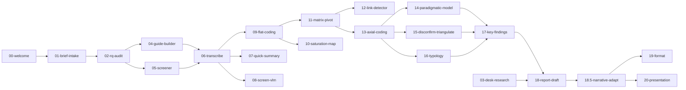

# ux-research-pipeline

**An AI research assistant for qualitative in-depth interviews — from a stakeholder brief to a finished report — driven by a single conversation.**

This is a framework for running qualitative UX research studies end-to-end with an AI agent. You install it as a workspace in an agentic coding client (Claude Code, Cowork, Codex, Cursor) and start one per study. Under the hood it's a 13-stage pipeline implemented as ~25 composable skills. On the surface it's a plain conversation: you drop in a recording, say "let's start", and the agent decides what to run next.

> **Portfolio note.** This is a working design I built for a professional research team and then genericized for public release. It ships with **synthetic, fictional example data only** — no real recordings, transcripts, or respondent data. See [NOTICE](NOTICE).

---

## The idea

Most "AI for research" tools are single-purpose: a transcriber, a summarizer, a coding assistant. The interesting problem is the **whole craft** — taking a vague stakeholder question and turning it into a defensible, evidence-backed finding without losing methodological rigor at any step. That's a long chain of judgment calls, and most of them are exactly where an LLM left unsupervised will quietly cut corners: inventing quotes, presenting interpretation as fact, calling a pattern from three respondents "most users".

This framework is built around three principles:

1. **Help, don't burden.** The researcher talks to the agent like a colleague. No JSON to hand-edit, no skill names to memorize, no menu of commands. Drop a meeting recording in `0-input/` → get a brief draft and three study-design options. Bring an interview → it transcribes, codes, and shows up in the project map. Say "draft the report" → it assembles one.

2. **Rigor is enforced in the architecture, not hoped for in the prompt.** Verbatim quotes are validated against the source. Fact / interpretation / hypothesis are kept structurally separate. No percentages on a 12-person sample. A "stop-on-anomaly" rule halts the agent when the data looks wrong instead of confabulating through it. These live in [`AGENT.md`](AGENT.md) — the agent's operating contract — and in `shared/prompts/`.

3. **Methodology, not vibes.** The analysis stages implement grounded-theory mechanics properly: flat (open) coding → a respondent × theme matrix → axial coding → a paradigm model → typology, with active search for **disconfirming cases** and **triangulation** before anything is called a finding.

---

## The pipeline

13 stages, presented as a concierge experience. The researcher never has to know which skill is running.



| Stage | What happens | Skill(s) |
|---|---|---|
| 0 · Onboarding | First-run setup, STT key | `00-welcome` |
| 1 · Brief intake | Turn a stakeholder request into a testable research question | `01-brief-intake`, `02-rq-audit` |
| 2 · Desk research | External-source synthesis | `03-desk-research` |
| 3 · Interview guide | Block skeleton + questions, with a leading-question check | `04-guide-builder` |
| 4 · Screener | Criteria, quotas, recruiter instructions, self-selection-bias check | `05-screener` |
| 5 · Fieldwork | Tech checklist, quick team summary, saturation map | `07-quick-summary`, `10-saturation-map` |
| 6 · Transcription | STT + diarization, speaker verification, optional UI-screenshot VLM | `06-transcribe`, `06.2-speaker-verify`, `08-screen-vlm` |
| 7 · Flat coding | Verbatim-anchored open coding into a structured codebook | `09-flat-coding`, `transcript-coding` |
| 8 · Analysis | Matrix → axial coding → paradigm model → typology; disconfirms + triangulation | `11`–`17` |
| 9 · Report | Academic draft → **mandatory** stakeholder-language adaptation | `18-report-draft`, `18.5-narrative-adapt` |
| 10 · Formatting | Clean Markdown / standalone HTML, mermaid diagrams | `19-format` |
| 11 · Presentation | Key messages → `.pptx` export | `20-presentation` |
| 12–13 · Feedback loop | Capture the researcher's edits; quarterly retro to improve prompts | `feedback.md`, `templates/retro.md` |

Full stage-by-stage breakdown with core/stretch/experimental labels: [`docs/pipeline-map.md`](docs/pipeline-map.md).

---

## Two modes

Set in `project-config.yaml`:

- **`assistive`** (default) — the agent works step by step and pauses before every substantive methodological fork. Use it on normal studies with a stakeholder.
- **`autonomous`** — the agent runs the whole pipeline itself and produces a `4-output/handoff.md` with its findings and its own doubts at the end. Built for auditing an external vendor's work, desk research, or a fast first draft. **You always read the handoff** before anything goes out — it is explicitly *not* "ship to the stakeholder unchecked".

Details and the applicability boundary: [`docs/modes.md`](docs/modes.md).

---

## Architecture

- **Skills are the unit of work.** Each `skills/NN-*/SKILL.md` is a self-contained capability with its own triggers, inputs/outputs, definition-of-done, and failure modes. The agent picks them; the researcher doesn't.
- **`AGENT.md` is the brain.** A ~60KB operating contract: hard rules (confidentiality, fact-vs-interpretation, verbatim policy, stop-on-anomaly), the two modes, the per-study file architecture, session-budget discipline, and cross-session memory. This is where the rigor lives.
- **A study is a folder.** Everything for one project — inputs, methodology, interviews, analysis, output — is plain files on disk, so it's portable, diffable, and inspectable. See `project-template/`.
- **The analysis folder is an Obsidian vault.** `3-analysis/` opens as an [Obsidian](https://obsidian.md) vault: respondents, themes, and findings become a navigable graph, and the paradigm model is a canvas. It also works fine as plain Markdown if you don't use Obsidian. See [`docs/obsidian-conventions.md`](docs/obsidian-conventions.md).
- **Coding has two backends.** By default the agent codes transcripts in-context (no external keys). For large samples it can delegate to `transcript-coding` — a standalone, Pydantic-validated coding engine with OpenAI / Anthropic backends.

---

## Try it yourself

The framework is designed to be driven by an agentic client, but the coding engine is a normal Python tool you can run on its own against the bundled synthetic interview.

### 1. Clone and install

```bash
git clone https://github.com/shipaleks/ux-research-pipeline.git
cd ux-research-pipeline
cp .env.example .env          # fill in only what you need
pip install -r skills/transcript-coding/scripts/requirements.txt
```

### 2. Verify the install offline (no API key)

The coding engine ships with a synthetic example interview and a golden output. The schema tests validate everything end-to-end without calling any API:

```bash
cd skills/transcript-coding
python3 tests/test_schemas.py     # → PASS x4
```

### 3. Code the example interview (needs a key)

`transcript-coding` turns a raw transcript (an array of timestamped utterances) into structured, verbatim-anchored coded segments. With `OPENAI_API_KEY` or `ANTHROPIC_API_KEY` in your `.env`:

```bash
python3 scripts/code_transcript.py run \
    examples/input_transcript.json \
    examples/input_brief.json \
    --respondent-id r_1
# → writes examples/coding/input_transcript.coded.json
```

See [`skills/transcript-coding/README.md`](skills/transcript-coding/README.md) for backends, presets, and the JSON schema.

### 3. Or use it as an agent workspace

Open the repo as a workspace in Claude Code / Cowork / Codex. The client picks up `CLAUDE.md` / `AGENTS.md` automatically. Then copy the template into a project root and talk to the agent:

```bash
cp -r project-template ~/research-projects/my-first-study
```

Open that folder, say "let's start", or drop a meeting recording into `0-input/`.

### What needs a key, and what doesn't

| Capability | Requirement |
|---|---|
| In-context coding & analysis (default) | none — the agent uses its own context |
| Transcription (audio → text) | `MISTRAL_API_KEY` (Mistral Voxtral) |
| Standalone `transcript-coding` engine | `OPENAI_API_KEY` or `ANTHROPIC_API_KEY` |
| UI-screenshot analysis (optional) | `GEMINI_API_KEY` |

---

## Confidentiality by design

Qualitative research data is sensitive by nature. The framework treats that as a first-class constraint, not an afterthought:

- Raw audio, transcripts, and coded interviews are **git-ignored** by default (`.gitignore`) and live outside the framework code.
- The agent is instructed never to push raw recordings or transcripts to public services, and to use aggregated demographics ("woman, 34, mid-size city") instead of reproducing respondent PII in reports.
- Verbatim quotes must be verifiable in the source; the agent is forbidden from splicing or fabricating them.

See [`docs/confidentiality.md`](docs/confidentiality.md) and `shared/prompts/`.

---

## Repository layout

```
ux-research-pipeline/
├── AGENT.md / AGENTS.md       # the agent's operating contract (the "brain")
├── CLAUDE.md                  # client-specific hooks for Claude Code
├── skills/                    # ~25 skills, one folder each (the pipeline stages)
│   ├── transcript-coding/     # standalone, runnable coding engine (Python)
│   └── ux-transcribe/         # STT via Mistral Voxtral
├── prompts/                   # analysis prompt templates
├── templates/                 # brief, guide, screener, report, retro
├── shared/                    # JSON schemas, methodology glossary, guardrail prompts
├── project-template/          # the per-study folder you copy for each project
│   ├── 0-input/ 1-methodology/ 2-interviews/ 3-analysis/ 4-output/
│   ├── thoughts.md  feedback.md  project-config.yaml
├── workflows/                 # end-to-end recipes (full-assistive, audit-external, …)
├── docs/                      # getting-started, modes, pipeline-map, conventions
└── tests/golden/              # scaffold for prompt-regression on a golden case
```

---

## Status & roadmap

Pre-1.0 (`v0.5.1`). The core pipeline works; some analysis stages are marked *stretch* (quality depends on prompt phrasing) and are honestly labeled as such in [`docs/pipeline-map.md`](docs/pipeline-map.md).

Planned (v2):

- **desk-research-index** — RAG over an archive of past transcripts and reports.
- **live-cohost** — a co-pilot during the interview itself.
- **edits-categorizer** — auto-diff and categorization of the researcher's edits to learn from them.
- **regression-eval** — a golden set + prompt regression after the first projects.

---

## License

All rights reserved — see [NOTICE](NOTICE). Published as a portfolio / demonstration project; you're welcome to clone and run it locally to evaluate the design.
