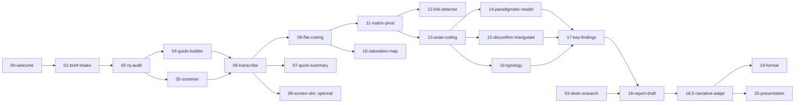

# Pipeline map

A full map of the 13 research stages and the skills that cover them in v1.

Labels:
- **core** — done confidently, clear ROI, manageable risks.
- **stretch** — done, but the skill's quality depends on how the prompt is phrased; needs a pilot on a golden case.
- **experimental** — use with caution, requires decisions about the technical setup.
- **v2** — deferred: depends on infrastructure that doesn't exist yet.
- **template/process** — implemented by a template or a process; a dedicated skill would be over-engineering.

## Stage 0. Onboarding

| Substage | Skill | Label |
|---|---|---|
| 0.1 First-run onboarding | `00-welcome` | core (once per user, marker `.system/welcomed-at.txt`) |
| 0.2 MISTRAL_API_KEY setup | `shared/scripts/setup-mistral.sh` | utility |

## Stage 1. Unpacking the stakeholder's request

| Substage | Skill | Label |
|---|---|---|
| 1.1 Brief intake | `01-brief-intake` | core |
| 1.2 Research questions + hypotheses | `02-rq-audit` | core |
| 1.3 Brief sign-off | `templates/brief.md` | template |

## Stage 2. Deep desk research

| Substage | Skill | Label |
|---|---|---|
| 2.1 Searching for reports in the wiki (RAG) | — | **v2** (see `desk-research-index`) |
| 2.2 Re-creation from old transcripts | — | **v2** |
| 2.3 External sources (web_search) | `03-desk-research` | core |
| 2.4 Synthesis of "what we know / where the gaps are" | — | **v2** (loses meaning without 2.1+2.2) |

## Stage 3. Interview script

| Substage | Skill | Label |
|---|---|---|
| 3.1 Block skeleton | `04-guide-builder` (part of the skill) | core |
| 3.2 Questions and stimuli + leading-question check | `04-guide-builder` (part of the skill) | core |

## Stage 4. Screener and recruitment

| Substage | Skill | Label |
|---|---|---|
| 4.1 Criteria and quotas | `05-screener` (part) | core |
| 4.2 Screener questionnaire | `05-screener` (part) | core |
| 4.3 Recruiter instructions | `05-screener` (part) | core |

## Stage 5. Running the interviews

| Substage | Skill | Label |
|---|---|---|
| 5.1 Tech setup and recording | `templates/tech-setup-checklist.md` | template |
| 5.2 Live co-pilot during the interview | — | **dropped from the plan** (requires a technical-setup decision — a separate product) |
| 5.3 Quick team summary | `07-quick-summary` | core (optional, on request or auto-triggered) |
| 5.4 Saturation map | `10-saturation-map` | stretch (depends on coding quality) |

## Stage 6. Transcription

| Substage | Skill | Label |
|---|---|---|
| 6.1 STT + diarization | `06-transcribe` (shim → vendored `ux-transcribe` in `skills/ux-transcribe/`) | external |
| 6.2 Speaker-verify (heuristic + LLM re-attribute pass) | `06.2-speaker-verify` | core (mandatory for interviews >40 min) |
| 6.3 Screenshots + VLM | `08-screen-vlm` | **experimental** (Gemini, optional, requires confirmation) |
| 6.4 Tagging of guide blocks | part of the `09-flat-coding` global pass | inside another skill |

## Stage 7. Flat coding

| Substage | Skill | Label |
|---|---|---|
| 7.1–7.9 All substages | `09-flat-coding` (shim → `transcript-coding`) | external |

## Stage 8. Code analysis

| Substage | Skill | Label |
|---|---|---|
| 8.1 Respondent × theme matrix | `11-matrix-pivot` | core |
| 8.2 Links between fragments | `12-link-detector` | stretch |
| 8.3 Axial coding | `13-axial-coding` | stretch (the main analysis skill, requires HITL) |
| 8.4 Evidence/counter-evidence per hypothesis | part of `17-key-findings` | inside another skill |
| 8.5 Active search for disconfirming cases | `15-disconfirm-triangulate` (part) | stretch |
| 8.6 Triangulation | `15-disconfirm-triangulate` (part) | stretch |
| 8.7 Typology | `16-typology` | stretch (risk of substituting demographics) |
| 8.8 Paradigm model | `14-paradigmatic-model` | core (always built by the agent, optionally shown to the researcher) |
| 8.9 New hypotheses (without an archive) | part of `17-key-findings` | core (without cross-checking the archive — that's in v2) |
| 8.10 Key findings | `17-key-findings` | core |

## Stage 9. Automated report

| Substage | Skill | Label |
|---|---|---|
| 9.1 Structure and draft (academic version) | `18-report-draft` (part) | core |
| 9.2 Recommendations (academic version) | `18-report-draft` (part) | core (draft only) |
| **9.5 Adapting the language for the stakeholder** | **`18.5-narrative-adapt`** | **core (mandatory gate)** |
| 9.3 Human editing | — | process |

## Stage 10. Markdown formatting

| Substage | Skill | Label |
|---|---|---|
| 10.1 Markdown conversion | `19-format` (the Markdown formatting step) | core |

## Stage 11. Presentation

| Substage | Skill | Label |
|---|---|---|
| 11.1 Key messages | part of `20-presentation` | inside another skill |
| 11.2 Assembling the presentation | `20-presentation` (a presentation export step (.pptx)) | external |

## Stage 12. Collecting the researcher's edits

| Substage | Skill | Label |
|---|---|---|
| 12.1 Auto-diff | `feedback.md` + `.system/runs/` | minimal, no skill. Full version — **v2**. |
| 12.2 Categorization by cause | `feedback.md` (by hand) | minimal. **v2** for auto. |

## Stage 13. Feedback loop

| Substage | Skill | Label |
|---|---|---|
| 13.1 Pipeline retrospective | `templates/retro.md` + a recurring cadence | process |
| 13.2 Prompt regression | `tests/golden/` scaffold | **v2** (needs a golden set after the first projects) |
| 13.3 Prompt versioning | git + a changelog in the repo | process |

## Summary

- **25 skills (v0.5.1)**: 23 numbered pipeline skills + 2 vendored (`transcript-coding`, `ux-transcribe`). Of the pipeline skills, roughly 13 are core, 6 stretch, 1 experimental, plus onboarding (`00-welcome`) and an optional quick-summary.
- **5 v2 tasks**: desk-research-index (2.1+2.2), full 2.4, auto-diff of edits (12.1+12.2), regression (13.2).
- **6 process/template** things: 1.3, 5.1, 6.3, 9.3, 13.1, 13.3.
- **`session_budget` low/normal/high** — in `project-template/project-config.yaml`. Changes how aggressive handoffs are (AGENT.md §14.1).
- **18-report-draft is two-beat**: Step 1 outline → Step 2 researcher confirmation → Step 3 full text. The gate `outline_approved: true` in the frontmatter, without which 18.5 refuses to run.

## Dependencies between skills

