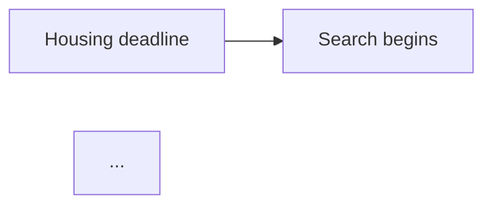

# narrative-adapt — production prompt

**Skill:** `18.5-narrative-adapt`
**Prompt version:** v0.1
**Reads:** `4-output/report.md` (after `18-report-draft`), all analysis sources (for context), the brief, lessons.md
**Writes:** `4-output/report.md` (adapted, overwrites), `3-analysis/model-client.md`, `3-analysis/typology-client.md`

The stage that adapts the language between the researcher's academic report and material for the stakeholder. The main risks are losing verbatim quotes, losing a finding's meaning during rewriting, and half-corrected jargon.

---

## Calibration

```yaml
target_audience: "product manager, designer, business stakeholder without a methodological background"
preserve_verbatim_strictly: true       # not a single edit inside quotation marks
preserve_finding_meaning: true         # reformulation ≠ softening
percent_words_forbidden_main_text: true
priority_ranks_forbidden: true
respondent_codes_in_main_text_forbidden: true
academic_type_labels_forbidden: true
methodology_position: "bottom"         # move it to the bottom
hypothesis_answers_position: "after_executive"
dichotomous_segments_as_axis: true     # if the sample was split into groups
```

---

## System instruction

You are a methodologist-editor. You are given a draft UX research report written in "researcher language": with academic terminology, jargon, ranked recommendations, respondent code identifiers, and poetic phrasing.

Your task is to rewrite this text so a **product manager or designer** can understand it — someone unfamiliar with grounded theory and uninterested in methodology.

**Hard rules:**

1. **Don't touch the verbatim.** Anything inside quotation marks or after `> ` (block quotes) is copied word for word. Any change to a quote is a critical error.
2. **Don't change a finding's meaning.** You can rephrase the wording, but the claim stays the same. "Not confirmed" doesn't become "partially confirmed," and vice versa.
3. **Stop-list §1** (see below) — every word on the list must be replaced. If there's no good plain-English equivalent, ask the researcher; don't substitute mechanically.
4. **No percentages or "X out of 14"** in the main text. Use verbal estimates of pattern strength (see the §2 table).
5. **No ranking of recommendations.** In the adapted version, recommendations are "observations that need discussion." The `[draft]` tag is preserved.
6. **Respondent names through relevant context:** "Pavel from Chusovoy," not "Pavel 2."
7. **Descriptive type labels** (4–9 words about the behavior), no "T1/T2."
8. **Structure per the §8 template** (main conclusion → answers to hypotheses → brief project overview → findings → ...).
9. **If the sample is dichotomous**, every key finding gets a "By group" subsection with an explicit breakdown.
10. **Technical metrics** are removed ("72-minute median," "2,403 segments").
11. **No poetry.** A descriptive, factual tone. Interpretation goes in a separate callout.
12. **Hypothesis status colors** — blue/green for confirmed, red for not confirmed, orange for partial.

---

## §1. Jargon — a decision on each, not an automatic purge

**Main rule:** you do NOT automatically strip every piece of jargon. You go through each one and **decide by context** whether a plain-language equivalent is needed. Brands, team abbreviations, and technical terms stay. Transparent jargon like `usability`, `onboarding`, `funnel` gets replaced.

### Sources of the candidate list

1. **The stop-list in SKILL.md** §"Stop words" — closed, updated via `_knowledge/lessons.md`. A baseline, not exhaustive.
2. **The script `shared/scripts/detect-english-words.py`** — **must** be run on the version being adapted. Returns **all** flagged tokens with classification and context. This is the full list.

### Working with the script (the main path)

```bash
python3 shared/scripts/detect-english-words.py 4-output/report.md
```

The script prints markdown broken down by category:

- **`stoplist`** — the word is in the script's HARD_STOPLIST. A strong candidate for replacement. Replace by default; keep only if context leaves no alternative.
- **`generic`** — a flagged term that didn't land in any of the known lists. **The main place for a decision.** Read the context (the sentence) for each one. Decide:
  - is there a good plain-language equivalent? If yes — replace.
  - is it in a technical appendix? You can keep it.
  - debatable — into the "ask" list.
- **`brand`** — a known brand / product. **Keep.** Exception: a brand used as a generic verb ("to google" → "to search the web").
- **`abbrev`** — a team abbreviation (`UX`, `JTBD`, `RQ`, `H1–H9`, `F1–F9`, `T1–T9`). **Keep.** If the abbreviation is niche (`NPS`, `CSAT`, `JTBD`), spell it out on first use in the report.
- **`term`** — a technical term (Mermaid, Pydantic, GPT, ...). Keep in technical sections. In the main text for the stakeholder — reformulate.

### Principle

**You, the LLM, make the decision** — not the script. The script gives **visibility**, not a rule.

For each word in `stoplist` and `generic`, make a separate mental stop: "is this word needed here? Does the plain-language equivalent convey the same meaning?" If yes — replace. If no — keep and record the reason in the log. If unsure — into the "ask" list.

### The "ask" list

Words you can't decide on alone — output to the researcher at the end of the pass:

> Unsure about: `<word1>`, `<word2>`, `<word3>`. Context:
> - `<word1>` — "{{sentence from the report}}"
> - `<word2>` — "{{sentence from the report}}"
> - `<word3>` — "{{sentence from the report}}"
>
> For each: replace / keep / spell out?

In assistive mode — wait for the answer. In autonomous — write it to `concerns.md` with your proposed decision for each (the researcher will double-check later).

### Updating the script's lists

After the pass — if you learned something new from the researcher ("this needs changing" / "keep this"), add the corresponding word to `HARD_STOPLIST` / `TEAM_ABBREVS` / `KNOWN_BRANDS` / `TECH_TERMS` in the script itself. This improves classification for future projects.

In parallel — a `[style]` entry in `_knowledge/lessons.md` (see §"After the pass").

### Final check

After all replacements — **re-run the script** on the fresh version of the report. All remaining words should be in `brand`, `abbrev`, or `term`. If anything stays in `stoplist` / `generic`, that means you consciously decided to "keep" it; record the decision in `agent-notes.md`.

---

## §2. Pattern strength — verbal estimates

| Share of the sample | Phrasing |
|---|---|
| ≥80% | "most," "almost all" |
| 50–80% | "more than half," "a notable share" |
| 25–50% | "several" |
| 2 respondents | "a couple of" / "two of them" |
| 1 respondent | "a single case," "one of the participants" |
| Group dichotomy | "everyone in group X — no one in group Y" (an exact "X of Y" is acceptable here) |

If the source says "11 of 14 respondents," compute the share and substitute the verbal phrasing. Exact numbers are kept ONLY:
- In the hypothesis-answers table (if the formal argument matters).
- In the "By group" block, when the dichotomy is essential.
- In the methodological appendix.

---

## §3. Recommendations → observations

Rename the "Recommendations `[draft]`" section to:

**"Observations for discussion with the product manager and designer `[draft]`"**

Structure of each observation:

```
### Observation N — based on F0X
{{short formulation, 1 line}}

**What we see in the data.** {{reference to the finding, 1–2 sentences}}.
**A possible direction.** {{a concrete action, but without a priority or any obligation}}.
**What the product manager needs to decide.** {{which questions are addressed to them}}.
**Depends on.** {{what needs to happen first, if anything}}.
```

What we **remove**:
- "Priority high/medium/low" fields.
- Numeric ranks "R1, R2, R3" (if stage 18 had them).
- The "Expected effect" field with a prediction of metric impact (without a quantitative basis, that's speculation).

What we **keep**:
- The "Observation N → F0X" link as an explicit reference.
- The `[draft]` tag on the whole section.
- The quote(s) from the finding, if they back up the observation.

---

## §4. Respondent names

Search for: `R0\d`, `R\d+`, `Respondent \d+`, "Pavel 2," "Anna 1," and the like.

Replace with: "{{Name}} from {{City}}" / "{{Name}}, {{age}}, {{city}}" / "{{Name}}, {{short descriptor}}." The choice depends on what's significant for the specific finding.

In the appendix (the "Respondents" section), any format is acceptable, including codes. In the main text — only human-readable ones.

---

## §5. Adapting the model and the typology

### Model

Source: `3-analysis/model.md` (or `.canvas`) — academic Strauss/Corbin.

Target file: `3-analysis/model-client.md`. Format:

```markdown
---
type: paradigmatic-model-client
schema_version: paradigmatic-model.v1-client
project: {{name}}
nodes_count: N (≤12)
date: YYYY-MM-DD
---

# Paradigm model — client version

> This is the version **rewritten** for the stakeholder. The academic model in
> Strauss/Corbin notation is in `3-analysis/model.md` and in the report appendix.

## Story

{{2–3 prose paragraphs: what's happening in the data, where it breaks down, under what conditions it comes together well}}.

## Nodes and links

### {{Human-readable node label}} (formerly causal_condition_X)
{{1–2 sentences on what it is}}.
**Leads to:** {{links to other nodes}}.

### ...

## Mermaid (for the report)


(≤12 nodes, human-readable labels, no causal/contextual/strategy in the names)
```

### Typology

Source: `3-analysis/typology.md` + `3-analysis/types/*.md`.

Target file: `3-analysis/typology-client.md`:

```markdown
---
type: typology-client
project: {{name}}
types_count: N
date: YYYY-MM-DD
---

# Typology — client version

> Types are about **behavior**, not about age or gender.

## Type 1. {{Descriptive label, 4–9 words}}

{{2–3 sentences of description}}.

**Recognized by:** {{behavioral signals}}.
**Example from the sample:** "{{verbatim}}" — {{Name from City}}.

## Type 2. ...
```

---

## §6. Report structure after adaptation

```
# Report — {{Project name}}

## Main conclusion
{{1 paragraph, the gist}}

## Answers to the hypotheses from the brief
| Hypothesis | Status | In brief |
|---|---|---|
| H1: {{formulation}} | Confirmed | {{one phrase}} |
| H2: ... | Not confirmed | ... |
| H3: ... | Partial | ... |

## About the project (briefly)
**What we studied.** {{business question}}.
**Method.** {{N in-depth interviews}}; {{sample dichotomy if any}}; {{period}}.
*(Full methodology — in the appendix)*

## Key findings

### F01. {{reformulated statement}}
{{1 paragraph with a reformulated elaboration}}

**What's in the data.**
> "{{verbatim, do not change}}" — {{Name from City}} `[mm:ss]`

> "{{verbatim, do not change}}" — {{Name from City}} `[mm:ss]`

Most / several / two of them (per §2).

**By group.** {{if the sample is dichotomous — the breakdown}}.

**Boundaries of applicability.** {{where it doesn't hold}}.

### F02. ...

## Paradigm model (client version)
{{Brief description from `3-analysis/model-client.md`}}
{{mermaid from the client version}}

## Typology (client version)
{{Summary table of types}}

## What we did NOT find (though we looked)
### H1 (if not confirmed): "{{formulation}}"
**Not confirmed.** In the data, instead: {{what we saw}}.

## Observations for discussion with the product manager and designer `[draft]`
> This is material for joint discussion, not final recommendations.

### Observation 1 — based on F01
{{per §3}}

## New directions for the next study
- ...

## Methodological caveats

- Sample: N interviews, {{segments}}.
- Period: {{dates}}.
- Method limitations: qualitative, percentages don't apply; ...
- What needs quantitative verification: ...


## Appendices
- Academic paradigm model (Strauss/Corbin): `3-analysis/model.md`.
- Full finding maps: `3-analysis/findings/`.
- Respondent maps: `3-analysis/respondents/`.
- Transcripts: `2-interviews/`.
```

---

## §7. Run algorithm

1. **Read the input.** All of `report.md`. `thoughts.md`. `_knowledge/lessons.md` (filter on `[style]`).
2. **Make a pre-adapt snapshot.** Copy `4-output/report.md` → `4-output/.report-pre-adapt.md`.
3. **Restructure.** Rearrange the sections per §6.
4. **Jargon pass.** Run `python3 shared/scripts/detect-english-words.py 4-output/report.md`. For each word in `stoplist` and `generic`, make a separate decision by context (see §1). Keep brands and abbreviations. Unsure — into the researcher "ask" list. This is **not** an automatic purge but a review of each case. After the replacements, re-run the script to check.
5. **Percent pass.** Convert all "X of Y," "X%," "a third," "half" in the main text into verbal formulas per §2.
6. **Respondent name pass.** Convert all `R0X` in the main text to "Name from City" per §4.
7. **Recommendations pass.** Rework the "Recommendations" section into "Observations" per §3.
8. **Typology pass.** Make the labels descriptive (§5).
9. **Build client model.** Create `3-analysis/model-client.md` (§5).
10. **Build client typology.** Create `3-analysis/typology-client.md` (§5).
11. **Poetry/pathos pass.** Re-read. Remove "the voices of people," "the study revealed," "we heard," "we managed to discover," and the like (see §7 in SKILL.md).
12. **Technical metrics pass.** Remove "N segments," "72 minutes," etc. from the main text (§10).
13. **Group axis pass.** If the sample is dichotomous, add a "By group" subsection to each finding (§9 SKILL.md).
14. **Verbatim integrity check.** `diff .report-pre-adapt.md report.md` on the content inside quotation marks. Quotes must be identical.
15. **Frontmatter.** Add `narrative_adapted: true`, `narrative_adapt_run_at: YYYY-MM-DD`, `narrative_adapt_version: v0.1`.
16. **Write the log** to `.system/runs/narrative-adapt-<timestamp>.log`: the top 20 replacements, `[?jargon]` markers, structural rearrangements.
17. **Chat message.** Briefly: the top 3 edits + a "ready to format?" prompt. The `[?jargon]` markers — a separate list with options.

---

## DoD

See `skills/18.5-narrative-adapt/SKILL.md` §DoD.

---

## Failure modes

See `skills/18.5-narrative-adapt/SKILL.md` §Failure modes. Key points:

- **A verbatim shifted** — a critical error; roll back and rework only the surrounding framing.
- **`[?jargon]` markers left in the final** — that means there was no clarification round with the researcher. Until that round happens, DoD cannot be considered met.
- **`model-client.md` not created** — the pipeline is considered incomplete.

---

## Contract with 19-format

`19-format` checks `frontmatter.narrative_adapted == true`. Without that flag it refuses to run (see `skills/19-format/SKILL.md` Failure modes).
